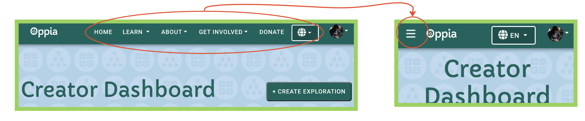

# Introduction

Acceptance tests are end-to-end tests that test the complete functionality of the application, and this will help users to catch bugs and regressions before they are released ensuring that the code does what it is supposed to do.

This guide will help you to get started on how to write `e2e acceptance test` for a particular user-type.


## Files and Directory Structure

```
oppia/core/tests/
 └── puppeteer-acceptance-tests
    ├── spec
    │  ├── blog-admin-tests (give user type name)
    │  │    ├── assign-role-to-users-and-change-tag-properties.spec.ts
    │  ├── blog-editor-tests
    │  │    ├── try-to-publish-a-duplicate-blog-post-and-get-blocked.spec.ts
    │  ├── logged-in-user-tests
    │  │    ├── click-all-buttons-in-about-foundation-page.spec.ts
    │  │    ├── click-all-buttons-in-about-page.spec.ts
    │  │    ├── click-all-buttons-in-thanks-for-donating-page.spec.ts
    │  │    ├── click-all-buttons-on-navbar.spec.ts
    │  ├── practice-question-admin-tests
    │  │    ├── add-and-remove-contribution-rights.spec.ts
    │  ├── translation-admin-tests
    │  │    ├── add-translation-rights.spec.ts
    │  │    ├── remove-translation-rights.spec.ts
    ├── images
    │  └── blog-post-thumbnail.svg
    ├── puppeteer-testing-utilities
    │  ├── puppeteer-utils.ts
    │  ├── show-message-utils.ts
    │  ├── test-constants.ts
    │  ├── user-factory.ts
    │  └── console-reporter.ts
    └── user-utilities
       └── blog-admin-utils.ts
       └── blog-post-editor-utils.ts
       └── logged-in-users-utils.ts
       └── question-admin-utils.ts
       └── super-admin-utils.ts
       └── translation-admin-utils.ts
```

The directory structure is as follows:
1) The `spec` directory contains all the top-level test files. Each test file is named as `*.spec.ts` and contains the test for a particular user type. For example, `blog-admin-tests` directory contains all the tests for the `Blog Admin` user.

2) The `puppeteer-testing-utilities` directory contains all the utility files and helper functions, which you would require to write new acceptance tests. This directory can also be used to append more utility functions as when required or needed by the user.
Files included inside this directory are :
  - `puppeteer-utils.ts` -> This file contains the base _*BaseUser*_ class which provides the most common and useful methods such as _*openBrowser*_, _*goto*_, _*clickOn*_, _*openExternalPdfLink*_ etc. This class also serves as a foundation for defining other user-oriented subclasses, facilitating various testing scenarios.
  - `user-factory.ts` -> This file contains methods for creating a certain user. The file has different methods for creating different types of user.
  - `test-constants.ts` -> This file contains defined constants such as _*URLs, classname, id etc. which are used in the tests.
  - `show-message-utils.ts` -> This file contains method for logging the progress and errors during a test.

3) The `user-utilities` directory holds the utility files for different user types. Each user utility class is build upon the base `BaseUser` class containing the original methods along with the ones related to that user type. For eg. `BlogPostEditor` contains base functions as well as additional functions just related to `Blog Post Editor` user.

4) The `images` directory contains all the images used in the tests.


## How to run the acceptance tests
From the root directory of oppia, run the following command:
```  
python -m scripts.run_acceptance_tests --suite={{suiteName}}  
``` 

Docker:
```
make run_tests.acceptance suite=SUITE_NAME
```

For example, to run the `check-blog-editor-unable-to-publish-duplicate-blog-post.spec.ts` test, run the following command:
Python:
```
python -m scripts.run_acceptance_tests --suite="blog-editor-tests/check-blog-editor-unable-to-publish-duplicate-blog-post"
```

Docker:
```
make run_tests.acceptance suite="blog-editor-tests/check-blog-editor-unable-to-publish-duplicate-blog-post"
```


## How to write new tests for a specific user

1) Create a new directory for the specific user if it doesn't already exists inside the `spec` directory. For ex. `Topic Manager` user can have directory named as `topic-manager-tests`, and within the user directory, each test file is named as `*.spec.ts`. 
> Note: Naming convention for directories / files is kebab case, where each word is separated by a (-)

2) Within the user directory, create a new file for each test. For ex. `create-new-topic.spec.ts` and `delete-topic.spec.ts` for `Topic Manager` user. And these top-level test contains single user stories checking their test steps and expectations mentioned in the [testing spreadsheet](https://docs.google.com/spreadsheets/d/1O8EHiSAGrG0yoNUBz9E4DIwKNS8Rfsv_ffC4k1WK5jc/edit?usp=sharing).

3) The functionality of the top-level tests for each user-type is defined in the `user-utilities` directory. For ex. the blog editor tests are written within the `spec/blog-editor-tests` directory, and the functionality of the tests are defined in the `user-utilities/blog-post-editor-utils.ts` file.
> Note: A utility file is maintained for each user type. The purpose of maintaining this file is to add methods specific to that user on top of the already provided basic methods. This file maintains a user class which is extended from the base class of puppeteer-utils.ts . For ex. blog-post-admin-utils.ts have a class BlogPostEditor which have methods like `createDraftBlogPostWithTitle`, `deleteDraftBlogPostWithTitle` etc. specific to Blog Admin only.

4) The utility files are imported into the top-level test files, and the methods are called to perform the required actions. For example, in the `try-to-publish-a-duplicate-blog-post-and-get-blocked.spec.ts` file, the `createNewBlogPostWithTitle` method is called to create a new blog post with the given title. Additionally, the `expectUserUnableToPublishBlogPost` method is called to check if the user is unable to publish a blog post. To facilitate instantiation of classes, each utils file should also include a `UserFactory` function. This function's purpose is to instantiate a new class of the corresponding type. For instance, ` export let QuestionAdminFactory = (): QuestionAdmin => new QuestionAdmin();` would create a QuestionAdmin instance.

5) After adding a new user utility file, you should make the following changes to user factory:

   If the role requires a super admin to assign it, first, add the role to the `Roles` enum in `test-constants.ts`. Then, to add it, reference the `USER_ROLE_MAPPING` inside the `user-factory.ts` file. If the user requires a role from the super admin, add the reference accordingly.

   For example, if we want to add Translation admin with the help of super admin then:

    • Define the role in `Roles` enum:
    ```
      Roles: {
        other roles... ,
        TRANSLATION_ADMIN: 'translation admin',
      }
    ```
    • Add the role to `USER_ROLE_MAPPING`:
    ```
      const USER_ROLE_MAPPING = {
        other roles... ,
        [ROLES.TRANSLATION_ADMIN]: TranslationAdminFactory,
      } as const;
    ```

    For roles that don't require super admin privileges, such as `LoggedInUser`, add the factory to the array inside `createNewUser` under `composeUserWithRoles(BaseUserFactory(), [...])`. This ensures that the new user role is included when creating a new user instance.

    Please ensure to follow the appropriate conventions and guidelines while adding new user-utilities files to the user-factory to maintain consistency and clarity in the testing process.

6) For each test, the user is created using the `UserFactory` class. For ex. in the `try-to-publish-a-duplicate-blog-post-and-get-blocked.spec.ts` file, The `createNewUser` method is called to create a new user, with the parameter `[ROLES.BLOG_POST_EDITOR]` assigned as the role of the blog post editor. The `createNewUser` method is defined in the `user-factory.ts` file. The `createNewUser` method creates a new user with the provided username, email and role, and then returns the user object. The user object is used to perform the required actions (that are defined in the `user-utilities/*-utils.ts`).

7) After successful completition of any test step or any expectation, the `showMessage` method is called to log the progress. For ex. in the `blog-post-editor-utils.ts` file, the `showMessage` method is called to log the progress after publishing new blog post. The `showMessage` method is defined in the `show-message-utils.ts` file.

8) If there is any error during the test, then we throw errors in the expectation step or there would be timeout error if some component does not behave as intended.

9) The `puppeteer-testing-utilities` directory contains all the utility files and helper functions, which you would require to write new acceptance tests. This directory can also be used to append more utility functions as when required or needed by the user.

10) The test must be thoroughly tested before submitting a PR. The test can be run locally by running the following command as mentioned above or you can run the test on the CI server by pushing your code to the remote branch in your fork. The CI server will run the test and will show the result.

### Console errors logging functionality in Acceptance Tests

Now, Acceptance Tests have the capability to detect console errors during CUJ's, potentially causing test failures. However, there are scenarios where certain console errors can be deemed acceptable and require more precise handling, especially when these errors are incidental to the test execution. For example, using `ConsoleReporter.setConsoleErrorsToIgnore`, specific error messages can be designated to be overlooked temporarily. This functionality is particularly useful when the observed console errors are not critical for the current testing objectives. For instance, errors like `Blog Post with the given title exists already. Please use a different title.` might occur during testing but are not indicative of a test failure. Such errors, distinct from generic ones like status 500, can be selectively ignored to prevent unnecessary test failures.
```typescript
ConsoleReporter.setConsoleErrorsToIgnore([
  'Blog Post with the given title exists already. Please use a different title.'
]);
```

To handle errors that need to be ignored and are are not specific to any acceptance test, you should include them directly within the `console-reporter.ts` utility. In this file, you would add the error regex to the `CONSOLE_ERRORS_TO_IGNORE` array and explain with a comment why this error should be ignored.

```typescript
const CONSOLE_ERRORS_TO_IGNORE = [
  // These "localhost:9099" are errors related to communicating with the
  // Firebase emulator, which would never occur in production, so we just ignore
  // them.
  escapeRegExp(
    'http://localhost:9099/www.googleapis.com/identitytoolkit/v3/' +
      'relyingparty/getAccountInfo?key=fake-api-key'
  ),
  // This error covers the case when the PencilCode site uses an
  // invalid SSL certificate (which can happen when it expires).
  // In such cases, we ignore the error since it is out of our control.
  escapeRegExp(
    'https://pencilcode.net/lib/pencilcodeembed.js - Failed to ' +
      'load resource: net::ERR_CERT_DATE_INVALID'
  ),
];
```

## Acceptance Tests for Mobile

Similar to desktop, we also have acceptance tests for mobile to ensure responsiveness and uninterrupted user journeys on small screen devices. While the tests themselves remain largely the same for both desktop and mobile, there are some differences. For instance, large full menus on desktop may be converted to dropdowns, hamburger menus, or other shortcuts on mobile, requiring additional actions to complete the tests.

### How to Write Tests for Mobile

There will be no change in the `spec` file of the tests; however, there may be some changes in the `utils` file, which is optional and dependent on the specific test cases. In most cases, the tests will run correctly for both mobile and desktop.

However, in scenarios where certain actions are affected by the smaller screen size, additional steps may be required.

For example: consider a scenario where a menu is collapsed into a hamburger menu due to the small screen size:



Here, if we want to click on the "Home" or any other button, we need to first click on the hamburger menu. Additionally, there may be differences in selectors for the same buttons between desktop and mobile. For instance, the publish button in desktop might be `e2e-test-publish-exploration`, while in mobile it could be `e2e-test-mobile-publish-button`.

We can handle these differences by including conditional statements in the `utils` file, using the `isViewportAtMobileWidth()` function to execute commands specific to mobile devices.

For Eg.

```typescript
async discardCurrentChanges(): Promise<void> {
    // Check if the viewport corresponds to a mobile device.
    if (this.isViewportAtMobileWidth()) {
        // If on mobile, click on the mobile-specific discard button.
        await this.clickOn(mobileDiscardButton);
    } else {
        // If on desktop, click on the desktop-specific discard button.
        await this.clickOn(discardDraftButton);
    }
    // Confirm the discard action, regardless of the viewport size(common in both).
    await this.clickOn(discardConfirmButton);
}
```

In this example, the `discardCurrentChanges()` function checks if the viewport width corresponds to a mobile device, and if so, clicks on the mobile-specific discard button. Otherwise, it clicks on the desktop-specific discard button. Finally, it confirms the discard action. This approach allows us to maintain a single set of tests while accommodating differences between desktop and mobile environments.

### How to run mobile acceptance tests
From the root directory of oppia, run the following command:
```  
python -m scripts.run_acceptance_tests --mobile --suite={{suiteName}}  
``` 

Docker:
```
make run_tests.acceptance --mobile suite=SUITE_NAME
```

For example, to run the `check-blog-editor-unable-to-publish-duplicate-blog-post.spec.ts` test, run the following command:
Python:
```
python -m scripts.run_acceptance_tests --mobile --suite="blog-editor-tests/check-blog-editor-unable-to-publish-duplicate-blog-post"
```

Docker:
```
make run_tests.acceptance --mobile suite="blog-editor-tests/check-blog-editor-unable-to-publish-duplicate-blog-post"
```

## Reference Links
Blog Admin and Blog Editor Tests - 
  [Blog Admin top-level tests](https://github.com/oppia/oppia/tree/develop/core/tests/puppeteer-acceptance-tests/spec/blog-admin-tests)
  [Blog Editor top-level tests](https://github.com/oppia/oppia/tree/develop/core/tests/puppeteer-acceptance-tests/spec/blog-editor-tests)
  [user utility files](https://github.com/oppia/oppia/blob/develop/core/tests/puppeteer-acceptance-tests/user-utilities/blog-post-editor-utils.ts)
  [puppeteer utility files - base class](https://github.com/oppia/oppia/blob/develop/core/tests/puppeteer-acceptance-tests/puppeteer-testing-utilities/puppeteer-utils.ts)
  [puppeteer utility files - user factory](https://github.com/oppia/oppia/blob/develop/core/tests/puppeteer-acceptance-tests/puppeteer-testing-utilities/user-factory.ts)
