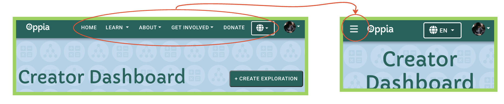

# Introduction

Acceptance tests are end-to-end tests that test the complete functionality of the application, and this will help users to catch bugs and regressions before they are released ensuring that the code does what it is supposed to do.

This guide will help you to get started on how to write `e2e acceptance test` for a particular user-type.


## Files and Directory Structure

```
oppia/core/tests/
 └── puppeteer-acceptance-tests
    ├── data
    │  └── blog-post-thumbnail.svg
    │  └── ...
    ├── functions
    │  └── is-element-clickable.ts
    ├── specs
    │  ├── blog-admin
    │  │    ├── assign-role-to-users-and-change-tag-properties.spec.ts
    │  │    └── ...
    │  ├── curriculum-admin
    │  │    ├── create-publish-unpublish-and-delete-topic-and-skill.spec.ts
    │  │    ├── create-edit-and-delete-classroom.spec.ts
    │  │    └── ...
    │  ├── topic-manager
    │  │    ├── create-and-delete-subtopic-and-story.spec.ts
    │  │    ├── browse-topics-on-topics-and-skills-dashboard.spec.ts
    │  │    └── ...
    │  ├── moderator
    │  │    ├── view-recent-commits-and-feedback-messages.spec.ts
    │  │    └── ...
    │  ├── site-admin
    │  │    ├── edit-user-roles.spec.ts
    │  │    └── ...
    │  ├── contributor-dashboard-admin
    │  │    ├── manage-translators-and-reviewers.spec.ts
    │  │    └── ...
    │  ├── release-coordinator
    │  │    ├── run-a-beam-job-and-copy-the-output.spec.ts
    │  │    └── ...
    │  ├── voiceover-admin
    │  │    ├── add-voiceover-artist-to-an-exploration.spec.ts
    │  ├── logged-out-user
    │  │    ├── click-all-buttons-on-contact-us-page.spec.ts
    │  │    ├── click-all-buttons-on-creator-guidelines-page.spec.ts
    │  │    └── ...
    │  ├── logged-in-user
    │  │    ├── create-and-delete-account.spec.ts
    │  │    ├── access-dashboards-and-other-pages-from-profile-menu.spec.ts
    │  │    └── ...
    │  ├── translation-admin
    │  │    ├── add-and-remove-translation-rights.spec.ts
    │  ├── practice-question-admin
    │  │    ├── add-and-remove-contribution-rights.spec.ts
    ├── utilities
    │  ├── common
    │  │    ├── puppeteer-utils.ts
    │  │    ├── show-message.ts
    │  │    ├── test-constants.ts
    │  │    ├── console-report.ts
    │  │    ├── user-factory.ts
    │  ├── user
    │  │    ├── blog-admin.ts
    │  │    ├── blog-post-editor.ts
    │  │    ├── curriculum-admin.ts
    │  │    ├── topic-manager.ts
    │  │    ├── moderator.ts
    │  │    ├── site-admin.ts
    │  │    ├── contributor-dashboard-admin.ts
    │  │    ├── release-coordinator-admin.ts
    │  │    ├── email-dashboard-admin.ts
    │  │    ├── voiceover-admin.ts
    │  │    ├── logged-in-user.ts
    │  │    ├── logged-out-user.ts
    │  │    ├── question-admin.ts
    │  │    ├── super-admin.ts
    │  │    ├── translation-admin.ts
```

The directory structure is as follows:
1) The `specs` directory contains all the top-level test files. Each test file is named as `*.spec.ts` and contains the test for a particular user type. For example, the `blog-admin` directory contains available tests for the `Blog Admin` user.

2) The `utilities` directory contains all the utility files and helper functions, which you would require to write new acceptance tests. This directory can also be used to append more utility functions as needed by the user.
Files included inside this directory are:
  - `common/puppeteer-utils.ts` -> This file contains the base _*BaseUser*_ class which provides the most common and useful methods such as _*openBrowser*_, _*goto*_, _*clickOn*_, _*openExternalPdfLink*_ etc. This class also serves as a foundation for defining other user-oriented subclasses, facilitating various testing scenarios.
  - `common/user-factory.ts` -> This file contains methods for creating a certain user. The file has different methods for creating different types of users.
  - `common/test-constants.ts` -> This file contains defined constants such as _*URLs, roles, etc.*_ which are used in the tests.
  - `common/console-report.ts` -> This file contains methods for listening the console errors during a test.
  - `common/show-message.ts` -> This file contains methods for displaying messages during the tests.

3) The `user` directory holds the utility files for different user types. Each user utility class is built upon the base `BaseUser` class containing the original methods along with the ones related to that user type. For example, `blog-post-editor.ts` contains base functions as well as additional functions just related to the `Blog Post Editor` user. 
4) The `data` directory contains all the images and other data files used in the tests.

## How to run the acceptance tests
From the root directory of oppia, run the following command:
```  
python -m scripts.run_acceptance_tests --suite={{suiteName}}  
``` 

Docker:
```
make run_tests.acceptance suite=SUITE_NAME
```

For example, to run the `check-blog-editor-unable-to-publish-duplicate-blog-post.spec.ts` test, run the following command:
Python:
```
python -m scripts.run_acceptance_tests --suite="blog-editor/check-blog-editor-unable-to-publish-duplicate-blog-post"
```

Docker:
```
make run_tests.acceptance suite="blog-editor/check-blog-editor-unable-to-publish-duplicate-blog-post"
```

> **TIP:** To reduce the development cycle for the tests, try using `--skip-build` to skip the build in the local environment as this can reduce the run-time of tests.

**Note: Typically, these tests take anywhere between 2 to 5-6 minutes (excluding the time taken for setting up the server) for any suite to run, both in headless and non-headless modes, assuming the machine has sufficient resources. The duration depends on the tests, and some tests can run longer due to a more extensive setup (if there is a longer setup, it would be mentioned in the timeout in the test block). However, tests with longer setups can go up to 8-10 minutes (currently, we have some such tests). Usually, the total runtime of tests would be around 3-4 minutes in most cases. In any case, if the run-time appears unreasonably long to you on you machine, feel free to raise an issue on our [issue tracker](https://github.com/oppia/oppia/issues).**

## How to write new tests for a specific user

1) Create a new directory for the specific user if it doesn't already exist inside the `specs` directory. For example, the `Topic Manager` user can have a directory named `topic-manager`, and within the user directory, each test file is named as `*.spec.ts`. 
> Note: Naming convention for directories/files is kebab case, where each word is separated by a (-).

2) Within the user directory, create a new file for each test. For example, `create-and-delete-subtopic-and-story.spec.ts` and `browse-topics-on-topics-and-skills-dashboard.spec.ts` for the `Topic Manager` user. These top-level tests contain single user stories checking their test steps and expectations mentioned in the testing spreadsheet.

3) The functionality of the top-level tests for each user type is defined in the `utilities/user` directory. For example, the blog admin tests are written within the `specs/blog-admin` directory, and the functionality of the tests is defined in the `utilities/user/blog-admin.ts` file.
> Note: A utility file is maintained for each user type. The purpose of maintaining this file is to add methods specific to that user on top of the already provided basic methods. This file maintains a user class which is extended from the base class of `puppeteer-utils.ts`. For example, `blog-admin.ts` has a class `BlogAdmin` which has methods like `createDraftBlogPostWithTitle`, `deleteDraftBlogPostWithTitle`, etc., specific to Blog Admin only. Sometimes, when a user (e.g., Topic Manager) requires methods from another user type (e.g., Curriculum Admin), it's acceptable to use intersection types to combine the necessary methods.

4) The utility files are imported into the top-level test files, and the methods are called to perform the required actions. For example, in the `assign-role-to-users-and-change-tag-properties.spec.ts` file, the `assignRoleToUser` method is called to assign a role to a user. Additionally, the `expectRoleAssignedSuccessfully` method is called to check if the role was assigned successfully. To facilitate instantiation of classes, each utils file should also include a `UserFactory` function. This function's purpose is to instantiate a new class of the corresponding type. For instance, `export let BlogAdminFactory = (): BlogAdmin => new BlogAdmin();` would create a BlogAdmin instance.

5) After adding a new user utility file, you should make the following changes to the user factory:

If the role requires a super admin to assign it, first, add the role to the `Roles` enum in `test-constants.ts`. Then, to add it, reference the `USER_ROLE_MAPPING` inside the `user-factory.ts` file. If the user requires a role from the super admin, add the reference accordingly.

For example, if we want to add Translation Admin with the help of a super admin then:

    • Define the role in `Roles` enum:
    ```
      Roles: {
        other roles... ,
        TRANSLATION_ADMIN: 'translation admin',
      }
    ```
    • Add the role to `USER_ROLE_MAPPING`:
    ```
      const USER_ROLE_MAPPING = {
        other roles... ,
        [ROLES.TRANSLATION_ADMIN]: TranslationAdminFactory,
      } as const;
    ```

For roles that don't require super admin privileges, such as `LoggedInUser`, add the factory to the array inside `createNewUser` under `composeUserWithRoles(BaseUserFactory(), [...])`. This ensures that the new user role is included when creating a new user instance. Please ensure to follow the appropriate conventions and guidelines while adding new user-utilities files to the user-factory to maintain consistency and clarity in the testing process.

6) For each test, the user is created using the `UserFactory` class. For example, in the `assign-role-to-users-and-change-tag-properties.spec.ts` file, the `createNewUser` method is called to create a new user, with the parameter `[ROLES.BLOG_ADMIN]` assigned as the role of the blog admin. The `createNewUser` method is defined in the `user-factory.ts`file. The `createNewUser` method creates a new user with the provided username, email, and role, and then returns the user object. The user object is used to perform the required actions (that are defined in the `utilities/user/*-utils.ts`).

7) After successful completion of any test step or any expectation, the `showMessage` method is called to log the progress. For example, in the `blog-admin.ts` file, the `showMessage` method is called to log the progress after publishing a new blog post. The `showMessage` method is defined in the `show-message.ts` file.

8) If there is any error during the test, then we throw errors in the expectation step or there would be a timeout error if some component does not behave as intended.

9) The `utilities` directory contains all the utility files and helper functions, which you would require to write new acceptance tests. This directory can also be used to append more utility functions as and when required or needed by the user.

10) The test must be thoroughly tested before submitting a PR. The test can be run locally by running the following command as mentioned above or you can run the test on the CI server by pushing your code to the remote branch in your fork. The CI server will run the test and will show the result.

11) After writing the test, do not forget to add it in our configuration file `common.py` and in `acceptance.json` file so that it is included in the workflow.

> Note: Sometimes tests may pass locally but fail on the CI environment due to differences between the local and CI environments. In such cases, debugging and fixing should be done on the CI environment, as that is where the tests are intended to run. However, we are transitioning to using Docker for both the local and CI setups, which should help mitigate these issues.**

### Console errors logging functionality in Acceptance Tests

Acceptance Tests have the capability to detect console errors during CUJs, potentially resulting in test failures. However, there are scenarios where certain console errors can be deemed acceptable and should not cause the test to fail. In order to ignore errors like these, you can use `ConsoleReporter.setConsoleErrorsToIgnore`, which takes in an array of error regexes to match the errors that can be acceptable. For instance, an error like `Blog Post with the given title exists already. Please use a different title.`, which occurs during the 'blog-editor-tests/try-to-publish-a-duplicate-blog-post-and-get-blocked' test, is ignored using the ConsoleReporter since it is an acceptable error in the context of the test. When passing acceptable errors like these to the ConsoleReporter, you should be specific and not use vague errors like `Failed to load resource...`.

Below is an example of this usage:
```typescript
ConsoleReporter.setConsoleErrorsToIgnore([
  'Blog Post with the given title exists already. Please use a different title.'
]);
```

To handle errors that need to be ignored and are not specific to any acceptance test, you should include them directly within the `console-reporter.ts` utility. In this file, you would add the error regex to the `CONSOLE_ERRORS_TO_IGNORE` array and explain with a comment why this error should be ignored.

```typescript
const CONSOLE_ERRORS_TO_IGNORE = [
  // These "localhost:9099" are errors related to communicating with the
  // Firebase emulator, which would never occur in production, so we just ignore
  // them.
  escapeRegExp(
    'http://localhost:9099/www.googleapis.com/identitytoolkit/v3/' +
      'relyingparty/getAccountInfo?key=fake-api-key'
  ),
  // This error covers the case when the PencilCode site uses an
  // invalid SSL certificate (which can happen when it expires).
  // In such cases, we ignore the error since it is out of our control.
  escapeRegExp(
    'https://pencilcode.net/lib/pencilcodeembed.js - Failed to ' +
      'load resource: net::ERR_CERT_DATE_INVALID'
  ),
];
```
To handle errors that need to be fixed, you should include them directly within the `console-reporter.ts` utility. In this file, you would add the error regex to the `CONSOLE_ERRORS_TO_FIX ` array and add a TODO comment which points to the existing issue number (this comment should be removed when the bug is resolved). If the error doesn't have any corresponding issue, then file a new issue on our [issue tracker](https://github.com/oppia/oppia/issues).

For example:
```typescript
const CONSOLE_ERRORS_TO_FIX = [
  // TODO(#19746): Development console error "Uncaught in Promise" on signup.
  new RegExp(
    'Uncaught \\(in promise\\).*learner_groups_feature_status_handler'
  ),
  // TODO(#19733): 404 (Not Found) for resources used in midi-js.
  escapeRegExp(
    'http://localhost:8181/dist/oppia-angular/midi/examples/soundfont/acoustic' +
      '_grand_piano-ogg.js Failed to load resource: the server responded with a ' +
      'status of 404 (Not Found)'
  )
];
```

### Screenshots testing functionality in Acceptance Tests

Acceptance Tests have a function called `expectScreenshotToMatch` in `puppeteer-utils.ts` to take screenshots of the UI during the acceptance tests and compare them to the existing screenshots in the codebase, which can help with debugging test failures as it provides more information beside the error message. 

To use this functionality, call the function `expectScreenshotToMatch`, which takes in a string as the name of the screenshot, and the absolute path of the directory of the specs file to locate where the folder of the screenshots will be. For instance, to create a screenshot after calling the function `loggedOutUser.clickTeachButtonInAboutMenuOnNavbar` in `logged-out-user/click-all-buttons-on-navbar.spec.ts`, call the function `expectScreenshotToMatch` with the user type `loggedOutUser` to identify which user's browser should be screenshotted, `teachPage`, a name for the screenshots that describes what the page is, and the variable `__dirname`. 

Below is an example of this usage:
```typescript
it(
  'should open teach page when the "For Parents/Teachers" button is clicked in About Menu on navbar',
  async function () {
    await loggedOutUser.clickTeachButtonInAboutMenuOnNavbar();
    await loggedOutUser.expectScreenshotToMatch('teachPage', __dirname);
  },
  DEFAULT_SPEC_TIMEOUT_MSECS
);
```

On the first run, a screenshot named `teachPage-snap.png` will be created and stored in a folder based on which mode (prod mode or dev mode) and device environment (desktop or mobile) the test was run in. There are four different folders:

- `prod-desktop-screenshots`: production mode in desktop environment, in which the `prod_env` flag is used. 
- `prod-mobile-screenshots`: production mode in mobile environment, in which the `prod_env` and `mobile` flags are used
- `dev-desktop-screenshots`: local development mode in desktop environments
- `dev-mobile-screenshots`: local development mode in mobile environment, in which the `mobile` flag is used. 

To introduce a new screenshot to the codebase, the test should be run in all these four modes/environments to generate each screenshot in all four folders. 

On CI, we run all the acceptance tests in production mode, so the screenshots in `prod-desktop-screenshots` and `prod-mobile-screenshots` will be compared to the screenshots that are generated during CI checks. If a screenshot doesn't match on CI, it generates an image in a folder as an artifact in the GitHub workflow. For example, if the screenshot `teachPage-snap.png` fails in `logged-out-user/click-all-buttons-on-navbar.spec.ts` during the CI checks in desktop environment, a folder named `diff-snapshots-logged-out-user_click-all-buttons-on-navbar` will be created. Inside this folder, a folder named `prod-desktop-screenshots` will be created and a screenshot `teachPage-diff.png` will be stored under this folder. The screenshots `teachPage-diff.png` will show the difference between the screenshot from the codebase and the new generated screenshot, making it easier to identify the difference. 

On the other hand, if the screenshot fails locally (in desktop environment), the screenshot `teachPage-diff.png` will be generated and stored inside a new folder `diff-snapshots` under `logged-out-user/dev-desktop-screenshots`. 

### Adding Prod screenshots for Acceptance Tests
On making changes that affect a user journey tested through the acceptance tests or introduce a new feature, a contributor needs to update/add screenshots supporting their changes.
It has been noted that screenshots obtained by running the Acceptance tests locally using the prod flag do not match those captured by the CI. To overcome this, you can commit any image in the prod screenshot folder and follow these steps:
1. Go to the failing run and click on the 'uploading diff screenshots as an artifact' section:
  

2. Then download the artifact from the artifact download url:
  

3. Extract the contents of the artifact. There will be a folder with an image. The image will be like this:
  
  
  The left side is the current reference image on the repo. The right side is the screenshot that was taken while running the test on the CI with your changes. The middle is the difference between the two.
  
  We want to update the current reference as it is incorrect. Generally we do not want to do this as we expect the reference screenshots to be correct. Only do this after asking a maintainer.

4. Go to https://splitter.imageonline.co/

5. Upload the diff image from the artifact you extracted:


6. Choose Split into pieces:


7. Set rows as 3 and columns as 1:


8. Click on split image 

9. You will get 3 split images:


10. Right click on the rightmost one and use 'Save Image as...'. Choose any random name.

11. Navigate to where you have saved the Oppia repo on your local machine.

12. Go to oppia/core/tests/puppeteer-acceptance-tests/specs

13. The spec will be mentioned in the artifact folder you downloaded:


(Its curriculum-admin in this case)

14. Navigate to the spec

15. Check if the failure was for desktop or mobile based on the screenshot or the subfolder in the artifact:


16. Go to the prod-desktop-screenshots/prod-mobile-screenshots folder depending on your failure

17. Paste the image we split.

18. Check the name of the image from the artifact. It will be {screenshot_name}-diff.png

19. Delete the screenshot with {screenshot_name}-snap.png from the folder you are currently in.

20. Rename the pasted image to {screenshot_name}-snap.png

21. Check that the correct image got replaced, commit and push your changes!

## Acceptance Tests for Mobile

Similar to desktop, we also have acceptance tests for mobile to ensure responsiveness and uninterrupted user journeys on small screen devices. While the tests themselves remain largely the same for both desktop and mobile, there are some differences. For instance, large full menus on desktop may be converted to dropdowns, hamburger menus, or other shortcuts on mobile, requiring additional actions to complete the tests.

### How to write tests for mobile

There will be no change in the `specs` file of the tests; however, there may be some changes in the `utilities/user` file, which is optional and dependent on the specific test cases. In most cases, the tests will run correctly for both mobile and desktop.

However, in scenarios where certain actions are affected by the smaller screen size, additional steps may be required.

For example: consider a scenario where a menu is collapsed into a hamburger menu due to the small screen size:



Here, if we want to click on the "Home" or any other button, we need to first click on the hamburger menu. Additionally, there may be differences in selectors for the same buttons between desktop and mobile. For instance, the publish button in desktop might be `e2e-test-publish-exploration`, while in mobile it could be `e2e-test-mobile-publish-button`.

We can handle these differences by including conditional statements in the `utilities/user` file, using the `isViewportAtMobileWidth()` function to execute commands specific to mobile devices.

For example:

```typescript
async discardCurrentChanges(): Promise<void> {
    // Check if the viewport corresponds to a mobile device.
    if (this.isViewportAtMobileWidth()) {
        // If on mobile, click on the mobile-specific discard button.
        await this.clickOn(mobileDiscardButton);
    } else {
        // If on desktop, click on the desktop-specific discard button.
        await this.clickOn(discardDraftButton);
    }
    // Confirm the discard action, regardless of the viewport size(common in both).
    await this.clickOn(discardConfirmButton);
}
```

In this example, the `discardCurrentChanges()` function checks if the viewport width corresponds to a mobile device, and if so, clicks on the mobile-specific discard button. Otherwise, it clicks on the desktop-specific discard button. Finally, it confirms the discard action. This approach allows us to maintain a single set of tests while accommodating differences between desktop and mobile environments.

### How to run mobile acceptance tests
From the root directory of oppia, run the following command:
```  
python -m scripts.run_acceptance_tests --mobile --suite={{suiteName}}  
``` 

Docker:
```
make run_tests.acceptance suite=SUITE_NAME MOBILE=true
```

For example, to run the `check-blog-editor-unable-to-publish-duplicate-blog-post.spec.ts` test, run the following command:
Python:
```
python -m scripts.run_acceptance_tests --mobile --suite="blog-editor/check-blog-editor-unable-to-publish-duplicate-blog-post"
```

Docker:
```
make run_tests.acceptance suite="blog-editor/check-blog-editor-unable-to-publish-duplicate-blog-post" MOBILE=true
```

## Reference Links
Blog Admin and Blog Editor Tests - 
  [Blog Admin top-level tests](https://github.com/oppia/oppia/tree/develop/core/tests/puppeteer-acceptance-tests/spec/blog-admin-tests)
  [Blog Editor top-level tests](https://github.com/oppia/oppia/tree/develop/core/tests/puppeteer-acceptance-tests/spec/blog-editor-tests)
  [user utility files](https://github.com/oppia/oppia/blob/develop/core/tests/puppeteer-acceptance-tests/user-utilities/blog-post-editor-utils.ts)
  [puppeteer utility files - base class](https://github.com/oppia/oppia/blob/develop/core/tests/puppeteer-acceptance-tests/puppeteer-testing-utilities/puppeteer-utils.ts)
  [puppeteer utility files - user factory](https://github.com/oppia/oppia/blob/develop/core/tests/puppeteer-acceptance-tests/puppeteer-testing-utilities/user-factory.ts)
