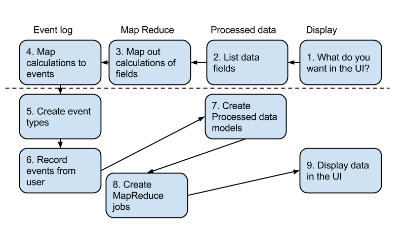

<!-- This guide was created by Stephanie Federwisch as a Google document and then transferred to the wiki. -->

_Note: This guide was written in 2014. If you find anything outdated, please either let us know, or make an update directly to the doc. Thanks!_

This page should walk you through how to go from a statistic you want to calculate from Oppia data through creating the models, jobs and getting them up and running.

Our statistics framework has four levels:
 * Event log (in datastore)
 * Map Reduce jobs
 * View optimized models (in datastore)
 * Display


This document walks through how to create each of these levels.

The recommended way of going through this process is to:
 * Plan the overall approach: start at the presentation layer and work your way down the layers to the event log (steps 1 - 4 in the diagram below). This will not involve writing code.
 * Write code to record the data you need for your calculations (steps 5-6).
 * Create mapreduce jobs (steps 7-8).
 * Use the data in the UI (step 9).

Each of these three sections will be a separate commit in a branch off of develop. After all 9 steps are completed and reviewed, this branch can be merged into develop.



## 1-4. Figuring out what you need

1. Start by thinking about what you want to display. This could mean drawing charts and/or listing out data you want to display.
2. List out processed data fields. Figure out which data you need to display and find one field for each. For example, a bulleted list would have one field in the model for each bullet point. A histogram could be drawn by having a list of data point values, but if you want to have standard deviation or mean, you would want to have separate fields for those as well.
3. Map out how you would calculate each field in your model. For some fields this may be straightforward, like how counting how many students go to the page for a number of students that started the exploration, whereas others might be more complex and this stage may take a while, like how confused are students.
4. Figure out what interactions you would need to keep track of to do those calculations. For mapping out completions of an exploration, this might be “I need to know when students complete the exploration.” Keep in mind when you would record these events. So if you wanted to know an average time spent in a particular state it would become “I need to know how much time was spent in the state when the student leaves the exploration”.

So, you have a model of what you want to create and you know which model it should be in.

## 5. Creating the events

Now, you need to figure out which events you need to know about to make this calculation. See if these events already exist. (`core/storage/statistics/gae_models.py`).

If any event type is missing, create a new branch off of develop. Then, create a new event class in `core/storage/statistics/gae_models.py`. This class should be fully commented about what this event indicates and what each field should be populated with. In addition, it should have the following properties:
 * It inherits from the superclass `base_models.BaseModel`.
 * Its class name ends in `EventLogEntryModel`.
 * Make sure to add in common fields for similar types of events. See this file for what fields many event types require. If it isn’t in that file, try to use those fields as a guideline. A reader generated event should include the session id, play type, exploration id/version, etc. Note: created_on is already a part of `BaseModel` and it will be set automatically.
 * Event_type field. This should be a constant in `feconf.py`, like `EVENT_TYPE_LEAVE`.
 * Entity Id. Since we do not have plans to query for events by id, this id just needs to be unique. Something like `timestamp:exp_id:session_id` is likely sufficient.
 * Create function. This should be a marked with `@classmethod` and take in all fields that need to be set in the event. Note: Fields that are the the same for every instance of the same class, like event_type or time since start for start events, do not need to be parameters in the function.

## 6. Record events from the User

### Add services functions

The pattern we use is to hide creating models by adding functions in event_services. For each event type (or scenario), create a class whose name ends in `EventHandler`, and it should be a subclass of `BaseEventHandler`:
 * Create a function by the name `_handle_event` which should be marked `@classmethod`. This is the actual function which is called when you record an event.
 * Should call `stats_models.YourModelName.create()`.
 * Add a line in core/domain/stats_services_test.py, EventLogEntryTests test_create_events.
 * If you feel this does not cover everything that needs to be tested, add a new test (and increase the count of tests in `core/tests/gae_suite.py`).

### Creating the data

 * Find the right controller from core/controllers that keeps track of the data you want to use. For example, `reader.py` would be the controller for any reader interactions. 
 * Figure out which handler in that file. Comments should help with this, but if not you can find the url to handler mapping in `main.py`.
 * What if there isn’t such a handler or not all the data you need is collected? We can add a new data collection/handlers but since this is a more complex operation and is likely to collect new and different kinds of data, please check with a tech lead before making these kinds of changes.
 * You will need to create and send a request. An example from the handler for leave events: 
```js
var requestMap = {
  params: $scope.params,
  version: GLOBALS.explorationVersion,
  session_id: $scope.sessionId,
  client_time_spent_in_secs: 
    (new Date().getTime() - $scope.stateStartTime) / 1000,
};

$http.post(
  '/explorehandler/leave/' + $scope.explorationId + '/' + encodeURIComponent($scope.stateName),
  oppiaRequestCreator.createRequest(requestMap),
  {headers: {'Content-Type': 'application/x-www-form-urlencoded'}});
```
 * Once you have gotten all the data through to the controller, make a call to `event_services.YourEventHandler.record()` with all the data.

### Submitting the event log entries

Up till this point can all be done in one commit (or possibly several smaller ones on the same branch). Run `./scripts/run_tests.sh`, commit and then request a code review. This branch should be able to be merged in to develop after that code review if you so choose, since it should not impact the front end to record more unused events. If you want to keep working on this branch, make sure you periodically check to make sure you merge develop into your branch to keep up to date. After each merge, run tests to make sure that your changes do not cause any conflicts with the new code.

## 7. Create view models

So now you should have all the events you need being recorded in the data store. The next thing you need to do is create (or add to) the final models. Each view in the UI has its own model in `core/storage/statistics/gae_models.py`, likely the one you want is either `ExplorationAnnotationModel`, `StateAnnotationModel`, `UserAnnotationModel`, or `GalleryAnnotationModel`. There will be one model for each entity that can be viewed. So an `ExplorationAnnotationModel` will have one instance per exploration. 
 * Find the appropriate model.
 * If it doesn’t exist, create a new model based off of `base_models.BaseMapReduceBatchResultsModel` (using this model turns off default caching).
 * Add a field for each UI display. This could be a list that will be turned into a graph, or a calculated field that will be displayed as is, or some map from different UI entities to a data point for each.
 * Keep it minimal: store only as much data as you need in order to populate the view. This makes it as efficient as possible to query this data.
 * Add a simple get function in `core/domain/stats_services.py`. Make sure to handle `EntityNotFoundError` for before the job has been run.


## 8. Create MapReduce Jobs

### Finding the right job

How do you know which job to add or which one to update?
 * If the model already exists, use the same job that is already calculating this model. No two jobs should be updating the same model.
 * Could you get the data you need from a grouping that already exists? If so, consider bundling the calculation into a job that already does that grouping. For example, state data could be calculated in a job that groups by exploration, but user level data might not. 
 * Would the data look inconsistent if it wasn’t calculated at the same time? If you are creating a subview of a larger view that already has a job or a new location of similar data, consider what would happen if you viewed the two places at the same time when one job has run recently, but the other has not. If the data would look inconsistent, they should probably go in the same job. 
 * If you are doing similar math in two places, you may want to consider running both computations in the same job.

If you create a new job:
 * Add it to `core/domain/stats_jobs.py`.
 * Should be a subclass of `jobs.BaseMapReduceJobManager`.
 * Add a line to `core/jobs_registry.py` to register the job to run.

If you are updating an existing job, update docstrings for jobs you are modifying.

### Event types to process

Double check `entity_classes_to_map_over()`. This is a list of all the events to MapReduce in this job. Make sure all event types you need are in this list. If they aren’t, add them.

### Writing or updating map

Each event gets sent to the map function individually and the map function yields one or more key-value pairs. For the most part, each event should yield only one pair. Note: if the fields in each event type being processed are different, you may want to have separate yield statements depending on the event type.

Selecting the key: 
In the reduce step you will get all values with the same key at the same time, so all events that need to be processed together in the reduce phase should be aggregated under the same key during the map phase. If you want to process all data for a session, use the session id. If you want to process all data for an exploration, use the exploration id.

Creating the value: 
All values passed to the reduce method will be stringified. To make sure that we can reliably de-stringify this value, the passed value needs to be constructed of base python types. We’ve found the simplest form to use to be turning the event into a dictionary. This will look something like this
```python
map_value = {
  'event_type': item.event_type,
  'session_id': item.session_id,
  'created_on': int(utils.get_time_in_millisecs(item.created_on)),
  'state_name': item.state_name
}
```

For each value of the event that is relevant:
 * The map key should be the name of the field.
 * The value needs to be turned into a base python type (i.e., datetime would need to be turned into an int).

### Writing reduce

Reduce will get a key and a list of stringified values. First you will need to de-stringify any value you want to use. You can use `ast.literal_eval(value_str)`. This is the function where you will write all the calculations you want.

Keep in mind any sanity checks for data and how the code would react if certain fields were missing. Any new fields you have added may not exist for older events, so it should handle these without causing the job to raise an exception. You also need to be careful about skipping this event entirely since it is likely that the event will be used for other calculations in this job and we don’t want to throw those off.

Write the data to the models
 * The id for the model is likely similar to the key for the reduce.
 * The line should read something like this `stats_models.YourModel(id=id, field1=value1, field2=value2, …).put()`.

###Testing your job manually

Now you have a functioning job, but you should check to make sure.
 * Run `scripts/start.sh`.
 * In your browser go to `localhost:8181`.
 * Login as admin.
 * From the admin page, reload an exploration that will meet your needs.
 * Do some UI interaction(s) that should trigger your event creation code. You may want to trigger several events with varied values to do a more complete test.
 * Go to the admin page and find the job you want to test and click “Start job”.
 * Refreshing the admin page should tell you whether or not the job is complete.
 * When the job is complete, navigate to `localhost:8000`.
 * In the datastore viewer, select the model you want to verify and click List Entities. You should see an entry corresponding to the interactions you have done. Check to make sure all values make sense. You may also see values for explorations/states/users that you did not interact with. Make sure that the existing values still calculate correctly and that your values have a reasonable default value in those cases.
 * Repeat this process to make sure that your job will update the values on subsequent runs properly.

### Writing tests

Write some unit tests that follow this general pattern:
* Record some events using the `EventHandler methods`.
* To get job running use code similar to this
```python
job_id = stats_jobs.StatisticsPageJobManager.create_new()
stats_jobs.StatisticsPageJobManager.enqueue(job_id)
self.assertEqual(self.count_jobs_in_taskqueue(), self.process_and_flush_pending_tasks()
self.assertEqual(stats_jobs.StatisticsPageJobManager.get_status_code(job_id), jobs.STATUS_CODE_COMPLETED)
```
 * Use datastore get to get the models you are writing to.
 * Verify the values are as expected.

Write multiple tests to make sure that all code paths are tested. For any new test you add you will need to increment the count in `core/tests/gae_suite.py`.

Dealing with event timestamps in test:
Test run quickly and as such often times the events created in a test will likely all have the same timestamp. So if your tests require events to happen in a particular order, such as calculation that tests time between events or takes the first or last event, the best practice is to manually edit the created_on timestamps to avoid flakiness in the tests. You have to create the event first and then modify created_on and then put it in the database. Like in this example:
```python
leave = stats_models.MaybeLeaveExplorationEventLogEntryModel(
    event_type=feconf.EVENT_TYPE_LEAVE,
    exploration_id=exp_id,
    exploration_version=version,
    state_name=state,
    session_id='session1',
    client_time_spent_in_secs=27.0,
    params={},
    play_type=feconf.PLAY_TYPE_PLAYTEST)
leave.created_on = datetime.fromtimestamp(1)
leave.put()
```

### Making it run as a cron job

Many core jobs will be run on a periodic basis. You will need to make sure that your job runs at reasonable intervals. This only applies if you have added a new job.
 * You will need to add a handler in `core/controllers/cron.py` This will need to kick off a job. The code will look like this
```python
for klass in jobs_registry.JOB_MANAGER_CLASSES:
  if klass.__name__ == 'StatisticsPageJobManager':
    klass.enqueue(klass.create_new())
    break
```
 * You will also need to add a line to main_cron.py to direct the url to your handler
    get_redirect_route(r'/cron/statistics', cron.StatisticsHandler, 'statistics_handler'),
 * Add a section to cron.yaml specifying the url, a description and the time interval 

### Submitting job

After this point, run scripts/test.sh. Make sure that all tests pass and you have reasonable code coverage for any code you have added. Once you commit this to your branch, request a code review. 


## 9. Using it in the UI

 * Find the handler for the page you want to display the data in. For most statistics this is going to be `controllers/editor.py ExplorationStatisticsHandler`.
 * Call the get function for your annotation model.
 * In the put function there is a line calling `self.render_json()`. Put new entries into this dict like this
```python
‘num_visits’ : exploration_annotation.num_visits
```
 * This will become a field in the response.data when get is called on that handler. You can add this variable to the $scope, in most cases this will be in `core/templates/dev/head/editor/ExplorationEditor.js`
```js
$scope.stats = {
  'numVisits': data.num_visits,
  'numCompletions': data.num_completions,
};
```
 * Then this can be accessed in angular in the html for rendering. core/templates/dev/head/editor/stats_viewer.html in most cases. Some examples:
```html
<div ng-if="stats.numVisits > 0">
```

_Now you can merge your jobs in and your stats should be up to date! Any of these layers can be edited at any time if you so choose._
