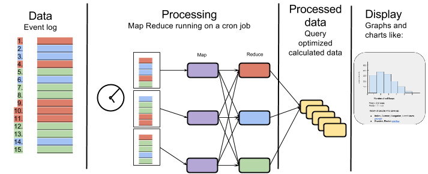

This page should walk you through how to go from a statistic you want to calculate from Oppia data through creating the models, jobs and getting them up and running.

Our statistics framework has four levels:
 * Event log (in datastore)
 * Map Reduce jobs
 * View optimized models (in datastore)
 * Display

  