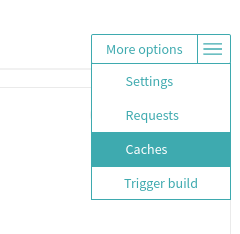
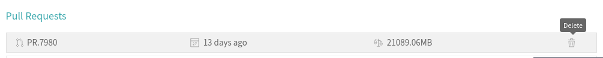

If your build is consistently failing and one of the following reasons is true, then you may need to reach out to a code owner or Core Maintainer to clear the Travis Cache.

- Recent change to third party package versions (ie. node, etc)
- Recent addition or removal of third party packages
- No apparent cause for failures that are not due to flakiness
- Errors with package installation on Travis, for example:
```
dpkg-deb (subprocess): decompressing archive member: lzma error: unexpected end of input
dpkg-deb: error: subprocess <decompress> returned error exit status 2
dpkg: error processing archive /home/travis/.cache/TravisChrome/google-chrome-stable_77.0.3865.75-1_amd64.deb (--install):
 cannot copy extracted data for './opt/google/chrome/chrome' to '/opt/google/chrome/chrome.dpkg-new': unexpected end of file or stream
Errors were encountered while processing:
 /home/travis/.cache/TravisChrome/google-chrome-stable_77.0.3865.75-1_amd64.deb
Traceback (most recent call last):
  File "/opt/python/2.7.15/lib/python2.7/runpy.py", line 174, in _run_module_as_main
    "__main__", fname, loader, pkg_name)
  File "/opt/python/2.7.15/lib/python2.7/runpy.py", line 72, in _run_code
    exec code in run_globals
  File "/home/travis/build/oppia/oppia/scripts/install_chrome_on_travis.py", line 63, in <module>
    main()
  File "/home/travis/build/oppia/oppia/scripts/install_chrome_on_travis.py", line 59, in main
    subprocess.check_call(['sudo', 'dpkg', '-i', travis_chrome_path])
  File "/opt/python/2.7.15/lib/python2.7/subprocess.py", line 190, in check_call
    raise CalledProcessError(retcode, cmd)
subprocess.CalledProcessError: Command '[u'sudo', u'dpkg', u'-i', u'/home/travis/.cache/TravisChrome/google-chrome-stable_77.0.3865.75-1_amd64.deb']' returned non-zero exit status 1
```


## Instructions

1. Click on the More Options menu on the right, then Caches in the dropdown.

   

2. Click on each of the trash cans for each of rows of cache. The Delete All Cache button *does not* work. Note that deleting the cache takes time to reflect on the webpage, so be patient or reload the page.

  
