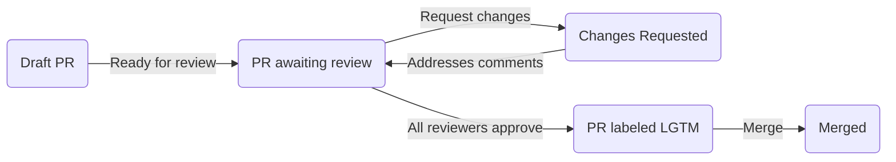

## Table of contents

* [Pull request lifecycle](#pull-request-lifecycle)
* [Draft pull requests](#draft-pull-requests)
* [Labeling pull requests](#labeling-pull-requests)
* [Working on multiple pull requests](#working-on-multiple-pull-requests)

## Pull request lifecycle

1. (optional) Draft PR: Authors can open draft PRs to get early feedback or debug CI tests. Reviewers usually won't leave comments on these PRs unless the author leaves a comment of the form `@reviewer_username PTAL` to request a review from GitHub user `reviewer_username`.
2. PR ready for review: Once authors mark PRs as ready for review (or if they skip the draft PR stage entirely), reviews will automatically be requested from all code owners. Oppiabot will assign the code owners to review the PR.
3. Changes requested: Reviewers will either approve the PR or request changes. Almost all PRs will have at least some changes requested. PR authors address each comment, either by making the requested change or explaining why they think it is unnecessary. Once all comments are addressed, reviewers will re-review.
4. LGTM: A PR gets labeled LGTM ("looks good to me") when it has sufficient reviews. This means that a code owner from each modified file has approved. When multiple developers share code ownership, only one has to approve.
5. PR merged: PRs can be merged once CI checks pass and the LGTM label has been applied. Only members of the Oppia organization can merge PRs.

## Draft pull requests

While making a contribution, you may discover that your change is not complete and needs some more work. You can make a draft pull request to make it easy for other developers to give you feedback; however, draft pull requests consume resources like time on our CI runners, which slows down CI runs for other developers. Hence, you should prefix the commit messages with `[skip ci]` or `[ci skip]` to disable CI runs when those commits are going to a draft PR. If you want those tests to run to help you debug a problem, you should open a PR against your fork's `develop` branch instead of the `oppia/oppia` develop. This will not delay other developers' GitHub Actions runs.

Learn more about [skipping a GitHub Actions run](https://github.blog/changelog/2021-02-08-github-actions-skip-pull-request-and-push-workflows-with-skip-ci/).

## Labeling pull requests

While contributing to Oppia, you will need to add different labels to issues or pull requests which you are working on. However, not all labels are allowed on issues and pull requests. Below are labels which can be applied to pull requests:

* Added by PR author:

  * `dependencies`: Should be added to pull requests that update one or more dependencies.
  * `PR: Affects datastore layer`: Indicates that a PR changes the datastore layer. Adding this label notifies the developers in charge of datastore stability so they can review the PR. Sometimes this label gets added automatically by Oppiabot, but if you open a PR that changes the datastore layer and the label isn't added automatically, you should add it manually. You can also add the label without waiting for Oppiabot.
* `PR: require post-merge sync to HEAD`: Should only be applied to pull requests which, when merged, will require all other open pull requests to be updated with the develop branch.

* Added automatically:

  * Labels starting with `PR: don't merge`: Indicates that some problem with the PR needs to be addressed before merging. For example, one of these labels gets added if the PR author hasn't signed the CLA yet.
  * `stale`: This label gets added by oppiabot to PRs that have been inactive for a week. They will be automatically closed after 4 more days of inactivity.
  * `PR: LGTM`: Indicates that a PR has all necessary approvals. The PR can be merged as soon as the CI checks pass.

* Added by the release team:

  * `PR: for current release`: Identifies PRs that need to be included in the release that is currently in progress. This label is used by the release team to identify PRs to cherry-pick into the release.
  * `PR: released`: Identifies PRs that have been cherry-picked into the release. Should only be used by the release team.

A complete list of labels can be found [here](https://github.com/oppia/oppia/labels). If you don't have permission to add labels, leave a comment asking one of your reviewers to add the label for you.

## Working on multiple pull requests

After you've submitted a PR, and are waiting for it to get reviewed, you might want to start working on a new issue in the meantime. Just follow the [[instructions for making a pull request|Make-a-pull-request]] again from the beginning.

Always prioritize following up on your existing PRs and getting them ready for the next round of review. In particular, only start working on new issues/PRs after **all** the other PRs you're working on are in the "waiting for review" stage. This helps avoids creating a logjam in the build queues.
