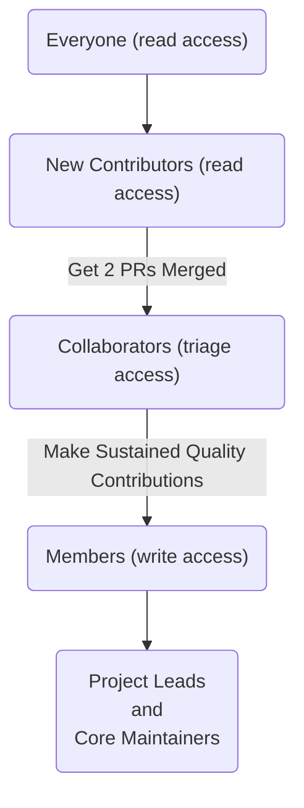
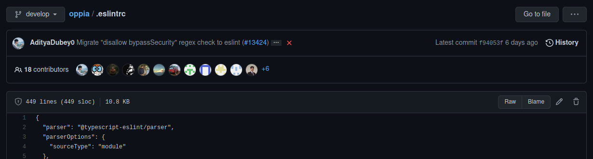

_These instructions are for developers who'd like to contribute code to improve the Oppia platform. If you'd prefer to help out with other things, please see our [[general contribution guidelines|Home]]._

Thanks for your interest in improving the Oppia platform! This page explains how you can get involved.

If you run into any problems along the way, we're here to help! Check out our [[wiki page on getting help|Get-help]] for the communication channels you can use. If you find any bugs, you can also file an issue on our [issue tracker](https://github.com/oppia/oppia/issues). There are also lots of helpful resources in the sidebar, check that out too! Also, if you'd like to get familiar with Oppia from a user's point of view, you can take a look at the [user documentation](http://oppia.github.io/).

**Important! Please read this page in its entirety before making any code changes.** It contains lots of really important information. You should also read through our [[guide to making pull requests|Make-a-pull-request]].

## Table of Contents

* [Setting things up](#setting-things-up)
* [Developing your skills](#developing-your-skills)
* [Finding something to do](#finding-something-to-do)
  * [Good first issues for new contributors](#good-first-issues-for-new-contributors)
  * [How to tackle good first issues](#how-to-tackle-good-first-issues)
  * [Contributor Roles](#contributor-roles)
  * [Tasks for Existing Contributors](#tasks-for-existing-contributors)
* [Tips for Success](#tips-for-success)
* [Notes](#notes)

## Setting things up

1. Please sign the CLA so that we can accept your contributions. If you're contributing as an individual, use the [individual CLA](https://goo.gl/forms/AttNH80OV0). If your company owns the copyright to your contributions, a company representative should sign the [corporate CLA](https://goo.gl/forms/xDq9gK3Zcv). **If you do not sign the CLA, any PRs you open will be closed.**

2. Fill in the [Oppia contributor survey](https://goo.gl/forms/otv30JV3Ihv0dT3C3) to let us know what your interests are. (You can always change your responses later.)

3. Say hi and introduce yourself on [GitHub Discussions](https://github.com/oppia/oppia/discussions/16715)!

4. Install Oppia following the [[installation instructions|Installing-Oppia]]. If you run into any issues, please check out the [[troubleshooting instructions|Troubleshooting]]. If you want help setting up a code editor, also check out our [[guide to common IDEs|Tips-for-common-IDEs]]. If the above resources don't help and you're still stuck, please check [GitHub Discussions](https://github.com/oppia/oppia/discussions/categories/q-a-installation) to see if any existing threads address the issue. If not, feel free to start a new thread explaining what you've tried and what you're seeing, so that we can try and help you!

5. Update your GitHub settings:

   * [Set up 2FA]( https://help.github.com/articles/securing-your-account-with-two-factor-authentication-2fa/) on your GitHub account. **This is important to prevent people from impersonating you.**

     When using 2FA, you might need to create a [personal access token](https://help.github.com/articles/creating-a-personal-access-token-for-the-command-line/) so that you can log in from the command line. Alternatively, you can [log in using SSH](https://docs.github.com/en/github/authenticating-to-github/connecting-to-github-with-ssh).

   * Set your GitHub notification preferences [here](https://github.com/oppia/oppia/subscription). The important thing is to make sure you notice when someone replies to a conversation you're part of -- many people choose "Not watching" so that they do not get overwhelmed. Selecting "Watching" will notify you about everything that happens on the Oppia repository (which is a lot!), and notifications specifically addressed to you might end up getting lost in the noise.

   * (Optional) Consider setting up [automatic auth](https://help.github.com/articles/caching-your-github-password-in-git/) so you don't have to type in a username and password each time you push a change. Note that this isn't an issue if you use SSH.

6. Familiarize yourself with the resources linked to from the sidebar of this page, especially the [[overview of the codebase|Overview-of-the-Oppia-codebase]], the [[coding style guide|Coding-style-guide]], and the [[Frequently Asked Questions|Frequently-Asked-Questions]]. You don't have to read all the other stuff right now, but it's a good idea to be aware of what's available, so that you can refer to it later if needed.

7. Take up your first Oppia starter issue! (See [below](https://github.com/oppia/oppia/wiki/Contributing-code-to-Oppia#finding-something-to-do) on how to do this.) Make sure to read and follow the [[PR instructions|Make-a-pull-request]] closely so that your PR review proceeds smoothly.

    * In your browser, consider bookmarking the [[guide to making pull requests|Make-a-pull-request]] for easy reference later, as well as the ["my issues" page](https://github.com/issues/assigned) (so that you can keep track of the issues assigned to you).

    * Facing any problems (including non-coding ones)? Please feel free to create a [GitHub Discussion](https://github.com/oppia/oppia/discussions) and get help from the Oppia community. You can use this avenue for asking anything -- questions about any issue, who to contact for specific things, etc.

    * We also have onboarding mentors who would be more than happy to help you take your first steps in open source. If you'd like individual support, feel free to request a mentor [using this form](https://forms.gle/udsRP4WQgLcez9Zm8).

8. When you have merged PRs that correspond to two different pre-existing GitHub issues, please fill in [this form](https://forms.gle/NxPjimCMqsSTNUgu5) to become an Oppia collaborator! This will grant you access to the repository, and allow you to join a team. (But please don't create your own issues and then make PRs for them -- that won't count.)

## Developing your skills

See our [[page of learning resources|Learning-Resources]] for suggestions on how you can improve your development skills. When you take up an issue that requires programming languages or tools you are unfamiliar with, check out that page for resources that other developers have found useful when learning.

We also **strongly recommend** looking through the resources under "Developing Oppia" in the wiki sidebar. Good places to start include the [[Overview of the Oppia codebase|Overview-of-the-Oppia-codebase]] and the [[tips on how to find the right code to change|Find-the-right-code-to-change]].

## Finding something to do

### Good first issues for new contributors

Welcome! Please make sure to follow the instructions above if you haven't already.

After that, you can choose a good first issue from the [list of good first issues](https://github.com/oppia/oppia/labels/good%20first%20issue). These issues are hand-picked to ensure that you don't run into unexpected roadblocks while working on them, and each of them should have clear instructions for new contributors. If you see one that doesn't, please let us know via [GitHub Discussions](https://github.com/oppia/oppia/discussions) and we'll fix it. For other issues, you might need to be more independent because we might not know how to solve them either.

You can also browse good first issues for each of the core Oppia Web teams to find something you'd enjoy working on! Please only choose issues that have **not yet** been assigned, unless the issue is a "checkbox issue" with multiple claimable parts. Here are the project boards for the different teams:

- Learner and Creator Experience (LaCE): https://github.com/orgs/oppia/projects/3/views/10, typically frontend or full-stack
- Contributor Dashboard: https://github.com/orgs/oppia/projects/18/views/5, typically frontend or full-stack
- Developer Workflow: https://github.com/orgs/oppia/projects/8/views/10, typically backend or frontend

### How to tackle good first issues

When you've found a good first issue you'd like to tackle, please investigate it first to understand why the issue is happening. Here are some things you should do:

- Read the entire discussion thread to understand what has been tried so far.
- Try to reproduce the issue on your local dev server. (For Contributor Dashboard issues, the [[Contributor Dashboard wiki page|Contributor-dashboard]] has some useful setup information. For Learner and Creator Experience releated issues, you can refer to the [[LaCE-onboarding-guide|LaCE onboarding guide]].)
- Figure out why the problem is happening, and find the relevant code in the Oppia repository to change. (The [['Finding the right code to change' wiki page|Find-the-right-code-to-change]] might be helpful.) If you have trouble with this, feel free to ask on [GitHub Discussion](https://github.com/oppia/oppia/discussions) and explain what you've tried doing so far.
- If the issue is easy to fix, try to get a rough fix working on your local dev server!

Once you have a good understanding of the issue, you can ask for it to be assigned to you by leaving a comment as follows:

- Explain clearly how you'd tackle the issue (at a minimum, point to which file(s) you'd modify and describe the changes you'd make).
- If possible, show a screenshot or code snippet demonstrating your proposed fix.
- @-mention the leads of the corresponding project the issue falls under, letting them know you'd like to work on it. (The leads are: @SanjaySajuJacob and @Priyansh61 for [LaCE](https://github.com/orgs/oppia/projects/3/views/8?pane=info); @sagangwee and @chris7716 for [Contributor Dashboard](https://github.com/orgs/oppia/projects/18/views/4?pane=info); @U8NWXD and @gp201 for [Developer Workflow](https://github.com/orgs/oppia/projects/8?pane=info).)

If your explanation makes sense, we'll assign the issue to you. Once assigned, feel free to submit a PR by following the [[instructions for making a PR|Make-a-pull-request]].

If you run into any problems, feel free to create a [GitHub Discussion](https://github.com/oppia/oppia/discussions) and get help from the Oppia community, or [request a mentor](https://forms.gle/udsRP4WQgLcez9Zm8) if you'd like individual support.

**Important Note**: Please follow the [[PR instructions|Make-a-pull-request]] carefully! Otherwise your PR review may be delayed or your PR may be closed.


### Contributor Roles

If you want to play a more integral role in sustaining Oppia, you can look forward to being able to take on more responsibilities as you continue to make quality contributions to the project. Here is a rough outline of the roles developers play at Oppia:



As a new contributor, you won't have any permissions on the repository except to read the code, so you'll need to ask other developers (or Oppiabot) to assign reviewers to your PR or add labels to your issue.

After you've completed parts of at least two different issues and successfully submitted PRs for them into develop, you can fill in [this form](https://forms.gle/NxPjimCMqsSTNUgu5) to become an Oppia collaborator! This will grant you access to the repository, and allow you to join a team of your choice. Once you fill out the form, we'll mail you a collaborator invite link for the Oppia repository -- this is a manual process, and may take up to 48 hours. Please visit [this link](https://github.com/oppia/oppia/invitations) to accept the invitation to collaborate. Feel free to email us at admin@oppia.org if you don't receive the email!

Then you'll be a collaborator with triage access, which lets you assign reviewers and labels. No more asking for reviewers to be assigned! If you continue to make quality contributions, you may be added as a member of the Oppia organization, which grants you write access. Then you'll be able to restart tests, serve as a [code owner](https://docs.github.com/en/articles/about-code-owners), and review pull requests.

Finally, after you've been contributing to the project for a while, you may become a project lead and/or core maintainer. In those roles, you'll help plan and lead Oppia's development.

If you ever wonder why you don't have permission to perform some action on the Oppia repository, it might be because of your role. GitHub details each role's privileges in more detail in [their documentation](https://docs.github.com/en/organizations/managing-access-to-your-organizations-repositories/repository-permission-levels-for-an-organization).

### Tasks for Existing Contributors

There are lots of options!

* **Want easy issues?** Check out our [list of "good first issues"](https://github.com/oppia/oppia/labels/good%20first%20issue).

* **Want to join a team working on a larger effort?** See our [list of projects](https://github.com/oppia/oppia/projects).

* **Want to practice debugging?** Check out our [list of issues needing debugging help](https://github.com/oppia/oppia/issues?utf8=%E2%9C%93&q=is%3Aissue%20is%3Aopen%20label%3A%22needs%20debugging%22%20).

* **Want to practice writing a design doc?** Check out the [list of issues requiring a design doc](https://github.com/oppia/oppia/labels/needs%20design%20doc). This is useful for learning how to write good "technical implementation" proposals.

* **Want to lead a project?** Let us know by emailing admin@oppia.org.  We may offer you the opportunity to do this once you've sent in several good PRs.

* **Want help figuring out what to do?** Just ask us on [GitHub Discussions](https://github.com/oppia/oppia/discussions), or send an email to admin@oppia.org. We'll try to help!

If an issue hasn't got someone assigned to it, and there's no existing PR for the issue (you can check this by scanning the list of [existing PRs](https://github.com/oppia/oppia/pulls)), feel free to take it up by assigning yourself to it. You don't need to ask permission to do so. Also, if you need help or advice on an issue, you can contact the corresponding team lead, whose GitHub username you can find in the description of the project the issue is assigned to. You can also find a list of all Oppia teams on the [Projects page](https://github.com/oppia/oppia/projects).

## Tips for Success

1. Make dependent (“stacked”) PRs to ensure smaller time between reviews and subsequent PRs. A large PR results in difficulty to review for the reviewer as well as difficulty in making changes according to a review for an author. So, it is better to create smaller PRs which deliver a single small goal. If you have code changes dependent on a PR, it is better to create a separate PR for those changes.

2. Try and follow test-driven development. This is the easiest way to make sure the code you wrote is working fine. The basic idea is to first write tests for the expected behaviour and then write code that will pass those tests. Refer to our [[guides for writing good tests|Tests]].

3. If you're stuck on something, ask for help instead of letting it block all your work. It can be difficult to know when to ask for help, so one rule of thumb is to ask whenever you've been unable to make progress for an hour.

4. When asking questions, follow our guide to [[getting help|Get-help]] to make sure your question gets to the right people and has the information they need to help you.

5. Remember that you're working with volunteers, nearly all of whom spend most of their time at school or a job. Don't be surprised if it takes a few hours for someone to get back to you (they might be in a different time zone!).

6. Do a self-review to find your own mistakes. Reviews by other developers take time, so any mistakes you can catch by yourself will speed things up.

7. Take the time to understand what the code you are changing is doing.  Sometimes we see PRs for changes that don't do anything useful or that don't make sense given the context of the code. These won't get merged.

8. If you are making a contribution which involves changing some user interface or introducing a new feature, it is good to start with a design doc to avoid wasting efforts later. Follow our [[guide for writing design docs|Writing-design-docs]].

9. You will almost certainly run into bugs where you aren't sure what the cause is. This is normal! Our [[debugging guides|Debugging]] will help you investigate the problem.

## Notes

* Our central development branch is `develop`, which should be clean and ready for release at any time. All changes should be done in feature branches based off of `develop`.

* Sometimes, GitHub comments in the main conversation thread don't have a reply box. This seems to be a quirk with GitHub: apparently the reply box doesn't show up on outdated threads if you're currently in the middle of a review (or a reply to someone else's review) that you haven't submitted. After you submit the review, the reply field should show up again.

* If you want to do a codebase change that is large and somewhat repetitive, do a small trial PR first for a limited subset of the change, and check with reviewers whether the approach makes sense. Only after getting that trial PR merged (or at least approved by all reviewers) should you do the full change.

  This helps because, if you just did the full PR at the outset instead, then if a reviewer requests changes to the approach, you'd need to go back and modify all the files. On the other hand, with a trial PR, addressing an initial round of changes is less work, and by the time you get to the full PR, you'd already know what you need to do!

* To find the author of a particular change in a file, run this command:

  ```console
  git blame file-name
  ```

  The output will show the latest commit SHA, author, date, and time of commit for each line.

  To confine the search of an author between particular lines in a file, you can use:

  ```console
  git blame -L 40,60 file-name
  ```

  The output will then show lines 40 to 60 of the particular file.

  For more `git blame` options, you can visit the [git blame documentation](https://git-scm.com/docs/git-blame). You can also view this information on GitHub. Just navigate to the file you are interested and click the "Blame" button:

  

* **Important** PRs marked with the “critical” label need to be tested in the backup server before being merged. For this, one of the release coordinators (with access to deploy) should checkout a new branch from develop, merge the branch from the PR into the new branch, and initiate deployment to the backup server from this branch. The PR author should give specific testing instructions for the changes (like which job to run, what the expected output is, etc) and the coordinator should verify the same. Once successfully tested, the PR should be merged into develop. This is to prevent cases like exploration migrations which can result in data corruption (as it will auto-migrate) if the migration isn’t safe. The "critical" label needs to be applied on PRs that change data validation checks, and other possibly critical changes which could affect production data.
