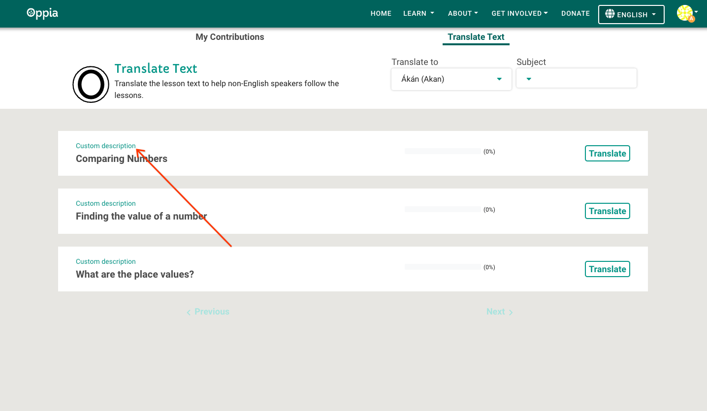
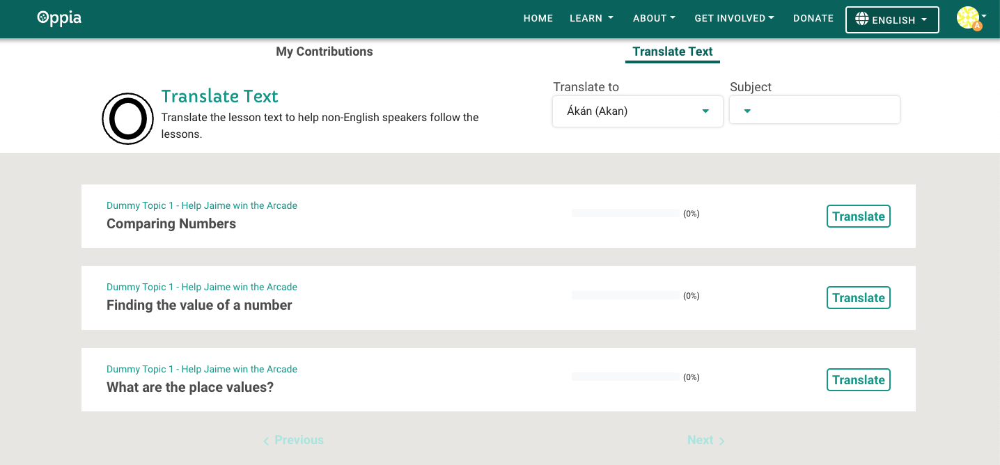
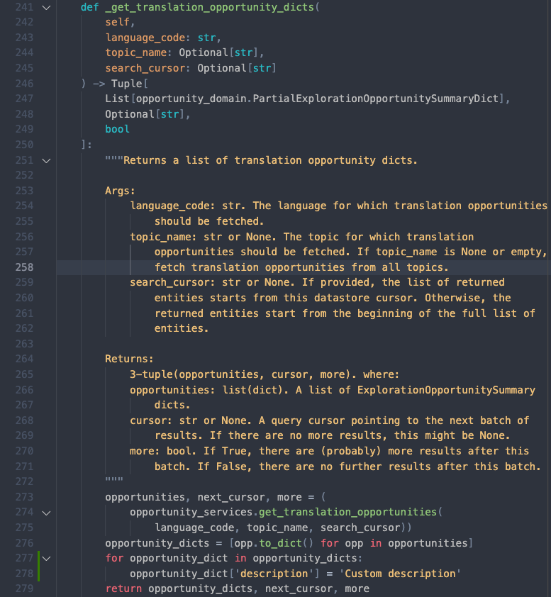

## Overview
The [contributor dashboard page](https://www.oppia.org/contributor-dashboard) on the Oppia site allows users to submit content suggestions (currently translations and practice questions) directly to lessons. These suggestions are then reviewed, and either accepted, or sent back for revision. See the [user docs](https://oppia-user-guide.readthedocs.io/en/latest/contributor/contribute.html) for step-by-step instructions how to contribute content suggestions.

## How items for contribution are populated

### Translate text tab
Every list item on the "Translate Text" tab corresponds to a particular lesson and all of its pieces of text content. In the codebase, we refer to each of these list items as _opportunities_. The contributor dashboard automatically shows a translation opportunity for a lesson when the following are true:

1. The lesson (also called an _exploration_) corresponds to a _chapter_ in a _story_ of a published classroom subject, e.g. "Decimals" (also called a _topic_). See the [user docs](https://oppia-user-guide.readthedocs.io/en/latest/keyconcepts.html) for an overview of these terms.
1. There is at least one piece of text content in the lesson that does not yet have an accepted translation.

### Submit question tab
Every list item on the "Submit Question" tab corresponds to a particular _skill_, e.g. "Adding Decimals", in a topic. The contributor dashboard automatically shows a question opportunity for a skill when the following are true:

1. The skill is part of a published classroom topic.
1. The skill does not yet have 10 accepted practice questions.

## Additional feature behavior
- Unlike with submitting translation suggestions, users need to be allowlisted by an admin before being able to submit question suggestions. Until then, the user will not see the "Submit Question" tab on the contributor dashboard page:

  

- Users cannot review their own suggestions.
- Users must be allowlisted by an admin to be able to review translation suggestions in a particular language or to review question suggestions.
- Reviewers can edit a suggestion and accept the edited version.
- Only subjects/topics associated with a classroom, e.g. Math, are surfaced in the topic/subject selector of the "Translate Text" tab.

## Admin page
There exists a separate admin page for the contributor dashboard at /contributor-dashboard-admin. There, an admin user can:

1. allowlist a user to submit question suggestions
1. allowlist a user to review translation suggestions in a particular language
1. allowlist a user to review question suggestions
1. remove rights from a user for any of the above

See [this](https://docs.google.com/document/d/1VqNiJttq85YyR6cQkd8M9lGGkOP8OlUlkI37Xw6SovM/edit) doc for step-by-step admin instructions. This may be useful for developing locally as a coder as well.

## Local development
Some setup is usually required when developing locally for the contributor dashboard since before a user can submit a content suggestion to a lesson, a lesson needs to exist. Additionally, the requirements outlined in [How items for contribution are populated](#how-items-for-contribution-are-populated) must be satisfied. To pre-populate contributor dashboard data, run the `populate_sample_contributor_data.py` script after starting a local development server:

```
python -m scripts.start
```

```
python -m scripts.populate_sample_contributor_data
```

The `populate_sample_contributor_data.py` script will automatically do the following:
1. Create an admin user with the username "a" and email testadmin@example.com,
and grant curriculum, translation, and question admin rights to the user.
2. Create a non-admin user with the username "b" and email
contributor@example.com, and grant the user "submit question" rights to the
user.
3. Set up 3 sample lessons for translation and question contribution.
4. Add the sample lesson topics to a classroom.

You can then use the testadmin@example.com user for admin duties, the
contributor@example.com user to submit question suggestions, and/or either user
to submit translation suggestions.

For step-by-step instructions on how to generate sample data manually, see
[this](https://docs.google.com/document/d/1JYX4nvTcblaVVYAlTi7rApE0lWSBx0v_ZCCr_8WW4Wc/edit#) doc.

## Code pointers

See the [Oppia codebase overview](https://github.com/oppia/oppia/wiki/Overview-of-the-Oppia-codebase) for a general overview of Oppia's code structure.

### Frontend
- [core/templates/pages/contributor-dashboard-page/](https://github.com/oppia/oppia/tree/develop/core/templates/pages/contributor-dashboard-page): Main directory of Angular components, frontend services, HTML, CSS.
- core/templates/domain/opportunity/: Frontend opportunity models.
- core/templates/domain/suggestion/: Frontend suggestion models.

Highlights:
- core/templates/pages/contributions-and-review/: Component for the "My Contributions" tab. Handles viewing and reviewing suggestions.
- core/templates/pages/modal-templates/: Templates for pop-up modals, e.g. for submitting/reviewing a question/translation suggestion.
- core/templates/pages/question-opportunities/: Component for showing question opportunity list items on the "Submit Question" tab.
- core/templates/pages/translation-opportunities/: Component for showing translation opportunity list items on the "Translate Text" tab.

### Backend

#### Controllers
- [core/controllers/contributor_dashboard.py](https://github.com/oppia/oppia/blob/develop/core/controllers/contributor_dashboard.py): Handles fetching opportunities and contributor dashboard metadata such as eligible translatable text content.
- [core/controllers/suggestion.py](https://github.com/oppia/oppia/blob/develop/core/controllers/suggestion.py): Handles everything suggestion related, e.g. submitting and reviewing suggestions.
- [core/controllers/contributor_dashboard_admin.py](https://github.com/oppia/oppia/blob/develop/core/controllers/contributor_dashboard_admin.py): Handles admin actions.

#### Domain services
- [core/domain/opportunity_services.py](https://github.com/oppia/oppia/blob/develop/core/domain/opportunity_services.py): Backend services for operating over opportunities.
- [core/domain/suggestion_services.py](https://github.com/oppia/oppia/blob/develop/core/domain/suggestion_services.py): Backend services for operating over suggestions.
- [core/domain/email_manager.py](https://github.com/oppia/oppia/blob/develop/core/domain/email_manager.py): Contains services for sending contributor dashboard related emails, e.g. for notifying users when they have been added as a reviewer.

#### Domain models
- [core/domain/opportunity_domain.py](https://github.com/oppia/oppia/blob/develop/core/domain/opportunity_domain.py): Domain models for opportunities.
- [core/domain/suggestion_registry.py](https://github.com/oppia/oppia/blob/develop/core/domain/suggestion_registry.py): Domain models for suggestions.

#### Storage
- [core/storage/opportunity/gae_models.py](https://github.com/oppia/oppia/blob/develop/core/storage/opportunity/gae_models.py): Storage models for opportunities.
- [core/storage/suggestion/gae_models.py](https://github.com/oppia/oppia/blob/develop/core/storage/suggestion/gae_models.py): Storage models for suggestions.

### E2E Tests
- [core/tests/webdriverio_desktop/contributorDashboard.js](https://github.com/oppia/oppia/blob/develop/core/tests/webdriverio_desktop/contributorDashboard.js): E2E tests for contributor dashboard CUJs.
- [core/tests/webdriverio_utils/ContributorDashboardAdminPage.js](https://github.com/oppia/oppia/blob/develop/core/tests/webdriverio_utils/ContributorDashboardAdminPage.js): Utilities for navigating/asserting on the admin page.
- [core/tests/webdriverio_utils/ContributorDashboardPage.js](https://github.com/oppia/oppia/blob/develop/core/tests/webdriverio_utils/ContributorDashboardPage.js): Utilities for navigating/asserting on the contributor dashboard page.
- [core/tests/webdriverio_utils/ContributorDashboardTranslateTextTab.js](https://github.com/oppia/oppia/blob/develop/core/tests/webdriverio_utils/ContributorDashboardTranslateTextTab.js): Utilities for navigating/asserting on the "Translate Text" tab.

## Sample coding exercise
To familiarize ourselves with the codebase, let's go through an exercise to show custom description text for the translation opportunity subheading:



This text will be populated in the backend and propagated to the frontend.

1. First, start a local server and follow the steps outlined in the doc linked in [Local development](#local-development) to populate translation opportunities. Then, navigate to /contributor-dashboard and click on the "Translate Text" tab. You should see something like the following:



Notice the subheadings are formatted [TOPIC NAME - CHAPTER TITLE]. Now let's make our code changes.

2. Add a new field `description` of type `str` to the `PartialExplorationOpportunitySummaryDict` backend model in core/domain/opportunity_domain.py. This will allow us to pass a description from the backend to the frontend.

3. Populate the backend `description` field with some custom text in the returned translation opportunities in core/controllers/contributor_dashboard.py like so:



4. Add a `description` field to the `ExplorationOpportunitySummaryBackendDict` and `ExplorationOpportunitySummary` classes in core/templates/domain/opportunity/exploration-opportunity-summary.model.ts. Make sure to update the constructor definitions as well.

5. Populate the `description` field in the `_getExplorationOpportunityFromDict()` method of the frontend API service: core/templates/pages/contributor-dashboard-page/services/contribution-opportunities-backend-api.service.ts. This step adds the description field from the backend dict to the frontend model.

6. Finally, go back to core/templates/domain/opportunity/exploration-opportunity-summary.model.ts and modify `getOpportunitySubheading()` to return the description instead of the topic and chapter title. Make sure all your changes are saved, refresh the page, and you should see your custom description in all the opportunity subheadings!

> **Note**
> For this example, our description field was not fetched from persisted storage and was instead manually set in the backend controller.

## Appendix
1. [Contributor dashboard overview](https://docs.google.com/document/d/1wM9cQzq1-3nbEhZliRlpnGDXbM_HspNkY16CYnA6lWg/edit#): More in-depth developer focused overview of the system design of the contributor dashboard.