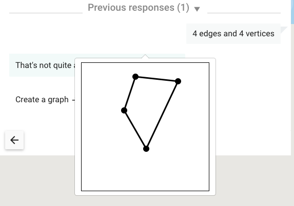

## Table of Contents

* [Introduction](#introduction)
* [Directory structure](#directory-structure)
* [The `directives` folder](#the-directives-folder)
  * [Components](#components)
  * [Services](#services)
* [Add a new Interaction](#add-a-new-interaction)
  * [Testing](#testing)

## Introduction

Interactions provide a way for learners to submit answers to Oppia. They are implemented using custom HTML tags built with Angular Components. Here's an example of such a tag:

```html
<oppia-interactive-text-input></oppia-interactive-text-input>
```

## Directory structure

In the Oppia codebase, interactions live in the `extensions/interactions` directory. Each interaction's foler has the following structure:

* A Python configuration file
* An empty `__init__.py` file
* A `directives` folder that contains Angular components that make up
  the interaction. Each component is defined by a triplet of files: a
  `*.html` file, a `*.ts` file, and a `*.spec.ts` file. This folder may
  also contain `*.service.ts` files that define services, for example a
  validation service.
* A `*.ts` file that imports all the components from the `directives`
  folder.
* A `*.module.ts` file that defines the interaction as a module.

## The directives folder

### Components

Each interaction needs the following components in its `directives` folder:

* Interaction component: A form the learner will submit when responding to the interaction. For the Multiple Choice Input interaction, this form shows answer options for the user to select.
* Response component: Displays the learner's response to the interaction. For the Multiple Choice Input interaction, this would be the user's selected answer.
* Short response component: Displays a shortened form of the learner's response. For some interactions, this shortened form is the same as the response component.

### Services

Inside the `directives` folder, each interaction will also have the following services:

* Rules service: [[Rules|Creating-Rules]] that allow a user's response to be evaluated for correctness. For example, the `MultipleChoiceInputRulesService` provides an `Equals` method that checks whether an answer matches a creator-configured correct answer.
* Validation service: A service that checks a configured interaction for correctness. For example, the validator for the Multiple Choice Input interaction checks that none of the answer choices are empty.

## Add a new interaction

To add a new interaction to Oppia, here is what you need to do:

1. Pick a descriptive id for your interaction, like `MusicPhraseInput`. For these instructions, we'll assume that the id of your interaction is `MyInput`.

2. In the `extensions/interactions` directory, create a new directory called `MyInput`. We will be creating our files in this directory.

3. Create a file `MyInput/MyInput.py`. In that file, define a `MyInput` class that inherits from `extensions.interactions.base.BaseInteraction`. This class will define no new methods, but it will override class variables from `BaseInteraction`. See the comments in [`extensions/interactions/base.py`](https://github.com/oppia/oppia/blob/develop/extensions/interactions/base.py) for details on which variables to override and what they mean. Here are some of the variables to override:

   * The `display_mode` field can take one of two values:

     * `DISPLAY_MODE_INLINE` corresponds to interactions, like text and multiple choice, that are part of the learner/tutor conversation.
     * `DISPLAY_MODE_SUPPLEMENTAL` corresponds to interactions that correspond to the tutor bringing a new artifact (like a map, or a programming console) into the conversation.

   * The `_customization_arg_specs` field should be an array specifying the options that the exploration creator can set. For each option, a dict with the following keys should be provided:
     * `name`: the name of the customization option. This name should also be used by the component.
     * `description`: the description shown to an exploration creator in the interaction editor.
     * `schema`: a [[schema|Schema-Based-Forms]] that defines the customization option's type, as well as appropriate validators and UI configuration options.
     * `default_value`: a default initial/fallback value for the customization option.

   * `answer_type` is the type of object that the learner's answer should be represented as. This should be the name of one of the classes in `extensions/objects/models/objects`. When the learner submits an answer, the answer will be passed to the server and then through the object's `normalize` function. You may need to [[write new objects|Creating-Objects]] to support your interaction. This object also determines which [[rules|Creating-Rules]] are available to classify answers submitted using this interaction. For example, if you specify a type of `Boolean`, then an `IsInclusivelyBetween` rule makes no sense.

   * `_dependency_ids` argument should contain a list of strings, each of which is the name of a [[dependency|Creating-Dependencies]]. These allow you to specify code that you want to be available to your interaction as it runs or is edited. If the interaction you are implementing has a significant JavaScript component, we suggest packaging as much of the core functionality as possible into third-party JavaScript libraries that are also usable outside of Oppia, and writing a small directive that makes use of the imported JavaScript library. For an example of how to do this, see the [PencilCode interaction](https://github.com/oppia/oppia/tree/master/extensions/interactions/PencilCodeEditor/).

4. Create an empty `MyInput/__init__.py` file.

5. Create a `MyInput/static` folder with any static content you need. For example, this folder should include an icon that represents your interaction.

6. Create a `MyInput/directives` folder with all of the components and services your interaction needs. These should be named as follows:

   * Interaction component:

     * `my-input-interaction.component.html`
     * `oppia-interactive-my-input.component.ts`: Defines a `InteractiveMyInputComponent` class.

     * `oppia-interactive-my-input.component.spec.ts`

   * Response component:

     * `my-input-response.component.html`
     * `oppia-response-my-input.component.ts`: Defines a `ResponseMyInputComponent` class.
     * `oppia-response-my-input.component.spec.ts`

   * Short response component:

     * `my-input-short-response.component.html`
     * `oppia-short-response-my-input.component.ts`: Defines a `ShortResponseMyInputComponent` class.
     * `oppia-short-response-my-input.component.spec.ts`

   * Rules service:

     * `my-input-rules.service.ts`
     * `my-input-rules.service.spec.ts`

   * Validation service:

     * `my-input-validation.service.ts`
     * `my-input-validation.service.spec.ts`

   Each component should implement `OnInit`. Parameters from the Python file are accessible as `parameterWithValue` where the Python variable is `parameter`. The `WithValue` is a legacy hold-over. Note that the parameters in $attrs are JSON-stringified, so you will need to use `oppiaHtmlEscaper.escapedJsonToObj()` to convert them back. (Do not use `JSON.parse()`, since it does not handle the necessary escaping.)

   You might be wondering what the difference is between the response component and the short response component. If you submit an incorrect answer to an interaction, you can click on "Previous responses" to see your incorrect answers. These are shown using the short response component. Then if you click on a previous answer, a pop-up appears with the response component. Here's an example from the graph input interaction:

   

   The graph is the response component, while the text "4 edges and 4 vertices" is the short response component.

7. Create a `MyInput/MyInput.ts` file that uses `require()` or `import` statements to import all the `*.ts` files in `MyInput/directives`. If you have CSS files in your `static/` folder, import those here too.

8. Create a `MyInput/my-interaction-interactions.module.ts` file that imports the interaction, response, and short response components from `MyInput/directives`. It should also import any dependencies and export a module like this:

   ```ts
   @NgModule({
     imports: [
       ... dependencies ...
     ],
     declarations: [
       ... interaction, response, and short response components ...
     ],
     entryComponents: [
       ... interaction, response, and short response components ...
     ],
     exports: [
       ... interaction, response, and short response components ...
     ],
   })

   export class MyInputInteractionModule { }
   ```

9. Activate your interaction in Oppia by editing the `ALLOWED_INTERACTION_CATEGORIES` variable in `assets/constants.ts` (you'll need to specify its name). Interactions are classified under different categories; add yours to a suitable category. Your interaction should then be available in the interaction repository, and can be used in explorations.

### Testing

We have an [[end-to-end testing framework|End-to-End-Tests]] using Protractor.js that you you are encouraged to use for your interaction. The tests mimic a user by interacting with the web-page, for example by clicking and typing, and then checking that the interaction behaves in the expected way.

To do so will require the following:

1. Create a `protractor.js` file in your interaction's directory and implement the following:

   * `customizeInteraction`: a function that when sent relevant arguments will choose parameters for your interaction.
   * `expectInteractionDetailsToMatch`: a function that in the player verifies the interaction is displayed correctly, including those customizations specified in the editor.
   * `submitAnswer`: a function that simulates the user submitting an answer to an interaction, for example for a numeric interaction submitting a number.
   * `answerObjectType`: The type of the returned object of the interaction; this should match the `obj_type` of the submission handler specified in the interaction's python file.
   * `testSuite`: An array of dictionaries, each of which describes a scenario in which the interaction is used and specifies how it should behave. Each entry specifies customizations for the interaction and selects and parameterizes one of the rules associated with it. The test will then move to the player, check that the interaction is displayed correctly, submit a series of correct and wrong answers, and verify that these are handled correctly.

2. Add your `protractor.js` file to the dictionary of interactions in `extensions/interactions/protractor.js`.

3. Any new [[objects|Creating-Objects]] you create must have handlers for them added to `extensions/objects/protractor.js`. You can then use these handlers when writing your `customizeInteraction` and `submitAnswer` functions. Objects that are used as rule parameters must implement a `setValue()` function that fully specifies them, and this will be used automatically when a rule is being selected. Don't forget to add the new objects both to the list of object editors and to the exports.

4. Any new [[rules|Creating-Rules]] must be included in `extensions/rules/protractor.js` within the entry for the type of returned object the rule applies to. You just need to specify the `description` from the rule's python file.

When running the tests you may want to change `describe` to `ddescribe` in the "Interactions" test class of `core/tests/protractor/editorAndPlayer.js` which will cause just the interaction-specific tests to be run. Be sure to change it back before committing!
