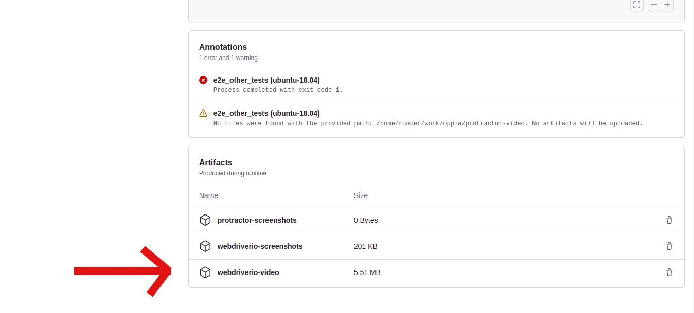

## Table of contents

* [Using the debugger](#using-the-debugger)
* [Downloading screenshots](#downloading-screenshots)
* [Downloading screen recordings](#downloading-screen-recordings)

## Using the debugger

1. Add a break-point in the code you want the control to stop at by adding the line `await browser.debug();`. For example:

   ```js
   ...
   await adminPage.get();
   await adminPage.updateRole('moderator1', 'moderator');
   await browser.debug();
   await adminPage.viewRolesbyUsername('moderator1');
   ...
   ```

2. Run the e2e script with the flag `--debug_mode`. For example,

   ```console
   python -m scripts.run_e2e_tests --debug_mode --suite="topicAndStoryEditor"
   ```

3. Wait for the script to show the following log:

   ```text
   The execution has stopped!
   You can now go into the browser or use the command line as REPL
   (To exit, press ^C again or type .exit)
   ```

4. The control will stop at the point where the `browser.debug()` statement was added. You can now choose to inspect elements, log variables in the test, or add more break-points.
For logging variable names, just type the name of the variable in the terminal.

5. To continue the tests you need to enter `.exit` in the terminal and press enter. The test will continue running in the same browser instance.

## Downloading screenshots

We capture screenshots of failing tests. On GitHub Actions, look for an `Artifacts` link in the upper right where you can download a zip file of the screenshots:


Screenshots, have a filename that follows the name of the test from which the screenshot was captured. For example, `Topic-editor-functionality-should-publish-and-unpublish-a-story-correctly.png`.

## Downloading screen recordings

When screen recordings are enabled, we capture video of the test running on GitHub Actions. This helps developers solve problems in E2E tests that only occur on CI or are difficult to replicate locally.

To enable screen recordings on GitHub Actions, you need to set the `VIDEO_RECORDING_IS_ENABLED` environment variable to `1` in your GitHub Actions workflow file and for enabling it locally, you need to set the `LOCAL_VIDEO_RECORDING_IS_ENABLED` variable to `1` in 'wdio.conf.js' file. Note that screen recordings are still not saved under the following circumstances:

* The test is running on CircleCI. CircleCI runners have too little memory to support video recording.
* The test passed. Videos of tests that pass are deleted before being made available for download. You can change this behavior by setting `saveAllVideos` to `true` in `wdio.conf.js`.

Each individual test within each suite gets its own video. The name of video follows the name of the test from which the screenshot was captured. For example, `Topic-editor-functionality-should-publish-and-unpublish-a-story-correctly.mp4`.

To download a zip file of the videos, look for the `Artifacts` link in the top-right of your test run.


If you don’t see the `Artifacts` link, go to the summary of the failing workflow, you will see the artifacts at the bottom of that page too.



Note for macOS: Quicktime doesn’t seem to like the videos we generate, so you might need to use VLC media player to view the videos.
