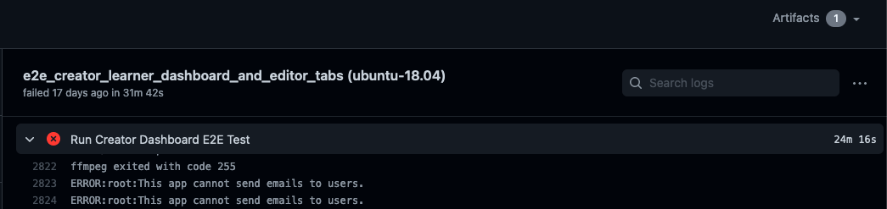

## Table of contents

* [Introduction](#introduction)
* [Using the debugger](#using-the-debugger)
* [Downloading screenshots](#downloading-screenshots)
* [Downloading screen recordings](#downloading-screen-recordings)

## Introduction

Whenever you're debugging tests, you should create a debugging doc to document your work. This helps future contributors if they run into a similar bug in the future. If other people come in later to help you, they can also use the debugging doc to get up to speed on what you've already figured out. You can make a copy of [this template debugging doc](https://docs.google.com/document/d/1qRbvKjJ0A7NPVK8g6XJNISMx_6BuepoCL7F2eIfrGqM/edit?usp=sharing) to get started. Also check out the [[debugging docs wiki page|debugging-docs]].

There are many ways to go about debugging an E2E test, but here's one approach:

1. Create a [[debugging doc|debugging-docs]].
2. Look through the logs from the failed test to try and understand what went wrong. In particular:

   * Look for a line that says just `Killed`. This line indicates that some process was killed by the operating system for consuming too much memory. It's fairly safe to assume that the test failure was because of that process being killed.
   * Look for the stack trace and error message of the _first_ error. The trace might point you to where the error was thrown in the test code, and the message may help explain what went wrong.

3. If you don't understand what the error message means, search for it online. Also look through the test code and `core/test/protractor_utils/action.js` to see if the error message (or something like it) is in our test code.

4. Enable [video recordings](#downloading-screen-recordings) and rerun the test until you reproduce the error. Then watch the video recordings and follow along in the test code. Try and understand why the error was thrown.

5. Try and reproduce the error locally. If you succeed, you can use your [local debugger](#using-the-debugger) to investigate.

## Using the debugger

1. Add a break-point in the code you want the control to stop at by adding the line `debugger;`. For example:

   ```js
   ...
   await adminPage.get();
   await adminPage.updateRole('moderator1', 'moderator');
   debugger;
   await adminPage.viewRolesbyUsername('moderator1');
   ...
   ```

2. Run the e2e script with the flag `--debug_mode`. For example,

   ```console
   python -m scripts.run_e2e_tests --debug_mode --suite="topicAndStoryEditor"
   ```

3. Wait for the script to show the following log:

   ```text
   Debugger listening on ws://127.0.0.1:9229/e4779cc6-72e9-4d8d-889e-1fb3b2628781
   For help, see: https://nodejs.org/en/docs/inspector
   ```

4. At this point, go to `chrome://inspect/#devices` on your Chrome browser.

5. Click on "inspect" under Remote Target (see screenshot below).

   

6. A Chrome dev tools instance will open up and the e2e test should start executing in a new window.

7. The control will stop at the point where the debugger statement was added. You can now choose to inspect elements, log variables in the test, or add more break-points.

## Downloading screenshots

We capture screenshots of failing tests. On GitHub Actions, look for an `Artifacts` link in the upper right where you can download a zip file of the screenshots:



There are two kinds of artifacts:

* Reports, which have the filename `report.html`
* Screenshots, which have a filename that follows the name of the test from which the screenshot was captured. For example, `Topic editor functionality should publish and unpublish a story correctly.png`.

Artifacts are grouped into folders based on attempt number. For example, the report at `protractor-screenshots/6b0d444200b12988799019647e6ed7a9/report.html` is in the folder `6b0d444200b12988799019647e6ed7a9`, which holds all the artifacts from one attempt (we attempt the tests multiple times to handle flakiness). You can use the reports to figure out which attempt goes with which folder. For example, if attempt number 2 has an error message

```text
Failed: Story could not be saved.
Wait timed out after 10003ms
```

then you can look for the report that includes this message. Times like `10003ms` will be particularly useful for this since they're usually unique. Say you find this error message in `protractor-screenshots/6b0d444200b12988799019647e6ed7a9/report.html`. Now you know that the screenshots from the attempt are all under `protractor-screenshots/6b0d444200b12988799019647e6ed7a9`!

Sometimes you'll get screenshots that just aren't very helpful. For example, a lot of screenshots show the login page for some reason. You can check other examples of a flake though. One of the others might have a useful screenshot.

## Downloading screen recordings

When screen recordings are enabled, we capture video of the test running on GitHub Actions. This helps developers solve problems in E2E tests that only occur on CI or are difficult to replicate locally.

To enable screen recordings, you need to set the `VIDEO_RECORDING_IS_ENABLED` environment variable to `1` in your GitHub Actions workflow file. Note that screen recordings are still not saved under the following circumstances:

* The test is running on CircleCI. CircleCI runners have too little memory to support video recording.
* The test passed. Videos of tests that pass are deleted before being made available for download. You can change this behavior by setting `ALL_VIDEOS` to `true` in `protractor.conf.js`.

Each individual test within each suite gets its own video. The video of each test gets a randomly assigned name, and this gets printed out above the suite, like this:


To download a zip file of the videos, look for the `Artifacts` link in the top-right of your test run.


If you don’t see the `Artifacts` link, go to the summary of the failing workflow, you will see the artifacts at the bottom of that page too.


Note for macOS: Quicktime doesn’t seem to like the videos we generate, so you might need to use VLC media player to view the videos.
