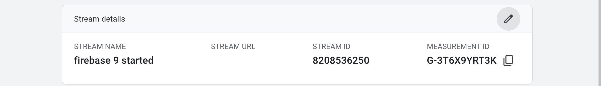
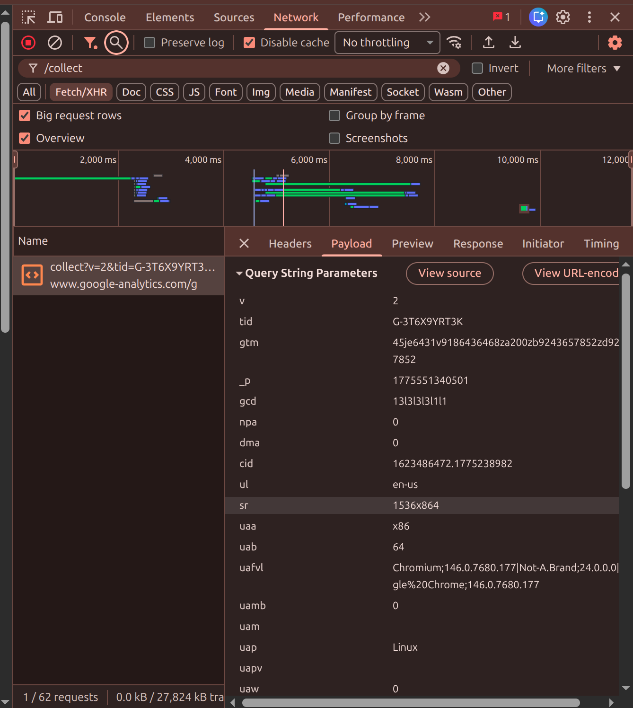
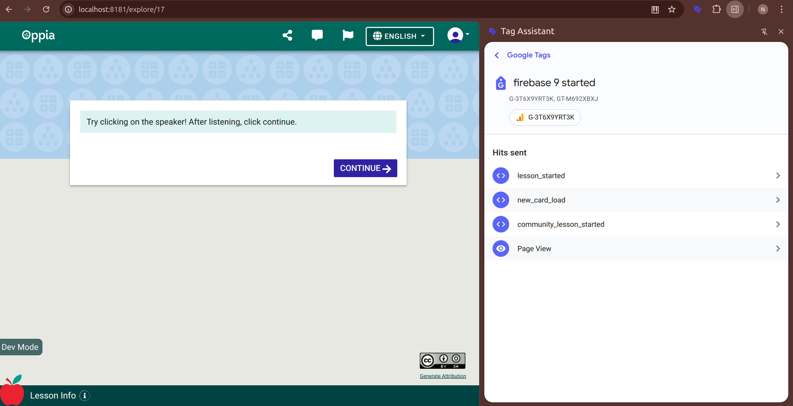
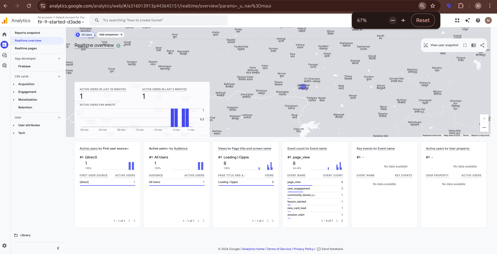
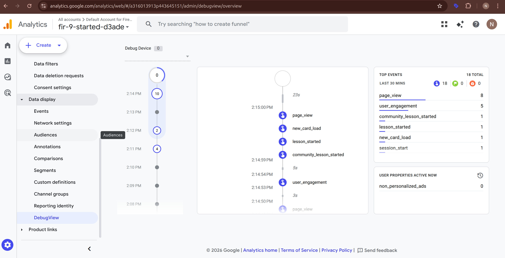

This guide explains, step by step, how to connect local Oppia to Google Analytics 4 (GA4), confirm events are being sent, and understand where to look when something fails.

If you are new to GA4 debugging, use this page as a checklist and learning guide. Each step explains both:
1. What to do.
2. Why that step matters.

Useful references:
1. [GA4 setup assistant](https://support.google.com/analytics/answer/9304153)
2. [Google tag (`gtag.js`) developer guide](https://developers.google.com/tag-platform/gtagjs)
3. [GA4 Realtime report](https://support.google.com/analytics/answer/9271392)
4. [GA4 DebugView](https://support.google.com/analytics/answer/7201382)
5. [Tag Assistant extension](https://chromewebstore.google.com/detail/tag-assistant/kejbdjndbnbjgmefkgdddjlbokphdefk?hl=en-US&utm_source=ext_sidebar)

## Event flow to verify
Before starting, it helps to know the end-to-end path your analytics event takes.

When debugging GA4 in Oppia, validate this sequence:
1. Oppia emits an event (`gtag`/`dataLayer`).
2. Browser sends a `/g/collect` request.
3. Tag Assistant detects the GA4 tag and hit.
4. GA4 Realtime shows incoming events.
5. GA4 DebugView shows the event timeline (`debug_mode` path).

Why this helps: if one step fails, you immediately know where to investigate instead of guessing across the whole stack.

## 1) Confirm your GA4 stream and Measurement ID
Start by confirming the exact GA4 web stream you want local Oppia to use.

Open your GA4 Web stream details and copy the Measurement ID (`G-...`).



What to check in this screen:
1. You are in the correct GA4 property.
2. You can see the Measurement ID clearly.
3. This is the exact ID you will place in Oppia constants.

Why this step matters: the wrong property or wrong `G-...` ID is the most common reason events never appear in your dashboard.

## 2) Connect local Oppia to your GA4 property
Now configure Oppia so local events are sent to your personal GA4 stream.

In `assets/analytics-constants.json`, set:
1. `CAN_SEND_ANALYTICS_EVENTS: true`
2. `GA_ANALYTICS_ID: "G-..."` (from stream details)
3. `SITE_NAME_FOR_ANALYTICS: "localhost"` (for local testing)
4. `GTM_ANALYTICS_ID: "GTM-..."` only if your local setup uses GTM

Restart the dev server after changing constants.

Why restart is required: analytics constants are compiled into frontend output, so changes are not picked up until the frontend rebuilds.

To avoid committing personal IDs:

```bash
git update-index --assume-unchanged assets/analytics-constants.json
```

Undo later:

```bash
git update-index --no-assume-unchanged assets/analytics-constants.json
```

## 3) Ensure DebugView path is enabled (`debug_mode`)
Realtime confirms ingestion, but DebugView is the best screen for debugging event sequence and timing.

In `core/templates/services/google-analytics-initializer.ts`, verify GA config includes:

```ts
gtag('config', analyticsConstants.GA_ANALYTICS_ID, {
  'anonymize_ip': true,
  'forceSSL': true,
  'debug_mode': analyticsConstants.SITE_NAME_FOR_ANALYTICS === 'localhost',
});
```

## 4) Validate browser network request (`/g/collect`)
Before checking GA dashboards, verify that the browser is actually sending analytics requests.

Trigger an Oppia action that should fire analytics, then inspect DevTools Network with filter `collect`.



What this screenshot should prove:
1. A `collect` request is sent to `www.google-analytics.com/g` .
2. Request payload includes `tid=<your-measurement-id>`.
3. Request succeeds (`2xx` status).

If this step fails, GA4 dashboards will not update.

## 5) Validate tag execution in Tag Assistant
Tag Assistant gives a tag-level explanation of what fired, which is often easier for beginners than raw network payloads.

Open Tag Assistant while using local Oppia and reproduce events.



What to verify here:
1. The GA4 tag (your `G-...`) is detected.
2. Expected hits/events are listed (for example `page_view`, `lesson_started`, `new_card_load`).
3. No blocking or critical tag errors are shown.

Use this together with Network tab: Tag Assistant confirms tag behavior, Network confirms outbound request delivery.

## 6) Confirm events in GA4 Realtime
Once browser-side checks pass, verify server-side ingestion in GA4.

Open **Reports > Realtime** in the same property.



What to verify:
1. Active users reflect your local session.
2. Event cards include your expected events.
3. Event counts rise when you trigger new actions in Oppia.

If you do not see data immediately, wait briefly and trigger one more event; Realtime is near real time but not always instant.

## 7) Confirm event timeline in GA4 DebugView
Finally, use DebugView to validate event ordering and timing for your local session.

Open **Admin/Data display > DebugView** and continue interacting with Oppia.



What to verify:
1. Event timeline updates in near real time.
2. Same event names seen in Tag Assistant/Realtime appear here.
3. Sequence is logical (`page_view` before interaction events, etc.).

