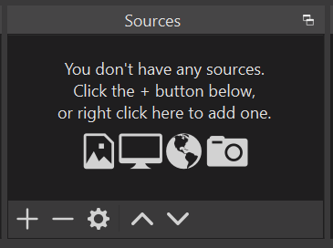
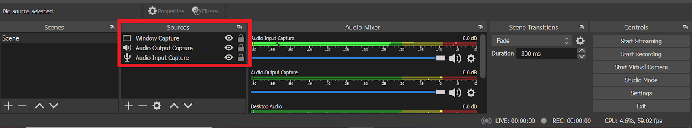

# Oppia Events team
## Overview
Oppia events team conducts various events from tech talks to game nights. These events happen approximately twice a month. The team currently consists of Akshay Anand, Apurv Botle, Kevin Thomas, Nithesh Hariharan and Srijan Reddy.

## Events

The usual events that we conduct are tech talks and game nights. But based on demand and/ or circumstances we may conduct other events like GSoC related talks, product-related talks, etc. In case you would like to organise an event or would want us to organise one please send an email to oppia-events-team@googlegroups.com.

If you are interested in helping out with events in Oppia and want to join the team, please send an email to oppia-events-team@googlegroups.com.

## Gaming Event server

Oppia has a gaming event server on discord where we usually join for fun nights playing Among Us, Chess, Skribl, etc. Here is a link to join the server: [https://discord.com/invite/dCJwEAgk3D](https://discord.com/invite/dCJwEAgk3D).

### Recording events

OBS is a reliable streaming software that can be used for streaming and recording, which is what was used for the past events at Oppia. Here are the steps to set up OBS:

1.  Install the latest OBS software from [here](https://obsproject.com/).

2.  Open the OBS software and add the following sources by clicking on the "+" icon in the "sources" section in the bottom left part of the screen.

    
  - Audio output capture, to capture speaker audio.
  - Audio input capture, to capture mic audio of organizer.
  - Window capture of the presented slides.
3. After adding sources, it should look like this.
  

4.  Click on "Start Recording" to start capturing the video and audio streams.

5.  When the person recording is not speaking, make sure to mute the "Audio Input Capture" to avoid unexpected audio from the recorder's device / environment. This can be done by tapping on the speaker symbol next to the volume control for the audio input capture. Also, make sure to mute audio input in the meeting. Remember to unmute on OBS and the meeting when you speak and want it to be recorded.

6.  To end the recording just click on the "Stop Recording" button. The recording will be stored in the "Recording Path" set in File > Settings > Output.