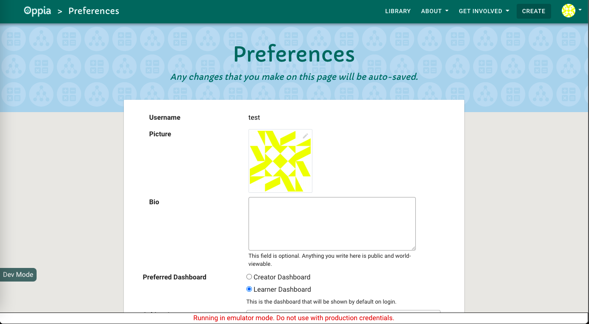
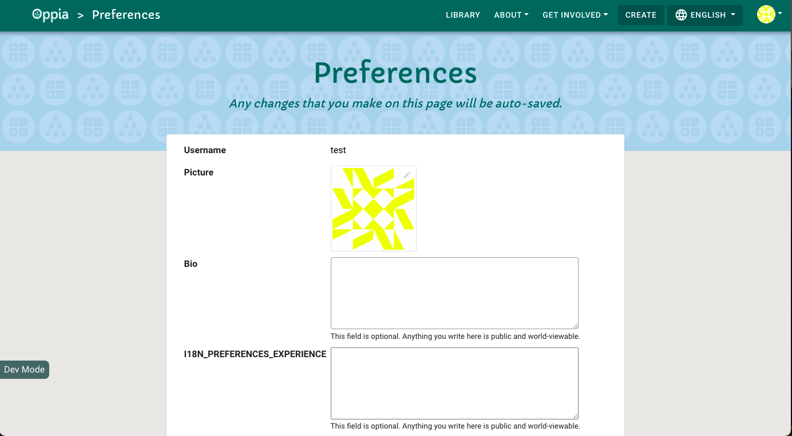
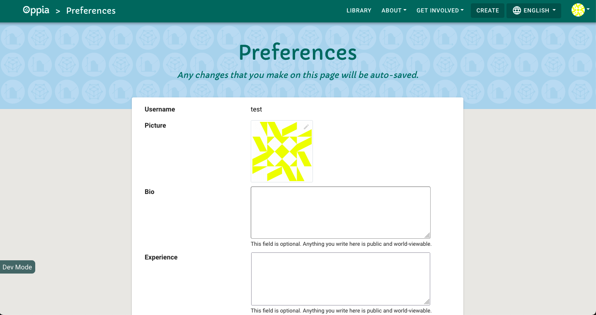
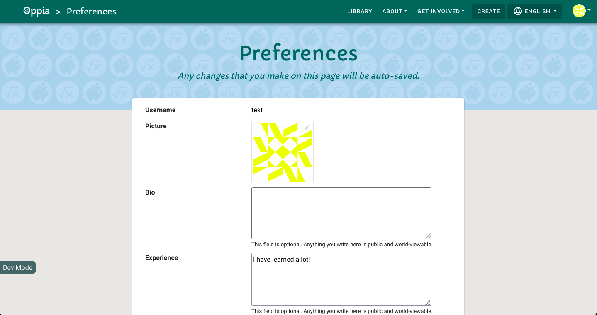

## Table of Contents

* [Support editing](#support-editing)
  * [Frontend changes to support editing](#frontend-changes-to-support-editing)
  * [Backend changes to support editing](#backend-changes-to-support-editing)
* [Support viewing](#support-viewing)
  * [Backend changes to support viewing](#backend-changes-to-support-viewing)
  * [Frontend changes to support viewing](#frontend-changes-to-support-viewing)

When you work on the Oppia codebase, you'll often need to figure out what file contains the code driving some feature. This tutorial will show you how to identify these files by working through an example. Suppose we are trying to cultivate a learning community among Oppia learners. To help with that, we want to add a field to user profiles where users can describe what concepts they have experience with. This will help other learners figure out who they can ask for help.

Before working through this tutorial, you should read through the [[Overview of Oppia's codebase|Overview-of-the-Oppia-codebase]].

**Warning: This is NOT a tutorial on how to make a code change to Oppia.** We will be writing code to support editing and viewing the new user experience field, but our changes will only be enough to confirm that we have identified all the relevant files. Our code will not be ready for production. Instead, working through the steps here will give you the understanding you need to write a design doc.

## Support editing

### Frontend changes to support editing

In this tutorial, we'll work from the more user-facing code all the way back to the database. This will let us see the results of our changes in a local development server at each step.

First, let's take a look at the page we want to modify. Start up a development server:

```console
python -m scripts.start
```

A development server will open at http://localhost:8181. Create a new account and navigate to the preferences page at http://localhost:8181/preferences. It should look like this:



We want to add a new field under the user bio to store the user's experience. First, we need to find the HTML file that provides the user's bio. Here are two approaches:

* Use your browser's developer tools to inspect the page's HTML. Find an HTML class you think will be unique, for example `protractor-test-user-bio`. Then search the codebase for that string.
* Rely on your knowledge of how the code files in Oppia are organized. We know that the HTML files for each component are under `core/templates/pages`. In that folder, we see a `preferences-page` directory, which looks promising since we are trying to edit the preferences page. Inside that folder, we see the `preferences-page.component.html` file.

Either approach should lead you to `core/templates/pages/preferences-page/preferences-page.component.html`.

1. Find the code for the bio field. You can find this block by noticing from your browser's development tools that the `protractor-test-user-bio` class is associated with the bio field. If you search for that string, you should find a section of code that looks like this:

   ```html
     <div class="form-group row">
       <label for="label-target-user-bio" class="col-lg-4 col-md-4 col-sm-4">{{ 'I18N_PREFERENCES_BIO' | translate }}</label>
       <div class="col-lg-8 col-md-8 col-sm-8">
         <textarea id="label-target-user-bio"
                   class="oppia-bio-border protractor-test-user-bio oppia-autofocus"
                   [(ngModel)]="userBio"
                   [attr.value]="userBio"
                   (blur)="saveUserBio(userBio)"
                   (change)="registerBioChanged()"
                   rows="5"
                   maxlength="2000">
         </textarea>
         <span class="form-text oppia-form-text">{{ 'I18N_PREFERENCES_BIO_EXPLAIN_TEXT' | translate }}</span>
       </div>
     </div>
     <!-- Add the experience field here -->
   </div>
   ```

   Pay close attention to the indentation! The last `</div>` doesn't close the `div` tag at the top, it closes a `div` from earlier in the code. Therefore, we want to add the experience field where the comment (which I added) is.

2. To confirm that we've found the right spot, add the following lines just below the block of code that adds the bio field.

   ```html
   <div class="form-group row">
     <label for="label-target-user-experience" class="col-lg-4 col-md-4 col-sm-4">{{ 'I18N_PREFERENCES_EXPERIENCE' | translate }}</label>
     <div class="col-lg-8 col-md-8 col-sm-8">
       <textarea id="label-target-user-experience"
                 class="oppia-experience-border"
                 rows="5"
                 maxlength="2000">
       </textarea>
       <span class="form-text oppia-form-text">{{ 'I18N_PREFERENCES_BIO_EXPLAIN_TEXT' | translate }}</span>
     </div>
   </div>
   ```

3. Restart the development by killing it with Ctrl-C and then running `python -m scripts.start` again. Load the preferences page again, and you should see something like this:

   

   Oops! That `I18N_PREFERENCES_EXPERIENCE` text should instead say something like `Preferences`. Translations are stored in `assets/i18n`, so We need to add a translation in the English file, `assets/i18n/en.json`:

   ```diff
     "I18N_PREFERENCES_BIO": "Bio",
   + "I18N_PREFERENCES_EXPERIENCE": "Experience",
     "I18N_PREFERENCES_BIO_EXPLAIN_TEXT": "This field is optional. Anything you write here is public and world-viewable.",
   ```

   Now let's try reloading the development server again. Now you should see this:

   .

   The presence of the user experience field confirms that we edited the right file.

4. Next we need to update the component's `*.ts` file to add some logic to our field. This file will have the same path as the HTML file we just edited, except it will end in `.ts` instead of `.html`. The file is `core/templates/pages/preferences-page/preferences-page.component.ts`, and there you'll find a `PreferencesPageComponent` class. Add to that class an instance variable for the user experience with a default value so we can see that it works:

   ```diff
     userBio: string;
   + userExperience: string = 'I have learned a lot!';
     defaultDashboard: string;
   ```

   Let's also add a method to handle saving the user bio:

   ```ts
   saveUserExperience(userExperience: string): void {
     console.log(`DEBUG: Saved user experience: ${userExperience}`);
   }
   ```

   In this case we haven't written the backend code to support saving, but we'll be able to see in the console log that the method was called.

5. Now we can update the component HTML file to use this new logic. Update the `textarea` tag we added as follows:

   ```diff
     <textarea id="label-target-user-experience"
               class="oppia-experience-border"
   +           [(ngModel)]="userExperience"
   +           (blur)="saveUserExperience(userExperience)"
               rows="5"
               maxlength="2000">
     </textarea>
   ```

   `[(ngModel)]="userExperience"` tells Angular to bind the value of the `textarea` element to the value of the `userExperience` attribute of the component class. `(blur)=saveUserExperience(userExperience)` causes the `saveUserExperience` method we wrote to be called with the value of the `userExperience` instance field whenever the `blur` event occurs. For more details, see [Angular's NgModel docs](https://angular.io/api/forms/NgModel#description) and [Angular's documentation on event binding](https://angular.io/guide/event-binding).

   Now when we restart the server and load the preferences page, we see our default user experience text:

   

   If you change the text in the experience field, say to `I have learned a lot! Yay!`, and then click away, you should see the console message from our `console.log` statement: `DEBUG: Saved user experience: I have learned a lot! Yay!`.

6. Next, let's tell the component to send updates to the experience field to the backend by changing the `saveUserExperience` method that we referenced in our HTML code above.

   ```diff
     saveUserExperience(userExperience: string): void {
   -   console.log(`DEBUG: Saved user experience: ${userExperience}`);
   +   this._saveDataItem('user_experience', userExperience);
     }
   ```

   Now when you try to change the experience field text, you'll see an error in the console:

   ```text
   ERROR Error: Uncaught (in promise): HttpErrorResponse: {"headers":{"normalizedNames":{},"lazyUpdate":null},"status":400,"statusText":"Bad Request","url":"http://localhost:8181/preferenceshandler/data","ok":false,"name":"HttpErrorResponse","message":"Http failure response for http://localhost:8181/preferenceshandler/data: 400 Bad Request","error":{"status_code":400,"error":"Invalid update type: user_experience"}}
   ```

   You should also see a similar error in your terminal output:

   ```text
   InvalidInputException: Invalid update type: user_experience
   ```

   This is because the backend isn't set up to handle updates to our new field. Note that we skipped the user backend API service. Since we are seeing an error in the terminal, we know our update to the user experience field is getting to the backend code, so the frontend's backend API service doesn't need to be changed. You should take a look at `core/templates/services/user-backend-api.service.ts` though to understand how it works. In particular, we care about the `updateUserPreferencesDataAsync` method:

   ```ts
   async updatePreferencesDataAsync(
       updateType: string,
       data: boolean | string | string[] | SubscriptionSummary[]):
       Promise<UpdatePreferencesResponse> {
     return this.http.put<UpdatePreferencesResponse>(this.PREFERENCES_DATA_URL, {
       update_type: updateType,
       data: data
     }).toPromise();
   }
   ```

### Backend changes to support editing

Next let's identify the backend files involved in handling updates to the user's profile.

1. We see that `updateUserPreferencesDataAsync` issues a PUT request against `PREFERENCES_DATA_URL`, which is `/preferenceshandler/data`. This path is assigned to the `PREFERENCES_DATA_URL` constant in `feconf.py`, and if you search for that constant in `main.py`, you'll see it mapped to the `profile.PreferencesHandler` controller, which is you can find in `core/controllers/profile.py`. In that controller, add code to handle the `user_experience` update type:

   ```diff
     if update_type == 'user_bio':
         if len(data) > feconf.MAX_BIO_LENGTH_IN_CHARS:
             raise self.InvalidInputException(
                 'User bio exceeds maximum character limit: %s'
                 % feconf.MAX_BIO_LENGTH_IN_CHARS)
         else:
             user_services.update_user_bio(self.user_id, data)
   + elif update_type == 'user_experience':
   +     if len(data) > feconf.MAX_BIO_LENGTH_IN_CHARS:
   +         raise self.InvalidInputException(
   +             'User experience exceeds maximum character limit: %s'
   +             % feconf.MAX_BIO_LENGTH_IN_CHARS)
   +     else:
   +         python_utils.PRINT(
   +             'DEBUG Controller received update: ' +
   +             data)
   ```

   Note that since we set the bio and experience maximum lengths to be the same, we are re-using the `MAX_BIO_LENGTH_IN_CHARS` variable for the user experience.

   When you restart the development server and update your experience field, you should see no console errors in your browser and the debugging message we added in your terminal:

   ```text
   DEBUG Controller received update: I have learned a lot! Yay!
   ```

2. Next, lets add a service to the `core/domain/user_services.py` to handle updating the user experience field. This will ensure our code follows the pattern used for updating the user bio, which we saw from the controller calls a `user_services.update_user_bio` function. Here's the code for our service:

   ```python
   def update_user_experience(user_id, user_experience):
       """Updates user_experience of user with given user_id.

       Args:
           user_id: str. The unique ID of the user.
           user_experience: str. New user experience to be set.
       """
       user_settings = get_user_settings(user_id, strict=True)
       user_settings.user_experience = user_experience
       python_utils.PRINT(
           'DEBUG: update_user_experience: ' + user_experience)
       _save_user_settings(user_settings)
    ```

    Now we can replace our print statement in the controller with a call to this service:


   ```diff
     elif update_type == 'user_experience':
         if len(data) > feconf.MAX_BIO_LENGTH_IN_CHARS:
             raise self.InvalidInputException(
                 'User experience exceeds maximum character limit: %s'
                 % feconf.MAX_BIO_LENGTH_IN_CHARS)
         else:
   -         python_utils.PRINT(
   -             'DEBUG Controller received update: ' +
   -             data)
   +         user_services.update_user_experience(self.user_id, data)
   ```

   When you restart the development server and update your experience field, you should see our print statement output in the terminal:

   ```text
   DEBUG: update_user_experience: I have learned a lot! Yay!
   ```

3. Next, we need to update the domain model. Let's take a moment to look at how the `_save_user_settings` function works. Here's the code:

   ```python
   def _save_user_settings(user_settings):
       """Commits a user settings object to the datastore.

       Args:
           user_settings: UserSettings. The user setting domain object to be saved.
       """
       user_settings.validate()

       user_settings_dict = user_settings.to_dict()

       # If user with the given user_id already exists, update that model
       # with the given user settings, otherwise, create a new one.
       user_model = user_models.UserSettingsModel.get_by_id(user_settings.user_id)
       if user_model is not None:
           user_model.populate(**user_settings_dict)
       else:
           user_settings_dict['id'] = user_settings.user_id
           user_model = user_models.UserSettingsModel(**user_settings_dict)

       # TODO(#12755): Remove update_roles_and_banned_fields call once roles and
       # banned fields are in use.
       update_roles_and_banned_fields(user_model)
       user_model.update_timestamps()
       user_model.put()
   ```

   We first convert the new user settings object to a dictionary, then we fetch the existing user settings model and populate it, and finally we put the updated model back into the datastore. This means that just need to tell the `UserSettings` domain model in `core/domain/user_domain.py` about our `user_experience` field.

   First, let's add a `user_experience` argument to the constructor, assign that argument to an instance field, and update the appropriate docstrings:

   ```diff
   @@ -55,6 +55,7 @@ class UserSettings(python_utils.OBJECT):
                a dataURI string.
            default_dashboard: str or None. The default dashboard of the user.
            user_bio: str. User-specified biography.
   +        user_experience: str. User-specified experience description.
            subject_interests: list(str) or None. Subject interests specified by
                the user.
            first_contribution_msec: float or None. The time in milliseconds when
   @@ -77,7 +78,7 @@ class UserSettings(python_utils.OBJECT):
                profile_picture_data_url=None, default_dashboard=None,
                creator_dashboard_display_pref=(
                    constants.ALLOWED_CREATOR_DASHBOARD_DISPLAY_PREFS['CARD']),
   -            user_bio='', subject_interests=None, first_contribution_msec=None,
   +            user_bio='', user_experience='', subject_interests=None, first_contribution_msec=None,
                preferred_language_codes=None, preferred_site_language_code=None,
                preferred_audio_language_code=None, pin=None, display_alias=None,
                deleted=False, created_on=None):
   @@ -106,6 +107,7 @@ class UserSettings(python_utils.OBJECT):
                creator_dashboard_display_pref: str. The creator dashboard of the
                    user.
                user_bio: str. User-specified biography.
   +            user_experience: str. User-specified experience description.
                subject_interests: list(str) or None. Subject interests specified by
                    the user.
                first_contribution_msec: float or None. The time in milliseconds
   @@ -140,6 +142,7 @@ class UserSettings(python_utils.OBJECT):
            self.default_dashboard = default_dashboard
            self.creator_dashboard_display_pref = creator_dashboard_display_pref
            self.user_bio = user_bio
   +        self.user_experience = user_experience
            self.subject_interests = (
                subject_interests if subject_interests else [])
            self.first_contribution_msec = first_contribution_msec
   ```

   Next, we need to update the `to_dict` function to include the `user_experience` field:

   ```diff
   @@ -293,6 +296,7 @@ class UserSettings(python_utils.OBJECT):
                'creator_dashboard_display_pref': (
                    self.creator_dashboard_display_pref),
                'user_bio': self.user_bio,
   +            'user_experience': self.user_experience,
                'subject_interests': self.subject_interests,
                'first_contribution_msec': self.first_contribution_msec,
                'preferred_language_codes': self.preferred_language_codes,
   ```

   Now if you restart the development server, you should get an error as soon as you log in:

   ```text
   AttributeError: type object 'UserSettingsModel' has no attribute 'user_experience'
   ```

   This happens because we haven't updated the storage model yet, so there is no `user_experience` field to put into the domain model. Let's fix that next.

4. The user storage model is defined in `core/storage/user/gae_models.py`. We can find this file this because all storage models are defined in `gae_models.py` files. Add an instance field to the `UserSettingsModel` class:

   ```python
   # User specified experience description.
   user_experience = datastore_services.TextProperty(
       indexed=False, default='')
   ```

   Now if you restart the development server and log in, you should not see any errors.

## Support viewing

Now we can supposedly change the user's experience field and save it to the datastore, but we need to confirm that this is actually happening. Let's add support for viewing the updated field to make sure everything's working.

### Backend changes to support viewing

Now that we have the user experience field added to all the models, we can update the backend code to serve that field when loading a user's preferences.

1. The backend storage models and domain models know about the user experience field, but we need to tell the user services to include the field when converting a storage model to a domain model. If you trace through how user models are retrieved through the user services, you'll find that the `_get_user_settings_from_model` function in `core/domain/user_services.py` extracts the instance fields from the storage model. Let's add code to that function:

   ```diff
     user_bio=user_settings_model.user_bio,
   + user_experience=user_settings_model.user_experience,
     subject_interests=user_settings_model.subject_interests,
   ```

   Now let's check our work by adding a print statement to `get_user_settings` in `core/domain/user_services.py`:

   ```diff
     user_settings = get_users_settings([user_id])[0]
     if strict and user_settings is None:
         logging.error('Could not find user with id %s' % user_id)
         raise Exception('User not found.')
   + if user_settings:
   +     python_utils.PRINT(
   +         'DEBUG get_user_settings experience: ' +
   +         user_settings.user_experience)
     return user_settings
   ```

   You can also remove the other print statements in that file to clean up the output. Now when you restart the server, set the user experience, and reload the preferences page, you should see in the terminal output that your updated experience text was retrieved from the datastore.

2. Now the backend models will contain our new field. Since these models get used throughout the backend, most of the backend code already handles our new field correctly. We just need to update the controller to include the user experience field when it converts the backend domain model into a dictionary. Update the `PreferencesHandler.get()` method in `core/controllers/profile.py`:

   ```diff
     self.values.update({
         'preferred_language_codes': user_settings.preferred_language_codes,
         'preferred_site_language_code': (
             user_settings.preferred_site_language_code),
         'preferred_audio_language_code': (
             user_settings.preferred_audio_language_code),
         'profile_picture_data_url': user_settings.profile_picture_data_url,
         'default_dashboard': user_settings.default_dashboard,
         'user_bio': user_settings.user_bio,
   +     'user_experience': user_settings.user_experience,
         'subject_interests': user_settings.subject_interests,
         'can_receive_email_updates': (
             user_email_preferences.can_receive_email_updates),
         'can_receive_editor_role_email': (
             user_email_preferences.can_receive_editor_role_email),
         'can_receive_feedback_message_email': (
             user_email_preferences.can_receive_feedback_message_email),
         'can_receive_subscription_email': (
             user_email_preferences.can_receive_subscription_email),
         'subscription_list': subscription_list
     })
   + python_utils.PRINT(self.values)
     self.render_json(self.values)
   ```

   To clean up the output, you should also remove the print statements we put in `core/domain/user_services.py`. Now, restart the development server and load the preferences page. In your terminal, you should see a dictionary printed with `'user_experience'` mapped to `''`. Next, add some text to the experience field and reload the page. In the terminal, you should now see that the dictionary maps `'user_experience'` to the text you submitted.

### Frontend changes to support viewing

Now the backend is providing us with the updated user experience text, but we need to tell the frontend how to display it.

1. Update the `PreferencesBackendDict` type in `core/templates/services/user-backend-api.service.ts` to add a `user_experience` field:

   ```diff
     export interface PreferencesBackendDict {
       'preferred_language_codes': string[];
       'preferred_site_language_code': string;
       'preferred_audio_language_code': string;
       'profile_picture_data_url': string;
       'default_dashboard': string;
       'user_bio': string;
   +   'user_experience': string;
       'subject_interests': string;
       'can_receive_email_updates': boolean;
       'can_receive_editor_role_email': boolean;
       'can_receive_feedback_message_email': boolean;
       'can_receive_subscription_email': boolean;
       'subscription_list': SubscriptionSummary[];
     }
   ```

   This reflects the fact that when we fetch a user's preferences from the backend API, the dictionary will include the user experience field from the backend domain model.

2. Load the `user_experience` field in the preferences page component's `ngOnInit` method:

   ```diff
     preferencesPromise.then((data) => {
       this.userBio = data.user_bio;
   +   this.userExperience = data.user_experience;
   ```

   We can also make the default value for user experience an empty string.

   Now you should be able to log in, set the user experience, and reload the page to see your submitted text preserved in the experience field.

Congratulations, you've found all the files needed to make a full-stack change! Hopefully working through this exercise has helped you understand how all the parts of Oppia fit together. Now you can take what you've learned about finding code in Oppia to do something similar for your own change. Doing so will prepare you to write a design doc.

**This tutorial gets you ready to write a design doc; there's a lot more to a full-stack change!** For example:

* Considering data privacy and ethics in your design doc.
* Creating stacked pull requests to make reviews easier.
* Writing tests and documentation.
* Considering how to design the appearance of your frontend changes.

You can find a copy of the completed code [on GitHub](https://github.com/U8NWXD/oppia/tree/full-stack-change).
