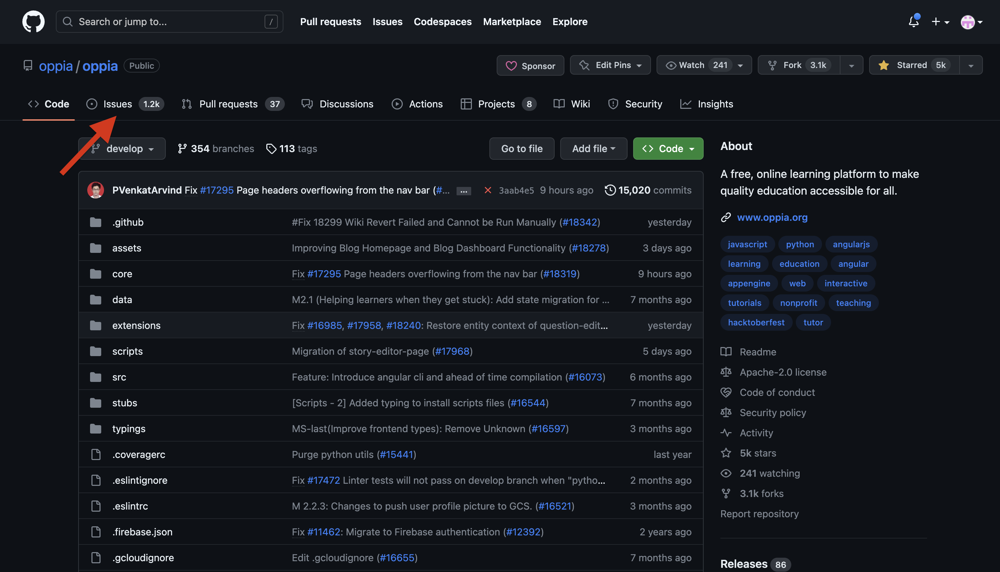
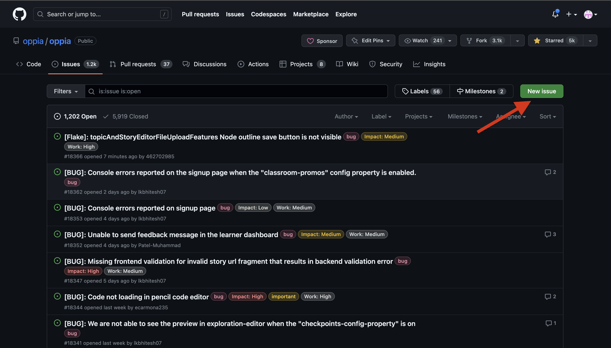
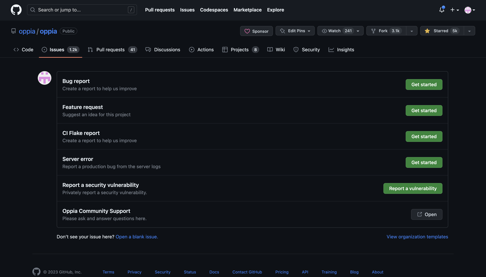
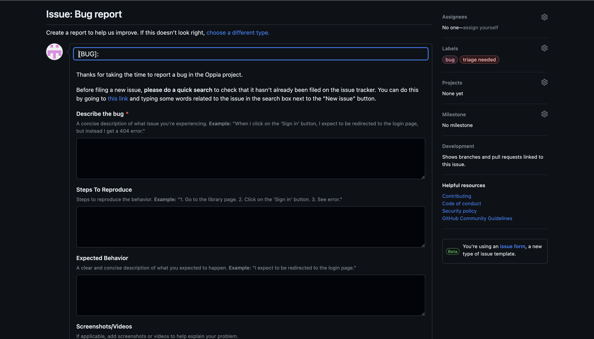

# Filing an Issue on Oppia's GitHub: A Step-by-Step Guide for Non-Developers

## Table of Contents
- [Create a GitHub Account](#create-a-github-account)
- [Access Oppia's GitHub Repository](#access-oppia's-github-repository)
- [File a New Issue](#file-a-new-issue)
- [Engage in the Issue Discussion](#engage-in-the-issue-discussion)
- [Conclusion](#conclusion)

Welcome to Oppia's GitHub issue filing guide for non-developers! This step-by-step guide will help you navigate the process of creating a GitHub account and filing an issue on Oppia's GitHub repository. Let's get started!

## Create a GitHub Account

1. Visit the GitHub website at [https://github.com](https://github.com).

2. Click on the "Sign up" button to create a new GitHub account.

3. Follow the instructions provided by GitHub to complete the signup process.

4. Verify your account by clicking on the confirmation link sent to your email.

## Access Oppia's GitHub Repository

1. Open your web browser and go to [Oppia's GitHub repository](https://github.com/oppia/oppia).

2. You will see the main page of the Oppia repository where the development and issue tracking take place.

## File a New Issue

1. On the Oppia repository page, locate the "Issues" tab near the top navigation bar and click on it.
 

2. In the "Issues" tab, you will find a green button labeled "New issue." Click on it to create a new issue.

3. Choose type of the issue which you want to file from the list of available types.

4. On the issue creation page, provide a concise and descriptive title for your issue in the "Title" field and follow the steps as mentioned along with each comment box.

   `Note :` Red starred comment box means it must be filled.

5. If applicable, you can include screenshots or any other supporting files by dragging and dropping them into the comment box.

6. Once you are satisfied with your issue, click on the green "Submit new issue" button to file it.

## Engage in the Issue Discussion

1. After filing the issue, you will be redirected to the issue's page.

2. From this point, you can monitor updates and engage in discussions related to the issue.

3. To comment on the issue, scroll down to the comment section and enter your comment in the text box provided. You can share additional information, provide clarifications, or ask questions related to the issue.

4. If a developer requests additional information or clarification, you can respond by adding a comment.

5. Utilize the preview feature to review your comment before submitting it. Click on the "Preview" tab beside the comment box to see how your comment will appear. Make any necessary edits if required.

6. Once you are satisfied with your comment, click on the "Comment" button to post it.

7. Feel free to engage in the ongoing discussion by adding more comments as needed.

## Conclusion

Congratulations! You have successfully filed an issue on Oppia's GitHub repository. Your contribution is valuable in improving Oppia for everyone. Remember to follow notifications and actively participate in the issue's discussion to help the developers fix it as soon as possible.

For further assistance or more information, you can refer to the [GitHub Help Documentation](https://docs.github.com/en/issues).
