## Table of Contents

* [User account pages](#user-account-pages)
  * [Log in or create account](#log-in-or-create-account)
  * [Log in as a super-administrator](#log-in-as-a-super-administrator)
    * [Using an email with implicit super-admin privileges](#using-an-email-with-implicit-super-admin-privileges)
    * [Grant super-admin privileges after account creation](#grant-super-admin-privileges-after-account-creation)
  * [Delete account page](#delete-account-page)
  * [Preferences page](#preferences-page)
  * [Profile page](#profile-page)
* [Admin pages](#admin-pages)
  * [Super admin page](#super-admin-page)
    * [Assign roles](#assign-roles)
  * [Email dashboard page](#email-dashboard-page)
  * [Release coordinator page](#release-coordinator-page)
* [Static pages](#static-pages)
  * [About page](#about-page)
  * [Donate page](#donate-page)
  * [Contact Page](#contact-page)
  * [Get started page](#get-started-page)
  * [Landing pages](#landing-pages)
  * [Thanks page](#thanks-page)
  * [Terms page](#terms-page)
* [Collection pages](#collection-pages)
  * [Collection editor page](#collection-editor-page)
  * [Collection player page](#collection-player-page)
* [Exploration pages](#exploration-pages)
  * [Community library page](#community-library-page)
  * [Creator dashboard page](#creator-dashboard-page)
  * [Exploration editor page](#exploration-editor-page)
  * [Exploration player page](#exploration-player-page)
* [Topics and skills pages](#topics-and-skills-pages)
  * [Skill editor page](#skill-editor-page)
  * [Story editor page](#story-editor-page)
  * [Story player page](#story-player-page)
  * [Topic editor (including preview tab)](#topic-editor-including-preview-tab)
  * [Topics and skills dashboard page](#topics-and-skills-dashboard-page)
* [Contributor pages](#contributor-pages)
  * [Contributor dashboard page](#contributor-dashboard-page)
  * [Contributor dashboard admin page](#contributor-dashboard-admin-page)

Oppia has many webpages and this is a comprehensive guide on how to access all those pages. Before a contributor makes a PR, we expect that the contributor has thoroughly tested the changes made in the PR for functional correctness. Part of this process is manually testing any pages that are affected by their code.

## User account pages

### Log in or create account

Many Oppia Pages require authentication to access. In order to sign in:

1. Click the sign-in button on the top left navigation bar.

   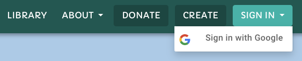

2. Once redirected to the login page, choose an email address and sign in. If you have used this email address before, you will be signed in to the existing account. Otherwise, a new account will be created for you.

   

### Log in as a super-administrator

Super-administrators have access to the admin page, where they can set the role of any user. Some of these roles (e.g. "Topic admin") give the user access to privileged pages (e.g. the topics and skills dashboard).

There are two ways to become a super-administrator: use an email address with implicit super-admin privileges, or use the Firebase emulator interface to grant super-admin privileges after the account has been created.

#### Using an email with implicit super-admin privileges

1. Use the email address `testadmin@example.com`. As soon as you type it in, a message should appear saying "This email address has implicit super-admin privileges!".

   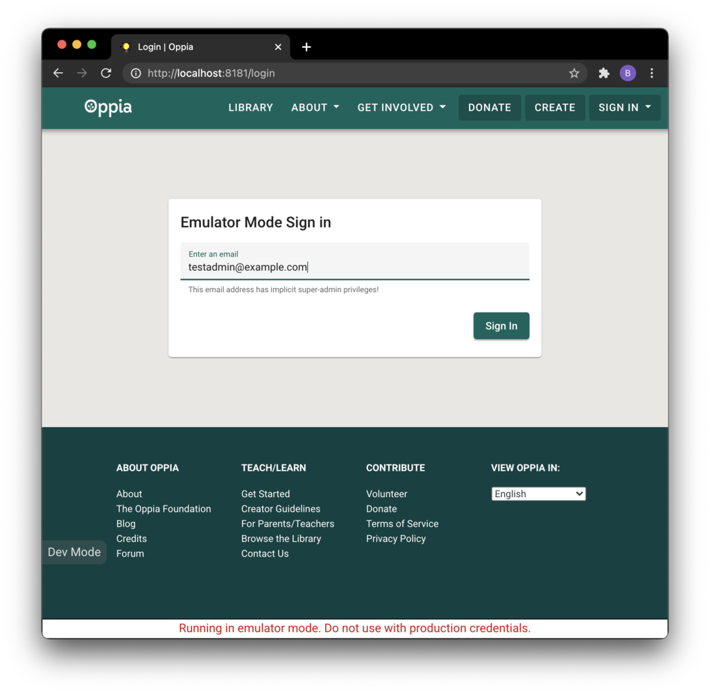

#### Grant super-admin privileges after account creation

1. Sign in with any email address.

   

2. Go to the Firebase Emulator UI: http://localhost:4000/auth.

   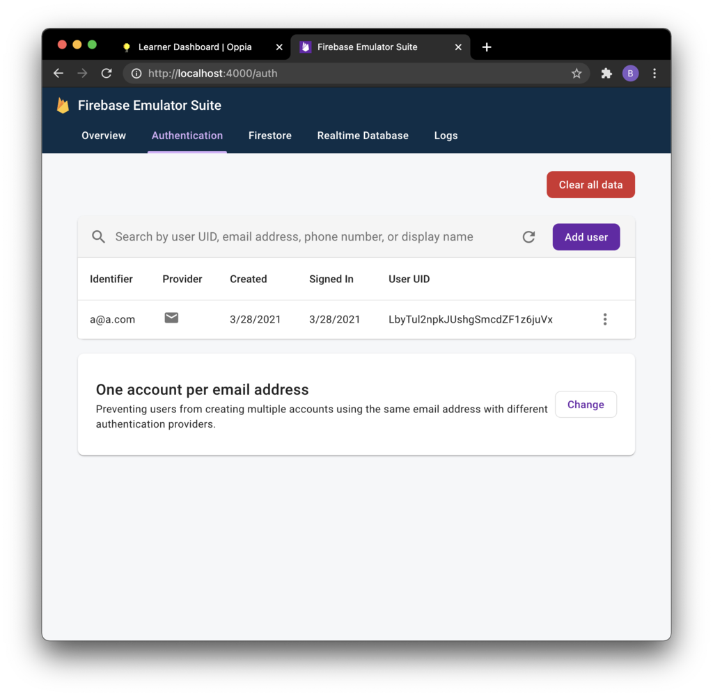

3. Find the corresponding Firebase account, click on the "3 dots" button, then click on "Edit user".

   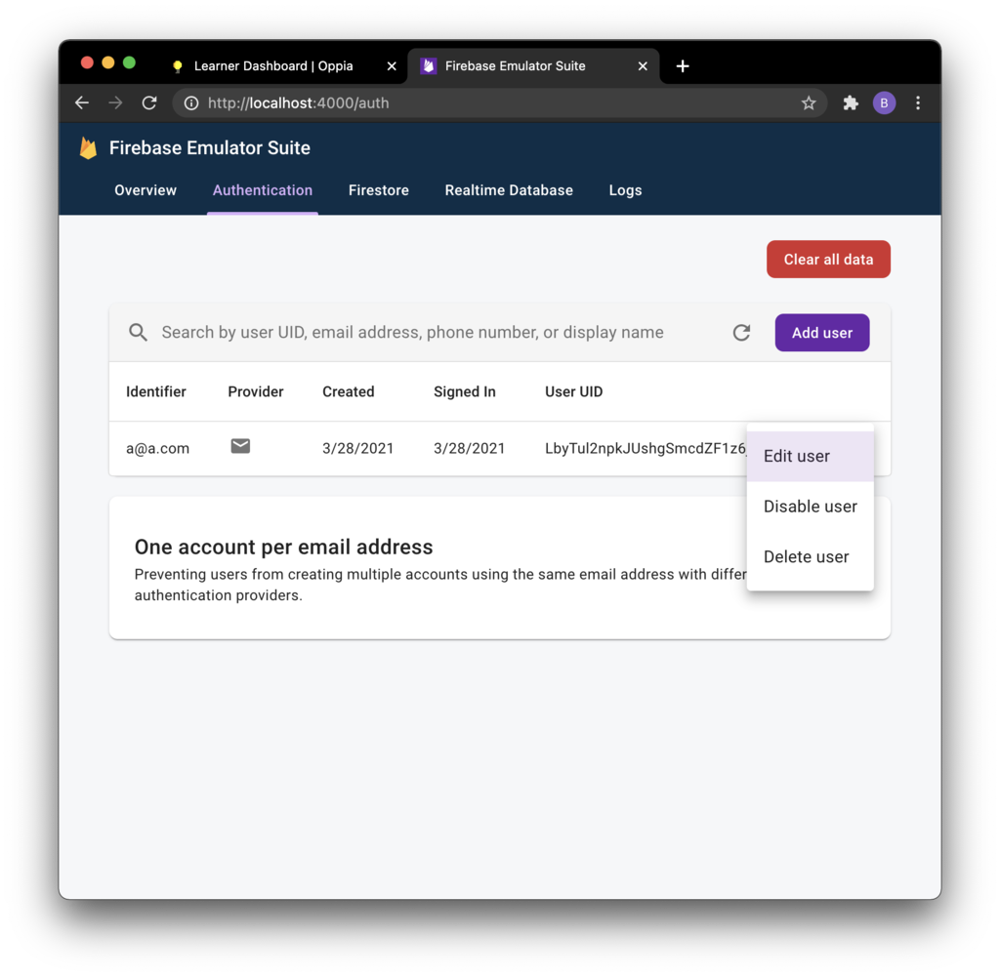

4. Set the Custom Claims value to `{"role":"super_admin"}`, then click on the "Save" button.

   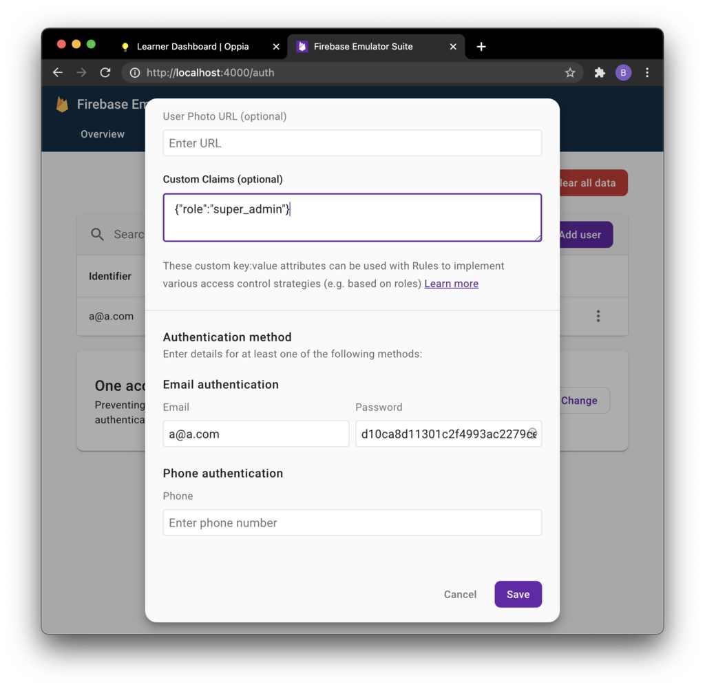

5. Log out and sign back in to refresh the session cookie.

### Delete account page

The delete account page allows users to delete their accounts. Currently, it is deactivated and certain code needs to be changed to access it.

1. Go to constants.ts and change `ENABLE_ACCOUNT_DELETION` from `false` to `true`.

2. Navigate to http://localhost:8181/delete-account.

### Preferences page

The preferences page allows users to change their settings on oppia.

1. Log in.

2. Go to http://localhost:8181/preferences.

### Profile page

The profile page allows users to view and change their profile on Oppia.

1. Log in.

2. Click on the profile menu and click your username to go to the profile page.

## Admin pages

### Super admin page

The admin page is a page accessible only to super-administrators. It has many functionalities including changing permissions, configuration values, and running jobs. Certain webpages cannot be accessed unless the current user has the required permissions.

1. Log in as a super-admin.

2. Go to the profile menu and click on the "Admin Page" link.

   

#### Assign roles

1. Navigate to the Admin page.

2. Click the "ROLES" tab and enter the username of the user whose roles
   you want to edit.

   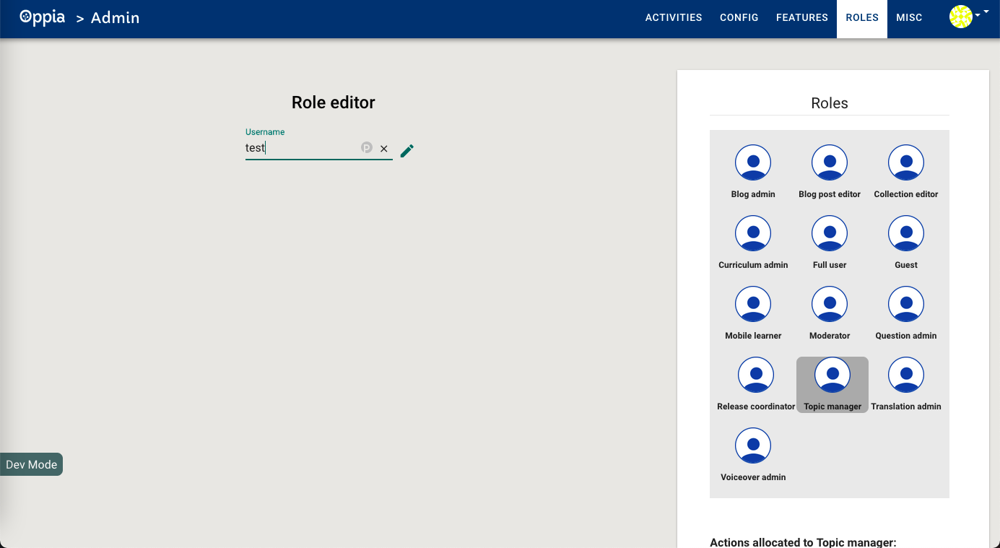

3. Assign the desired role, "Question Admin" in this screenshot:

   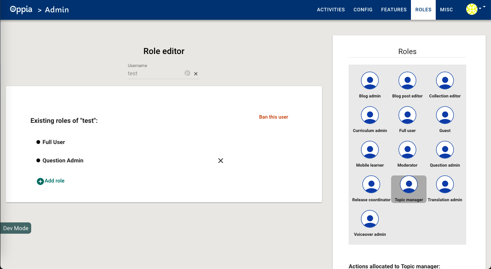

### Email dashboard page

1. Log in as a super-admin.

2. Navigate to http://localhost:8181/emaildashboard.

### Release coordinator page

1. Log in as a super-admin and assign to your user the "release-coordinator" role.

2. Navigate to http://localhost:8181/release-coordinator.

## Static pages

### About page

The About page provides a brief overview of Oppia. It details the goals of the Oppia organization, credits its contributors, and provides links to guides and tutorials on how to further explore Oppia.

1. Click the "About Menu" button on the top right navigation bar.

2. Click on the "About Oppia" link.

   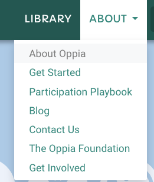

### Donate page

The donate page provides a way for people to donate to the Oppia organization.

1. Go to http://localhost:8181/donate or click on the donate button in the navigation bar.

### Contact Page

The contact page details the ways to communicate with the Oppia team and get involved.

1. Click on the "About" menu at the top navigation bar.

2. Click on the "Contact Us" link.

### Get started page

The get started page provides information for people new to Oppia.

1. Navigate to http://localhost:8181/get-started.

### Landing pages

The landing pages are a series of pages that provide information for people who want to help contribute to Oppia.

1. Navigate to http://localhost:8181/teachers.

### Thanks page

The Thanks page acknowledges people who support Oppia.

1. Go to http://localhost:8181/thanks.

### Terms page

The Terms page addresses the terms and conditions of Oppia.

1. Go to http://localhost:8181/terms.

## Collection pages

### Collection editor page

The Collection editor page allows users to create collections, which group explorations together. The collection editor page can only be accessed by users with the "collection editor" role.

1. Log in as a super-admin and assign yourself the "collection editor" role.

2. Navigate to the splash page (http://localhost:8181/splash).

3. Click on the "Create" button in the top navigation bar.

   

4. Select "Create Collection."

   

### Collection player page

The collection player page allows users to explore collections in Oppia.

1. Log in as a super-admin and assign yourself the "collection editor" role.

2. Go to the admin activities tab and reload the collection "welcome_to_collections.yaml"

   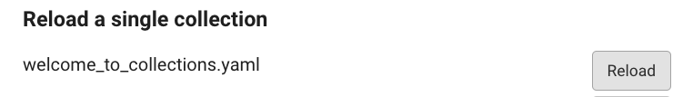

3. Navigate back to the community library page and type in the search bar "collections."

4. Click on the card titled "Introduction to collections in Oppia."

## Exploration pages

### Community library page

The community library page allows users to view and search for explorations on Oppia. "Community" here refers to the Oppia community of teachers, learners, and contributors.

1. Log in.

2. Go to http://localhost:8181/community-library.

The library page has a search bar that lets you search for explorations:

You can search the library, which consists of all of Oppia's explorations, by entering text, and you can filter by category (also called subject) and language.

### Creator dashboard page

The creator dashboard page allows users to view all explorations they have created, or are currently creating.

1. Log in.

2. Navigate to the creator dashboard page at http://localhost:8181/creator-dashboard.

### Exploration editor page

The exploration editor page allows users to create explorations, or lessons, in Oppia.

1. Log in.

2. Click the "Create" button on the top right to open the exploration editor.

### Exploration player page

The exploration player page allows users to play explorations in Oppia.

1. Navigate to http://localhost:8181/community-library.

2. Enter "fractions" into the search bar.

3. Click on the exploration titled "Fractions 1 - What is the Fraction?"

The exploration will launch in a new tab, where you will see the first card. As you progress through the exploration, you will see subsequent cards, each of which has some content (text, images, videos, or other rich text components). Some will also have interactions like multiple choice questions. A user's answer to these interactions are called "responses."

## Topics and skills pages

### Skill editor page

The skill editor allows the creation of skills in Oppia.

1. Log in as a super-admin and assign yourself the "Topic manager" role.

2. Go to http://localhost:8181/topics-and-skills-dashboard and create a topic.

   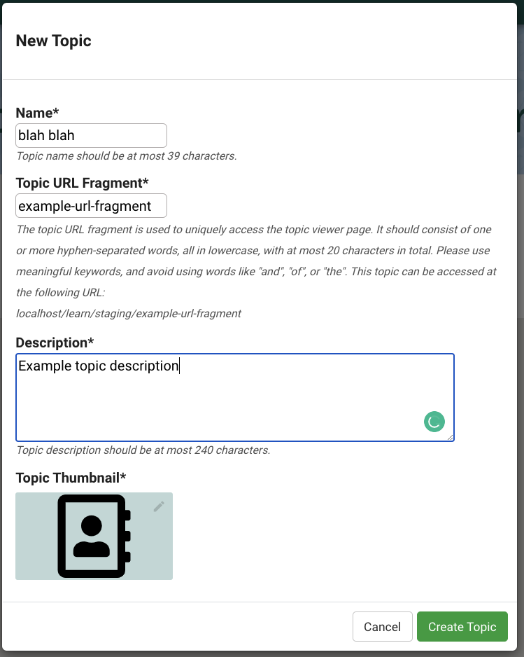

3. Go to the topic editor and scroll down to the "Create Skill" button.

4. Create a skill, and wait for the skill editor tab to open.

### Story editor page

The story editor page allows users to create stories in Oppia.

1. Log in as a super-admin and assign yourself the "Topic manager" role.

2. Go to http://localhost:8181/topics-and-skills-dashboard and create a topic.

   

3. Go to the topic editor and click on the Add Story button.

   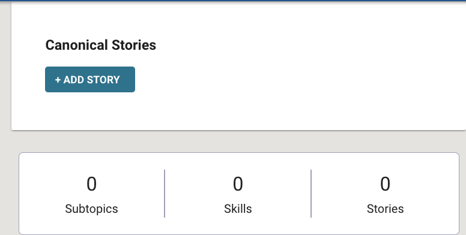

4. Complete create story modal, and wait for the story editor page to load.

   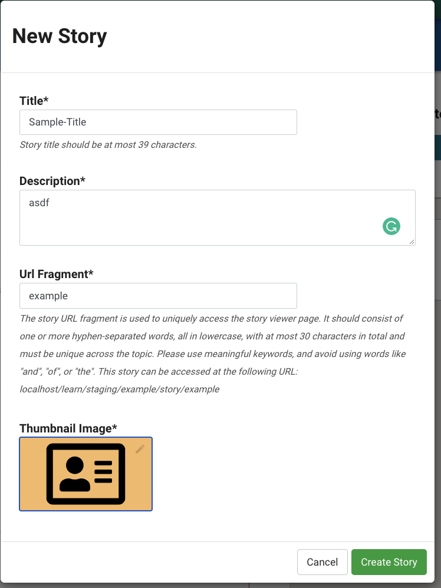

### Story player page

The story player allows people to play stories. To access it:

1. Follow steps to access the story editor page.

2. Add a chapter to the story.

3. Create an exploration and link it to the story.

4. Go to the Preview tab of the Story player.

### Topic editor (including preview tab)

The topic editor page allows users to create topics in Oppia.

1. Log in as a super-admin and assign yourself the "Topic manager" role.

2. Go to http://localhost:8181/topics-and-skills-dashboard and create a topic.

   

   The following modal should appear:

   

3. Create some skills and a topic and assign these skills to the topic.

4. Edit and publish the topic after adding subtopics (add some content for these), and a story with few chapters.

5. Use the preview button to navigate to the topic player.

### Topics and skills dashboard page

The topics and skills dashboard page allows users to view their created topics and skills.

1. Log in as a super-admin and assign yourself the "Topic manager" role.

2. Go to http://localhost:8181/topics-and-skills-dashboard or click the topic and skills dashboard link.

   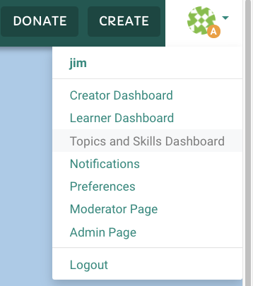

## Contributor pages

### Contributor dashboard page

The contributor dashboard page allows users to translate existing explorations into a different language, or create questions for existing Oppia explorations. This lets more people become "contributors" by helping create Oppia content.

1. Log in.

2. Navigate to the contributor dashboard page at http://localhost:8181/contributor-dashboard.

### Contributor dashboard admin page

1. Log in as a super-admin and assign to your user the "Question admin" role.

2. Navigate to http://localhost:8181/contributor-dashboard-admin.
