## Table of Contents
- [Overview of entities](#overview-of-entities)
  * [Key Terms](#key-terms)
  * [Other Terms](#other-terms)
- [User Account Pages](#user-account-pages)
  * [Log In or Create Account](#log-in-or-create-account)
  * [Log in as a Super-Administrator](#log-in-as-a-super-administrator)
    + [Method A — Implicit Super Admin Email (Fast):](#method-a---implicit-super-admin-email--fast--)
    + [Method B — Grant Super Admin via Firebase emulator (Explicit):](#method-b---grant-super-admin-via-firebase-emulator--explicit--)
- [Oppia Webpages](#oppia-webpages)
  * [About Page](#about-page)
  * [Admin Page](#admin-page)
    + [Important Admin Page Tabs](#important-admin-page-tabs)
  * [Android Page](#android-page)
  * [Blog Admin Page](#blog-admin-page)
  * [Blog Author Profile Page](#blog-author-profile-page)
  * [Blog Dashboard Page](#blog-dashboard-page)
  * [Blog Homepage Page](#blog-homepage-page)
  * [Blog Post Page](#blog-post-page)
  * [Classroom Admin Page](#classroom-admin-page)
  * [Classroom Page](#classroom-page)
  * [Classrooms Page](#classrooms-page)
  * [Collection Editor Page](#collection-editor-page)
  * [Collection Player Page](#collection-player-page)
  * [Community Library Page](#community-library-page)
  * [Contact Page](#contact-page)
  * [Contributor Admin Dashboard Page](#contributor-admin-dashboard-page)
  * [Contributor Dashboard Page](#contributor-dashboard-page)
    + [Important Contributor Dashboard Page Tabs](#important-contributor-dashboard-page-tabs)
  * [Create Learner Group Page](#create-learner-group-page)
  * [Creator Dashboard Page](#creator-dashboard-page)
  * [Creator Guidelines Page](#creator-guidelines-page)
  * [Custom Error Pages](#custom-error-pages)
  * [Delete Account Page](#delete-account-page)
  * [Diagnostic Test Player Page](#diagnostic-test-player-page)
  * [Donate Page](#donate-page)
  * [Edit Learner Group Page](#edit-learner-group-page)
    + [Important Edit Learner Group Page Tabs](#important-edit-learner-group-page-tabs)
  * [Email Dashboard Page](#email-dashboard-page)
  * [Embedded Exploration Player Page](#embedded-exploration-player-page)
  * [Exploration Editor Page](#exploration-editor-page)
  * [Exploration Player Page](#exploration-player-page)
  * [Facilitator Dashboard Page](#facilitator-dashboard-page)
  * [Feedback Updates Page](#feedback-updates-page)
  * [Get Started Page](#get-started-page)
  * [Iframe Error Page](#iframe-error-page)
  * [Learner Dashboard Page](#learner-dashboard-page)
  * [License Page](#license-page)
  * [Maintenance Page](#maintenance-page)
  * [Moderator Page](#moderator-page)
  * [New Lesson Player Page](#new-lesson-player-page)
  * [Partnerships Page](#partnerships-page)
  * [Pending Account Deletion Page](#pending-account-deletion-page)
  * [Practice Session Page](#practice-session-page)
  * [Preferences Page](#preferences-page)
  * [Privacy Policy Page](#privacy-policy-page)
  * [Profile Page](#profile-page)
  * [Release Coordinator Page](#release-coordinator-page)
    + [Important Release Coordinator Page Tabs](#important-release-coordinator-page-tabs)
  * [Review Test Page](#review-test-page)
  * [Signup Page](#signup-page)
  * [Skill Editor Page](#skill-editor-page)
  * [Story Editor Page](#story-editor-page)
  * [Story Player Page](#story-player-page)
  * [Study Guide Page](#study-guide-page)
  * [Teach Page](#teach-page)
  * [Terms of Use Page](#terms-of-use-page)
  * [Thank You Page](#thank-you-page)
  * [Topic Editor Page](#topic-editor-page)
  * [Topic Viewer Page](#topic-viewer-page)
  * [Topics & Skills Dashboard Page](#topics---skills-dashboard-page)
  * [View Learner Group Page](#view-learner-group-page)
  * [Voiceover Admin Page](#voiceover-admin-page)
  * [Volunteer Page](#volunteer-page)
- [Populating Data on Local Server](#populating-data-on-local-server)
  * [1. Admin Activities Tab (Dummy/Test Data)](#1-admin-activities-tab--dummy-test-data-)
    + [Generate Dummy Explorations](#generate-dummy-explorations)
    + [Reload a Single Exploration](#reload-a-single-exploration)
    + [Reload a Single Collection](#reload-a-single-collection)
    + [Load Dummy New Structures Data](#load-dummy-new-structures-data)
    + [Generate Stories](#generate-stories)
    + [Generate Chapters](#generate-chapters)
  * [2. Creating Explorations](#2-creating-explorations)
  * [3. Creating a Skill](#3-creating-a-skill)
  * [4. Creating a Topic](#4-creating-a-topic)
  * [5. Generate Dummy Blog Data](#5-generate-dummy-blog-data)
  * [6. Generating Data For Contributor Dashboard](#6-generating-data-for-contributor-dashboard)
  * [7. Creating Collections](#7-creating-collections)
    + [Using the Collection Editor](#using-the-collection-editor)
    + [Using Activities Tab](#using-activities-tab)
  * [8. Creating a Classroom](#8-creating-a-classroom)
    + [Creating a Custom Classroom](#creating-a-custom-classroom)
    + [Creating a Dummy Math Classroom](#creating-a-dummy-math-classroom)
  * [9. Community Library](#9-community-library)
    + [Generate Explorations](#generate-explorations)
    + [Generate Collections](#generate-collections)
  * [10. Collection Player](#10-collection-player)
  * [11. Story Player](#11-story-player)
  * [12. Review Test Page](#12-review-test-page)
  * [13. Fixing This common error](#13-fixing-this-common-error)
- [Oppia Routing Guide for Contributors](#oppia-routing-guide-for-contributors)
  * [1. What Is Routing in Oppia?](#1-what-is-routing-in-oppia-)
  * [2. Route Protection (Guards)](#2-route-protection--guards-)
    + [2.1 IsLoggedInGuard](#21-isloggedinguard)
    + [2.2 LessonPlayerPageAuthGuard](#22-lessonplayerpageauthguard)
    + [2.3 NormalizeUrlCaseGuard](#23-normalizeurlcaseguard)
  * [3. Public Pages (No Login Required)](#3-public-pages--no-login-required-)
  * [4. Authentication Pages](#4-authentication-pages)
  * [5. Dashboard Pages (Require Login)](#5-dashboard-pages--require-login-)
  * [6. Admin & Moderation Routes (Require Login)](#6-admin---moderation-routes--require-login-)
  * [7. Editor Routes (Require Login)](#7-editor-routes--require-login-)
  * [8. Topics, Practice & Learning Pages (Public)](#8-topics--practice---learning-pages--public-)
  * [9. Classrooms & Learning Paths](#9-classrooms---learning-paths)
  * [10. Exploration & Lesson Players](#10-exploration---lesson-players)
  * [11. Library & Collections](#11-library---collections)
  * [12. Blog Routes](#12-blog-routes)
  * [13. Learner Group Routes](#13-learner-group-routes)
  * [14. Account & Profile Routes](#14-account---profile-routes)
  * [15. Special Dynamic Routes](#15-special-dynamic-routes)
    + [15.1 Stewards Landing Pages](#151-stewards-landing-pages)
    + [15.2 Topic Landing Pages](#152-topic-landing-pages)
  * [16. Error Handling Routes](#16-error-handling-routes)
  * [17. Why this routing file Is critical](#17-why-this-routing-file-is-critical)
  * [18. Role-based Access Control](#18-role-based-access-control)
  * [19. Troubleshooting Tips](#19-troubleshooting-tips)
  * [20. Quick reference for contributors](#20-quick-reference-for-contributors)
  * [21. Contributor Checklist](#21-contributor-checklist)
  * [22. Summary](#22-summary)

<small><i><a href='http://ecotrust-canada.github.io/markdown-toc/'>Table of contents generated with markdown-toc</a></i></small>


  
## Overview of entities

This diagram outlines the various entities in Oppia and how they relate
to each other:

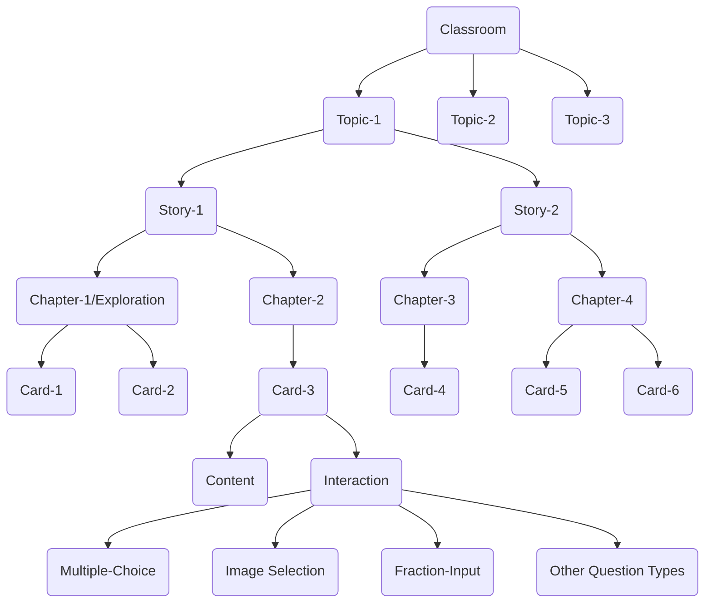
```mermaid
flowchart TD
C("Classroom") --> T1("Topic-1")
C --> T2("Topic-2")
C --> T3("Topic-3")
T1 --> S1("Story-1")
T1 --> S2("Story-2")
S1 --> C1("Chapter-1/Exploration")
C1 --> c1("Card-1")
C1 --> c2("Card-2")
S1 --> C2("Chapter-2")
C2 --> c3("Card-3")
c3 --> co("Content")
c3 --> in("Interaction")
in --> mc("Multiple-Choice")
in --> is("Image Selection")
in --> fi("Fraction-Input")
in --> oqt("Other Question Types")
S2 --> C3("Chapter-3")
S2 --> C4("Chapter-4")
C3 --> c4("Card-4")
C4 --> c5("Card-5")
C4 --> c6("Card-6")
```
As you go through https://www.oppia.org/, you will find these entities.

### Key Terms

1. **Classroom**: A Classroom in Oppia is a collection of topics grouped under a single subject. For example: https://www.oppia.org/learn/math this displays a Maths classroom.
2. **Topic**: A topic is a broad term that refers to the subject content being taught. For example: https://www.oppia.org/learn/math displays a list of math topics. A single topic can be described through multiple stories.
3. **Story**: Stories are situations/scenarios that are meant to help users understand the topic. For example, if the topic is addition, then one of the stories could be about where a kid goes to a shop and buys 3 pens and 4 pencils. The lesson could then explain the concept of addition while discussing the total number of items bought. As another example, https://www.oppia.org/learn/math/place-values/story talks about Jaime’s adventures for learning about place values. A single story can be referenced in multiple chapters and is essentially a collection of chapters.
4. **Chapter**: A chapter corresponds to different lessons through which we aim to teach the topic to the users. Each chapter has an associated exploration, and this exploration may have several cards. For example, https://www.oppia.org/learn/math/place-values/story shows a bunch of chapters to learn the place values topic.
5. **Card**:
A card is the primary component of lesson where each card consists of:

   - **Content**: This refers to the tutor’s question to the learner.
   - **Interaction**: Interactions refer to the type of question the users are shown (e.g. multiple-choice, image selection, fraction input, etc.)
   - **Response**: Feedback from Oppia to the learner based on the learner's answer to the interaction.

   For example, [this card](https://www.oppia.org/explore/K645IfRNzpKy?story_url_fragment=jaimes-adventures-in-arcade&topic_url_fragment=place-values&classroom_url_fragment=math&node_id=node_1) shows a card in one of the place values chapters.

### Other Terms

1. **Collection**: A collection is a group of related lessons arranged in a sequence. They don’t appear inside classrooms — instead, learners usually find them in the Community Library. For Example: https://www.oppia.org/collection/4UgTQUc1tala A Fractions collection with lessons like “What are Fractions?” and “Comparing Fractions.”
2. **Opportunity**: An opportunity is specific to an exploration, and it refers to a way any contributor can contribute content to Oppia.
3. **Suggestion**: Any time any user contributes to Oppia, their contribution is added as a request which is known as a suggestion. There are two types of suggestions:
   * **Translation suggestion**: A suggested translation of content into another language.
   * **Question suggestion**: A suggested question for a skill.
4. **Contributor** Anyone who pitches in content for an exploration/lesson. One way that Oppia is more of a collaborative learning space, in contrast to more traditional online learning platforms.
5. **Exploration** The fundamental unit of learning on Oppia. This is an interactive activity built by a creator, and consumed by a learner. 
6. **Library** The page where all explorations and collections on Oppia are displayed.
7. **Interaction** The interactive component of a card; this is the medium through which a learner communicates to a student by asking various types of questions and through which student can answer these question.
8. **Learner** A user who engages in an exploration or lesson.
9. **Response** Feedback and/or a new card that the learner is directed to based on their answer. A response can’t be empty; if a response doesn’t direct the learner to a new card, then feedback must be provided.
10. **Rule** A condition that triggers a response. Different interactions have different rule options. Multiple rules can be grouped together in a single answer group.
11. **Tags** Additional labels that can be added to an exploration in order to make it more findable in the community library.
   
## User Account Pages

### Log In or Create Account

Many Oppia Pages require authentication to access. In order to sign in:

1. Click the sign-in button on the top left navigation bar.

   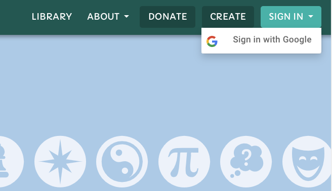

2. Once redirected to the login page, choose an email address and sign in. If you have used this email address before, you will be signed in to the existing account. Otherwise, a new account will be created for you.
   
   

### Log in as a Super-Administrator

Super Admin can:
- Access the Admin page
- Assign roles to users
- Run dummy data generation jobs
  
Some of these roles (e.g. "Topic admin") give the user access to privileged pages (e.g. the topics and skills dashboard).

There are two ways to become a super admin on the local server.

#### Method A — Implicit Super Admin Email (Fast):
1. On the sign-in page, enter testadmin@example.com.
2. A message will appear: "This email address has implicit Super Admin privileges!" — you now have Super Admin access.

   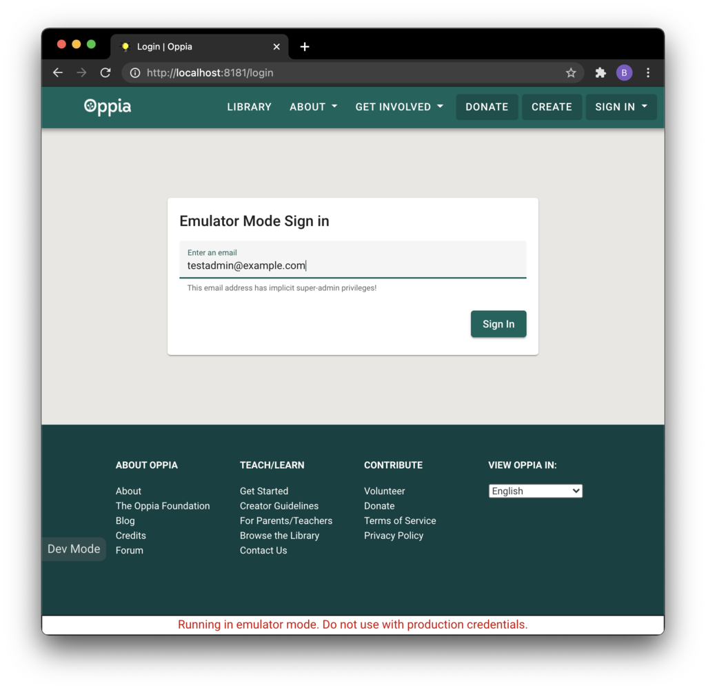

#### Method B — Grant Super Admin via Firebase emulator (Explicit):

1. Sign in with any email address.

   

2. Go to the Firebase Emulator UI: http://localhost:4000/auth.

   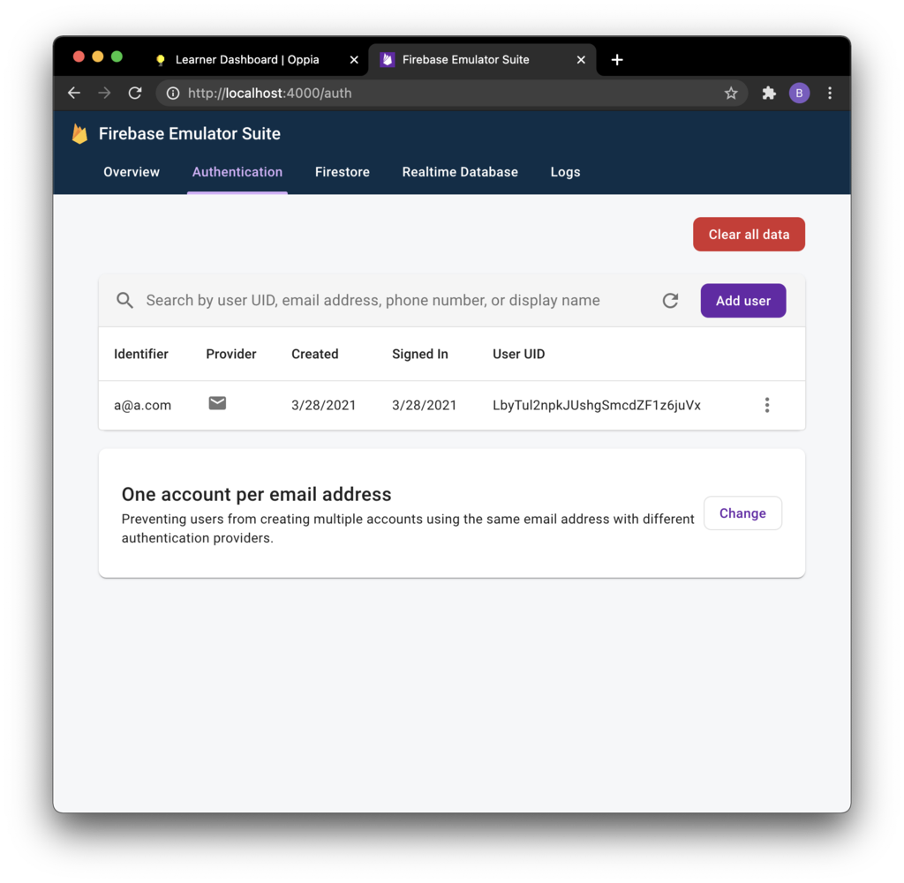

3. Find the corresponding Firebase account, click on the "3 dots" button, then click on "Edit user".

   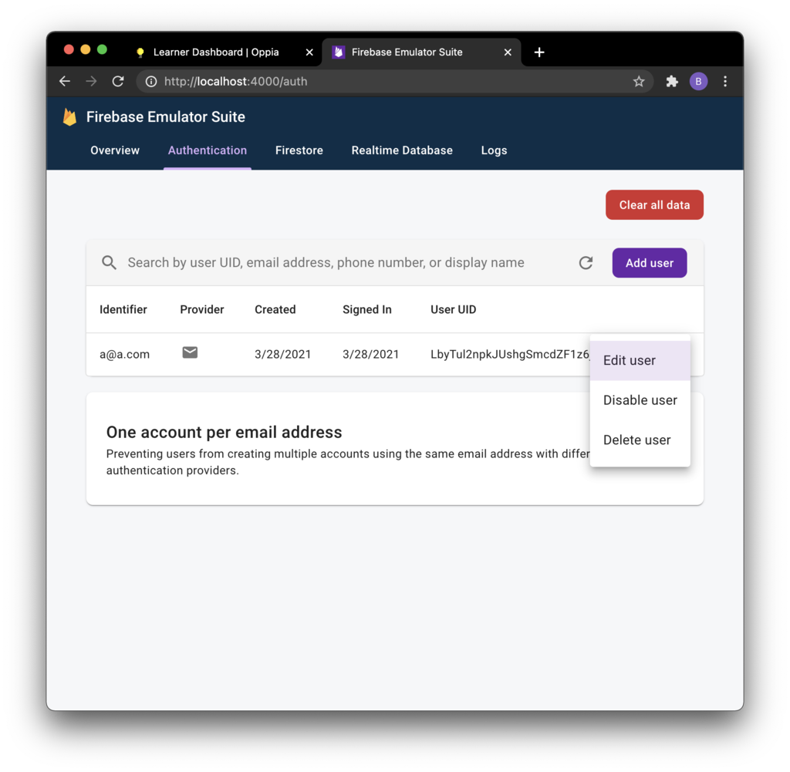

4. Set the Custom Claims value to `{"role":"super_admin"}`, then click on the "Save" button.

   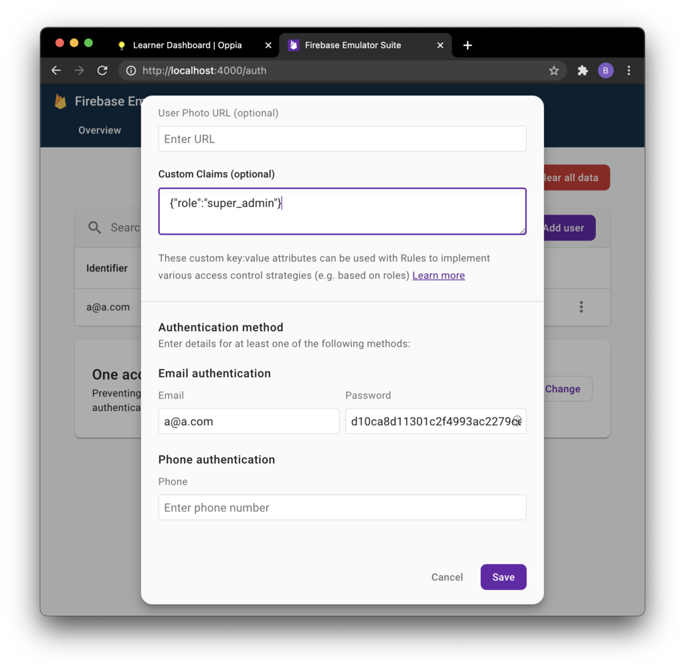

5. Log out and sign back in to refresh the session cookie.

## Oppia Webpages

### About Page

- **Description:** 
Provides information about the Oppia Foundation, its mission, team, and Impact.  

- **Url:** 
/about

- **Permissions Required:** 
None

**Steps to Access:** 
  1. Click About in the Navbar.

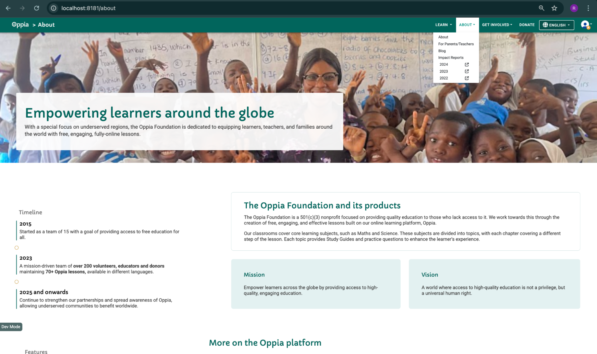


### Admin Page

- **Description:**
The Admin page is where Super Admins manage roles, run dummy data generation jobs, and reload prebuilt content.

- **Url:** 
http://localhost:8181/admin

- **Permissions Required:**
[Super Admin](#log-in-as-a-super-administrator)

**Steps to Access:**
  1. Log in as a super-admin. 
  2. Go to the profile menu and click on the "Admin Page" link.
      


#### Important Admin Page Tabs

We have the following tabs on the Admin Page:

- [Activities Tab](#activities-tab)
- [Misc Tab](#misc-tab)
- [Platform Parameters Tab](#platform-parameters-tab)
- [Roles Tab](#roles-tab)

#### **Activities Tab**

- **Description:**
This page allows Super Admin to generate, reload, or seed data on the local development server, such as explorations, collections, skills, topics, and  classrooms.

- **Url:**
http://localhost:8181/admin (Activities tab)

- **Permissions Required:**
[Super Admin](#log-in-as-a-super-administrator)

**Steps to Access:** 
  1. Log in as a super-admin.
  2. Navigate to /admin.
  3. Click on the Activities tab.
  4. Choose the required data generation or reload action.

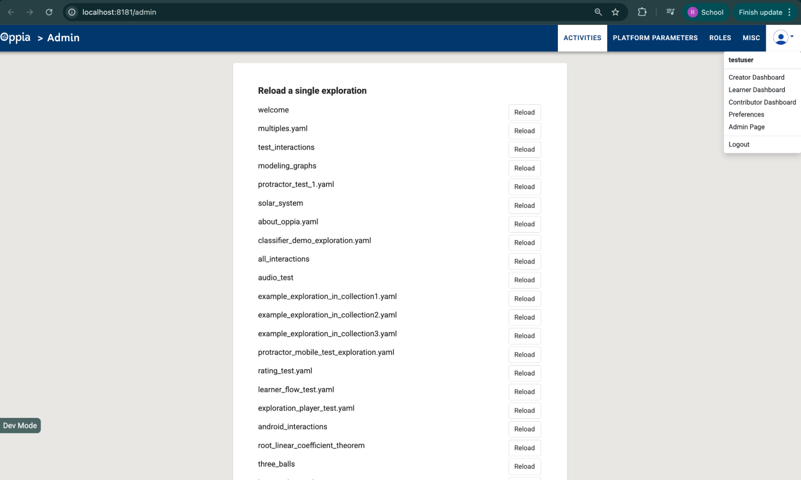

#### **Misc Tab**

- **Description:**
This page contains advanced admin tools used to maintain, debug, and manage Oppia’s internal data.
These tools are mainly for super-admins and developers, and are usually used during development, testing, data fixes, or emergency maintenance.
Most learners and creators will never need to use this page.

- **Url:**
http://localhost:8181/admin (Misc tab)

- **Permissions Required:**
[Super Admin](#log-in-as-a-super-administrator)

**Steps to Access:**
  1. Log in as a super-admin
  2. Navigate to /admin
  3. Open the Misc tab

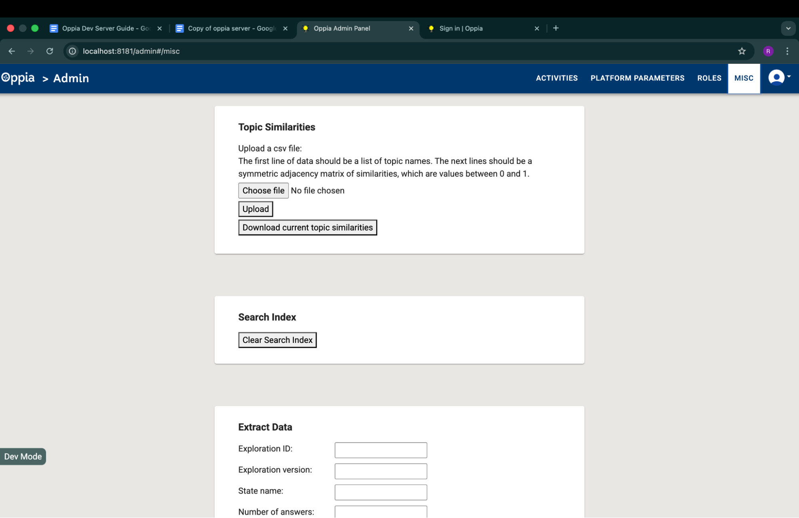

#### **Platform Parameters Tab** 

- **Description:**
This page displays platform-level configuration parameters that control feature flags and site behavior across Oppia. Admins can view platform configuration parameters. Some values may be editable depending on the environment.

- **Url:**
http://localhost:8181/admin (Platform Parameters tab)

- **Permissions Required:**
[Super Admin](#log-in-as-a-super-administrator)

**Steps to Access:**
  1. Log in as a super-admin.
  2. Open /admin.
  3. Navigate to the Platform Parameters tab.
  4. Review or update configuration values as required.

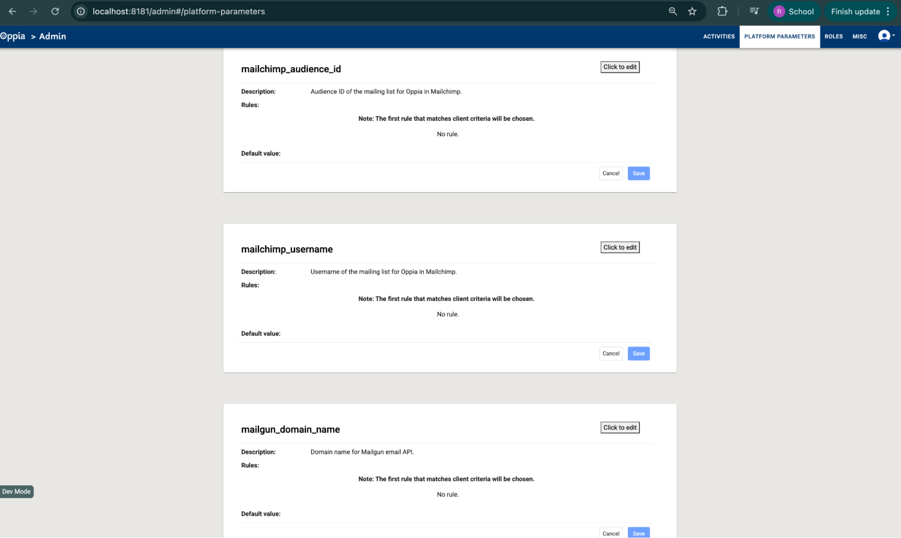

#### **Roles Tab** 

- **Description:** 
Allows Super Admin to assign roles such as Curriculum Admin, Question Admin, or Release Coordinator, etc.

- **Url:**
http://localhost:8181/admin (Roles tab)

- **Permissions Required:**
[Super Admin](#log-in-as-a-super-administrator)

**Steps to Access:**

  1. Navigate to the Admin page.
  2. Click the "Roles" tab and enter the username of the user whose roles you want to edit.

   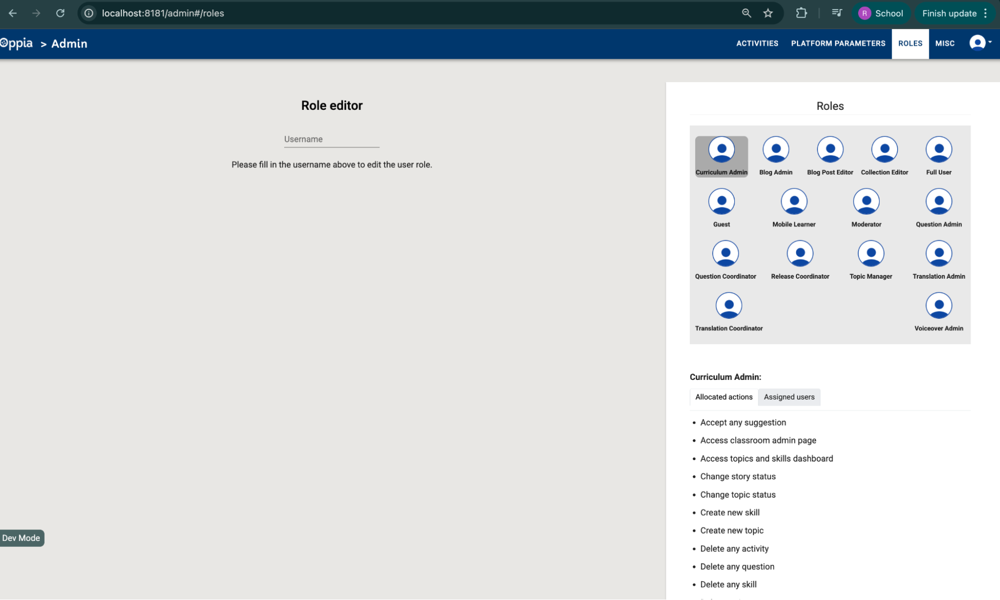

  3. Assign the desired role, "Question Admin" in this screenshot:

   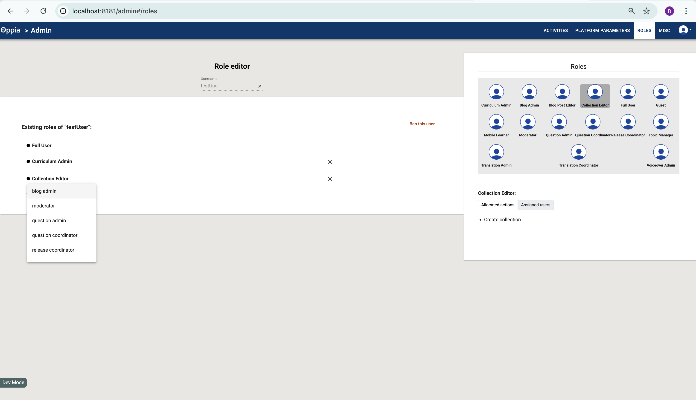

### Android Page

- **Description:** 
 Android Page allows to learn on the go with the Oppia Android app to access free, high-quality lessons in math, science, and more, even offline.

- **Url:** 
/android

- **Permissions Required:** 
None

**Steps to Access:** 
  1. Click LEARN in the navbar.
  2. Click try it today.
   
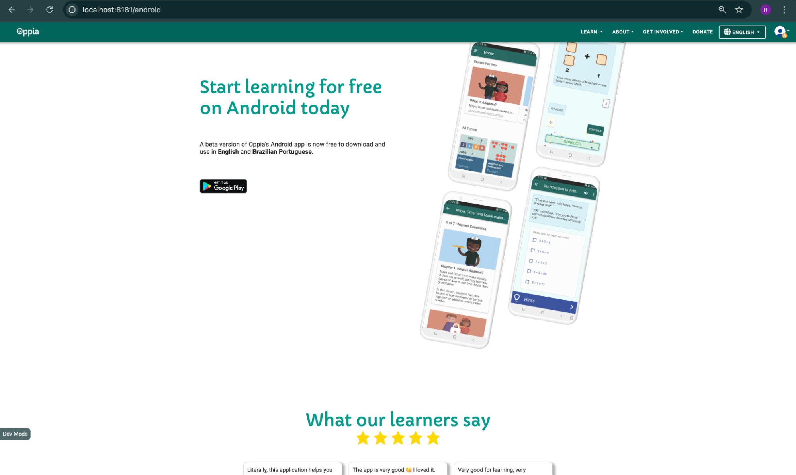

### Blog Admin Page

- **Description:**
Administrative dashboard for managing blog settings, categories, featured posts, and blog-wide configurations.

- **Url:**
/blog-admin

- **Permissions Required:**
Blog Admin role

**Steps to Access:**
  1. Log in as a Super Admin
  2. Assign yourself the Blog Admin role via /admin → Roles
  3. Navigate to http://localhost:8181/blog-admin

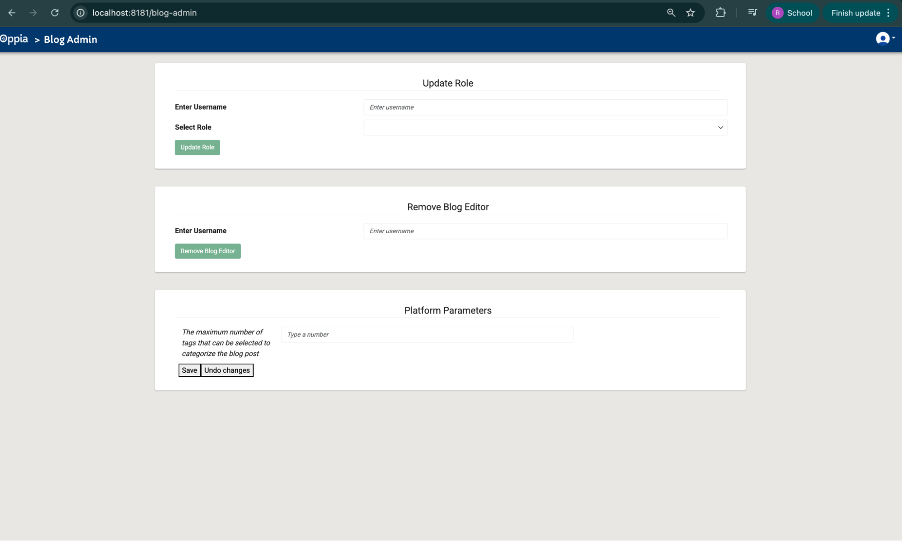

### Blog Author Profile Page

- **Description:**
Displays a blog author's profile, including their bio, published posts, and author information.

- **Url:**
/blog/author/<author_username>

- **Permissions Required:**
None (Public)

**Steps to Access:**
  1. Navigate to any blog post
  2. Click on the author's name
  3. OR directly visit http://localhost:8181/blog/author/<author_username>

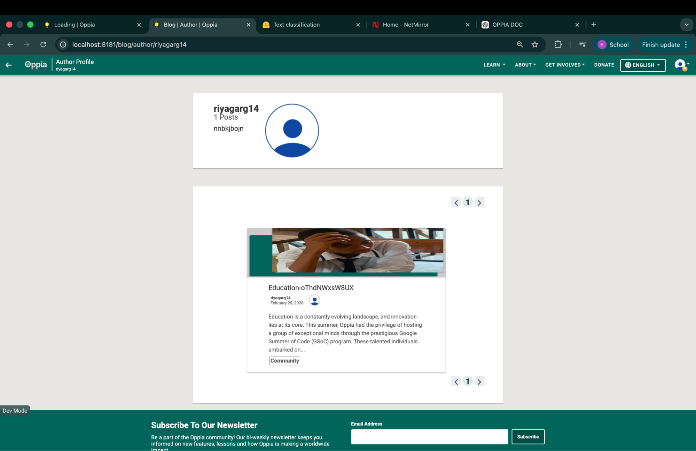

### Blog Dashboard Page

- **Description:**
Management interface for blog authors to create, edit, and publish blog posts.

- **Url:**
/blog-dashboard

- **Permissions Required:**
Blog Editor role

**Steps to Access:**
  1. Log in as a Super Admin
  2. Assign yourself the Blog Editor role via /admin (Roles)
  3. Navigate to http://localhost:8181/blog-dashboard

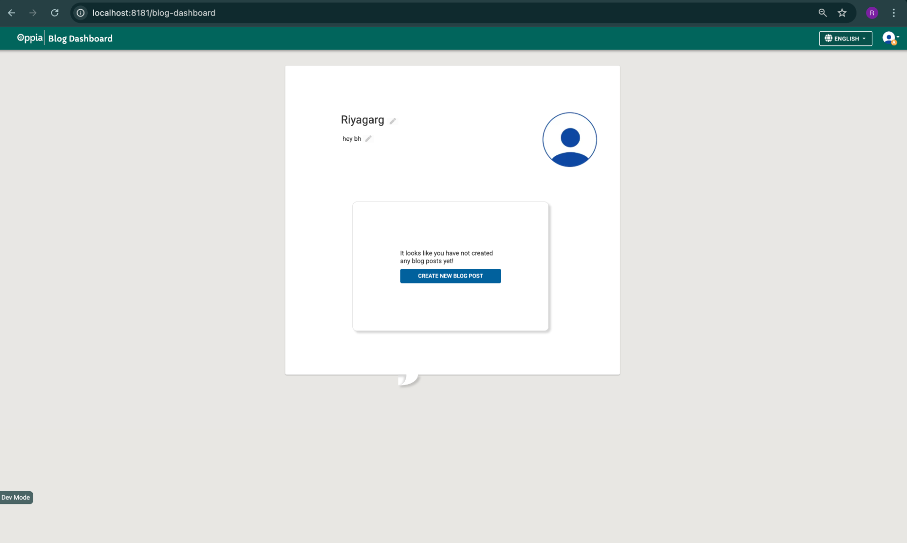

### Blog Homepage Page

- **Description:**
The main blog page displaying recent blog posts, featured articles, and blog categories.

- **Url:**
/blog

- **Permissions Required:**
None (Public)

**Steps to Access:**
  1. Click "Blog" in the navigation bar
  2. OR directly visit http://localhost:8181/blog
   
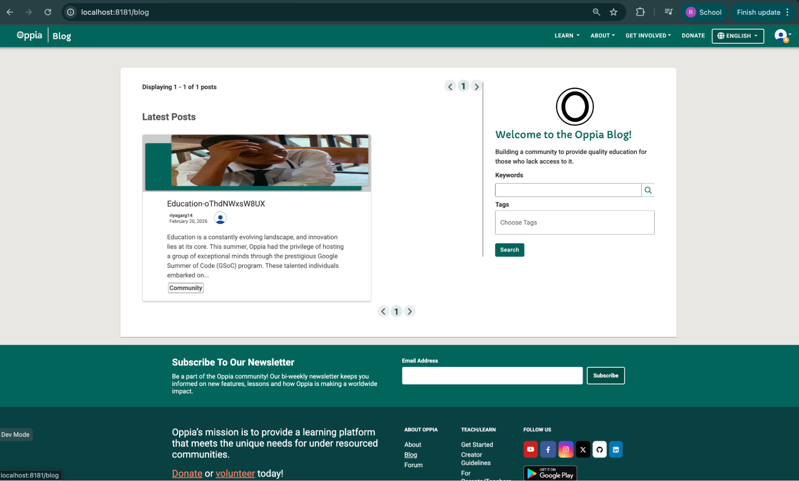

- To populate the Blog Homepage: See [Generate Dummy Blog Data](#5-generate-dummy-blog-data)

### Blog Post Page

- **Description:**
Displays a single blog post with its full content, images, and comments.

- **Url:**
 /blog/<blog_post_slug>

- **Permissions Required:**
None (Public)

**Steps to Access:**
  1. Navigate to /blog
  2. Click on a blog post title
  3. OR directly visit http://localhost:8181/blog/<blog_post_slug>

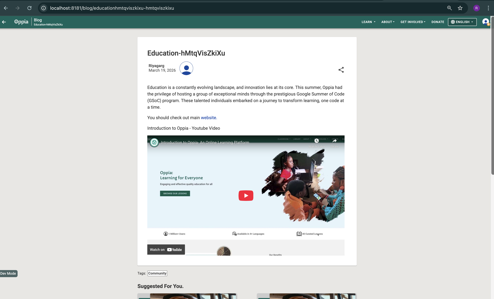

### Classroom Admin Page

- **Description:**
This page allows Curriculum Admins to create and manage classrooms, assign  topics, and configure classroom content displayed to learners.

- **Url:**
http://localhost:8181/classroom-admin

- **Permissions Required:**
Curriculum Admin role

**Steps to Access:**
  1. Log in as a super-admin.
  2. Assign yourself the Curriculum Admin role.
  3. Navigate to /classroom-admin.
  4. Create or edit classrooms and assign topics.

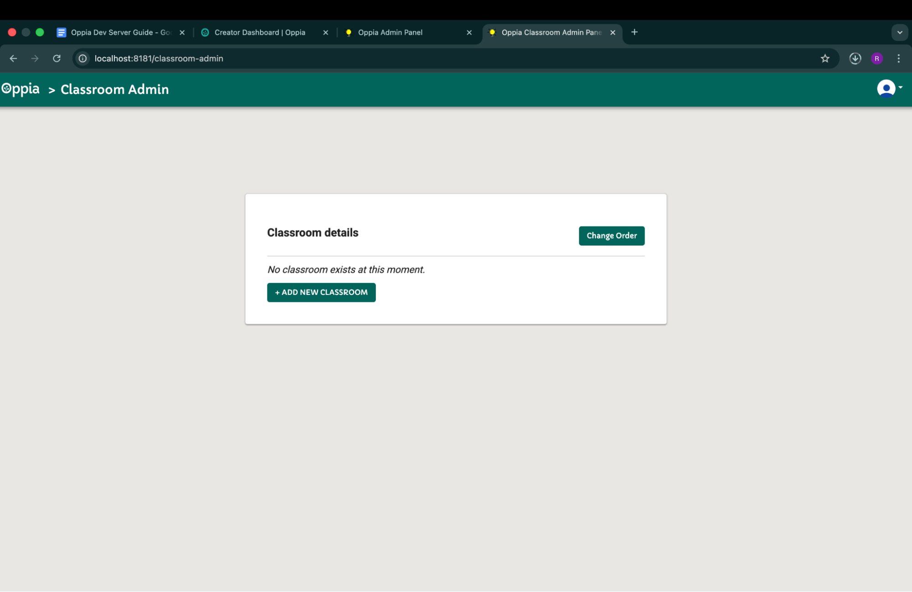

### Classroom Page

- **Description:**
Individual classroom landing page displaying all topics within that classroom, along with the classroom description and learning path.

- **Url:**
/learn/<classroom_url>

- **Permissions Required:**
None (Public)

**Steps to Access:**
  1. Navigate to /learn
  2. Click on a classroom card (e.g., "Math")

Example:
 http://localhost:8181/learn/math

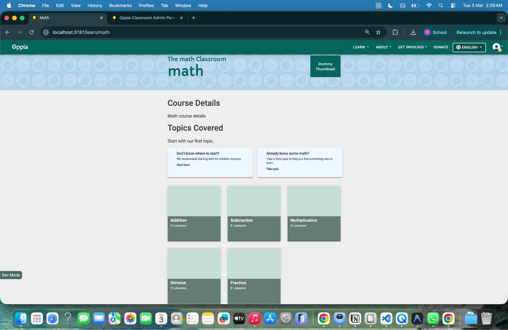

- To populate the Classroom Page: See [Creating a Classroom](#8-creating-a-classroom)

### Classrooms Page

- **Description:**
Landing page showing all available classrooms (Math, Science, etc.) that learners can explore.

- **Url:**
/learn

- **Permissions Required:**
None (Public)

**Steps to Access:**
  1. Click "Learn" in the navigation bar
  2. OR directly visit http://localhost:8181/learn

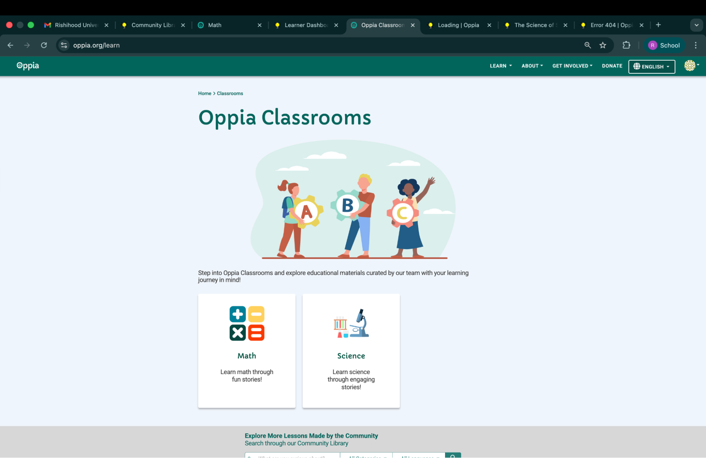

### Collection Editor Page

- **Description:**
This page allows creators to create and edit collections, which are ordered groups of explorations designed to guide learners through a learning path.

- **Url**: 
http://localhost:8181/collection_editor/create/<collection_id>

- **Permissions Required:**
Collection Editor 

**Steps to Access:**
  1. Log in to Oppia.
  2. Navigate to /creator-dashboard.
  3. Click Create New Collection.
  4. You will be redirected to the Collection Editor page.

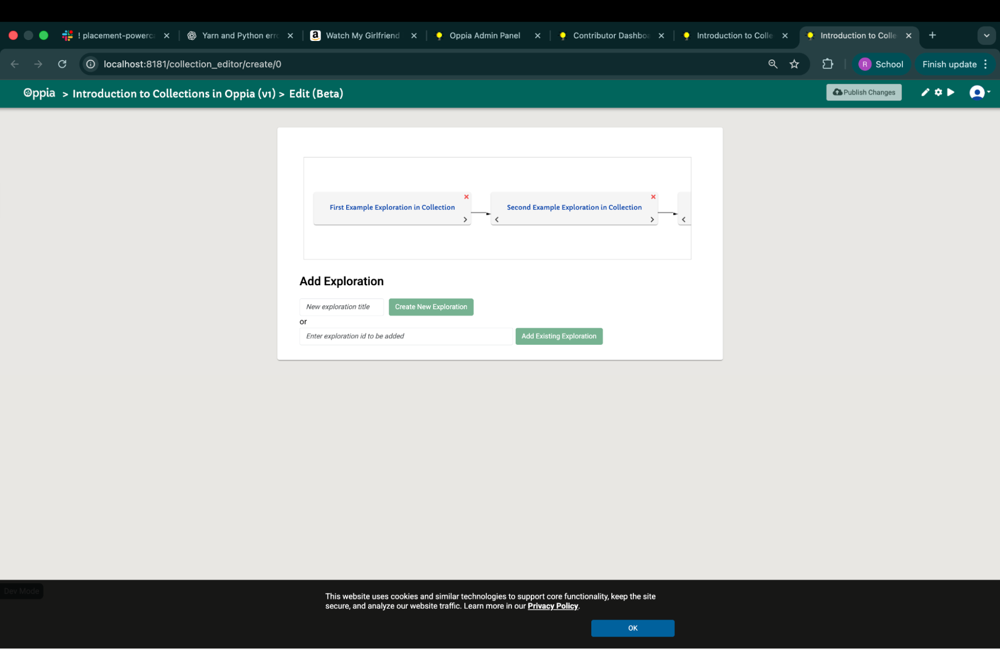

### Collection Player Page
- **Description:**
This page displays a learner-facing view of a collection, allowing learners to play explorations in sequence.

- **Url:**
http://localhost:8181/collection/<collection_id>

- **Permissions Required:**
Public (no login required)

**Steps to Access:**
  1. Ensure a collection is published.
  2. Navigate to /community-library.
  3. Search for the collection.
  4. Open the collection to start learning.

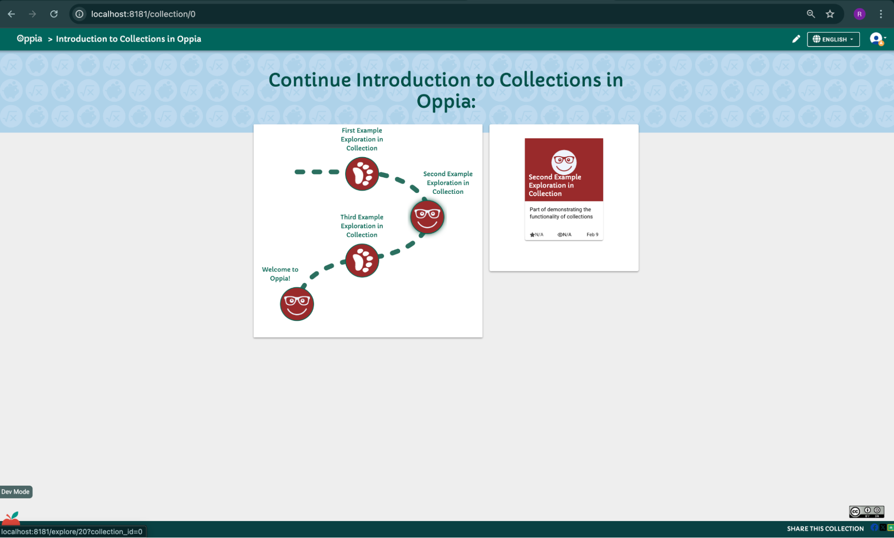

- Ways to Generate Collections: See [Creating Collections](#7-creating-collections).

### Community Library Page

- **Description:**
The Community Library allows users to browse, search, and filter explorations and collections available on Oppia.

- **Url:**
http://localhost:8181/community-library

- **Permissions Required:**
Public (no login required)

**Steps to Access:**
  1. Open Oppia in a browser.
  2. Navigate to /community-library.
  3. Use filters or search to find learning content.
   
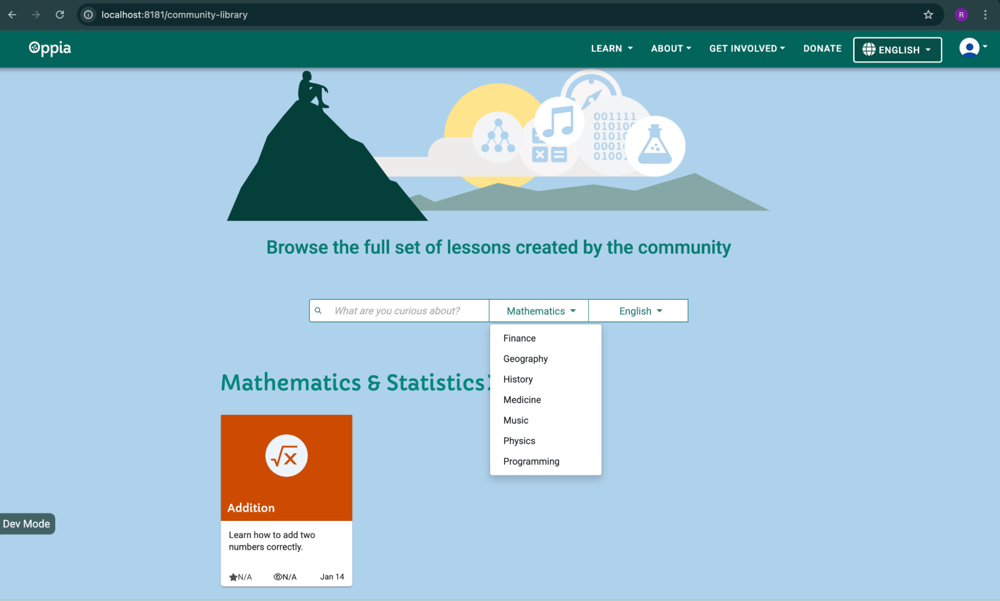

- To populate the Community Library Page: See [Community Library](#9-community-library)

### Contact Page

- **Description:** 
Contact Page allows to connect with the Oppia team,share your feedback, ask questions, and discover how to join our global community of contributors.

- **Url:** 
/contact

- **Permissions Required:** 
None

**Steps to Access:** 
  1. Click Get Involved in the navbar.
  2. Then click on Contact Us.

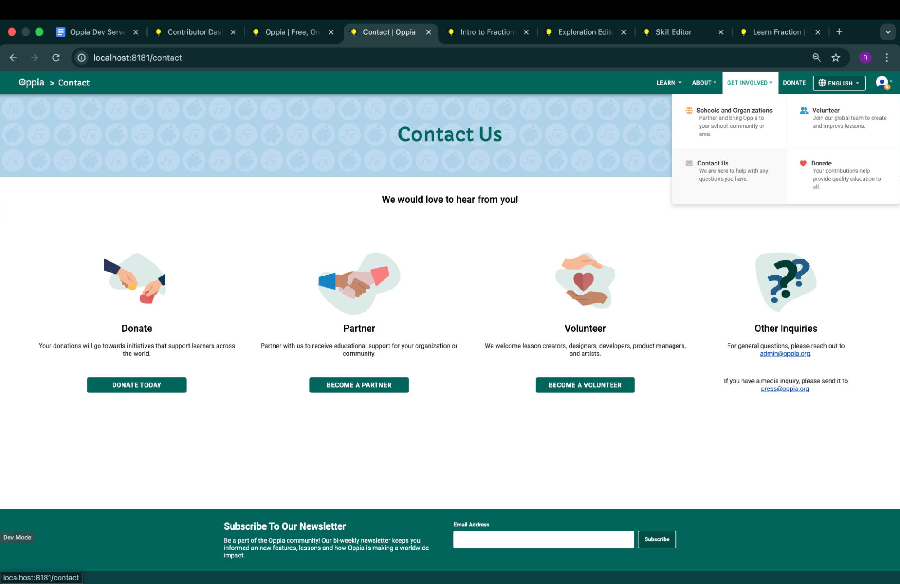

### Contributor Admin Dashboard Page

- **Description:**
This is used to manage community reviewer permissions. It allows administrators to grant or revoke question review and translation review rights to trusted contributors.

- **Url:**
http://localhost:8181/contributor-admin-dashboard

- **Permissions Required:**
Question Admin or Translation Admin.

**Steps to Access:**
  1. Assign yourself the Question Admin role/Translation Admin.
  2. Navigate to /contributor-admin-dashboard

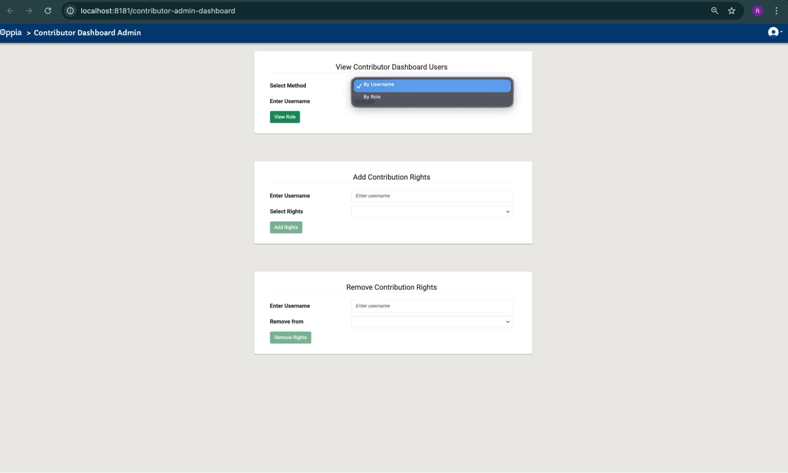

### Contributor Dashboard Page

- **Description:**
Allows contributors to submit translation suggestions and questions.

- **Url:**
http://localhost:8181/contributor-dashboard

- **Permissions Required:**
Logged-in users.

**Steps to Access:**
  1. Log in to Oppia.
  2. Navigate to /contributor-dashboard.

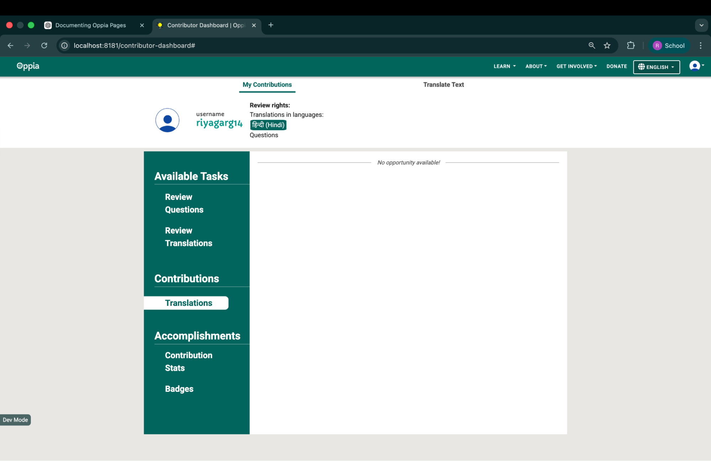

#### Important Contributor Dashboard Page Tabs

We have the following tabs on the Contributor Dashboard Page:

- [My Contributions Tab](#my-contributions-tab)
- [Translate Text Tab](#translate-text-tab)

#### **My Contributions Tab** 
This is your personal dashboard where you can track your history and impact. It is divided into three sections (visible in the side-nav):

1. **Accomplishments:** 
Displays your overall contribution Stats and any Badges you have earned for your work.
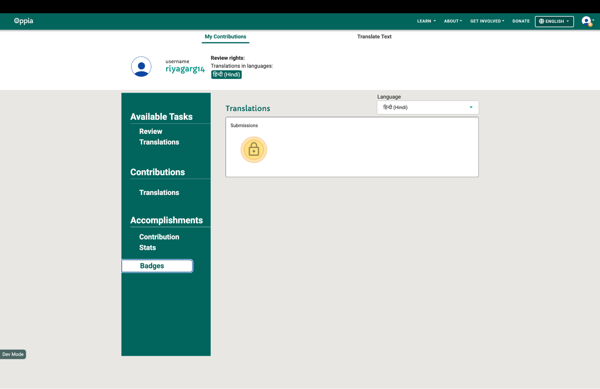

2. **Available Tasks:** 
If you have been granted "Reviewer" rights by an admin, this section shows you a list of other people's contributions that need your approval.                                   
- Question Review Rights
This permission allows users to review question suggestions submitted by other contributors.
- Translation Review Rights
This permission allows users to review translation suggestions in specific languages.    
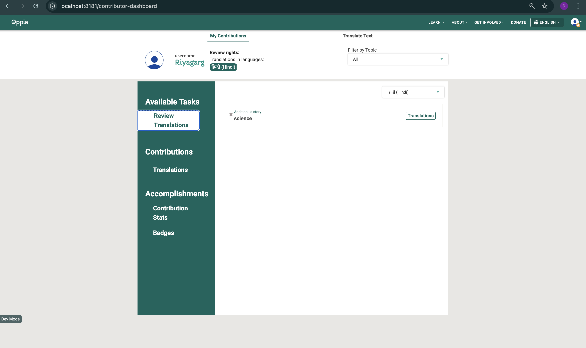

3. **Contributions:**
Shows the status of everything you have submitted (e.g., translations or 
questions). You can see if they are "Accepted," "Rejected," or "In Review."
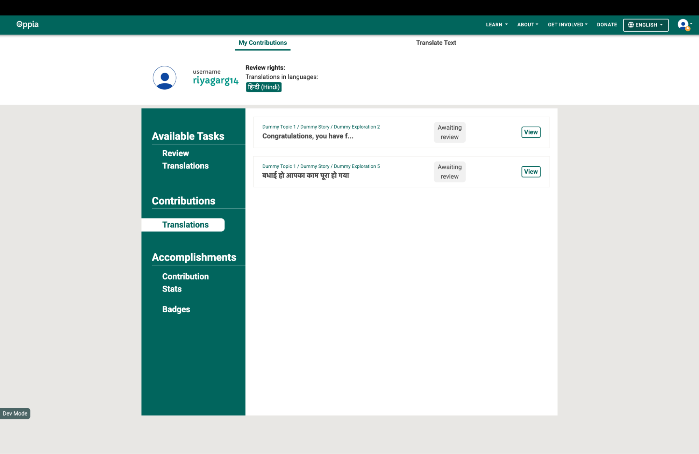

#### **⁠⁠Translate Text Tab**
This is where the actual work happens for translators.
It shows a list of Opportunities (lessons that need to be translated into your chosen language).
You can use the Language and Topic filters at the top to find specific lessons you want to work on.
Clicking Translate on any item will open the translation editor for that lesson.

Note: The "Available Tasks" section in the Contributor Dashboard becomes visible when a user has reviewer permissions. 
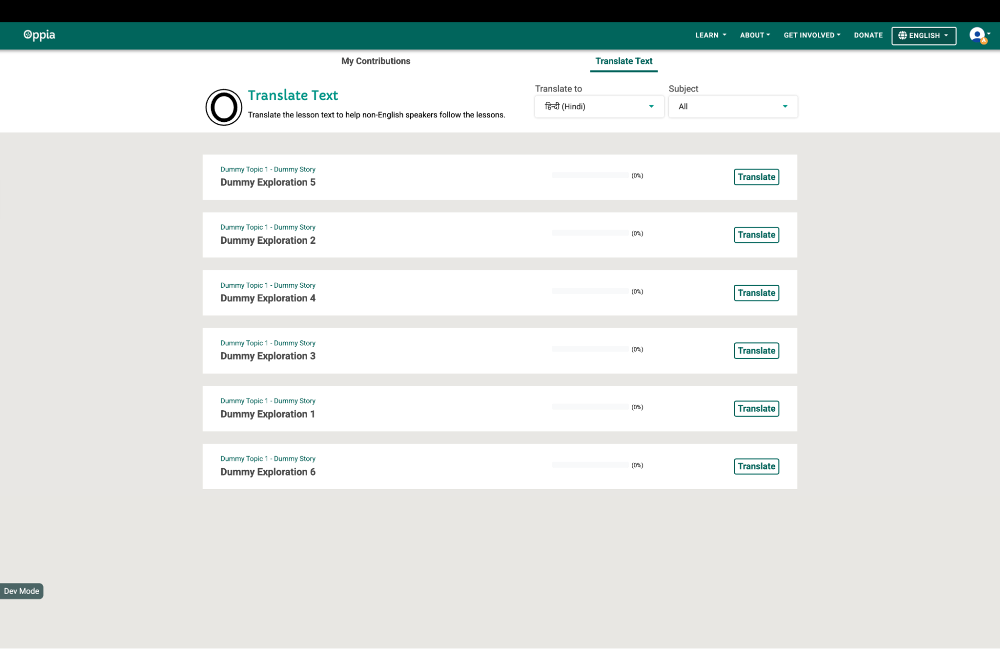

- Ways to Generate Contributions:
  See [Generating Data For Contributor Dashboard](#6-generating-data-for-contributor-dashboard).

### Create Learner Group Page

- **Description:**
Interface for facilitators to create a new learner group, add members, and assign lessons.

- **Url:**
/create-learner-group

- **Permissions Required:**
Logged-in users with the Full User role.

**Steps to Access:**
  1. Log in to Oppia
  2. Navigate to /facilitator-dashboard
  3. Click "Create Learner Group"
  4. OR directly visit http://localhost:8181/create-learner-group

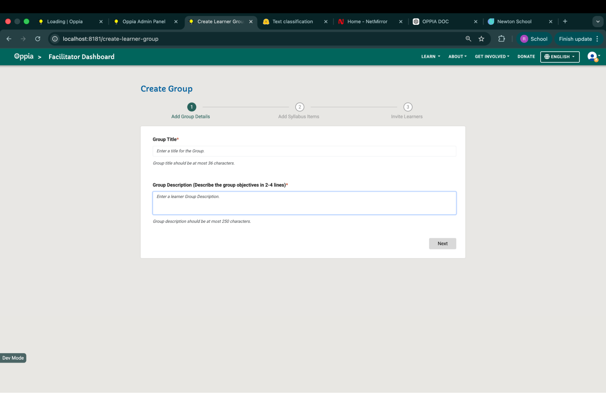

### Creator Dashboard Page

- **Description:**
This dashboard allows creators to manage explorations and collections they have created, including drafts and published content.

- **Url:**
http://localhost:8181/creator-dashboard

- **Permissions Required:**
Logged-in users

**Steps to Access:**
  1. Log in to Oppia.
  2. Navigate to /creator-dashboard.
      - Create, edit, or manage your explorations and collections.

 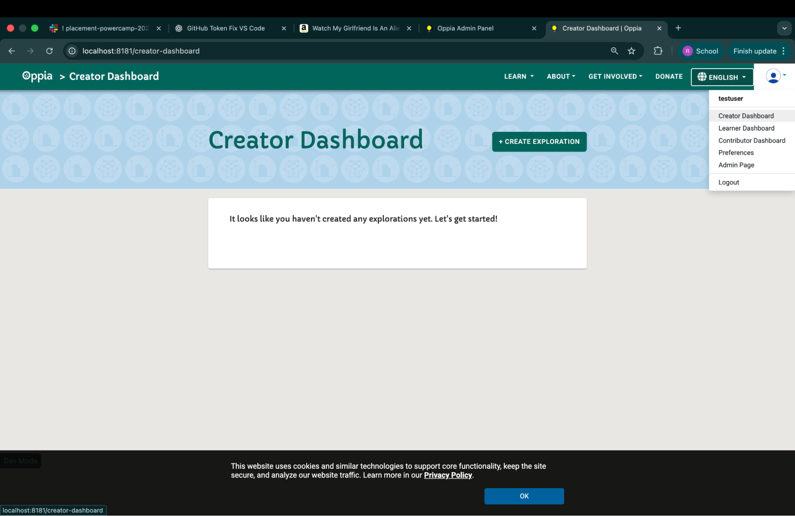

### Creator Guidelines Page

- **Description:** 
Provides instructions and best practices for participating in the community and creating explorations.

- **Url:** 
 /creator-guidelines

- **Permissions Required:** 
 None

**Steps to Access:** 
  1. Click Creator-guidelines in the footer.

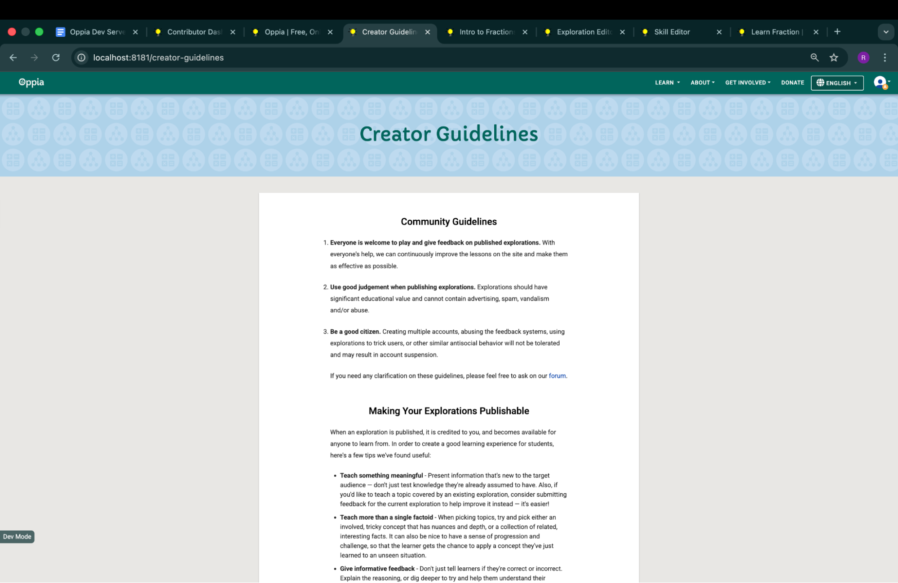

### Custom Error Pages

- **Description:**
Custom error pages for specific HTTP error codes (400, 401, 500, etc.) with helpful messages and recovery options.

- **Url:**
/error/<status_code>

- **Permissions Required:**
None (Public)

**Steps to Access:**
  1. These pages are automatically displayed when the corresponding error occurs
  2. For testing, visit http://localhost:8181/error/404 or /error/500

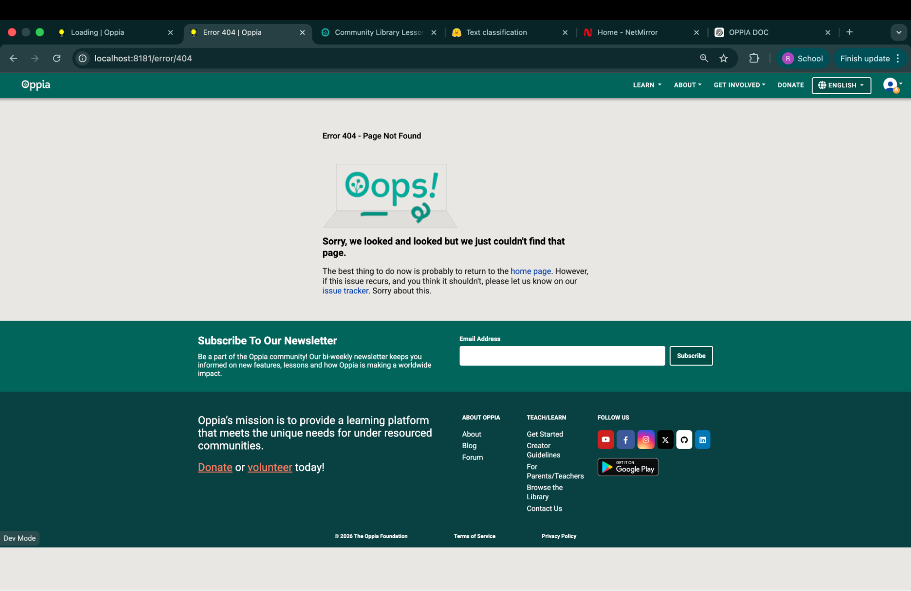

### Delete Account Page

- **Description:** 
This page allows signed-in learners to request deletion of their account.
In local development, the account may be deleted immediately. On production, the deletion request can be marked as pending and processed later.

- **Url:** 
http://localhost:8181/delete-account

- **Permissions Required:**
Learners must be signed in.

**Steps to Access:** 
  1. Log in to Oppia.
  2. Navigate to /preferences (Preferences page).
  3. On that page there is Delete button.
   
When the user clicks this button, they are taken to the Delete Account page, where they can confirm the deletion.
Follow the on-screen confirmation steps.

**Note**:
On local servers, deletion may happen immediately.
On production, deletion requests may remain pending.

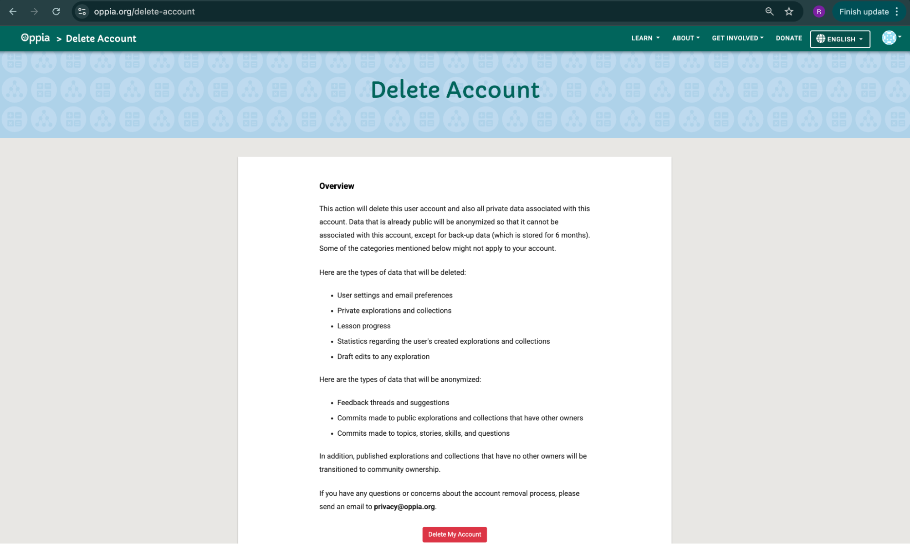

### Diagnostic Test Player Page

- **Description:** 
An interactive interface where learners take diagnostic tests to assess their knowledge of prerequisite skills before starting a topic. The test results determine which topics are recommended.

- **Url:**
/diagnostic-test-player?classroom=<classroom_url>

- **Permissions Required:**
None (Public route)

​​However, the Diagnostic Test will only function properly if:
- Diagnostic Test is enabled in the Classroom Admin page
- The topic is published
- Skills are assigned under the Diagnostic Tests section
- Each skill has at least 3 questions
- Topic is added to the classroom

If any of these are missing, the page may load but not behave correctly.

**Steps to Access:**
  1. Navigate to the classroom page.
  2. On the classroom page, click Take quiz.
   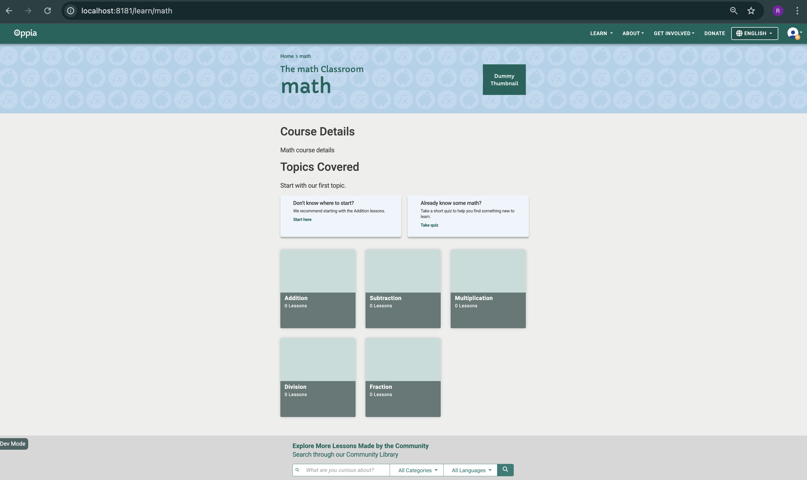
  3. The Diagnostic Test Player will open.
   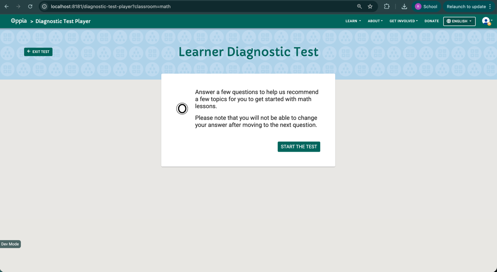

How to Enable Diagnostic Test
1. Go to /classroom-admin.
2. Click on the classroom tile (e.g., Math)
3. Click the pencil icon to enter Edit Mode
4. Scroll to Diagnostic Test Status
5. Toggle from Disabled → Public
6. Click Save
   
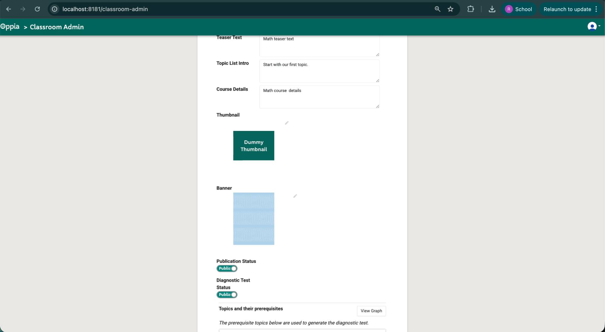

### Donate Page

- **Description:** 
Explains how community can support or align with Oppia Foundation's mission. 

- **Url:**   
/donate

- **Permissions Required:** 
None

**Steps to Access:** 
  1. Click Donate in the Navbar.

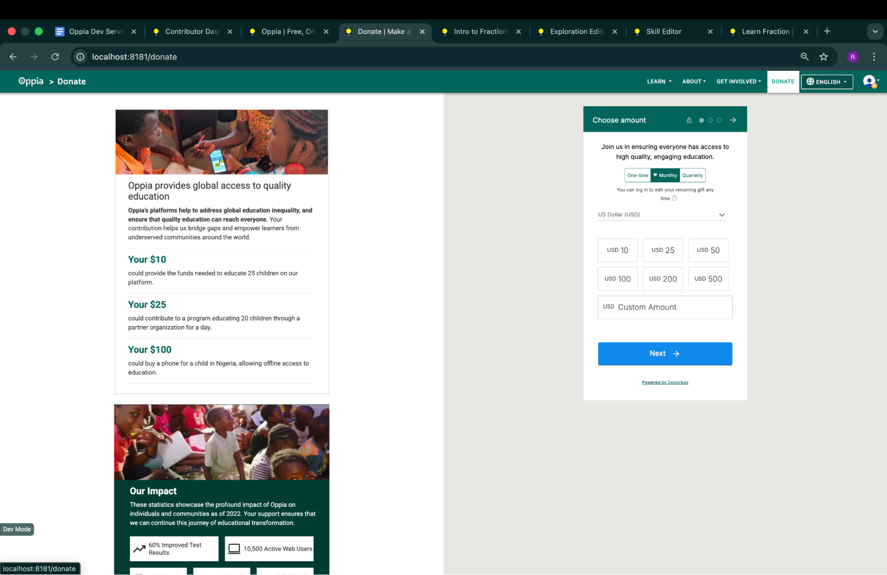

### Edit Learner Group Page

- **Description:**
Allows facilitators to edit learner group details, manage members, and update assigned lessons.

- **Url:**
/edit-learner-group/<group_id>

- **Permissions Required:**
The user must be the Facilitator of that specific group.

**Steps to Access:**
  1. Navigate to /facilitator-dashboard
  2. Click on a learner group
  3. Click "Edit Group"
   
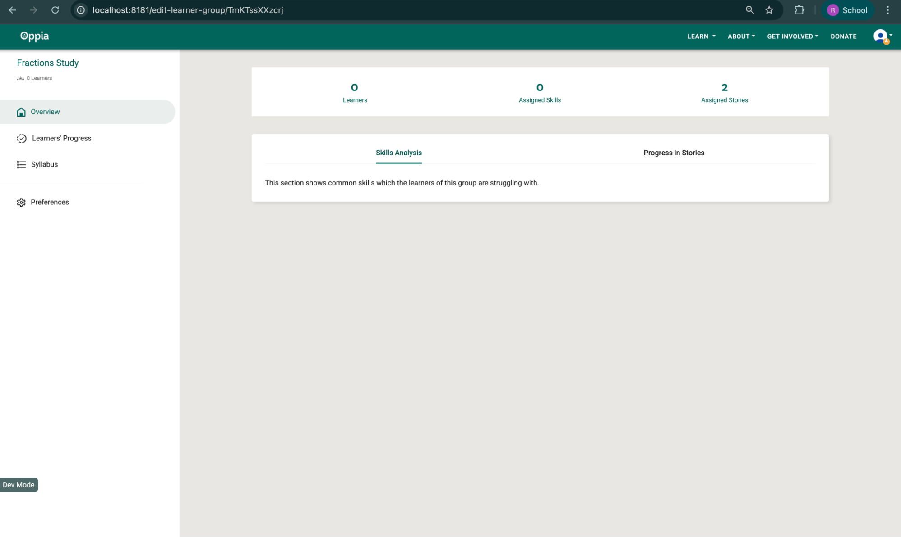 

#### Important Edit Learner Group Page Tabs

We have the following tabs on the Edit Learner Group Page:
- [Learners Progress Tab](#learners-progress-tab)
- [Overview Tab](#overview-tab)
- [Preferences Tab](#preferences-tab)
- [Syllabus Tab](#syllabus-tab)

#### Learners Progress Tab
Tracks individual learner progress. You can see:
 - Which stories each learner has completed
 - Which skills they've mastered or are struggling with
 - Overall completion percentages

   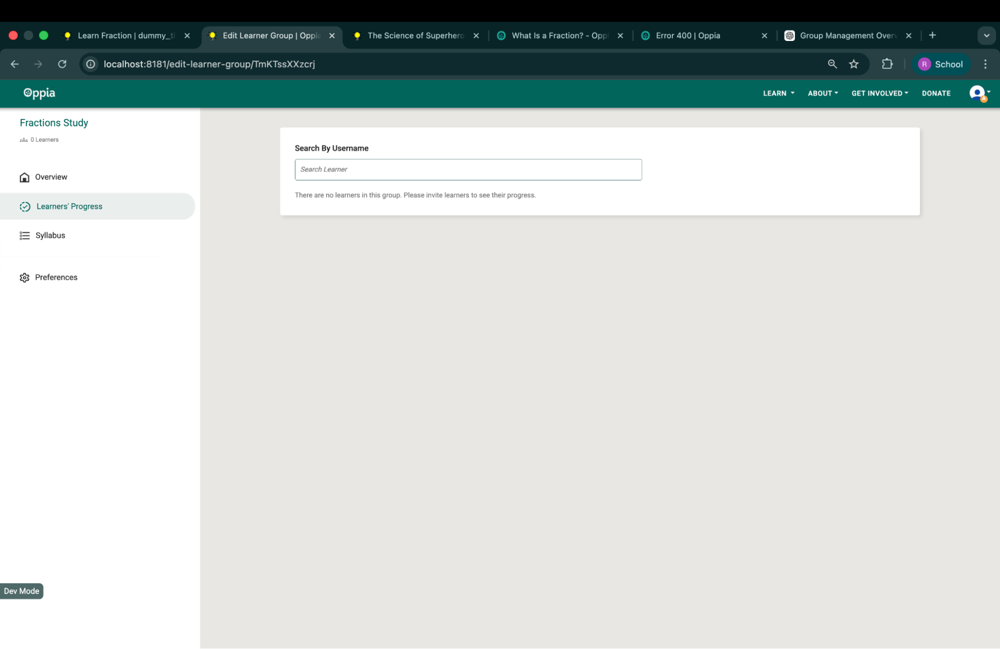

#### Overview Tab
Shows a high-level summary of the group with two sub-tabs:
      - Skills Analysis — Shows common skills that learners in this group are struggling with. Helps facilitators identify weak areas.
      - Progress in Stories — Shows how learners are progressing through the assigned stories/chapters.
        
#### Preferences Tab
Group settings including:
 - Edit the group title and description
 - Invite learners by username
 - Remove learners from the group
 - Delete the group entirely

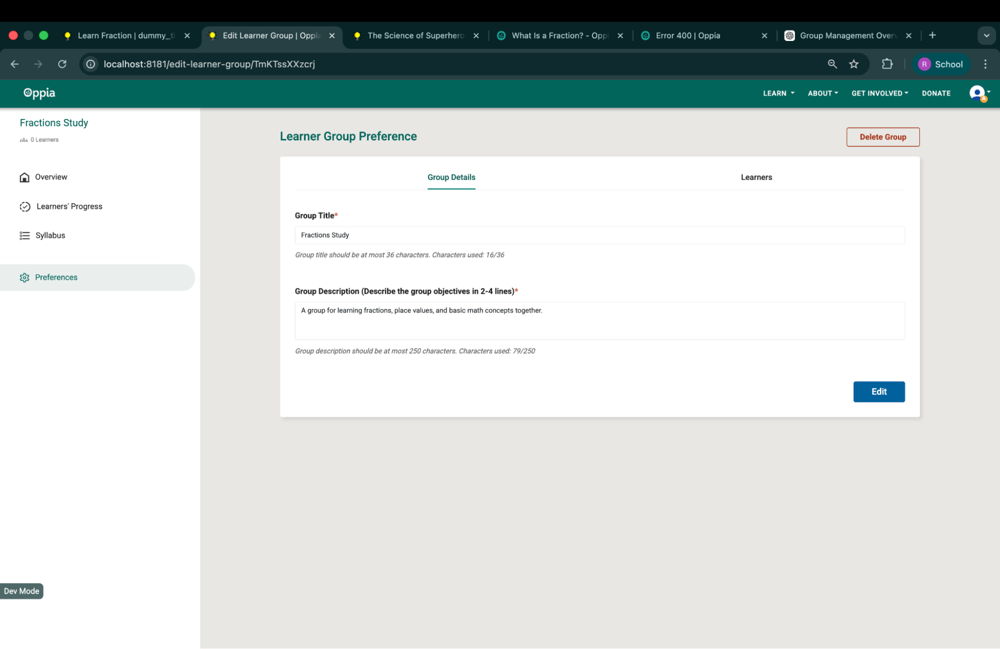

#### Syllabus Tab
Manage the group's learning content:
 - Add/remove stories — Assign stories from topics for learners to work through
 - Add/remove skills — Assign specific skills for practice

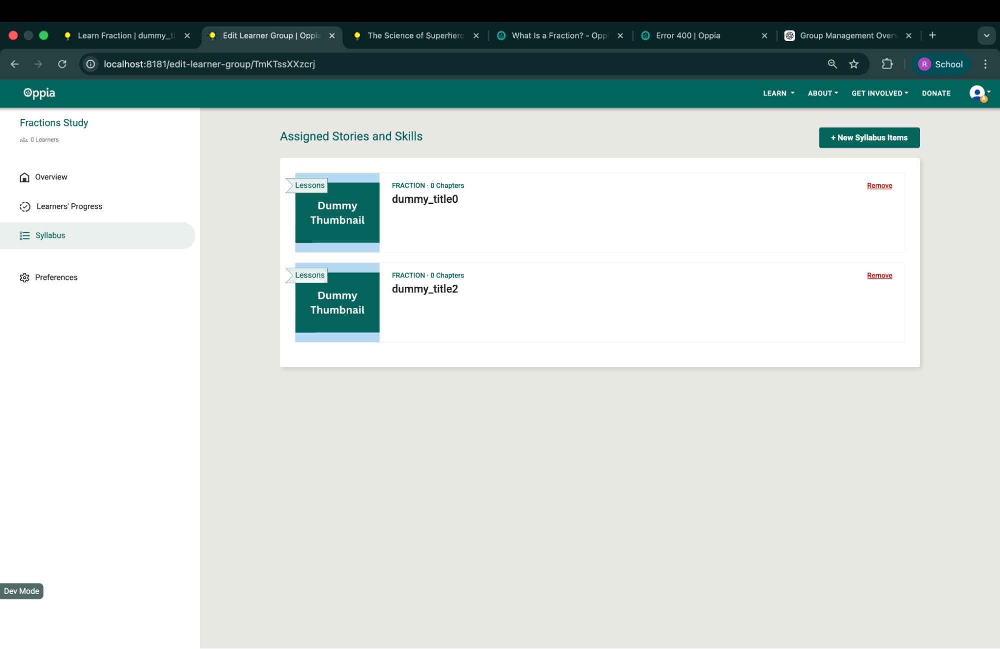

### Email Dashboard Page

- **Description:**
Interface for managing and sending bulk emails to specific user groups or the entire Oppia community.

- **Url:**
/emaildashboard

- **Permissions Required:**
Admin privileges

**Steps to Access:**
  1. Log in as a Super Admin
  2. Navigate to http://localhost:8181/emaildashboard

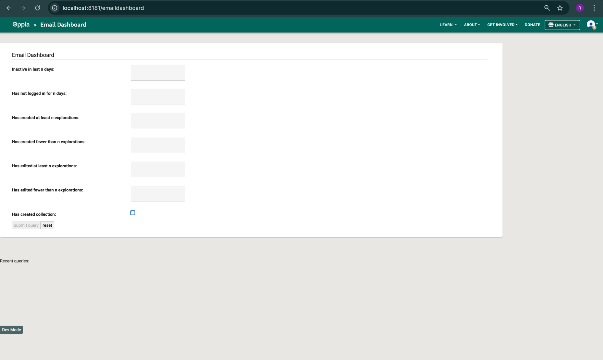

### Embedded Exploration Player Page

- **Description:**
A stripped-down version of the exploration player designed to be embedded in external websites via iframe.

- **Url:**
/embed/exploration/<exploration_id>

- **Permissions Required:**
None (Public)

**Steps to Access:**
  1. Directly visit http://localhost:8181/embed/exploration/<exploration_id>
  2. OR embed in an iframe:

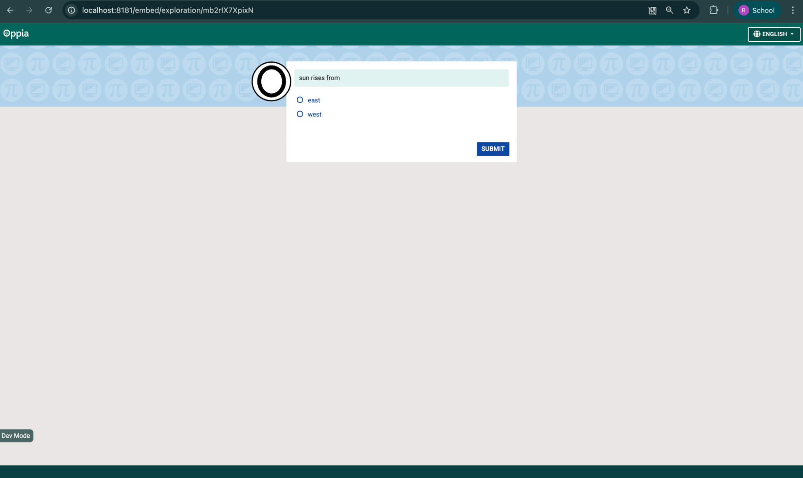

### Exploration Editor Page

- **Description:**
The exploration editor is where creators build interactive lessons. It includes a card-based interface for adding content, interactions, and feedback paths.

- **Url:**
/create/<exploration_id>

- **Permissions Required:**
Logged-in users (exploration owner or collaborators)

**Steps to Access:**
  1. Log in to Oppia
  2. Navigate to Creator Dashboard (/creator-dashboard)
  3. Click "Create Exploration"
  4. OR open an existing exploration from your dashboard

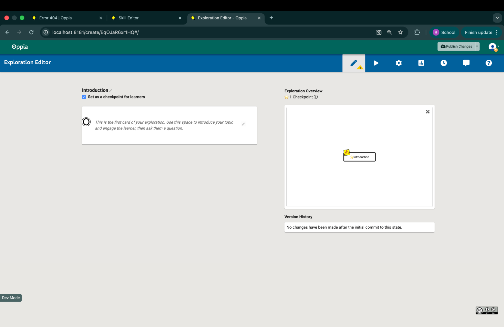

### Exploration Player Page

- **Description:**
The legacy exploration player interface for playing individual explorations (lessons).

- **Url:**
/explore/<exploration_id>

- **Permissions Required:**
None (Public)

**Steps to Access:**
  1. Find an exploration in the Community Library
  2. Click "Play" on the exploration
  3. OR directly visit http://localhost:8181/explore/<exploration_id>

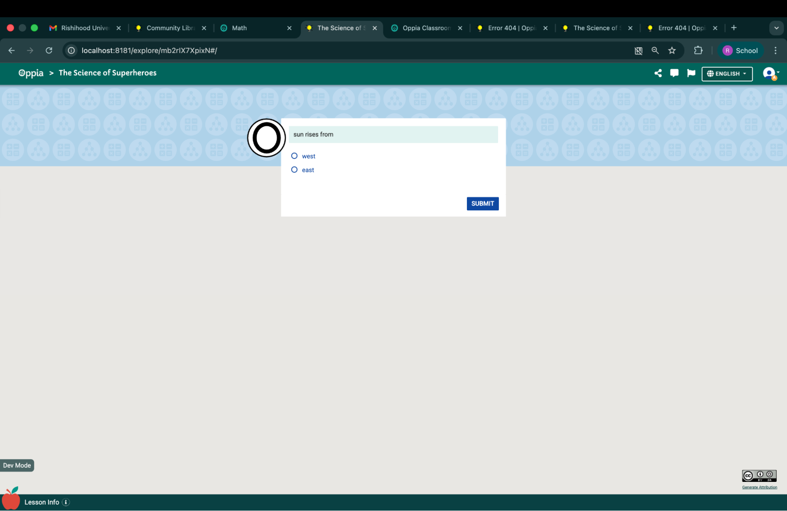

- To populate the Exploration Player Page: See [Creating Explorations](#2-creating-explorations) or reload demo explorations via [Admin Activities Tab](#1-admin-activities-tab-dummytest-data).

### Facilitator Dashboard Page

- **Description:**
A dashboard for classroom facilitators to manage learner groups, track student progress, and assign lessons.

- **Url:**
/facilitator-dashboard

- **Permissions Required:**
Logged-in users with Full User Role.

**Steps to Access:**
  1. Log in as a Super Admin, navigate to [Release Coordinator](#release-coordinator-page) -> Features tab, and enable the Learner Groups flag (internally learner_groups_are_enabled).
  2. Ensure your user account has the Full User role (assigned via the Admin -> Roles tab).
  3. Navigate to http://localhost:8181/facilitator-dashboard

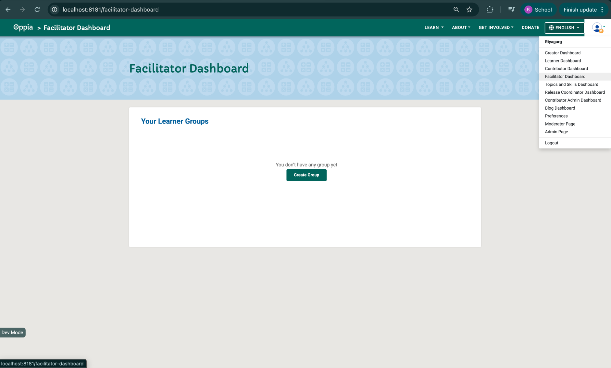

### Feedback Updates Page

- **Description:**
Displays all feedback threads from explorations that the user has participated in 
or subscribed to. Users can view conversation threads, read messages, and reply 
to feedback on explorations.

- **Url:**
/feedback-updates

- **Permissions Required:**
Logged-in users

**Steps to Access:**
  1. Log in to Oppia
  2. directly visit http://localhost:8181/feedback-updates

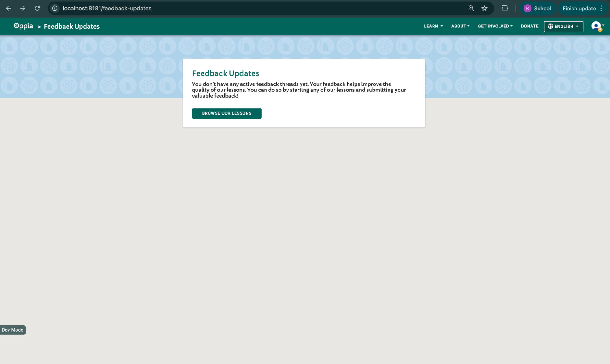

### Get Started Page

- **Description:** 
Provides guidance on how to begin using Oppia as a contributor.

- **Url:** 
/get-started

- **Permissions Required:** 
None

**Steps to Access:** 
  1. Click Get Started in the footer

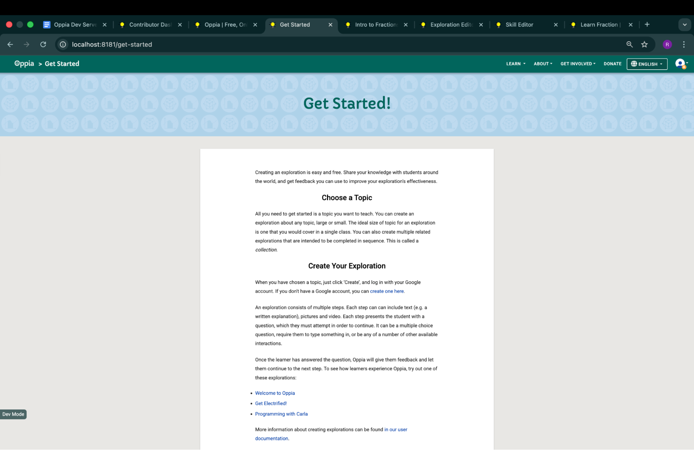


### Iframe Error Page

- **Description:**
A special error page designed to display within iframes without breaking the parent page.

- **Url:**
/error/iframed

- **Permissions Required:**
None (Public)

**Steps to Access:**
  1. This page is automatically shown when an error occurs within an embedded Oppia iframe
  2. OR directly visit http://localhost:8181/error/iframed

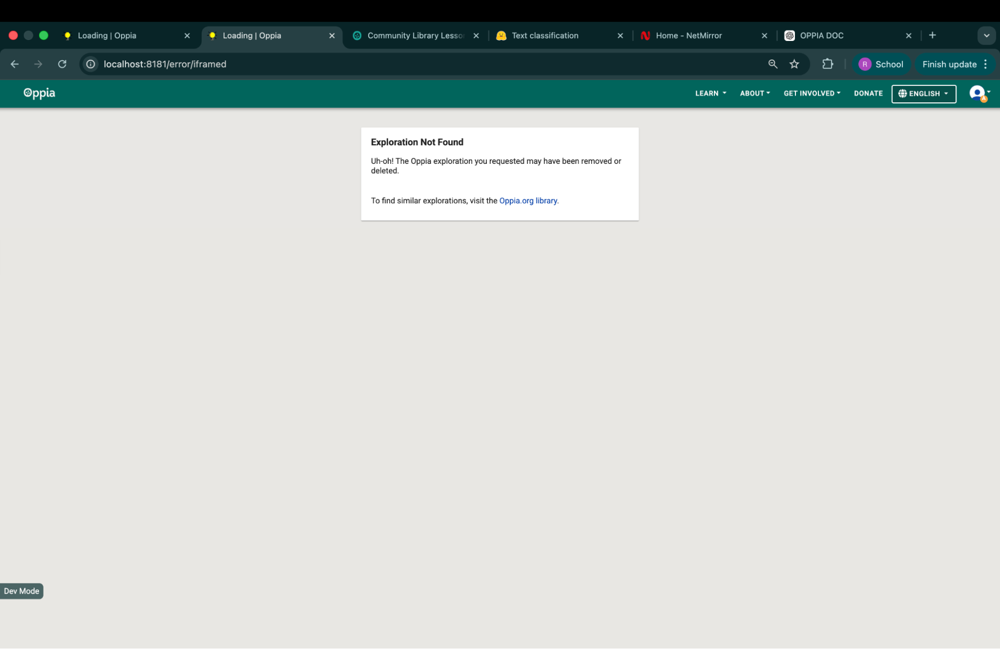

### Learner Dashboard Page

- **Description:**
The learner's personal homepage showing their learning progress, goals, ongoing lessons, recommended topics, and achievements.

- **Url:**
/learner-dashboard

- **Permissions Required:**
Logged-in users

**Steps to Access:**
  1. Log in to Oppia
  2. Click the Oppia logo or "Home" link
OR directly visit http://localhost:8181/learner-dashboard

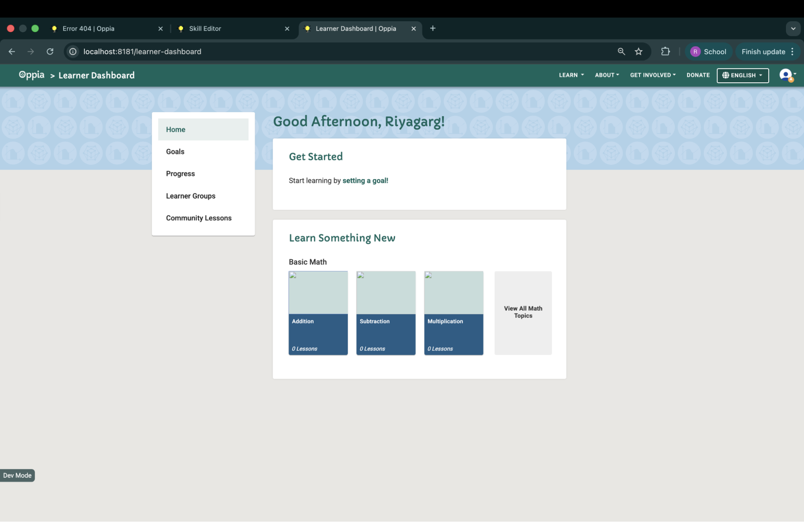

### License Page

- **Description:** 
Details the licenses under which Oppia’s content and software are released.

- **Url:** 
/license

- **Permissions Required:** 
None

**Steps to Access:** 
  1. Linked from the image receiver or audio uploader components during the creation process.

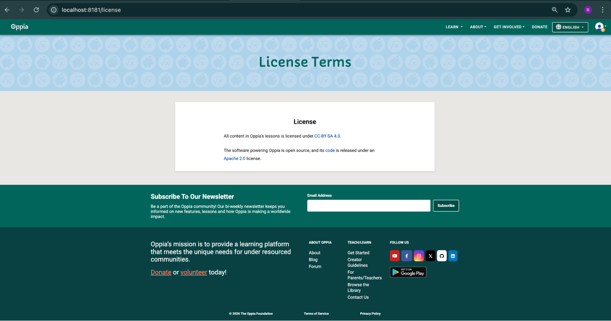

### Maintenance Page

- **Description:**
Displayed when Oppia is in maintenance mode. Shows a message that the site is temporarily unavailable.

- **Url:**
/maintenance

- **Permissions Required:**
None (Public)

**Steps to Access:**
  1. This page is automatically displayed when the server is in maintenance mode
  2. For testing, admins can start the server with python -m scripts.start --prod_env --maintenance_mode.
  3. OR directly visit http://localhost:8181/maintenance

**NOTE:** Maintenance mode only works with --prod_env flag. That's why the server is started with python -m scripts.start --prod_env --maintenance_mode.
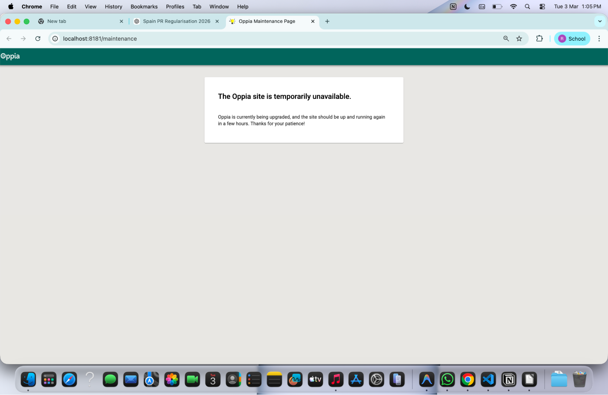

### Moderator Page

- **Description:**
Page for moderators to manage explorations and user feedback.

- **Url:** 
/moderator

- **Permissions Required:**
Moderator

**Steps to Access:** 
  1. Click Moderator Page in the side navigation bar.

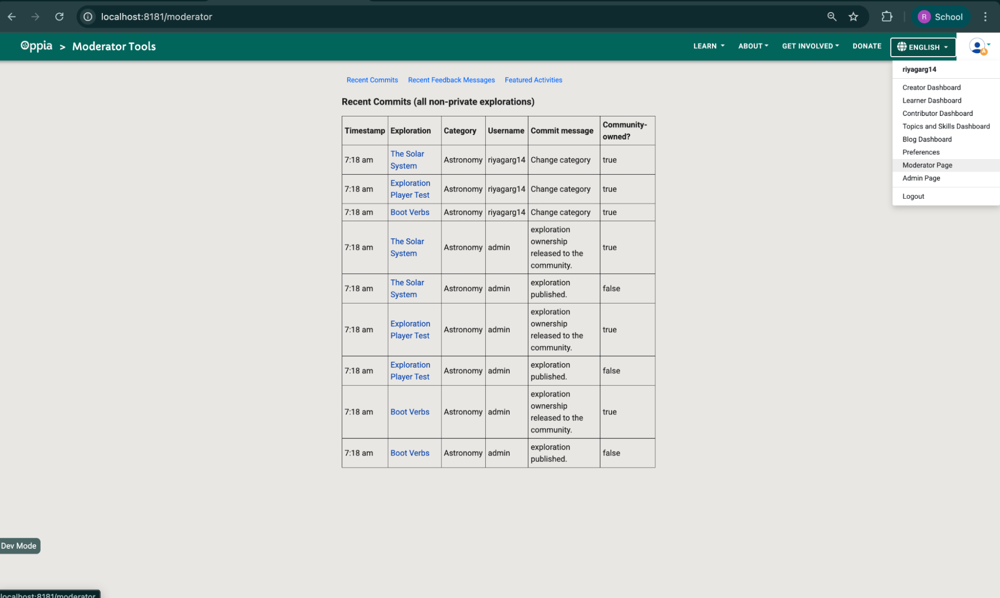

### New Lesson Player Page

- **Description:**
The modern lesson player interface with improved UX for playing explorations.

- **Url:**
/lesson/<exploration_id>

- **Permissions Required:**
Public (with authorization check)

**Steps to Access:**
  1. Go to [Release Coordinator](#release-coordinator) → Features tab
  2. Find new_lesson_player and set "Force-enable for all users" to Yes → Click **Save**
     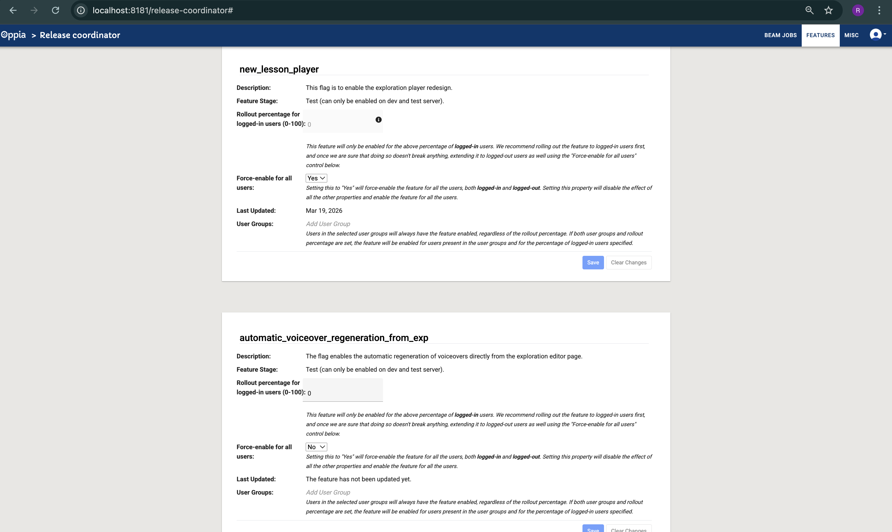
  3. Navigate through a classroom → topic → story → chapter
  4. Click on a chapter — it will now open in the New Lesson Player

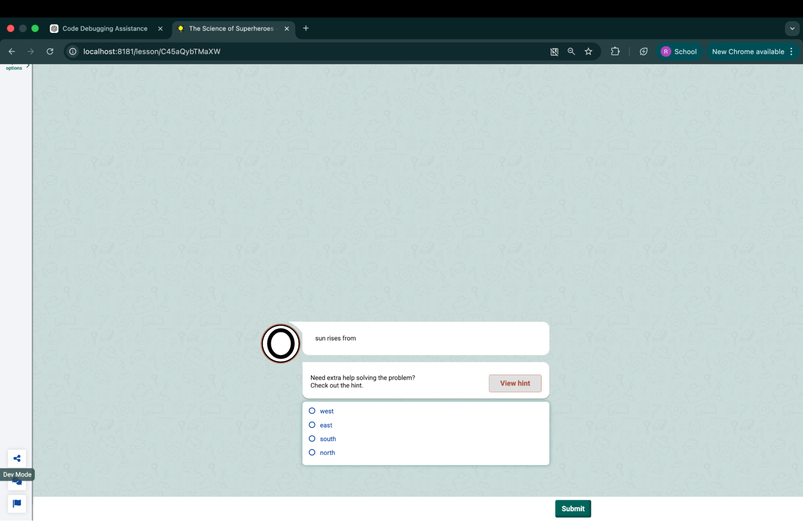

- To populate the New Lesson Player Page: Use [Load Dummy New Structures Data](#load-dummy-new-structures-data) or manually create a classroom with a topic, story, and chapters — see [Creating a Topic](#4-creating-a-topic), 
[Creating a Story](#5-creating-a-story), [Creating a Classroom](#8-creating-a-classroom), 
and [Creating an Exploration](#1-creating-an-exploration).

**NOTE:** This feature is currently in the development stage and has not been 
released to production yet. It is only available on local development servers.

### Partnerships Page

- **Description:** 
Provides information for organizations interested in partnering with Oppia to help students access education.

- **Url:** 
/partnerships

- **Permissions Required:** 
None

**Steps to Access:** 
  1. Click Get Involved in the navbar.
  2. Then click on the Schools and Organizations.
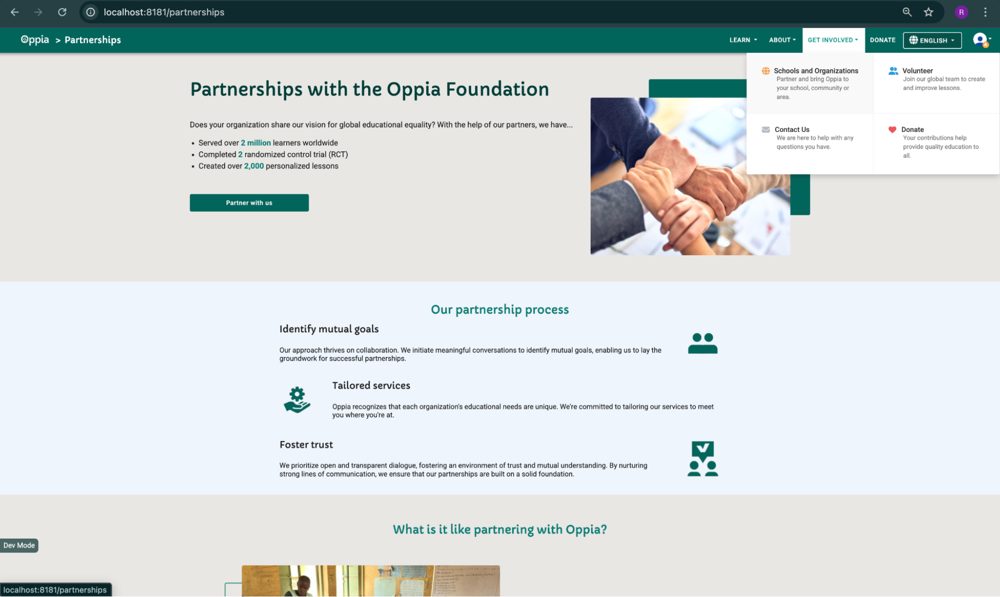

### Pending Account Deletion Page

- **Description:**
Displayed after a user requests account deletion. Shows the deletion status and estimated completion time.

- **Url:**
/pending-account-deletion

- **Permissions Required:**
None (Public - shown after deletion request)

**Steps to Access:**
  1. User is automatically redirected here after requesting account deletion
  2. OR directly visit http://localhost:8181/pending-account-deletion

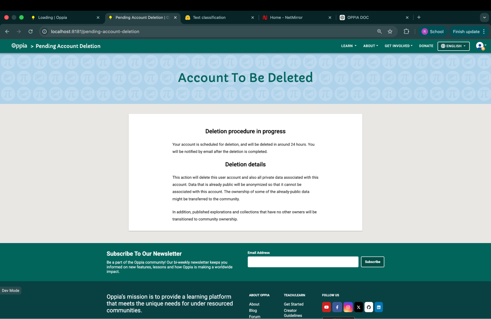

### Practice Session Page

- **Description:**
An interactive practice session where learners answer practice questions to reinforce their understanding of a topic's skills.

- **Url:**
/learn/<classroom_url>/<topic_url>/practice/session?selected_subtopic_ids=[<id>]

- **Permissions Required:**
None (Public)

**Steps to Access:**
  1. Navigate to /learn/<classroom_url>/<topic_url>/story (Topic Viewer page)
  2. Go to Practice Tab
  3. Select skills you want to practice.
  4. Click "Start"
  5. Answer questions related to the topic

Example:
http://localhost:8181/learn/math/add/practice/session?selected_subtopic_ids=%5B1%5D

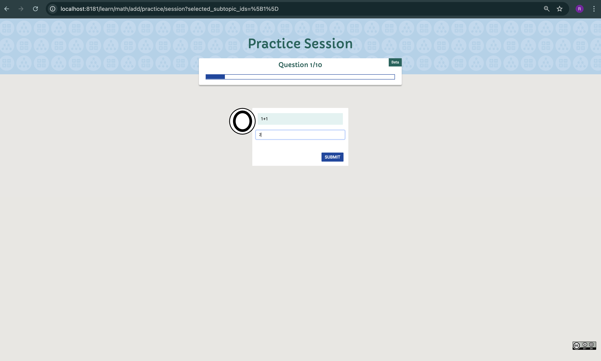

- To populate the Practice Session Page: Create a topic with skills that have at least 10 questions each. Then enable "Show Practice Tab to learners" in the [Topic Editor](#topic-editor-page). See [Creating a Skill](#3-creating-a-skill) and [Creating a Topic](#4-creating-a-topic).

### Preferences Page

- **Description:** This page allows learners to change their settings on Oppia, such as language preference and email preferences.

- **Url:** http://localhost:8181/preferences

- **Permissions Required:** No special permissions. Any signed-in learner can access it.

**Steps to Access:**
  1. Log in to Oppia.
  2. Open the top-right profile menu
  3. Click Preferences.

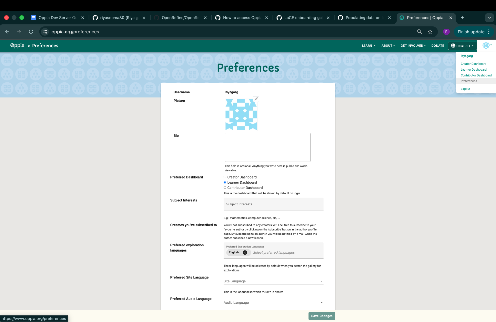

### Privacy Policy Page

- **Description:** 
Explains how Oppia collects, uses, and protects user data.

- **Url:** 
/privacy-policy

- **Permissions Required:** 
None

**Steps to Access:** 
  1. Click Privacy Policy in the footer.

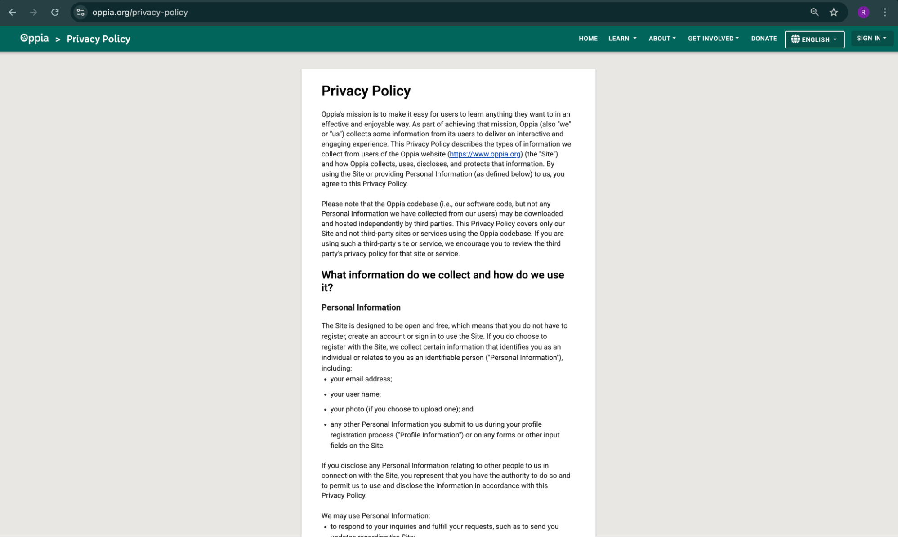

### Profile Page

- **Description:** 
This page displays a learner’s profile. It shows their username, bio, badges, and created lessons.

- **Url:** 
http://localhost:8181/profile/<username>

- **Permissions Required:** 
No special permissions. Public profiles are viewable by anyone.

**Steps to Access:** 
  1. Log in to Oppia
  2. Click your username in the top-right menu

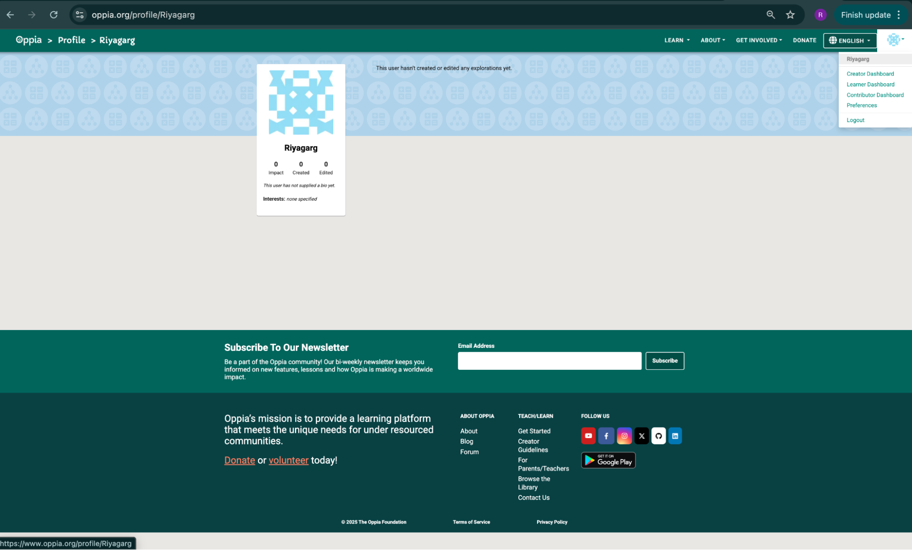

### Release Coordinator Page

- **Description:**
This page helps admins manage important release-related tasks in Oppia.
It is used to clear caches, manage features, and make sure everything works properly after new changes. Admins mostly use it during development, testing, and when releasing updates.

- **Url:**
http://localhost:8181/release-coordinator

- **Permissions Required:**
Release Coordinator role

**Steps to Access:**
  1. Log in as a Super Admin.
  2. Assign yourself the Release Coordinator role via Admin → Roles.
  3. Navigate to /release-coordinator.
  4. Use tools such as Flush Cache under the Misc tab.

#### Important Release Coordinator Page Tabs

We have the following tabs on the Release Coordinator Page:

- [Beam Jobs Tab](#beam-jobs-tab)
- [Features Tab](#features-tab)
- [Misc Tab](#misc-tab)

#### **Beam Jobs Tab**
It is used to start and monitor background jobs.
These jobs run long tasks like:
- Data migrations
- Batch updates
- Cleanup tasks           

It shows job status such as:
- Running
- Completed
- Failed
Example:
 Run a migration job after changing the database structure.

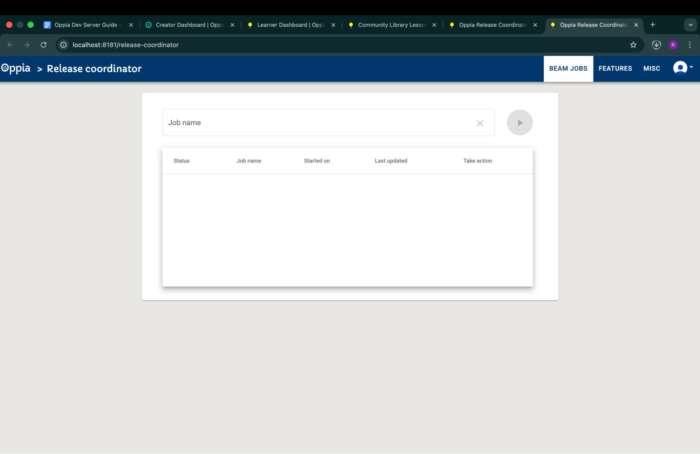

#### **Features Tab**
It is used to enable, disable, and control feature flags.
It helps roll out new features gradually using:
- rollout percentage
- user groups
- force-enable options
It prevents breaking the site by testing features on limited users first

Example:
 Enable a new UI feature only for 10% of users before full release.

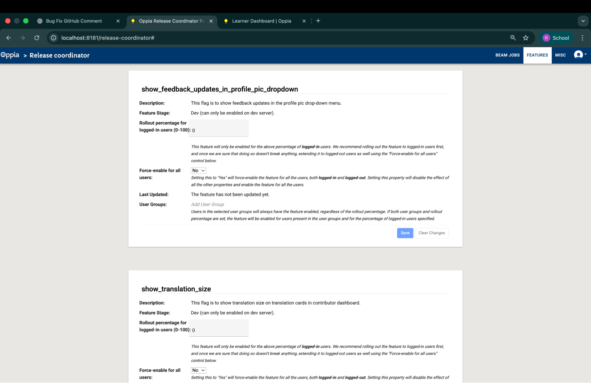

#### **Misc Tab**
   
It contains release utility tools
It is used mainly for maintenance and debugging
Includes:
- Flush Memory Cache – clears cached data so new changes take effect
- Get Memory Cache Profile – shows what data is stored in cache
- Promo Bar controls – display site-wide announcements
- Manage User Groups – create groups used by feature flags

Example:
 Flush cache when local server shows outdated data.

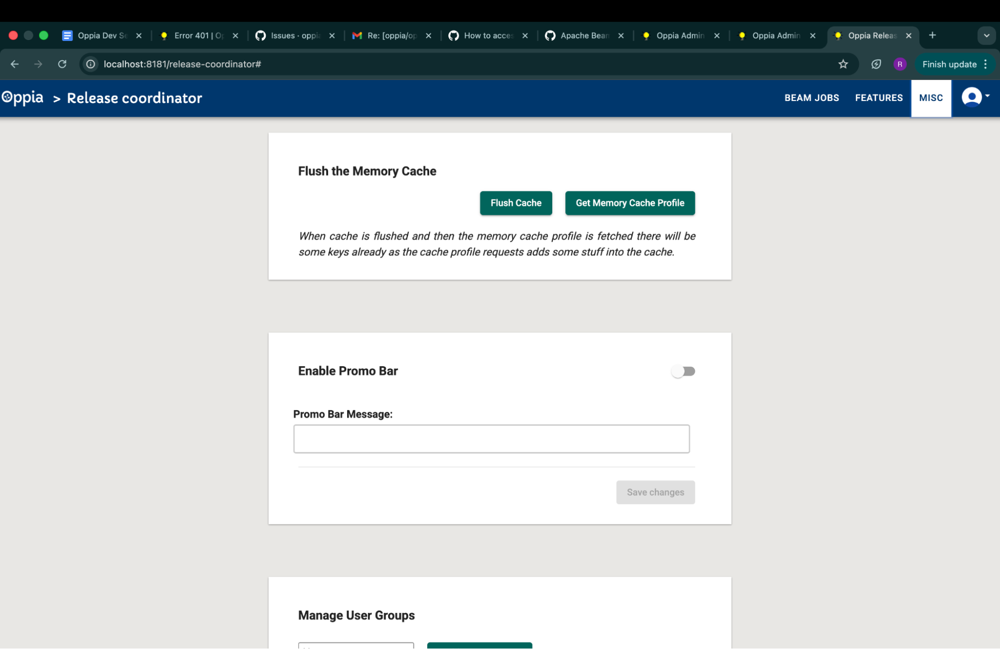

### Review Test Page

- **Description:**
A test that learners can take after completing a story to review what they've learned.

- **Url:**
/learn/<classroom_url>/<topic_url>/review-test/<story_url>

- **Permissions Required:**
None (Public)

**Steps to Access:**
  1. Complete a story
  2. Click "Take Review Test" at the end of the story
  3. The review test player will load

Example:
http://localhost:8181/learn/math/fractions/review-test/introduction-to-fractions

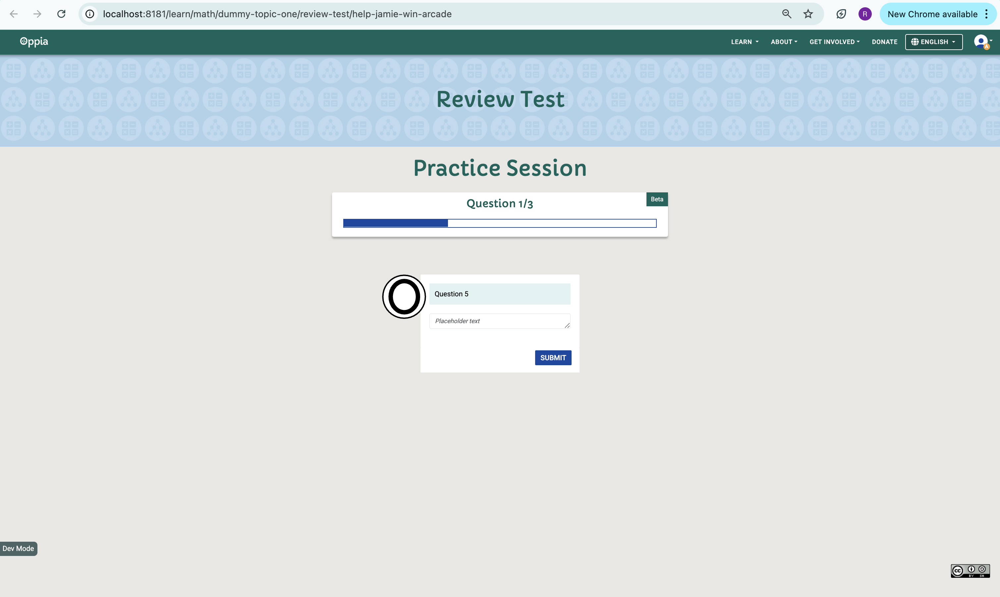

How to Enable Review Test Page
1. Navigate to http://localhost:8181/release-coordinator -> Features Tab
 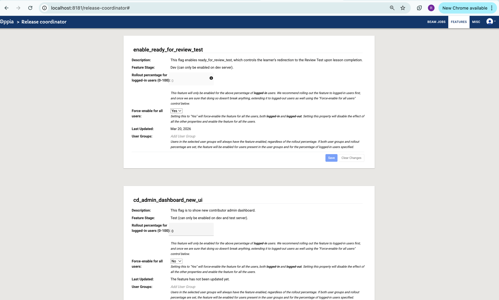
2. Find EnableReadyForReviewTest and enable it.
3. Click Save

-To populate Review Test Page: See [Review Test Page](#12-review-test-page)

### Signup Page

- **Description:**
Account creation page where new users can register for an Oppia account.

- **Url:**
/signup

- **Permissions Required:**
None (Public)

**Steps to Access:**
  1. Click "Sign In" button
  2. On the login page, enter a new email address
  3. Complete the signup flow (username selection, terms acceptance)

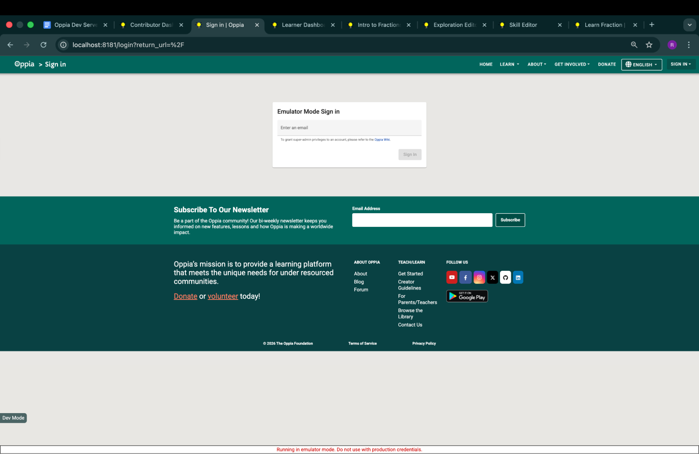

### Skill Editor Page
- **Description:** 
The skill editor allows the creation of skills in Oppia. You can access the Skills editor under the skills tab of topics-and-skills-dashboard page.

- **Url:**
http://localhost:8181/skill_editor/<skill_id>

- **Permissions Required:**
Curriculum Admin role.

**Steps to Access:**
  1. Open the Topics & Skills Dashboard.
  2. Click the Topic in which you want to add skills.
  3. Go to the ADD SKILL .
   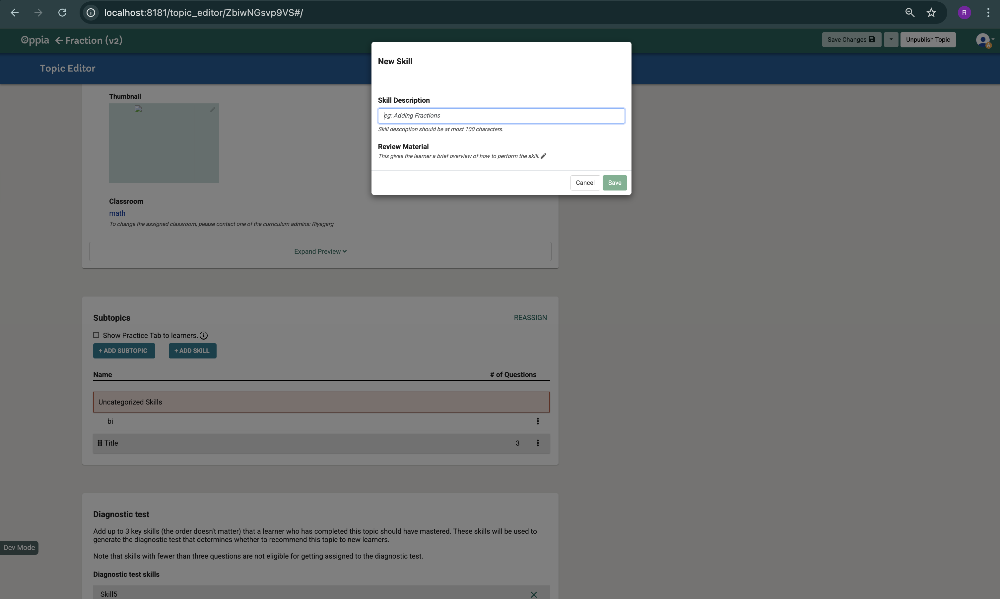
  4. New Skill modal will pop up.
  5. Once you click on Save button of the modal,a new tab will be opened.
  6. That will be Skill Editor page.
   
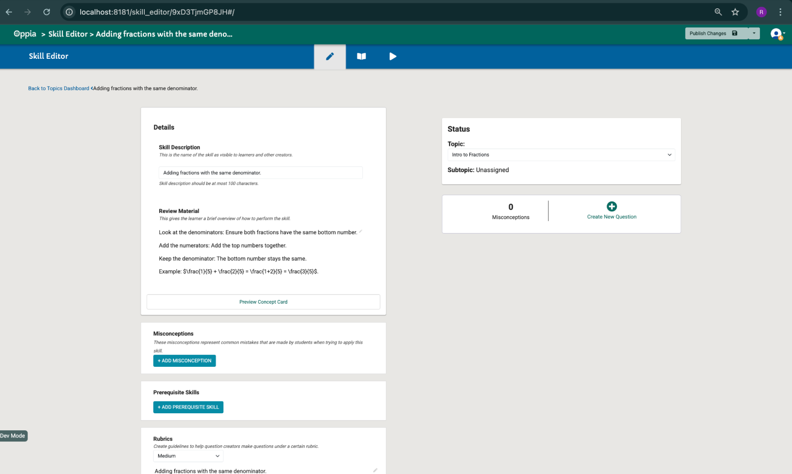

### Story Editor Page

- **Description:**
This allows the user to create stories in Oppia.

- **Url:**
http://localhost:8181/story_editor/<story_id>

- **Permissions Required:**
Curriculum Admin role

**Steps to Access:** 
  1. Navigate to /topics-and-skills-dashboard.
  2. [Create a topic](#4-creating-a-topic).
  3. Go to the [topic editor](#topic-editor-page) and click on the add story button.
   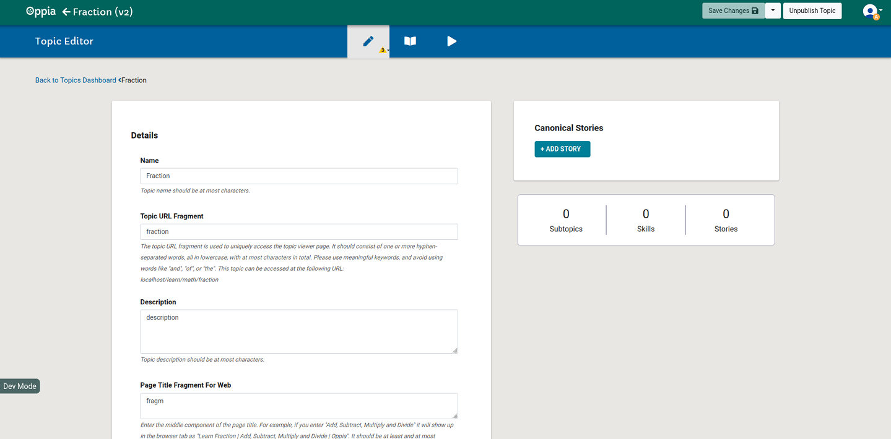
  4. Complete the “New story” modal and wait for the story editor page to load.

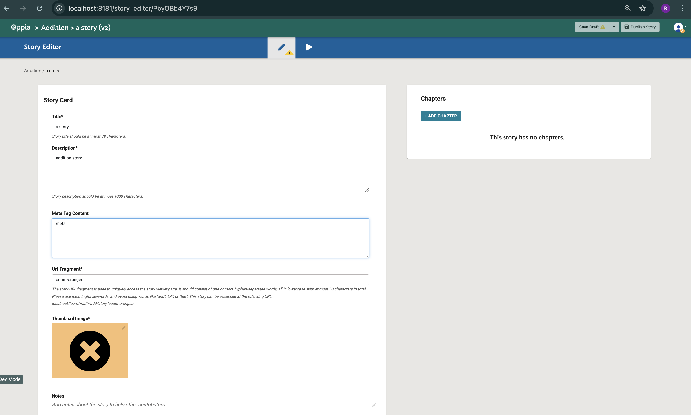

### Story Player Page

- **Description:** 
Displays the learner-facing view of a story and its chapters.

- **Url:**
/learn/<classroom_url_fragment>/<topic_url_fragment>/story/<story_url_fragment>

- **Permissions Required:**
Public (no login required)

**Steps to Access:**
  1. Navigate to /learn (Classrooms Page).
  2. Click on a Classroom (for example, "Math").
  3. Click on a Topic (for example, "Multiplication").
  4. Click "Continue" on a Story.
  5. The Story Player page opens.
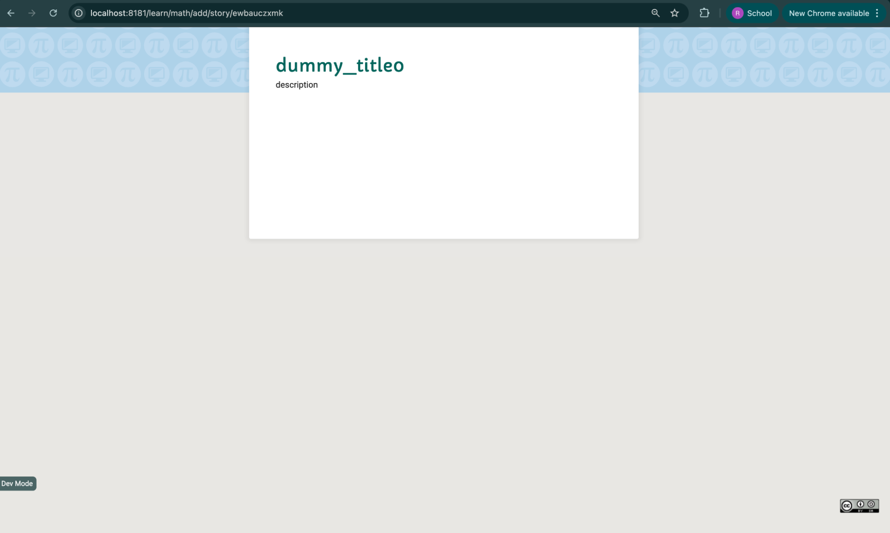

- To populate the Story Player Page it needs a published topic in a classroom, with a story that has chapters linked to published explorations: See [Story Player](#11-story-player)
 

### Study Guide Page

- **Description:**
Displays detailed study materials, explanations, and worked examples for a specific subtopic.

- **Url:**
/learn/:classroom_url_fragment/:topic_url_fragment/studyguide/:subtopic_url_fragment

- **Permissions Required:**
None (Public)

**Steps to Access:**
  1. Navigate to /learn/<classroom_url>/<topic_url>/story (Topic Viewer page)
  2. Click on a subtopic from the list
  3. The study guide for that subtopic will load

Example:
 http://localhost:8181/learn/math/fractions/studyguide

 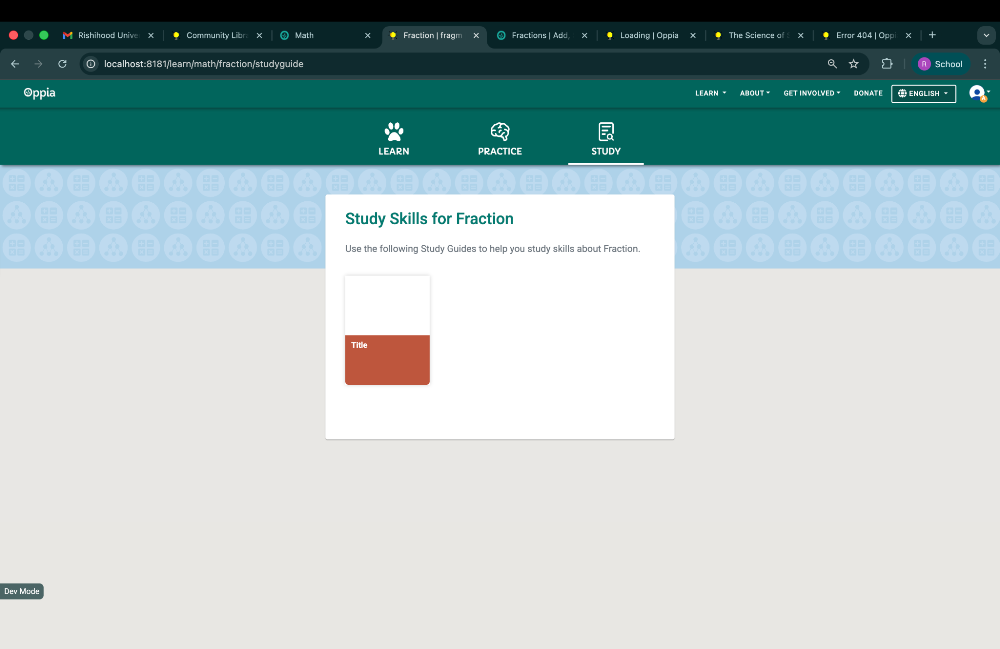

- To populate the Study Guide Page it needs a published topic in a classroom, with a subtopic that has content, a thumbnail, and skills assigned.
  : See [Creating a Topic](#4-creating-a-topic) OR [Load Dummy New Structures Data](#load-dummy-new-structures-data)
  
### Teach Page

- **Description:** 
Provides resources and guidance for teachers who want to use Oppia in their classrooms or create educational content.

- **Url:** 
/teach

- **Permissions Required:** 
None

**Steps to Access:** 
  1. Click For Parents/Teachers in the footer.
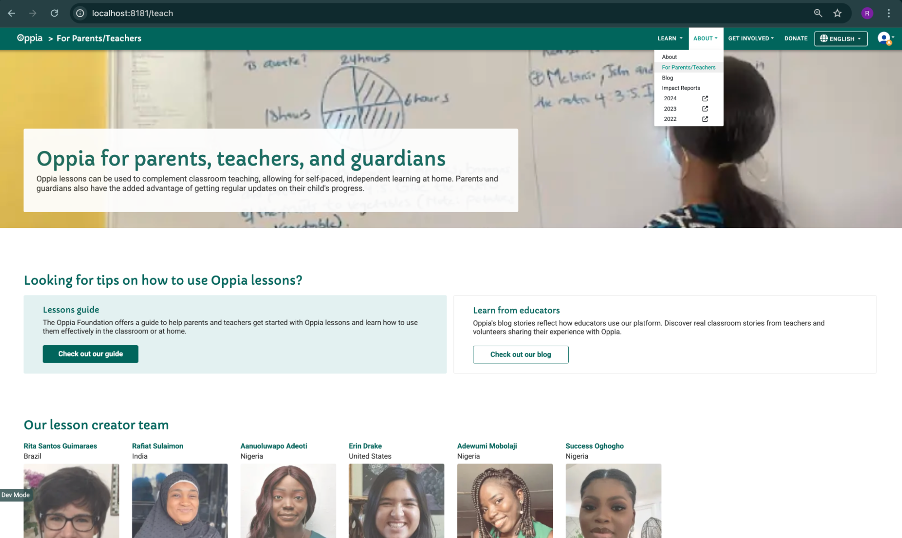

### Terms of Use Page

- **Description:** 
Defines the legal terms and conditions for using the Oppia platform.

- **Url:**
/terms

- **Permissions Required:** 
None

**Steps to Access:** 
  1. Click Terms of Service in the footer.

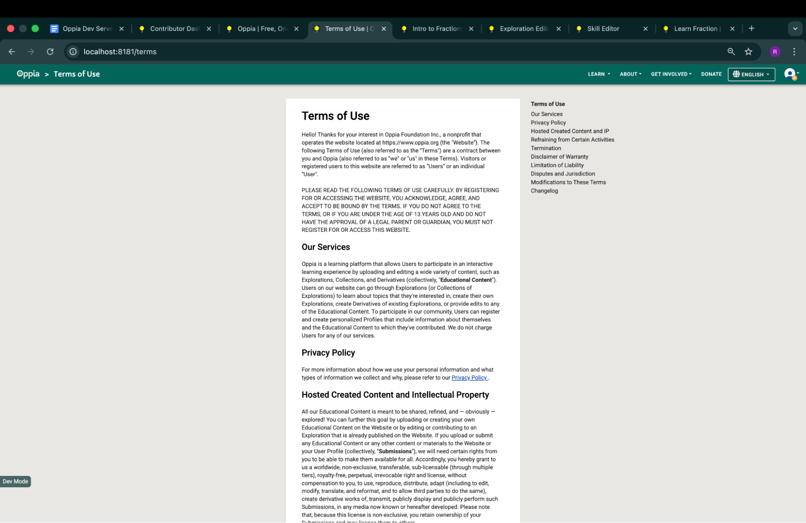

### Thank You Page

- **Description:** 
Confirmation page displayed after a successful donation.

- **Url:**
/thanks

- **Permissions Required:** 
None

**Steps to Access:** 
  1. Users are redirected automatically after completing a donation.

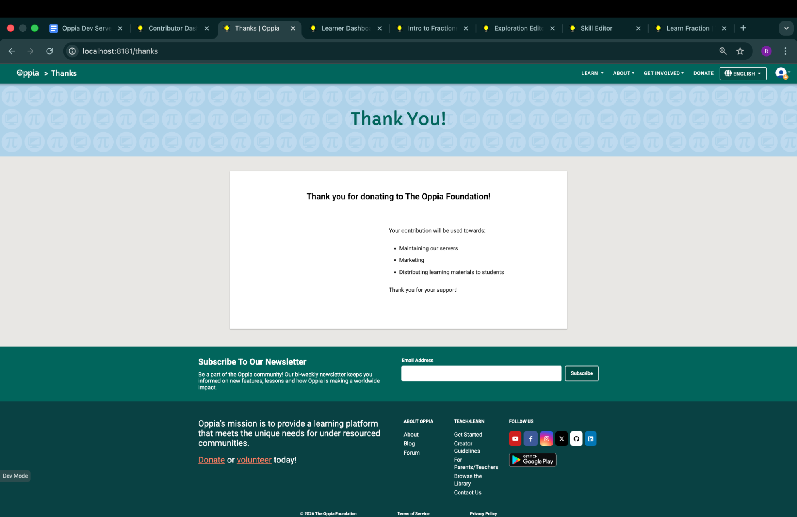

### Topic Editor Page

- **Description:**
Interface for creating and managing topics, including subtopics, stories, skills, and diagnostic test configuration.

- **Url:**
/topic_editor/<topic_id>

- **Permissions Required:**
Curriculum Admin role

**Steps to Access:**
  1. Log in as a Super Admin
  2. Assign yourself the Curriculum Admin role
  3. Navigate to Topics and Skills Dashboard
  4. Click on an existing topic OR create a new one
  5. The Topic Editor page will open

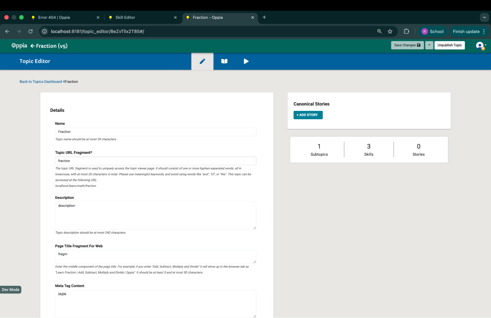

### Topic Viewer Page

- **Description:**
Displays a topic's details, stories, practice sessions, and study materials for learners.

- **Url:**
/learn/<classroom_url>/<topic_url>/story

- **Permissions Required:**
None (Public)

**Steps to Access:**
  1. Navigate to /learn (Classrooms page)
  2. Click on a classroom (e.g., "Math")
  3. Click on a topic (e.g., "Fractions")

Example:
http://localhost:8181/learn/math/fractions/story

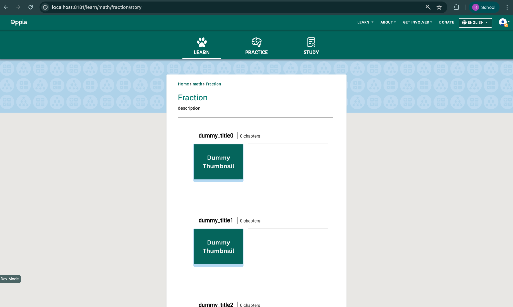

- To populate the Topic Viewer Page it needs a topic with stories, subtopics, and skills, published and added to a classroom: See [Creating a Classroom](#8-creating-a-classroom) and [Creating a Topic](#4-creating-a-topic) OR [Load Dummy New Structures Data](#load-dummy-new-structures-data)

### Topics & Skills Dashboard Page

- **Description:** 
The central hub for Curriculum Admins to create and manage Topics (and their stories) and Skills.

- **Url:**
http://localhost:8181/topics-and-skills-dashboard

- **Permissions Required:**
Curriculum Admin role.

**Steps to Access:**
  1. Log in as a Super Admin.
  2. Assign yourself the Curriculum Admin role.
  3. Navigate to /topics-and-skills-dashboard.


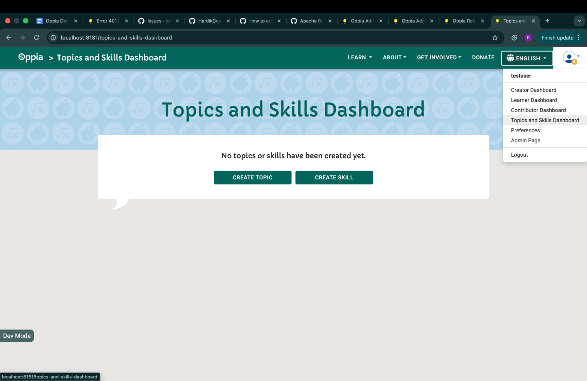

### View Learner Group Page

- **Description:**
Displays learner group information, member progress, and group activities.

- **Url:**
/learner-group/<group_id>

- **Permissions Required:**
Group members or facilitators

**Steps to Access:**
  1. Navigate to /facilitator-dashboard (for facilitators)
  2. OR access via shared group link (for members)
  3. Click on the group to view details

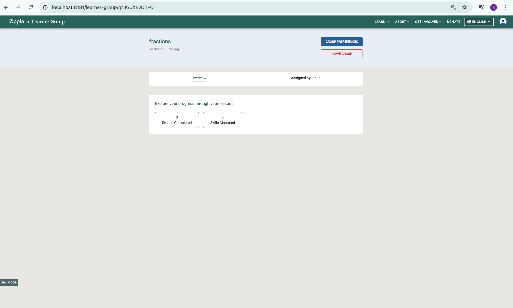

### Voiceover Admin Page

- **Description:**
Administrative tool for managing voiceover recordings, reviewing submitted voiceovers, and assigning voiceover tasks.

- **Url:**
/voiceover-admin

- **Permissions Required:**
Voiceover Admin role

**Steps to Access:**
  1. Log in as a Super Admin
  2. Assign yourself the Voiceover Admin role via /admin (Roles)
  3. Navigate to http://localhost:8181/voiceover-admin

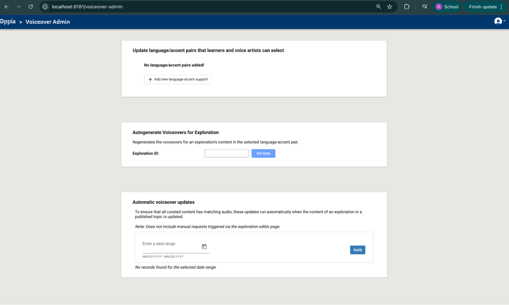


### Volunteer Page

- **Description:** 
Provides information on how to join the Oppia community as a volunteer and contribute in various roles.

- **Url:** 
/volunteer

- **Permissions Required:** 
None

**Steps to Access:** 
  1. Click Get Involved in the navbar.
  2. Then click on the Volunteer.

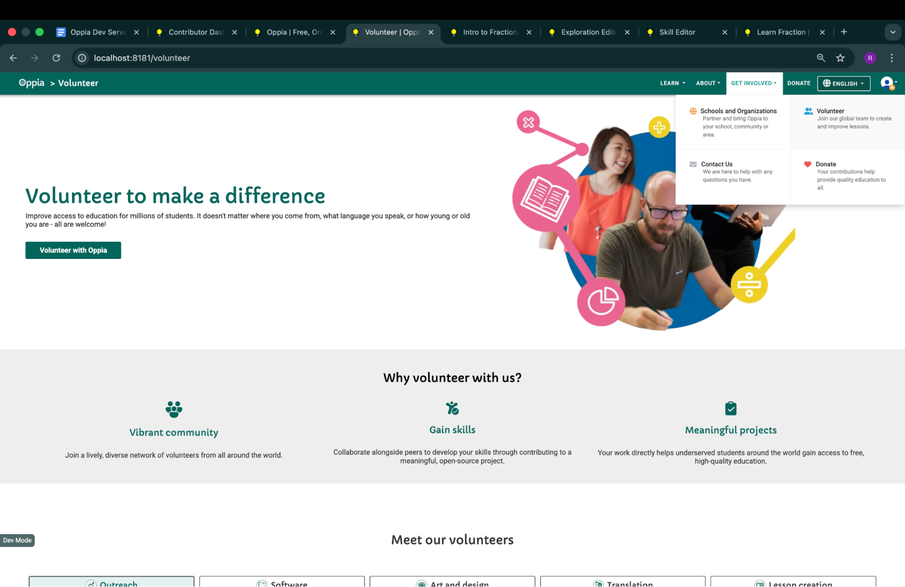
     
## Populating Data on Local Server

This section explains all the ways data can be created, loaded, or generated on the Oppia local development server.

### 1. Admin Activities Tab (Dummy/Test Data)
The Activities tab is ONLY for local testing and development.
It does not create real, customizable content.

**Access:**
Visit [Activities](#activities-tab).

#### Generate Dummy Explorations
- Creates random, empty explorations
- Optional auto-publish

**Use case:** Quick testing of dashboards and flows

#### Reload a Single Exploration

- Reloads predefined YAML explorations
- Example: welcome.yaml

**Use case:** Restore known test content

#### Reload a Single Collection
- Loads predefined collections from YAML
- Example: welcome_to_collections.yaml

**Limitations:**
- Cannot edit structure
- Cannot choose explorations
- Cannot create new collections

#### Load Dummy New Structures Data
Loads a complete dataset, including:
- Topics
- Skills
- Stories
- Explorations
- Questions

**Use case:** Populate everything in one click for local testing

**Prerequisite: Assign Required Roles**

Most data population actions require specific roles.
 To assign roles, see [Roles Tab](#important-admin-page-tabs).

#### Generate Stories
- Creates dummy stories for a selected topic
- Requires Curriculum Admin role
- Select a topic from the dropdown, enter the number of stories, and click **Generate Stories**
  
#### Generate Chapters
- Creates dummy chapters for a selected story
- Requires Curriculum Admin role
- Select a story from the dropdown, enter the number of chapters, and click **Generate Chapters**

### 2. Creating Explorations

An Exploration is the actual lesson that learners play. Stories, chapters, and practice sessions all depend on explorations.

**Step 1:** Open Creator Dashboard
Go to:
http://localhost:8181/creator-dashboard
Click:
“Create Exploration”

**Step 2:** Choose Interaction Type
You will be asked to select:

- Multiple Choice
- Text Input
- Fraction Input
- Drag & Drop
- Image Selection, etc.

Click Create
 **Step 3:** Add Content to the Card
 Each card contains:
 
- Content → The question shown to the learner
- Interaction → How the learner answers
- Response → Feedback after submission

You must:

1. Enter the question
2. Configure learner answer input
3. Add feedback response

Click Save Draft

**Step 4:** Add More Cards (Optional)
Click:
“Add New Card”

Repeat the process to create multi-step lessons.

**Step 5:** Preview the Exploration
Click the Preview button to test like a learner.

**Step 6:** Publish the Exploration
Click:
Publish
If it is not published:
- It will NOT appear in stories
- It will NOT be visible to learners

**Step 7:** Use Exploration in a Story
Once published:

1. Go to Topic Editor
2. Open a Story
3. Add a Chapter
4. Select your published Exploration
5. Save draft → Publish topic again if needed

### 3. Creating a Skill
   NOTE - A skill must have:
- At least **3 questions** to appear in the **Diagnostic Test**
- At least **10 questions** to appear in **Practice Sessions**

**Note**
Even after adding 10 questions to the skills in a topic, the Practice Session route will return a 404 until you open the Topic Editor and explicitly check the "Show Practice Tab to learners" checkbox. This checkbox remains disabled until the 10-question minimum is met.

There are two ways to create a skill:

**Method 1: From Topic Editor**
1. Open any Topic Editor
2. Click ADD SKILL under the Subtopics section
3. The skill will be automatically assigned to the topic

**Method 2: From Topics and Skills Dashboard**
1. Go to the dashboard
2. Click ADD SKILL
3. This skill will not be assigned to any topic automatically
   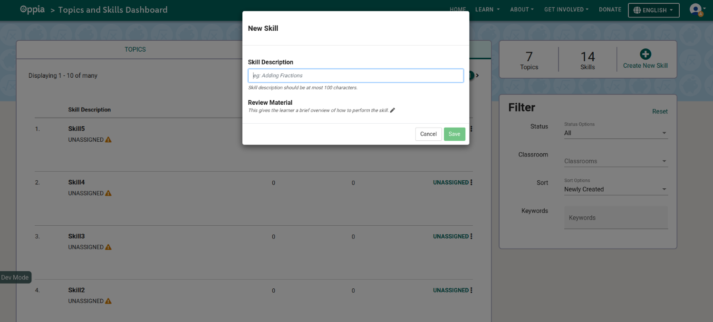
4. After saving, you will be taken to the Skill Editor page.
5. Sections Inside the Skill Editor:
- Details
  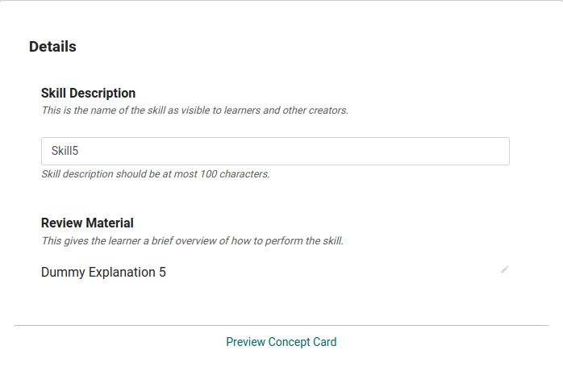
- Worked Example
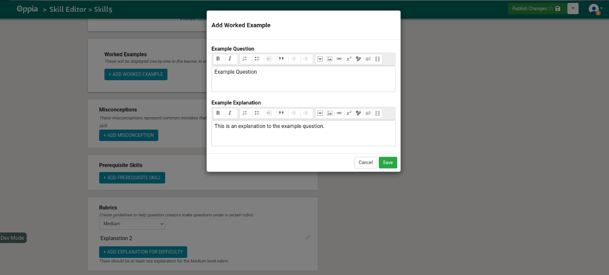

- Misconceptions
These are common mistakes learners make.
You can force these misconceptions to appear in all questions.

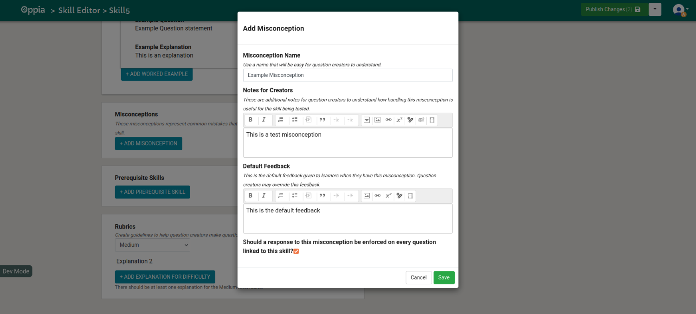

- Pre-requisite Skills
These are skills learners should complete first.
You can filter by:
- Topic
- Subtopic
- Skill name

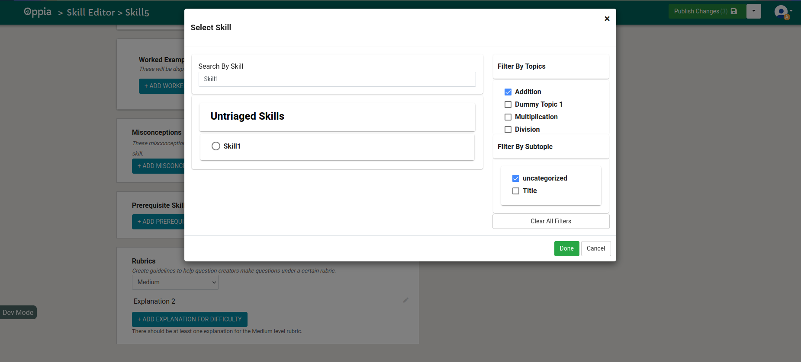

- Rubrics
Helps question creators follow defined standards.

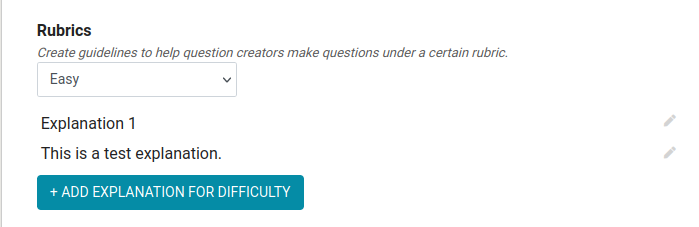

**Adding Questions to a Skill**
1. Scroll to the Questions section
2. Click ADD QUESTION
3. Inside the Question Editor, fill these 5 parts:
- Difficulty
                        
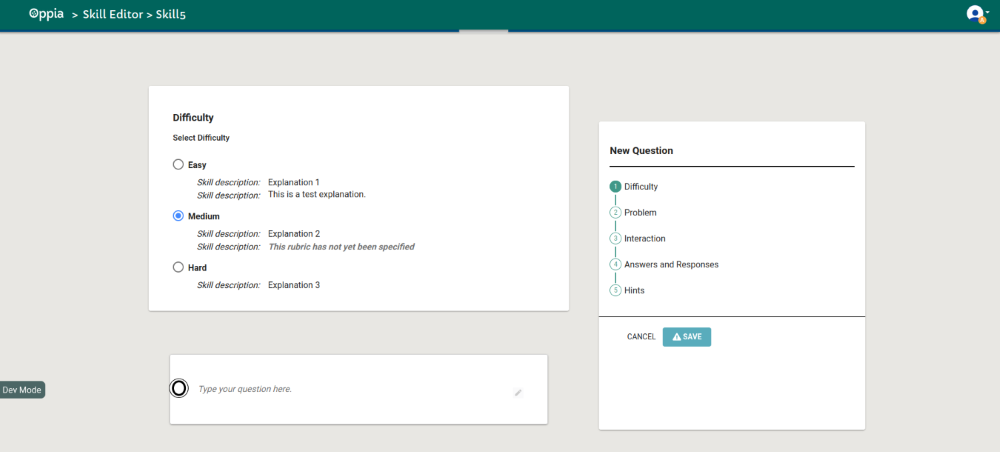

- Problem

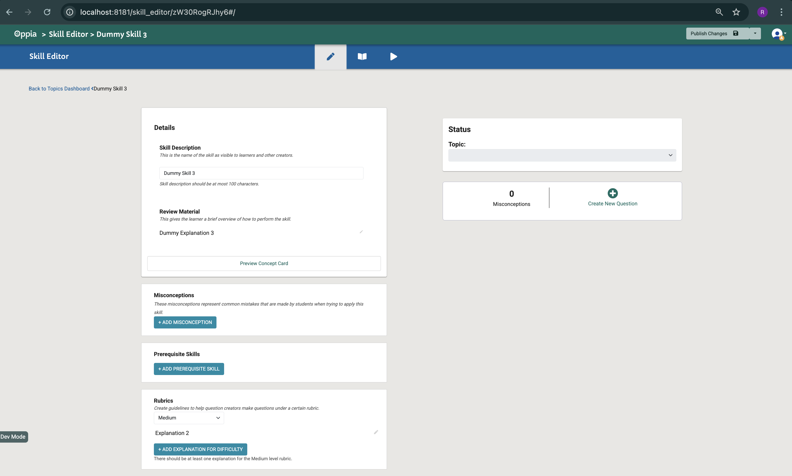

- Interaction
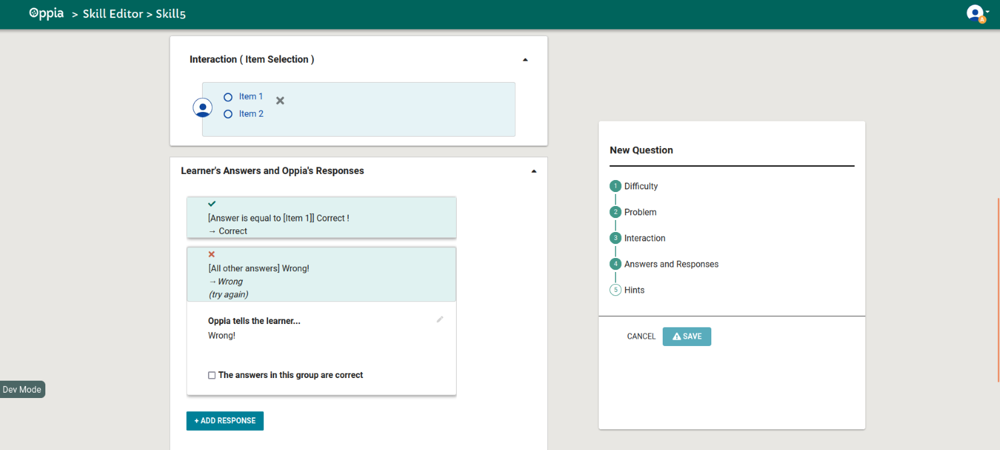

- Answers and Responses
  Hints
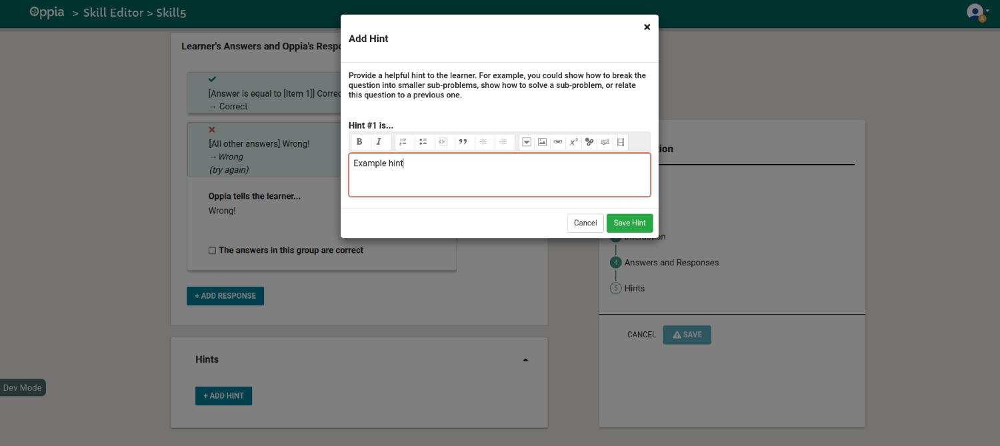

- After filling everything, click Save

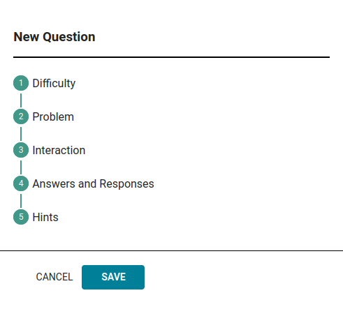

### 4. Creating a Topic
1. Open the Topics and Skills Dashboard.
2. Click on CREATE TOPIC.
3. A form will open where you need to fill:
- Topic name
- Topic thumbnail
- Other required details.
  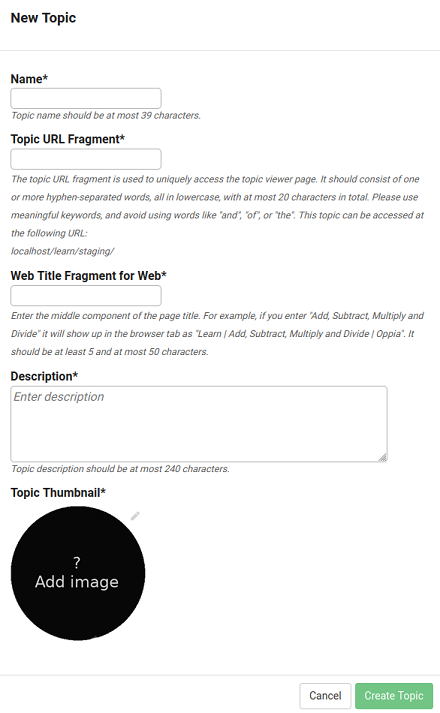
4. After saving, you will be redirected to the Topic Editor page.    


5. In the main editor tab, you will see validation errors that must be fixed before publishing.

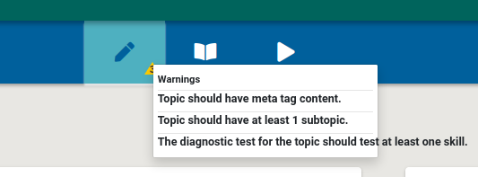
     
Sections in the Topic Editor:
- **Details** – Basic information about the topic
- **Subtopics** – Lists subtopics and the skills linked to them
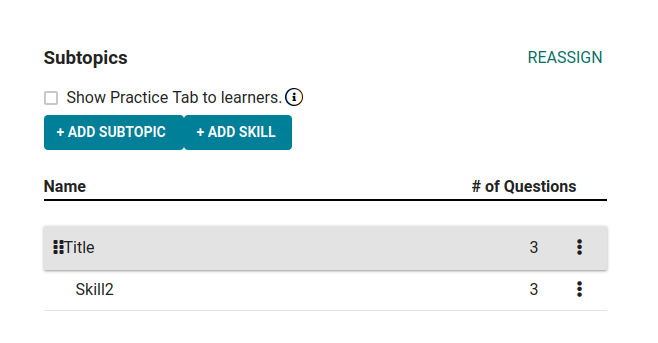

**Adding Content to a Subtopic (for Study Guide):**
1. In the Topic Editor, click on a subtopic name to open the Subtopic Editor.
2. Fill in the required fields:
   - **Title** — Name of the subtopic
   - **URL Fragment** — Used in the Study Guide URL
   - **Explanation** — Rich-text content shown on the Study Guide page (click the pen icon to edit)
   - **Thumbnail Image** — Upload a thumbnail
3. Under the **Skills** section, skills from the topic are listed. You can remove skills from the subtopic using the options menu.
4. Skills are assigned to subtopics by dragging them from the "Uncategorized Skills" section in the main Topic Editor.

- **Diagnostic Tests-**
Add skills that will be used to test learners before recommending this topic.
A skill must have at least 3 questions and be assigned to the topic to be used here.
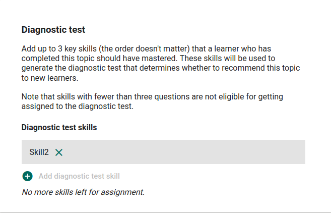

-**Canonical Stories**-
This section lists all stories that belong to this topic.

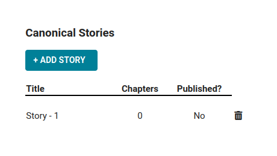

- Preview the Topic
  
1. Click the Preview button in the top navigation bar
2. This shows exactly how learners will see your topic before publishing.
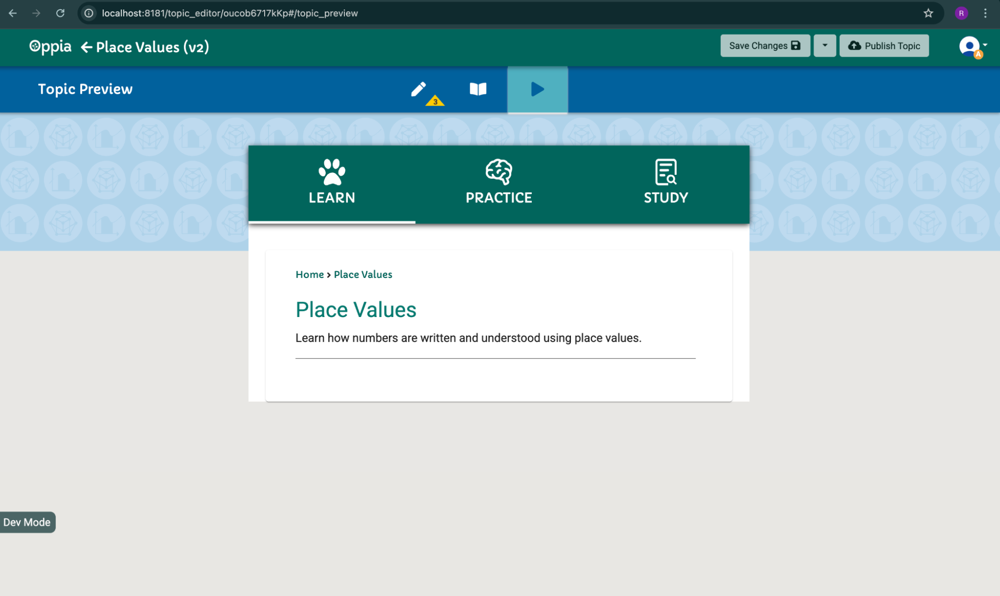
- Publish the Topic
Once all validation errors are resolved:
1. Click Publish Topic
2. Your Topic is now live in the system.

- Add the Published Topic to the Math Classroom
To make your topic visible on the Math Classroom page:

1. Go to http://localhost:8181/classroom-admin
2. Select the classroom (e.g. Math)
3. Click edit (pencil icon)
4. Add the published Topic ID
5.Save changes

- Verify on the Math Classroom Page
 Go to:
http://localhost:8181/learn/math

 You should now see your newly created topic listed on the classroom page.

### 5. Generate Dummy Blog Data

**Steps to generate data:**

1. Navigate to http://localhost:8181/admin#/activities 
2. Scroll down to the section titled "Generate dummy blog post".
3. You will see several titles (e.g., "Education", "Leading The Arabic Translations Team"). Click the "Generate" button next to these titles.
4. Each click generates and automatically publishes a dummy blog post.

### 6. Generating Data For Contributor Dashboard

- My Contributions
**Steps to generate data:**
1. Log in to Oppia.
2. Navigate to the Contributor Dashboard
3. Open the Translate Text tab.
4. Select:
- A Topic
- A Target Language (for example, Hindi).
  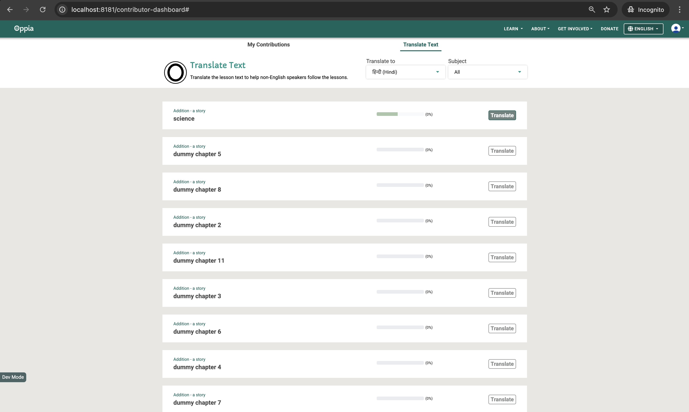
5. Choose an Opportunity (an exploration lesson that requires translation).
6. Enter a translation for the text.
7. Click Save and Close.
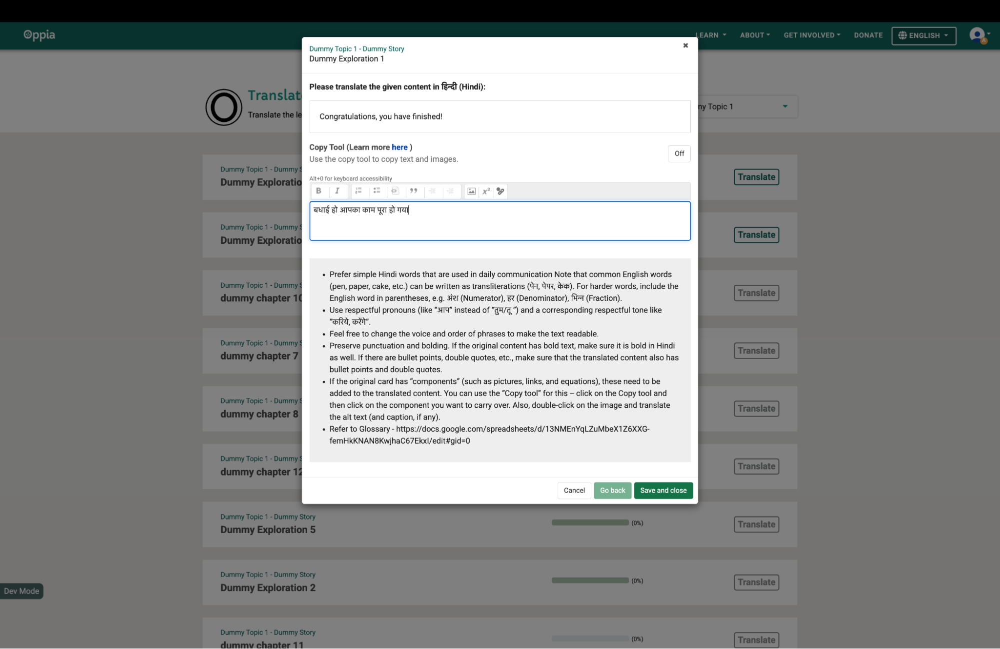

**Available Tasks (Reviewer Rights Required)**
The Available Tasks section displays suggestions submitted by other users that require review.
This section is visible only to users with Reviewer Rights.

1. Navigate to the Admin page
2. Open the Roles tab.
3. Enter your username.
4. Select one of the following roles:
      - Translation Admin
      - Question Admin
5. Click Update.
6. Navigate to the Contributor Admin Dashboard
7. In Manage Contributor Rights:

Enter your username.
Select a category:
     - Translation Reviewer
     - Question Reviewer
     Select a language (for example, Hindi).
     Click Add Rights.
 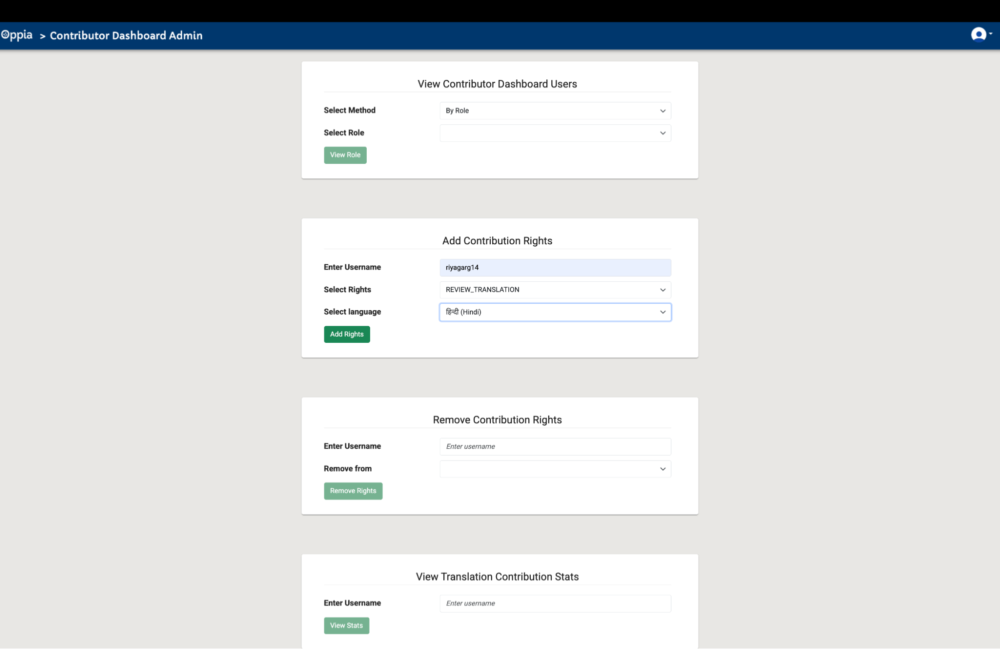
8. Log in with a different account(or open an incognito window).
9. Submit a translation or question suggestion using the steps described in Populating My Contributions.
 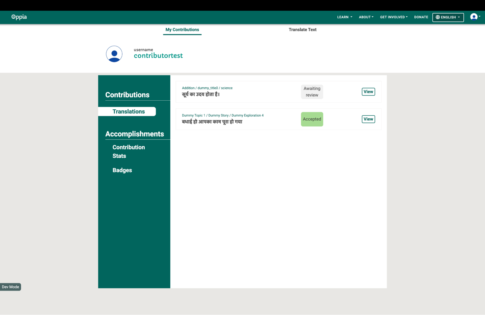
10. Log back in with the reviewer account.
11. Open the Available Tasks tab.
12. You should now see the submitted suggestion available for review.

 
 
**Accomplishments**

The Accomplishments tab tracks contributor statistics and badges based on accepted contributions.

Steps to generate data:
1. Log in as a user with Reviewer Rights.
2. Navigate to Available Tasks on the Contributor Dashboard.
3. Review a submitted suggestion.
4. Click Accept.

Result:
- The contributor’s statistics will update in the Accomplishments tab.
- Badges will be awarded automatically when contribution milestones are reached (for example, 50 accepted translations).

**Note**
The Available Tasks section remains hidden until reviewer permissions are granted through the Contributor Admin Dashboard.

### 7. Creating Collections
 #### Using the Collection Editor
1. Log in to Oppia
2. ⁠Navigate to /creator-dashboard
3. ⁠Click the "+ CREATE EXPLORATION" button
4. ⁠A modal appears: "Create an Activity"
5. Select "New Collection"
6. Click "CREATE COLLECTION"
7. You will be redirected to the Collection Editor page
   
**Note:** Despite the button saying "Create Exploration", it opens a modal where you can choose to create either an Exploration OR a Collection 
                     
  #### Using Activities Tab
     This is NOT used to create new collections manually.
1. Log in to Oppia
2. Navigate to /admin
3. The Activities tab is only for loading or reloading predefined (dummy) collections from YAML files
4. These collections are meant for testing, demos, or local development.
What you can do here:
- Reload an existing test collection (e.g. welcome_to_collections.yaml)

 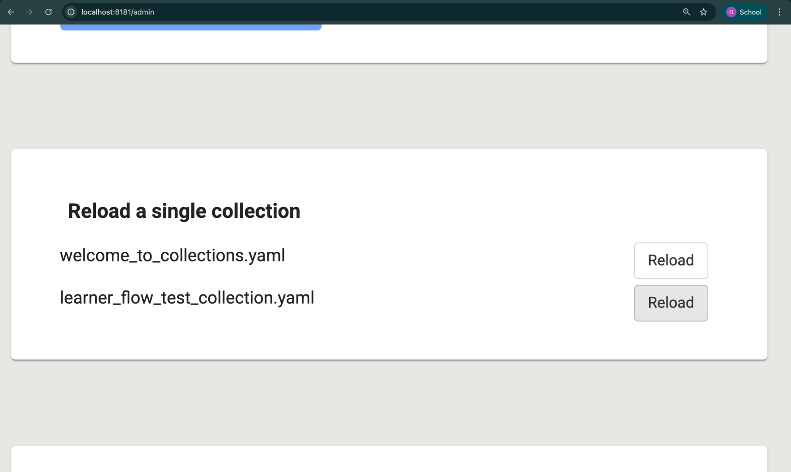
 
### 8. Creating a Classroom

Step 1: Assign Role
1. Go to /admin
2. Assign yourself the Curriculum Admin role
   
#### Creating a Custom Classroom
1. Open /classroom-admin
2. Click Add New Classroom
  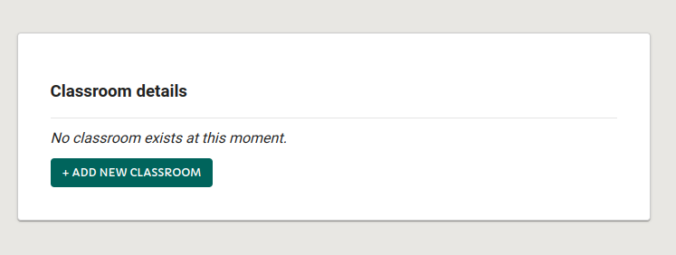
   **Enter:**
     - Classroom name
     - URL fragment
 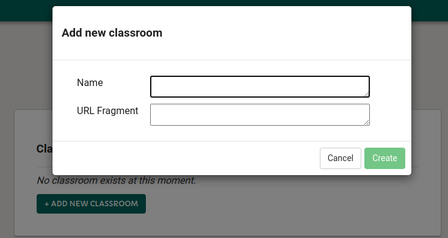
     - Click on the classroom title
     - Click the pencil icon to edit details
 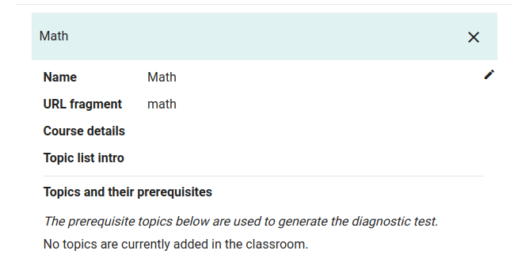
**Add:**
- Course details
- Topic introduction
- Topic IDs
 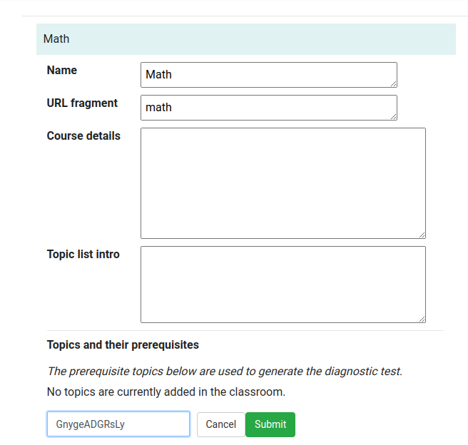

#### Creating a Dummy Math Classroom
1. Go to /admin → Activities tab
2. In the Generate a dummy math classroom section, click the Generate Data button.

 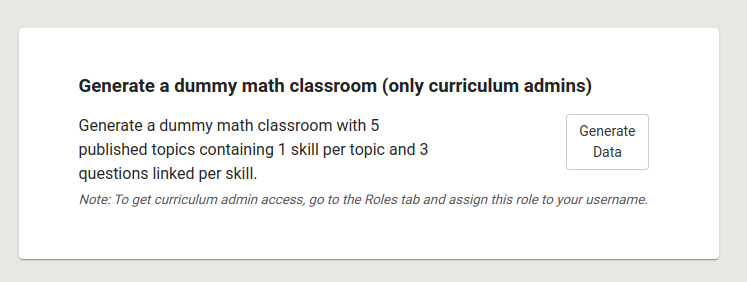

The classroom will be visible on:
- The Learner Dashboard Home Tab
- OR directly at:
http://localhost:8181/learn/<classroom_url_fragment>

**NOTE:** Learner-facing pages do not create data themselves.
They display data created via creator or admin flows.

### 9. Community Library
Populated when:
- Explorations are published
- Collections are published

#### Generate Explorations
1. Go to http://localhost:8181/admin#/activities.
2. Under "Reload a single exploration", click "Reload" for any exploration (e.g., "welcome", "about_oppia").
    - To Generate Random Explorations:
           1. Under "Generate dummy explorations", enter the number of explorations to generate and publish (e.g., 5 for both).
           2. Click "Generate Explorations".
                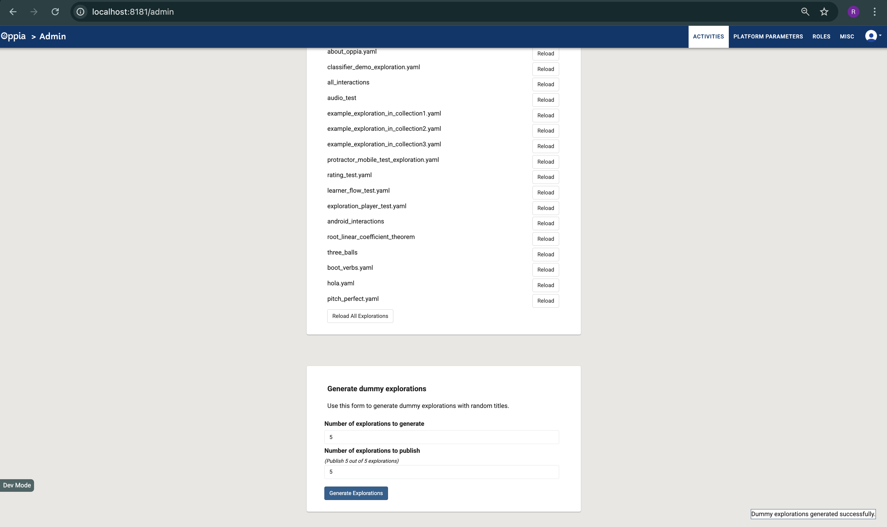
#### Generate Collections

See [Creating Collections](#7-creating-collections).

### 10. Collection Player
Populated when:
- A published collection exists
- Created via Collection Editor or Activities (dummy)

### 11. Story Player
- To populate the Story Player Page:
  - **Quick method:** Use [Load Dummy New Structures Data](#load-dummy-new-structures-data)
    (creates a complete topic with a story and 3 chapters in one click).
  - **Using Activities Tab generators:**
    1. Generate or create a topic (Curriculum Admin required)
    2. Use **Generate Stories** to create stories for that topic
    3. Use **Generate Chapters** to create chapters for those stories
  - **Manual method:** See [Creating a Topic](#4-creating-a-topic) and [Creating Explorations](#2-creating-explorations).


### 12. Review Test Page

- To populate the Review Test Page:
You need a working Classroom, Topic, Story, Skills, and Questions.

1. Navigate to the Admin page: http://localhost:8181/admin
2. Go to the [Activities tab](#activities-tab)
3. Click exactly once on Generate dummy new structures data.
   
**Note**: Clicking this multiple times will generate duplicate stories with the same URL fragment, which breaks the URL routing and causes 404s.

This button generates:
- A topic: "Dummy Topic 1" (dummy-topic-one)
- A story: "Help Jaime win the Arcade" (help-jamie-win-arcade)
- 3 dummy skills and dummy questions.
  
4. Run the Setup Script
- The default dummy data generation is incomplete:
- It does not link the generated Topic to a Classroom.
- It does not assign the generated Skills to the Story's nodes (so the Review Test has 0 questions).
- Playing through the dummy explorations manually can be broken due to missing multiple-choice options.

To fix all of this instantly, run the following Python script from your oppia/ root directory. It links the topic, assigns the skills, marks the exploration as completed for your user, and flushes the cache so the changes take effect immediately.

Save this as setup_review_test.py

```
python
import os, sys, json
os.environ['DATASTORE_EMULATOR_HOST'] = '127.0.0.1:8089'
os.environ['DATASTORE_DATASET'] = 'dev-project-id'
sys.path.insert(0, os.getcwd())
sys.path.insert(0, os.path.join(os.getcwd(), 'scripts'))
import common
for directory in common.DIRS_TO_ADD_TO_SYS_PATH:
    sys.path.insert(1, directory)
from core.platform import models
datastore_services = models.Registry.import_datastore_services()
StoryModel = models.Registry.import_models([models.Names.STORY])[0].StoryModel
(user_models,) = models.Registry.import_models([models.Names.USER])
from core.domain import classroom_config_services
from core.domain import story_fetchers
from core.domain import story_services
from core.domain import topic_fetchers
from core.domain import topic_services
from core.domain import skill_fetchers
def main():
    with datastore_services.get_ndb_context():
        # 1. Identify User
        users = user_models.UserSettingsModel.query().fetch()
        if not users:
            print("No users found. Please log in to the dev server first.")
            return
            
        # Prioritize finding the 'riyagarg' or 'testadmin' user
        admin_id = users[0].id
        for u in users:
            if u.username and ('riyagarg' in u.username.lower() or 'admin' in u.username.lower()):
                admin_id = u.id
                break
        # 2. Add Dummy Topic to Math Classroom
        classroom = classroom_config_services.get_classroom_by_url_fragment('math')
        topic_id = 'sVooUYRjW6sT' # ID assigned to Dummy Topic 1
        if classroom and topic_id not in classroom.topic_id_to_prerequisite_topic_ids:
            classroom.topic_id_to_prerequisite_topic_ids[topic_id] = []
            classroom_config_services.update_classroom(classroom)
            print("Linked Dummy Topic 1 to 'math' classroom.")
        # 3. Find the valid published story
        all_stories = story_fetchers.get_stories_by_ids([s.id for s in StoryModel.query().fetch()])
        valid_story = None
        for story in all_stories:
            if story and story.url_fragment == 'help-jamie-win-arcade':
                valid_story = story
                break
                
        if not valid_story:
            print("Story not found! Please run 'Generate dummy new structures data' from /admin.")
            return
        # 4. Publish Topic and Story
        try:
            topic_services.publish_topic(topic_id, admin_id)
        except Exception: pass # Usually already published
        
        try:
            story_services.publish_story(topic_id, valid_story.id, admin_id)
        except Exception: pass
        # 5. Assign Skills to Story Node (Bypassing validation)
        skills = skill_fetchers.get_multi_skills([s.id for s in models.Registry.import_models([models.Names.SKILL])[0].SkillModel.query().fetch(limit=3)])
        skill_ids = [s.id for s in skills if s]
        
        node_id = valid_story.story_contents.nodes[0].id
        
        # Directly update the NDB Model to bypass strict validation checks on broken explorations
        story_model = StoryModel.get_by_id(valid_story.id)
        story_dict = json.loads(story_model.story_contents)
        story_dict['nodes'][0]['acquired_skill_ids'] = skill_ids
        story_model.story_contents = json.dumps(story_dict)
        story_model.put()
        print(f"Assigned skills {skill_ids} to story node.")
        # 6. Mark Node as Completed for the User
        story_services.record_completed_node_in_story_context(admin_id, valid_story.id, node_id)
        print("Marked node as completed for your user.")
    # 7. Flush the Redis cache so Oppia loads the modified Datastore model!
    os.system('redis-cli flushall')
    print("Flushed Redis cache.")
if __name__ == '__main__':
    main()

```   
**Run the script:** python setup_review_test.py

Step 4: Access the Page
Once the script successfully completes, you can navigate straight to the Review Test Page.


### 13. Fixing This common error
**Error:**
Server error: 'NoneType' object has no attribute 'version'

**Fix:**
1. Go to /admin → Roles
2. Assign yourself the release-coordinator role
3. Open /release-coordinator
4. Under the Misc tab, click Flush Cache.
   
 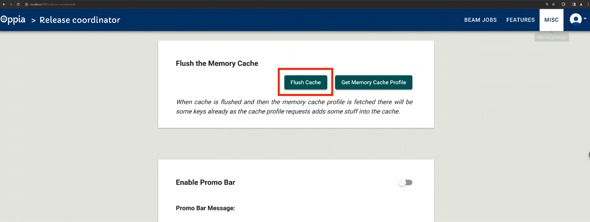

## Oppia Routing Guide for Contributors

This guide explains how routing works in Oppia and documents all available routes in the application.

### 1. What Is Routing in Oppia?

Routing in Oppia determines:
- What page opens when you visit a URL
- Whether login is required to access the page
- Which Angular module is loaded for that route
  
**Lazy Loading** 
Oppia uses lazy loading, which means:
- A page module is only loaded when it is actually visited
- This improves performance and reduces initial memory usage
- Each route uses loadChildren to dynamically import its module
  
### 2. Route Protection (Guards)
Oppia uses three main guards to control access:

#### 2.1 IsLoggedInGuard

**Purpose:** Blocks the page unless the user is logged in. If not logged in, redirects to /login.

**Used for:**
- Admin pages (/admin)
- Creator dashboard (/creator-dashboard)
- Topic / Skill / Story editors
- Blog management pages
- Learner dashboard
- Most contributor tools

#### 2.2 LessonPlayerPageAuthGuard

**Purpose:** Ensures only authorized access to lesson playback.

**Used for:**
- New lesson player (/lesson/<id>)
- Embedded lesson player (/embed/lesson/<id>)

#### 2.3 NormalizeUrlCaseGuard

**Purpose:** Ensures URL casing is correct to prevent routing bugs.
**Used for:**

- Classroom route (/learn/<classroom_url>)

### 3. Public Pages (No Login Required)
These pages are accessible to everyone without authentication:
| Route | Purpose |
|------|---------|
| /about | About Oppia |
| /contact | Contact page |
| /donate | Donation page |
| /get-started | New user onboarding |
| /teach | Teaching resources |
| /thanks | Thank-you page |
| /terms | Legal terms |
| /privacy-policy | Privacy policy |
| /license | Open-source license |
| /volunteer | Volunteer portal |
| /creator-guidelines | Participation playbook |
| /android | Android app info |
| /partnerships | Partnerships information |
| /contributor-dashboard | Contributor dashboard (no router guard)\* |
| /diagnostic-test-player | Diagnostic test player |
| /maintenance | Maintenance page |

**Note:** /contributor-dashboard does not have IsLoggedInGuard at the routing level, though it may check login status internally.

### 4. Authentication Pages
         
| Route | Purpose |
|------|---------|
| /signup | Account creation |

### 5. Dashboard Pages (Require Login)
  
| Route | Purpose | Guard |
|------|---------|-------|
| /creator-dashboard | For exploration creators | IsLoggedInGuard |
| /learner-dashboard | Learner homepage | IsLoggedInGuard |
| /facilitator-dashboard | Classroom facilitators | IsLoggedInGuard |
| /blog-dashboard | Blog post management | IsLoggedInGuard |

### 6. Admin & Moderation Routes (Require Login)
     All of these require IsLoggedInGuard:         
| Route | Purpose |
|------|---------|
| /admin | Main admin panel |
| /moderator | Content moderation |
| /emaildashboard | Email management |
| /voiceover-admin | Voiceover management |
| /topics-and-skills-dashboard | Topic & skill management (Curriculum Admin only) |
| /classroom-admin | Classroom management (Curriculum Admin only) |
| /contributor-admin-dashboard | Admin control of contributors |
| /blog-admin | Blog administration |

**Note:** /release-coordinator does not have IsLoggedInGuard at the routing level.

### 7. Editor Routes (Require Login)
All editor routes require IsLoggedInGuard:

| Route | Editor Type |
|------|-------------|
| /create/<exploration_id> | Exploration editor |
| /collection_editor/create/<collection_id> | Collection editor |
| /story_editor/<id> | Story editor |
| /topic_editor/<id> | Topic editor |
| /skill_editor/<id> | Skill editor |

### 8. Topics, Practice & Learning Pages (Public)
These learning pages are public and do not require login:
         
| Route | Purpose |
|------|---------|
| `/learn/<classroom_url>/<topic_url>` | Topic viewer |
| `/learn/<classroom_url>/<topic_url>/story/<story_url>` | Story viewer |
| `/learn/<classroom_url>/<topic_url>/practice` | Practice session |
| `/learn/<classroom_url>/<topic_url>/review-test/<story_url>` | Review test |
| `/learn/<classroom_url>/<topic_url>/studyguide/<subtopic_url>` | Subtopic viewer (study guide) |

Example:
/learn/math/fractions shows the Fractions topic in the Math classroom.

### 9. Classrooms & Learning Paths
        
| Route | Purpose | Guard |
|------|---------|-------|
| `/learn` | All classrooms | Public |
| `/learn/<classroom_url>` | Classroom landing page | Public (NormalizeUrlCaseGuard) |
| `/classroom-admin` | Classroom management | IsLoggedInGuard |

### 10. Exploration & Lesson Players

| Route | Purpose | Guard |
|------|---------|-------|
| `/explore/<id>` | Old exploration player | Public |
| `/embed/exploration/<id>` | Embedded exploration player | Public |
| `/lesson/<id>` | New lesson player | LessonPlayerPageAuthGuard |

### 11. Library & Collections

| Route | Purpose |
|------|---------|
| `/community-library` | Exploration library |
| `/search/find` | Library search |
| `/community-library/recently-published` | Recently published explorations |
| `/community-library/top-rated` | Top rated explorations |
| `/collection/<id>` | Collection player |

### 12. Blog Routes  
        
| Route | Purpose |
|------|---------|
| `/blog` | Blog homepage |
| `/blog/search/find` | Blog search |
| `/blog/author/:author_username` | Author profile |
| `/blog/<slug>` | Individual blog post |

### 13. Learner Group Routes

| Route | Purpose | Guard |
|------|---------|-------|
| `/create-learner-group` | Create group | IsLoggedInGuard |
| `/edit-learner-group/<id>` | Edit group | IsLoggedInGuard |
| `/view-learner-group/<id>` | View group | No guard* |

**Note:** /view-learner-group does not have IsLoggedInGuard at the routing level.

### 14. Account & Profile Routes

| Route | Purpose | Guard |
|------|---------|-------|
| `/preferences` | Account preferences | No guard* |
| `/profile/<username>` | User profile | Public |
| `/delete-account` | Delete account | IsLoggedInGuard |
| `/pending-account-deletion` | Deletion waiting page | Public |
| `/feedback-updates` | Feedback history | IsLoggedInGuard |

**Note:** /preferences does not have IsLoggedInGuard at the routing level, though it typically requires login to function.

### 15. Special Dynamic Routes

#### 15.1 Stewards Landing Pages

Old volunteer URLs are automatically redirected to /volunteer. This includes:
- /parents
- /partners
- /nonprofits
- /teachers
- /volunteers
This redirection happens through a loop in the routing configuration.

#### 15.2 Topic Landing Pages

Routes are auto-generated from AppConstants.AVAILABLE_LANDING_PAGES.
Currently available:

- /math/fractions
- /math/negative-numbers
- /maths/ratios
New subject landing pages can be added to the constants file and will automatically work without manual routing changes.

### 16. Error Handling Routes
     
| Route | Purpose |
|------|---------|
| `/error/iframed` | Iframe-safe error page |
| `/error/<status_code>` | Custom error page |
| `**` | Wildcard for broken URLs (404 page) |

**Critical:** The wildcard route (**) must always stay last in the routes array, or it will capture all routes and break navigation.

### 17. Why this routing file Is critical

- Every valid Oppia URL is registered here
- Every permission rule starts here
- Every editor, admin page, and learner view depends on this configuration
- If a route breaks or shows a false 404,check this file first
- All paths must be defined in constants.ts, otherwise pages will have false 404 status codes

### 18. Role-based Access Control

| Route | Access Level | Example Routes |
|------|-------------|---------------|
| Public (Not Logged In) | Public pages and learning content | `/about`, `/contact`, `/donate`, `/learn/<classroom>` |
| Learner | Learn and track progress | `/learner-dashboard`, practice sessions, `/profile` |
| Contributor | Content suggestions & translations | `/contributor-dashboard`, `/feedback-updates` |
| Creator | Create/edit explorations | `/creator-dashboard`, `/exploration_editor/<id>` |
| Curriculum Admin | Manage topics, skills, classrooms | `/topic_editor/<id>`, `/classroom-admin` |
| Moderator | Review content | `/moderator` |
| Blog editor | Manage blog posts | `/blog-dashboard` |
| Blog Admin | Admin blog settings | `/blog-admin` |
| Voiceover Admin | Manage voiceovers | `/voiceover-admin` |
| Release Coordinator | Cache & release tools | `/release-coordinator` |
| Super Admin | Full access | `/admin` and all routes |

### 19. Troubleshooting Tips
Error: 'NoneType' object has no attribute 'version'

**Fix:**
1. Assign yourself the release-coordinator role
2. Go to /release-coordinator
3. Navigate to Misc section
4. Click Flush Cache

Route shows 404 but should exist
Check:
- Is the route registered in app.routing.module.ts?
- Is the route constant defined in assets/constants.ts?
- Are you using the correct URL format?
- Does the route require login?
Page loads but shows "Access Denied"
Check:
- Do you have the required role?
- Some pages require specific roles (see Section 18)
- Contact an admin if needed

### 20. Quick reference for contributors

**Login & Roles**
- Login: /login
- Admin panel: /admin
  
**Generate Test Data**
1. Go to /admin
2. Activities tab
3. Generate dummy data
   
**Classroom Access**
- All classrooms: /classrooms
- Specific classroom: /learn/<classroom_url>

**Editor Access**
- Exploration editor: /exploration_editor/create/<id>
- Collection editor: /collection_editor/create/<id>
- Topic editor: /topic_editor/<id>
- Skill editor: /skill_editor/<id>
- Story editor: /story_editor/<id>

### 21. Contributor Checklist
- Dev server starts successfully
- Dummy classroom created
- Topic created & published
- Topic added to classroom
- /learn/<classroom_url> loads correctly
- All routes tested
- Cache flushed (if needed)
- No console errors
- Routes tested for logged-in and logged-out users

### 22. Summary
This routing guide provides a complete reference for all routes in Oppia.
When contributing:
- Always check the correct URL format
- Verify guard requirements
- Use exact, case-sensitive paths
- Test logged-in and logged-out states
- Refer to troubleshooting if issues occur
- Contact Oppia maintainers or open a GitHub issue if needed
