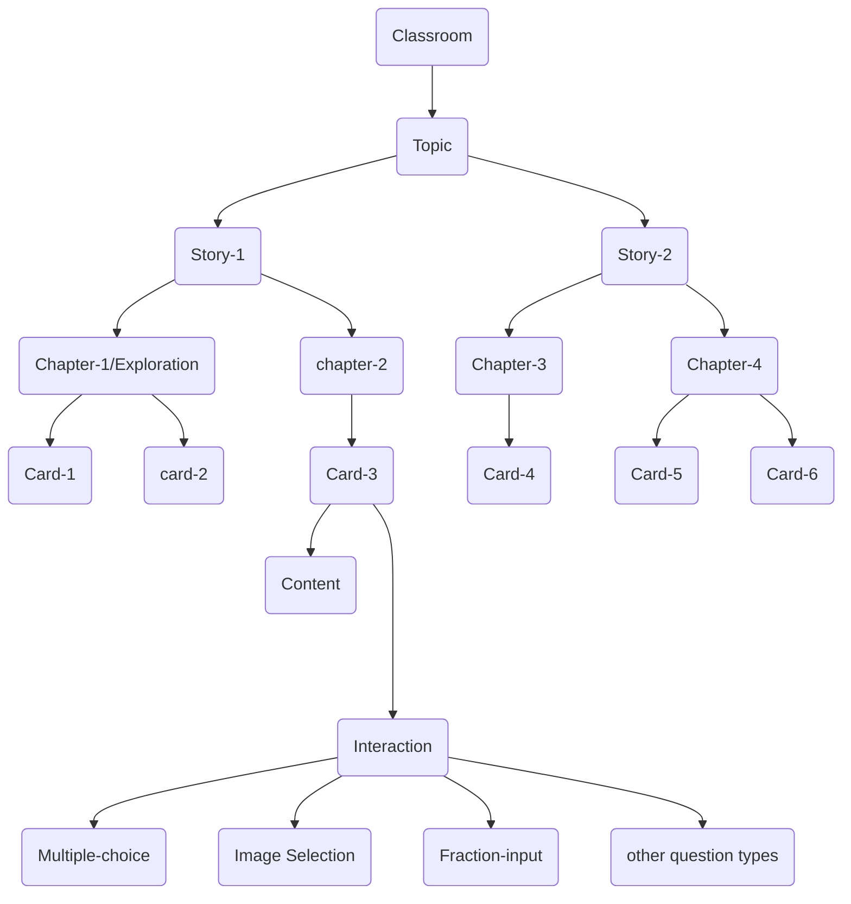
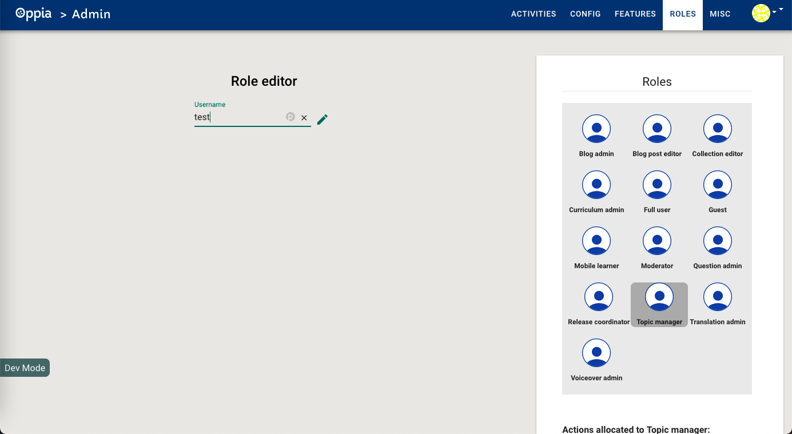
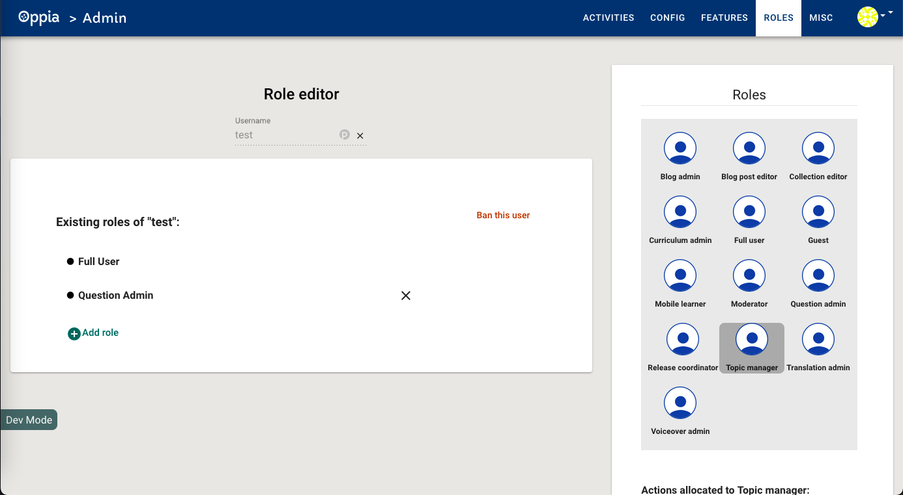
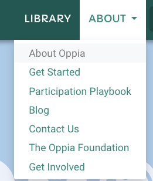
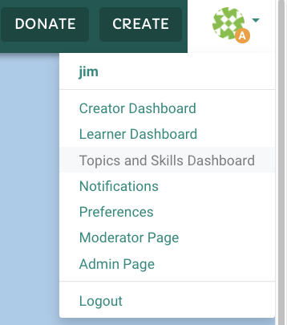
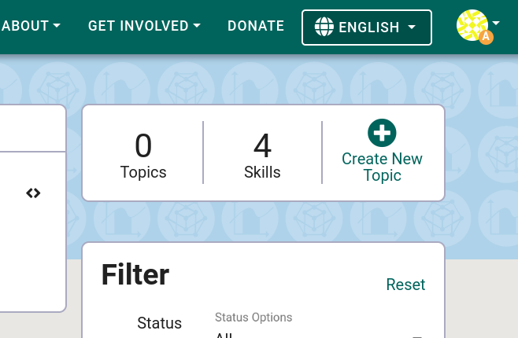
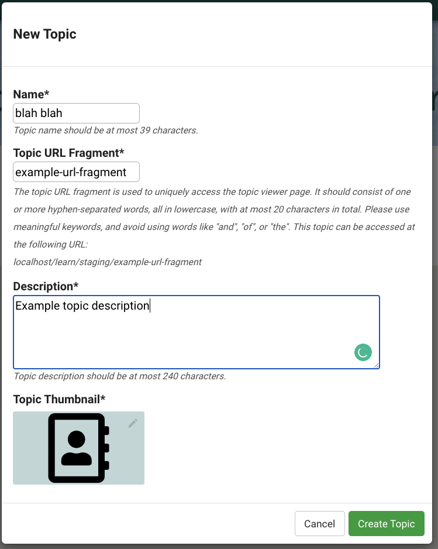
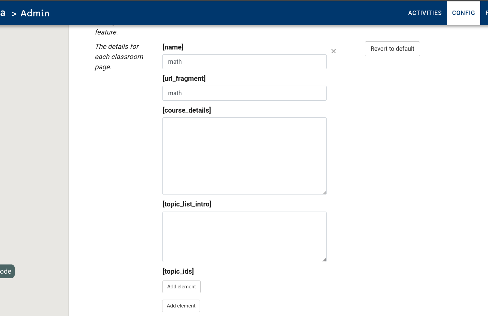
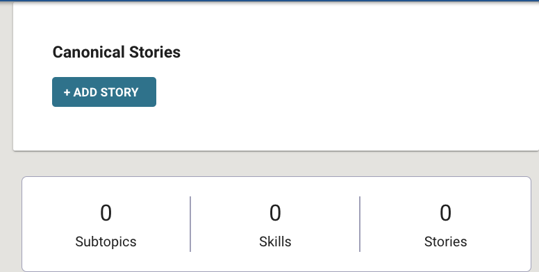
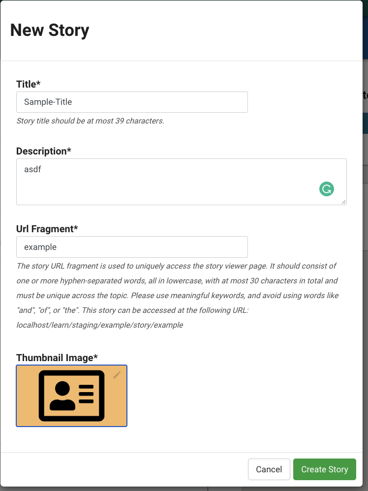

## Table of Contents

* [Overview of entities](#overview-of-entities)
* [User account pages](#user-account-pages)
  * [Log in or create account](#log-in-or-create-account)
  * [Log in as a super-administrator](#log-in-as-a-super-administrator)
    * [Using an email with implicit super-admin privileges](#using-an-email-with-implicit-super-admin-privileges)
    * [Grant super-admin privileges after account creation](#grant-super-admin-privileges-after-account-creation)
  * [Delete account page](#delete-account-page)
  * [Preferences page](#preferences-page)
  * [Profile page](#profile-page)
* [Admin pages](#admin-pages)
  * [Super admin page](#super-admin-page)
    * [Assign roles](#assign-roles)
  * [Email dashboard page](#email-dashboard-page)
  * [Release coordinator page](#release-coordinator-page)
* [Static pages](#static-pages)
  * [About page](#about-page)
  * [Donate page](#donate-page)
  * [Contact Page](#contact-page)
  * [Get started page](#get-started-page)
  * [Landing pages](#landing-pages)
  * [Thanks page](#thanks-page)
  * [Terms page](#terms-page)
* [Collection pages](#collection-pages)
  * [Collection editor page](#collection-editor-page)
  * [Collection player page](#collection-player-page)
* [Exploration pages](#exploration-pages)
  * [Community library page](#community-library-page)
  * [Creator dashboard page](#creator-dashboard-page)
  * [Exploration editor page](#exploration-editor-page)
  * [Exploration player page](#exploration-player-page)
* [Topics and skills pages](#topics-and-skills-pages)
  * [Topics and skills dashboard page](#topics-and-skills-dashboard-page)
  * [Topic editor (including preview tab)](#topic-editor-including-preview-tab)
  * [Skill editor page](#skill-editor-page)
  * [Story editor page](#story-editor-page)
  * [Story player page](#story-player-page)
* [Contributor pages](#contributor-pages)
  * [Contributor dashboard page](#contributor-dashboard-page)
  * [Contributor dashboard admin page](#contributor-dashboard-admin-page)
* [User documentation](#user-documentation)

Oppia has many webpages and this is a comprehensive guide on how to access all those pages. Before a contributor makes a PR, we expect that the contributor has thoroughly tested the changes made in the PR for functional correctness. Part of this process is manually testing any pages that are affected by their code.

## Overview of entities

This diagram outlines the various entities in Oppia and how they relate
to each other:

```mermaid
flowchart TD
C("Classroom")--> T("Topic")
T("Topic") --> S1("Story-1")
T --> S2("Story-2")
S1 --> C1("Chapter-1/Exploration")
C1 --> c1("Card-1")
C1 --> c2("card-2")
S1 --> C2("chapter-2")
C2 --> c3("Card-3")
c3 --> co("Content")
c3 ----> in("Interaction")
in --> mc("Multiple-choice")
in --> is("Image Selection")
in --> fi("Fraction-input")
in --> oqt("other question types")
S2 --> C3("Chapter-3")
S2 --> C4("Chapter-4")
C3 --> c4("Card-4")
C4 --> c5("Card-5")
C4 --> c6("Card-6")
```

As you go through https://www.oppia.org/, you will find these entities.

### Key terms

1. **Classroom**: A Classroom in Oppia is a collection of topics grouped under a single subject. For example ,https://www.oppia.org/learn/math this displays a Maths classroom.
2. **Topic**: A topic is a broad term that refers to the subject content being taught (e.g. Addition/Subtraction). For example, https://www.oppia.org/learn/math displays a list of math topics. A single topic can be described through multiple stories.
3. **Story**: Stories are situations/scenarios that are meant to help users understand the topic. For example, if the topic is addition, then one of the stories could be about where a kid goes to a shop and buys 3 pens and 4 pencils. The lesson could then explain explain the concept of addition while discussing the total number of items bought. As another example, https://www.oppia.org/learn/math/place-values/story talks about Jaime’s adventures for learning about place values. A single story can be referenced in multiple chapters and is essentially a collection of chapters.
4. **Chapter**: A chapter corresponds to different lessons through which we aim to teach the topic to the users. Each chapter has an associated exploration, and this exploration may have several cards. For example, https://www.oppia.org/learn/math/place-values/story shows a bunch of chapters to learn the place values topic.
5. **Card**: A card is the primary component of an exploration where each card consists of:

   * **Content**: This refers to the tutor’s question to the learner.
   * **Interaction**: Interactions refer to the type of question the users are shown (e.g. multiple-choice, image selection, fraction input, etc.)
   * **Response**: Feedback from Oppia to the learner based on the learner's answer to the interaction.

   For example, [this card](https://www.oppia.org/explore/K645IfRNzpKy?story_url_fragment=jaimes-adventures-in-arcade&topic_url_fragment=place-values&classroom_url_fragment=math&node_id=node_1) shows a card in one of the place values chapters.

### Other terms

1. **Collection**: A collection is a group of related lessons arranged in a sequence.They don’t appear inside classrooms — instead, learners usually find them in the Community Library. for Example, https://www.oppia.org/collection/4UgTQUc1tala A Fractions collection with lessons like “What are Fractions?” and “Comparing Fractions.”
2. **Opportunity**: An opportunity is specific to an exploration, and it refers to a way any contributor can contribute content to Oppia.
3. **Suggestion**: Any time any user contributes to Oppia, their contribution is added as a request which is known as a suggestion. There are two types of suggestions:
    * **Translation suggestion**: A suggested translation of content into  another language.
   * **Question suggestion**: A suggested question for a skill.
4. **Contributor** Anyone who pitches in content for an exploration/lesson. One way that Oppia is more of a collaborative learning space, in contrast to more traditional online learning platforms.
5. **Exploration** The fundamental unit of learning on Oppia. This is an interactive activity built by a creator, and consumed by a learner. 
6. **Library** The page where all explorations and collections on Oppia are displayed.
7. **Interaction** The interactive component of a card; this is the medium through which a learner communicates to a student by asking various types of questions and through which student can answer these question.
8. **Learner** A user who engages in an exploration or lesson.
9. **Response** Feedback and/or a new card that the learner is directed to based on their answer. A response can’t be empty; if a response doesn’t direct the learner to a new card, then feedback must be provided.
10. **Rule** A condition that triggers a response. Different interactions have different rule options. Multiple rules can be grouped together in a single answer group.
11. **Tags** Additional labels that can be added to an exploration in order to make it more findable in the community library..

## User account pages

### Log in or create account

Many Oppia Pages require authentication to access. In order to sign in:

1. Click the sign-in button on the top left navigation bar.

   

2. Once redirected to the login page, choose an email address and sign in. If you have used this email address before, you will be signed in to the existing account. Otherwise, a new account will be created for you.

   

### Log in as a super-administrator

Super-administrators have access to the admin page, where they can set the role of any user. Some of these roles (e.g. "Topic admin") give the user access to privileged pages (e.g. the topics and skills dashboard).

There are two ways to become a super-administrator: use an email address with implicit super-admin privileges, or use the Firebase emulator interface to grant super-admin privileges after the account has been created.

#### Using an email with implicit super-admin privileges

1. Use the email address `testadmin@example.com`. As soon as you type it in, a message should appear saying "This email address has implicit super-admin privileges!".

   

**Note**: This is a local development convenience. For reliable role management, prefer Method B using Firebase emulator custom claims.

#### Grant super-admin privileges after account creation

1. Sign in with any email address.

   

2. Go to the Firebase Emulator UI: http://localhost:4000/auth.

   

3. Find the corresponding Firebase account, click on the "3 dots" button, then click on "Edit user".

   

4. Set the Custom Claims value to `{"role":"super_admin"}`, then click on the "Save" button.

   

5. Log out and sign back in to refresh the session cookie.

### Delete account page

Description: 
This page allows signed-in learners to request deletion of their account.
In local development, the account may be deleted immediately. On production, the deletion request can be marked as pending and processed later.

Url: 
http://localhost:8181/delete-account

Permissions Required:
Learners must be signed in.

Steps to Access: 
1. Log in to Oppia.
2. Navigate to /preferences.(Preferences page)
3. On that page there is Delete button.
   
When the user clicks this button, they are taken to the Delete Account page, where they can confirm the deletion.
Follow the on-screen confirmation steps.

**Note**:
On local servers, deletion may happen immediately.
On production, deletion requests may remain pending.

### Preferences page

Description: 
This page allows learners to change their settings on Oppia, such as language preference and email preferences.

Url:
http://localhost:8181/preferences

Permissions Required:
No special permissions. Any signed-in learner can access it.

Steps to Access : 
1. Log in to Oppia.
2. Open the top-right profile menu
3. Click Preferences.

### Profile page

Description: 
This page displays a learner’s profile. It shows their username, bio, badges, and created lessons.

Url: 
http://localhost:8181/profile/<username>

Permissions Required: 
No special permissions. Public profiles are viewable by anyone.

Steps to Access: 
1. Log in to Oppia
2. Click your username in the top-right menu

## Admin pages

### Super admin page

Description:
The admin page is a page accessible only to super-administrators. It has many functionalities including changing permissions, configuration values, and running jobs. Certain webpages cannot be accessed unless the current user has the required permissions.

Url: 
http://localhost:8181/admin

Permissions Required:
Super Admin only.
Steps to Access:
1. Log in as a super-admin.
2. Go to the profile menu and click on the "Admin Page" link.

   

#### Assign roles

Description: 
Allows Super Admin to assign roles such as Curriculum Admin, Question Admin, or Release Coordinator.

Url:
http://localhost:8181/admin (Roles tab)

Permissions Required:
Super Admin only.

Steps to Access:
1. Navigate to the Admin page.
2. Click the "ROLES" tab and enter the username of the user whose roles
   you want to edit.

   

3. Assign the desired role, "Question Admin" in this screenshot:

   

### Email dashboard page

Description:
Interface for managing and sending bulk emails to specific user groups or the entire Oppia community.

Url:
/emaildashboard

Permissions Required:
Admin privileges

Steps to Access:
1. Log in as a super-admin.
2. Navigate to http://localhost:8181/emaildashboard.

### Release coordinator page

Description:
This page helps admins manage important release-related tasks in Oppia.
It is used to clear caches, manage features, and make sure everything works properly after new changes. Admins mostly use it during development, testing, and when releasing updates.

Url:
http://localhost:8181/release-coordinator

Permissions Required:
Release Coordinator role

Steps to Access:
1. Log in as a super-admin and assign to your user the "release-coordinator" role.
2. Navigate to http://localhost:8181/release-coordinator.

## Static pages

### About page

Description:
The About page provides a brief overview of Oppia. It details the goals of the Oppia organization, credits its contributors, and provides links to guides and tutorials on how to further explore Oppia.

Url: 
/about

Permissions Required: 
None

Steps to Access: 
1. Click the "About" button on the top right navigation bar.

   

### Donate page

Description: 
Explains how community can support or align with Oppia Foundation's mission. 

Url:   
/donate

Permissions Required: 
None

Steps to Access: 
1. Go to http://localhost:8181/donate or click on the donate button in the navigation bar.

### Contact Page

Description:
The contact page details the ways to communicate with the Oppia team and get involved.

Url: 
/contact

Permissions Required: 
None

Steps to Access: 
1. Click Get Involved in the navbar.
2. Then click on Contact Us.

### Get started page

Description:
The get started page provides information for people new to Oppia.

Url: 
/get-started

Permissions Required: 
None

Steps to Access: 
Click Get Started in the footer or Navigate to http://localhost:8181/get-started.

### Thanks page

Description:
The Thanks page acknowledges people who support Oppia.

Url: 
/thanks

Permissions Required: 
None

Steps to Access: 
1. Users are redirected automatically after completing a donation.

### Terms page

Description:
The Terms page addresses the terms and conditions of Oppia.

Url:
/terms

Permissions Required: 
None

Steps to Access: 
 1. Click Terms of Service in the footer or  Go to http://localhost:8181/terms.

## Collection pages

### Collection editor page

Description:
The Collection editor page allows users to create collections, which group explorations together. 

Url: 
http://localhost:8181/collection_editor/create/<collection_id>

Permissions Required:
Collection Editor 

Steps to Access:
1. Log in to Oppia.
2. Navigate to /creator-dashboard.
3. Click Create New Collection.
4. You will be redirected to the Collection Editor page.

### Collection player page

Description:
The collection player page allows users to explore collections in Oppia.

Url:
http://localhost:8181/collection/<collection_id>
Permissions Required:
Public (no login required)
Steps to Access:
1. Ensure a collection is published.
2. Navigate to /community-library.
3. Search for the collection.
4. Open the collection to start learning.

## Exploration pages

### Community library page

Description:
The community library page allows users to view and search for explorations on Oppia. "Community" here refers to the Oppia community of teachers, learners, and contributors.

Url:
http://localhost:8181/community-library

Permissions Required:
Public (no login required)

Steps to Access:

1. Log in.

2. Go to http://localhost:8181/community-library.

The library page has a search bar that lets you search for explorations:

You can search the library, which consists of all of Oppia's explorations, by entering text, and you can filter by category (also called subject) and language.

### Creator dashboard page

Description:
The creator dashboard page allows users to view all explorations they have created, or are currently creating.

Url:
http://localhost:8181/creator-dashboard

Permissions Required:
Logged-in users

Steps to Access:
1. Log in.
2. Navigate to the creator dashboard page at http://localhost:8181/creator-dashboard.

### Exploration editor page

Description:
The exploration editor page allows users to create explorations, or lessons, in Oppia.

Url:
/create/<exploration_id>

Permissions Required:
Logged-in users (exploration owner or collaborators)

Steps to Access:
1. Log in to Oppia
2. Navigate to Creator Dashboard (/creator-dashboard)
3. Click "Create Exploration" OR open an existing exploration from your dashboard

### Exploration player page

Description:
The exploration player page allows users to play explorations in Oppia.

Url:
/explore/<exploration_id>

Permissions Required:
None (Public)

Steps to Access:

1. Navigate to http://localhost:8181/community-library.
2. Find an exploration in the Community Library
3. Click "Play" on the exploration OR directly visit http://localhost:8181/explore/<exploration_id>.

The exploration will launch in a new tab, where you will see the first card. As you progress through the exploration, you will see subsequent cards, each of which has some content (text, images, videos, or other rich text components). Some will also have interactions like multiple choice questions. A user's answer to these interactions are called "responses."

## Topics and skills pages

### Topics and skills dashboard page

Description:
The topics and skills dashboard page allows users to view their created topics and skills, and to create new ones.

Url:
http://localhost:8181/topics-and-skills-dashboard

Permissions Required:
Curriculum Admin role.

Steps to Access:
1. To access this page, log in as a super-admin and assign yourself the "Curriculum admin" role from the admin page.
2. Go to http://localhost:8181/topics-and-skills-dashboard or click the topic and skills dashboard link on the profile menu.

   

### Topic editor (including preview tab)

To access the topic editor/to create new topics, go to the TOPICS tab of topics-and-skills-dashboard page, and click on the "Create New Topic" button.

1. Log in as a super-admin and assign yourself the "Curriculum admin" role.

2. Go to the TOPICS tab of the topics-and-skills-dashboard (http://localhost:8181/topics-and-skills-dashboard) and click on the "Create New Topic" button.

   

   The following modal should appear:

   

3. After creating a topic, create some skills and assign them to the topic (Note: This step is not necessary for the topic to be published).

4. Edit the topic as required (add subtopics, add a story with a few chapters, etc.) and save the draft when you're satisfied. This will enable the "Publish topic" button, which you can then use to publish your topic!

5. To preview your topic before publishing, use the preview button on the navbar at the top.

6. To view your published topic on the math classroom page, head to the admin page, and switch to the config tab. Under the **\[topic_ids\]** section of the "The details for each classroom page." property, add the topic id of the topic you just published.

   

7. Scroll down to the bottom of the page and click on the "Save" button.

8. Go to the math classroom page (http://localhost:8181/learn/math) to find your newly created topic.

### Skill editor page

Description:
The skill editor allows the creation of skills in Oppia. You can access the skill editor under the SKILLS tab of the topics-and-skills-dashboard page.

Url:
http://localhost:8181/skill_editor/<skill_id>

Permissions Required:
Curriculum Admin role.

Steps to Access:

1. Open the Topics & Skills Dashboard.

2. Go to the ADD SKILL .

3. New Skill modal will pop up.

4. Once you click on Save button of the modal,a new tab will be opened.

5. That will be Skill Editor page.

### Story editor page

Description:
The story editor page allows users to create stories in Oppia. 

Url:
http://localhost:8181/story_editor/<story_id>

Permissions Required:
Curriculum Admin role

Steps to access: 

1. Log in as a super-admin and assign yourself the "Curriculum admin" role.

2. Go to http://localhost:8181/topics-and-skills-dashboard and create a topic.

   

3. Go to the topic editor and click on the Add Story button.

   

4. Complete the "New story" modal, and wait for the story editor page to load.

   

### Story player page

Description:
The story player allows people to play stories. 

Url:
/learn/<classroom_url_fragment>/<topic_url_fragment>/story/<story_url_fragment>

Permissions Required:
Public (no login required)

Steps to Access:

1. Navigate to the Learn page.
2. Click on a Classroom (for example, "Math").
3. Click on a Topic (for example, "Multiplication").
4. Click "Continue" on a Story.
5. The Story Player page opens.

## Contributor pages

### Contributor dashboard page

Description:
The contributor dashboard page allows users to translate existing explorations into a different language, or create questions for existing Oppia explorations. This lets more people become "contributors" by helping create Oppia content.

Url:
http://localhost:8181/contributor-dashboard

Permissions Required:
Logged-in users.

Steps to Access:

1. Log in.
2. Navigate to the contributor dashboard page at http://localhost:8181/contributor-dashboard.

### Contributor dashboard admin page

Description:
This is used to manage community reviewer permissions. It allows administrators to grant or revoke question review and translation review rights to trusted contributors.

Url:
http://localhost:8181/contributor-admin-dashboard

Permissions Required:
Question Admin or Translation Admin.

Steps to Access:

1. Log in as a super-admin and assign to your user the "Question admin" or "Translation Admin"role.
2. Navigate to http://localhost:8181/contributor-admin-dashboard.

## User Documentation

More info about the usage of Oppia as a user and the pages can be found at the [user documentation page](https://oppia.github.io/).
