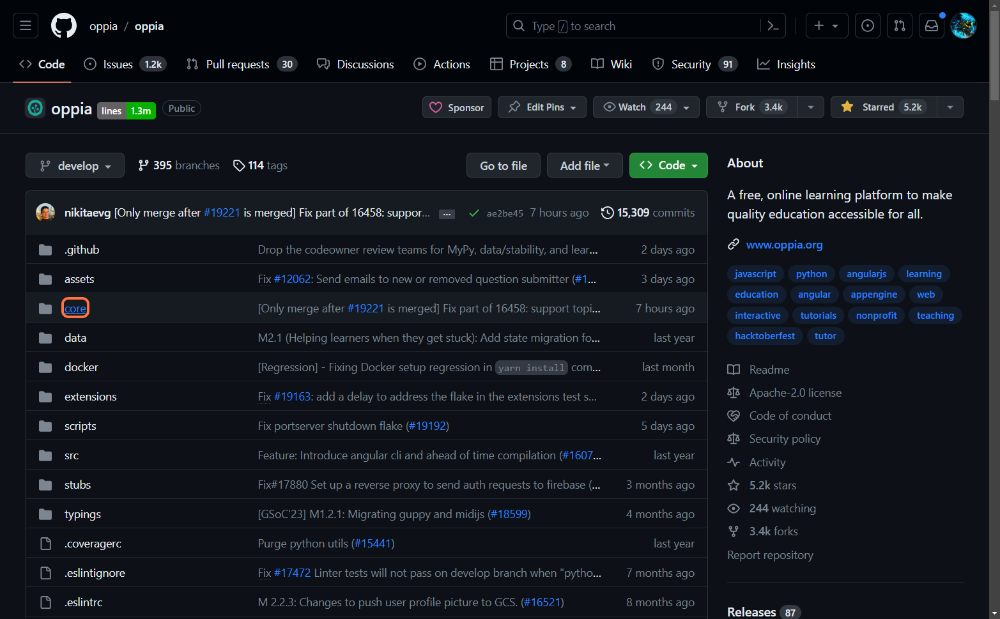
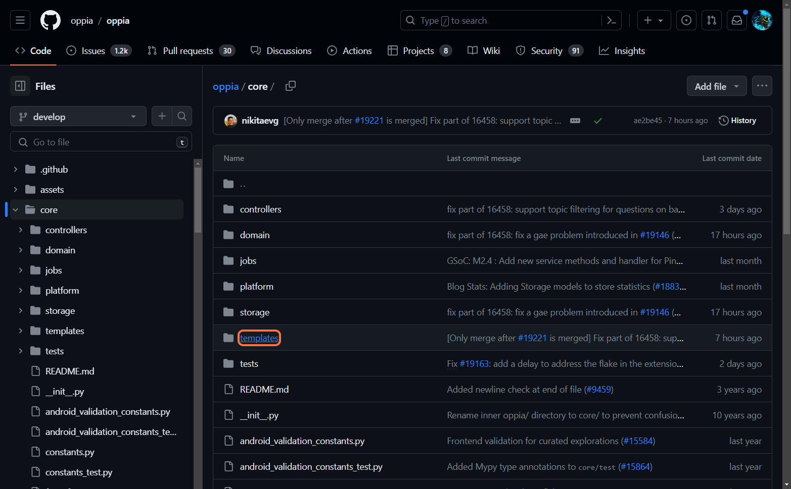
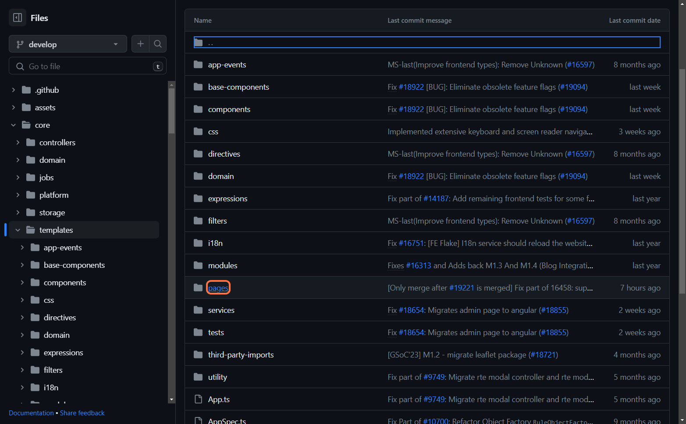
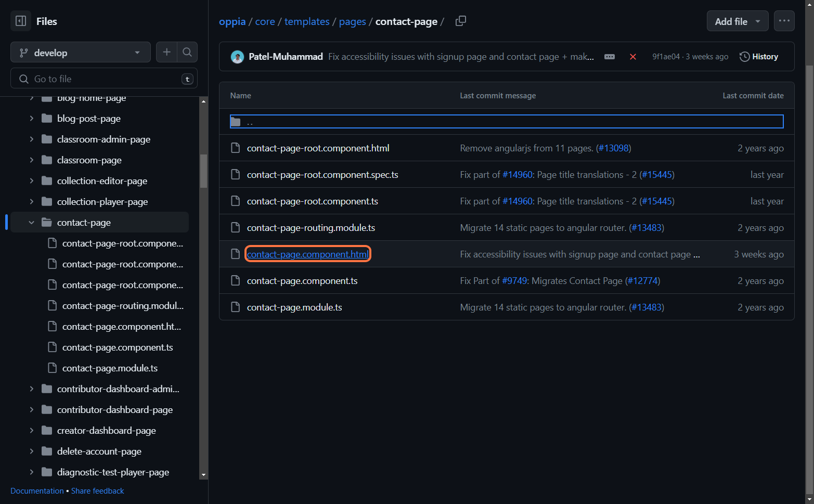
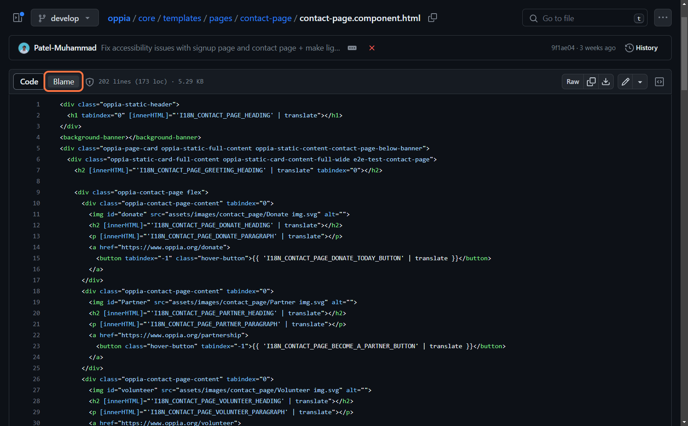
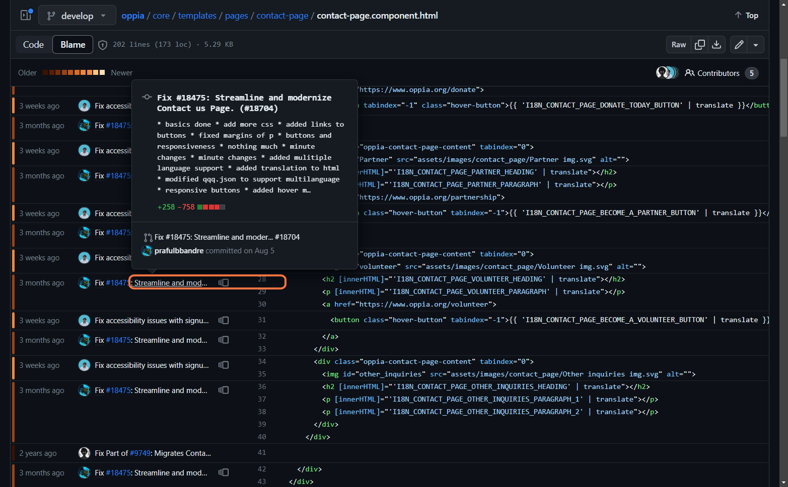
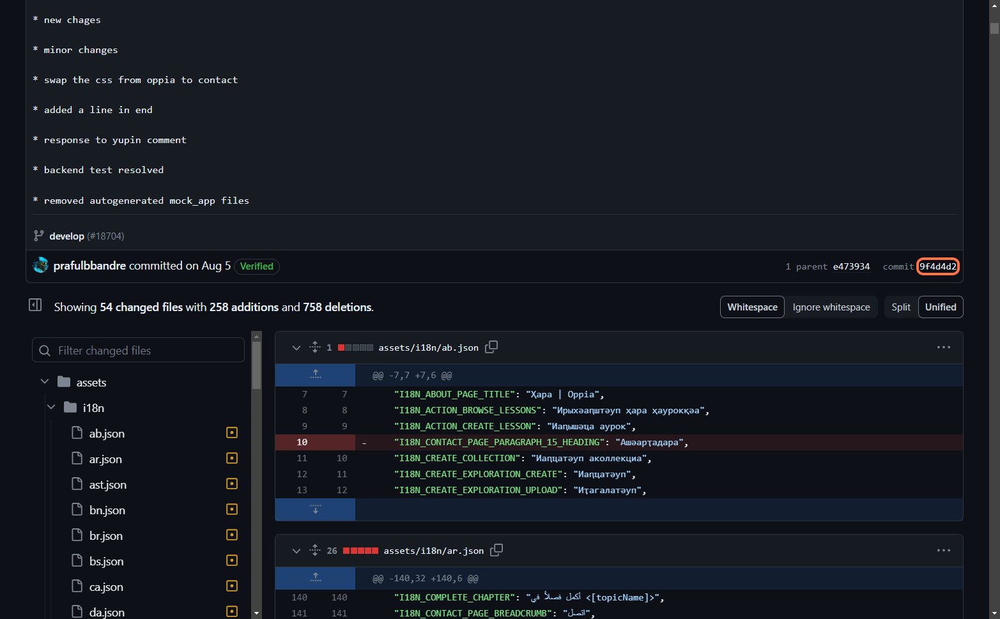

## Finding Bad Commits with the help of `git blame` and `git bisect`

#### Before Using both these commands:
1. **Make sure to checkout to the latest commit and see if the error exists.**
    * **If the error is not reproducible on the latest commit:** we don’t need to do anything! You can post video proof on the issue thread and request that a maintainer close the issue.
    * **Otherwise**: continue with the steps below.
2. **Depending on how far back you want to go, checkout one of the following:**
    * **This commit from Dec 2022 &lt;[9a334e9bde1d3d10e3b69dcd461d3e649733b0c0](https://github.com/oppia/oppia/commit/9a334e9bde1d3d10e3b69dcd461d3e649733b0c0)>, which is when the Python version was last updated – though this might not work if you are using Docker.**
    * **This commit from Aug 2023 &lt;<code>[dc333e4](https://github.com/oppia/oppia/commit/dc333e4e25dc72e22910cb6f8ef32ae652a29dad)</code>>, which is when Docker was first usable.</strong>
    * <strong>The latest release commit (you can find the hash and release date [here](https://github.com/oppia/oppia/releases)), if you want to see whether the error happened since the last release;</strong>
3. <strong>If the issue is <span style="text-decoration:underline;">not</span> reproducible on that commit then go ahead with the approach provided below.</strong>
4. <strong>If the issue is reproducible on that commit, report that info on the issue thread or group chat as appropriate. Include a link to the commit and mention the month/year it was made.</strong>

<!-- <span style="text-decoration:underline; font-size: 20px;">Git Blame</span> -->
## Git Blame

**`git blame` is a powerful Git command that helps you identify who last modified each line of a file. It's a useful tool for understanding the history of changes in a file and finding out who made specific modifications.**

How to use `git blame` to find bad commits:


1. Based on console errors or analysis of the code, find out which line(s) of code are causing problems.
2. Run `git blame` for that specific file and see if the line was recently introduced to the file.
3. Once the commit is obtained from the “blame” view, checkout that commit
    ```bash
    git checkout <commit-id>
    ```
    and see if the error is present. If yes, then checkout its parent commit (one commit earlier – you can find out what this is with `git log`).

4. If the parent commit doesn’t have errors, then you’ve confirmed that the error is due to that commit through which the lines are added to the codebase. Congratulations! Mention this info in the issue thread and include a link to the problematic commit.

## Using GitHub Website
    

Using the GitHub website, you can view the blame information for a file directly in the GitHub interface. Let’s try and use this feature on a file (contact-page.component.html) in the Oppia Repository.

If you want a **guided Practical** go [here](https://app.tango.us/app/workflow/Using-Blame-with-github-Website--f48fa87dc2e749e2af2dbd10281f4ec2), and then click on "**Guide me**".


Let’s start: 


1. **Open the GitHub repository in your web browser.**


2. **Navigate to the file(In this example we need to navigate to the core/templates/pages/contact-page/contact-page.component.html)**










3. **Open the file by clicking on its name.**





4. **Now, you're viewing the content of the file. To see the blame information:**

    **In the upper right corner of the file view, find the Blame button. It's next to the History and Raw buttons**.





**This will display the blame information for each line directly on the GitHub website. You can see the commit hash, author, and date for each line in the file.**





**If you click on the "Blame Info" as shown in the above image you will be forwarded to the commit page where it belongs.**





## Git Bisect

**`git bisect` is a powerful Git command that helps you find the commit that introduced a bug or regression in your codebase. It uses a binary search algorithm to efficiently narrow down the range of commits where the issue was introduced.**


Steps to use Git Bisect:

1. Open your Terminal.

2. navigate to your git repository using the `cd` command.

    ```bash
    cd opensource/oppia
    ```


3. Start the “git bisect” process.

    ```bash
    git bisect start
    ```


4. Mark the current commit as bad (where the bug exists):

    ```bash
    git bisect bad
    ```


5. Mark an older commit known to be bug-free as good (see [point 2](#bookmark=kix.vtty5bx24m2x) in the initial instructions):

    ```bash
    git bisect good <commit-id>
    ```


6. **Git will automatically checkout a commit in the middle of the range. Test your code to determine if the bug is present (e.g. refresh your browser and try to reproduce the error).**
    * If the bug is present, mark the current commit as bad, so that “git bisect” only searches the range from the good commit to the current commit:

        ```bash
        git bisect bad
        ```


    * If the bug is not present, mark the current commit as good, so that “git bisect” only searches the range from the current commit to the latest commit on develop:

        ```bash
        git bisect good
        ```


7. Repeat steps 6 until Git identifies the commit where the bug was introduced.
8. Once Git finds the first bad commit, it will display the commit hash.
9. To end the “git bisect” process, reset back to your original branch:

    ```bash
    git bisect reset
    ```


    Now, you have the commit-id that has introduced the bug. Report it in the issue thread, and then you can either fix it forward or revert the problematic commit.


    **Tip:** While bisecting, you might need to inspect the changes in each commit. You can use this command to view those details: 

    ```bash
    git show <commit-id>
    ```


## Appendix: Using “`git blame`” on CLI

**<span style="text-decoration:underline;">If you prefer using your terminal, here is how you can do “`git blame`”:</span>**

i. First navigate the file location using the `cd` command.

ii. Then use the `git blame` command (`git blame <file_name>`).
Example: 
```bash
git blame myfile.txt
```
(where  myfile.txt  is the name of the file.)

The output of `git blame` includes the following information:
* **Commit Hash:** The unique identifier of the commit.
* **Author:** The person who made the last modification.
* **Date:** The timestamp of the last modification.
* **Line Number:** The line number in the file.

This is the example line from the output :

```
^7d4a35b (John Doe 2023-01-15 12:30:00 42) This is a line in the file.
```


#### **In this example:**
* `7d4a35b` is the commit hash.
* `John Doe` is the Author.
* `2023-01-15 12:30:00` is the date and time of last modification.
* `42` is the line number.