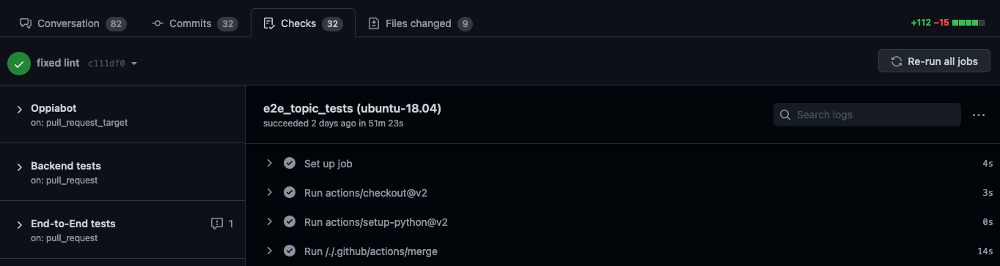

## Table of contents

* [Introduction](#introduction)
* [Merge conflicts](#merge-conflicts)
* [Network problems](#network-problems)
* [Failing tests and lint checks](#failing-tests-and-lint-checks)

## Introduction

If your PR build fails, do not despair! Scroll down to the bottom of the PR thread until you see the results of the continuous integration (CI) tests that ran:


The failure may be due to one of the following things:

* If you see a warning that your PR has a merge conflict, then see the [merge conflicts section](#merge-conflicts) below.
* If your issue is not a merge conflict, then click on the "Details" link next to any failing builds and inspect the logs.

  * If you see an error when installing third-party libraries, then there was probably a network issue. See the [network problems](#network-problems) section below.
  * If you see from the logs that a test or lint check is failing, see the [failing tests and lint checks section](#failing-tests-and-lint-checks) below.

If many of the CI checks are failing at once, your PR has probably resulted in a breakage. To debug and fix this, try [running the local development server](https://github.com/oppia/oppia/wiki/Installing-Oppia-%28Mac-OS%3B-Python-3%29#running-oppia-on-a-development-server) and checking that the website behaves normally, with no errors in the developer console. Often, you will probably get errors in the backend server logs or the developer console which will help you figure out what is going wrong. The CI logs should also contain useful information that can help with debugging.

## Merge conflicts

You can fix merge conflicts by following the "merge from develop" instructions in  [step 5 of our instructions for making a pull request](https://github.com/oppia/oppia/wiki/Make-a-pull-request#step-5-address-review-comments-until-all-reviewers-approve). Then when you push the merge commit to your feature branch on GitHub, the merge conflict message will disappear.

## Network problems

If the error has a message like the one below, then it is due to a network error and is unrelated to your PR. Please reach out to a code owner or Core Maintainer to restart your test.

```text
Installing Node.js
Traceback (most recent call last):
  File "/usr/local/lib/python2.7/runpy.py", line 174, in _run_module_as_main
    "__main__", fname, loader, pkg_name)
  File "/usr/local/lib/python2.7/runpy.py", line 72, in _run_code
    exec code in run_globals
  File ".../scripts/install_third_party_libs.py", line 311, in <module>
    main()
  File ".../scripts/install_third_party_libs.py", line 236, in main
    setup.main(args=[])
  File "scripts/setup.py", line 158, in main
    download_and_install_node()
  File "scripts/setup.py", line 120, in download_and_install_node
    outfile_name)
  File "scripts/setup.py", line 81, in download_and_install_package
    python_utils.url_retrieve(url_to_retrieve, filename=filename)
  File "python_utils.py", line 289, in url_retrieve
    return urllib.urlretrieve(source_url, filename=filename)
  File "/usr/local/lib/python2.7/urllib.py", line 98, in urlretrieve
    return opener.retrieve(url, filename, reporthook, data)
  File "/usr/local/lib/python2.7/urllib.py", line 289, in retrieve
    "of %i bytes" % (read, size), result)
urllib.ContentTooShortError: retrieval incomplete: got only 7372553 out of 18638507 bytes

Exited with code exit status 1
```

If you see a different error while installing third-party libraries, please file an issue and mention @automated-qa-reviewers to notify the Automated QA team.

## Failing tests and lint checks

If you see that a test or lint check is failing, there are two possibilities: your code could be wrong, or the test/check could be flaky. There is no easy way to tell whether a particular failure is a flake, but here are some guidelines:

* Flakes mostly occur in the end-to-end (E2E) tests. Sometimes we see flakes in the lighthouse or frontend tests, but the backend tests and linters almost never flake.
* Consider whether your changes could have plausibly caused the failure. For example, if you just updated the README, then there's no way that you could have broken an E2E test. However, be careful to consider that changes in one part of the code can have unintended effects in apparently unrelated code. For example, if you add an E2E test that creates an exploration with the same name as an exploration created by another E2E test, you could break that other E2E test, even if it's testing completely unrelated code.
* Check whether the error message you see matches a known flake. For E2E tests, look for a green message in the log like this:

  ```text
  E2E logging server says test flaky: {{true/false}}
  ```

  This message is based on a list of known flakes maintained by the Automated QA team. Note however that this list may be incomplete, so a test could be flaking even if this message says `false`.

Note that all our CI checks except for the backend tests merge from the upstream `develop` branch before running, so you may need to merge from `develop` locally to reproduce the failure.

If your code is wrong, then you'll need to fix it just as you would [respond to reviewer comments](https://github.com/oppia/oppia/wiki/Make-a-pull-request#step-5-address-review-comments-until-all-reviewers-approve). You may also want to review the following documentation to help you debug:

* If a lint check is failing, see [[Lint Checks|Lint-Checks]].
* If a test is failing, see [[Tests|Tests]].
* For general debugging tips, see our [[debugging guides|Debugging]].

If the test/check is flaky, and you have confirmed that it's not due to your changes, please file a [CI Flake report](https://github.com/oppia/oppia/issues/new?assignees=&labels=triage+needed%2Cbug&projects=&template=3_ci_error_template.yml&title=%5BFlake%5D%3A+). After doing that, you can restart the test as follows:

1. Click the "Details" link next to the test you want to restart.

   

2. Click on the "Re-run all jobs" button in the upper-right.

   

   If you don't see the button or cannot click it, you might not have the necessary permissions. In that case, ask one of your reviewers to restart the test for you. When doing this, please **provide a link to the [CI Flake report](https://github.com/oppia/oppia/issues/new?assignees=&labels=triage+needed%2Cbug&projects=&template=3_ci_error_template.yml&title=%5BFlake%5D%3A+) you filed.**

Following these instructions should result in PRs that are green and ready to merge by the time a reviewer looks at them, thus shortening the review cycle! If you are still unable to resolve the issues yourself, please follow our instructions to [[get help|Get-help]] from other developers.
