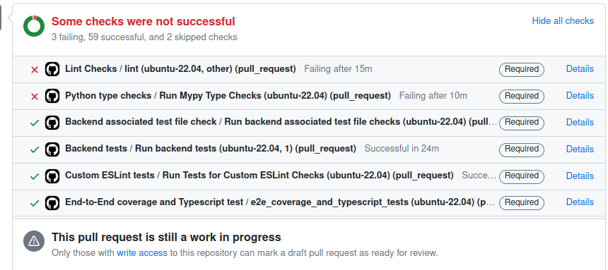
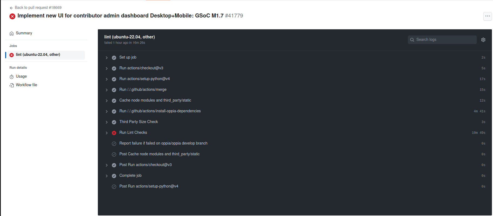
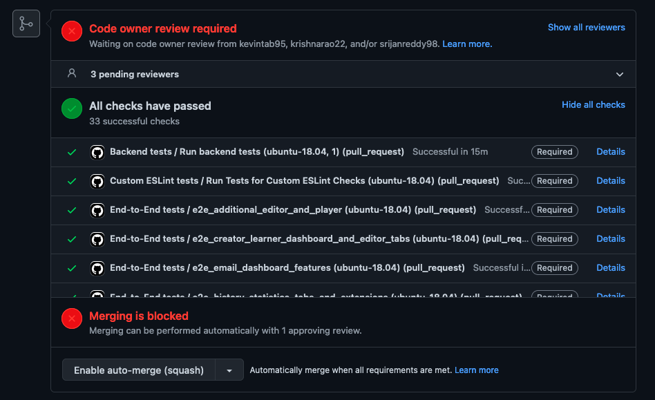
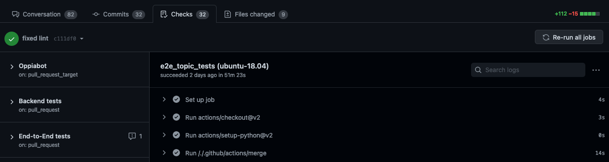

## Table of contents

* [General instructions](#general-instructions)
  * [Why is an unrelated CI check failing on my PR?](#why-is-an-unrelated-ci-check-failing-on-my-pr)
  * [Failures in the merge queue](#failures-in-the-merge-queue)
* [Figuring out whether the failure is due to your PR or an existing issue](#figuring-out-whether-the-failure-is-due-to-your-pr-or-an-existing-issue)
  * [What to do if the failure is due to your PR](#what-to-do-if-the-failure-is-due-to-your-pr)
  * [What to do if the failure is due to an existing issue](#what-to-do-if-the-failure-is-due-to-an-existing-issue)

## General instructions

If your PR build fails, do not despair! Follow these instructions:

1. Scroll down to the bottom of the PR thread until you see the results of the continuous integration (CI) tests that ran.

1. If you see a warning that your PR has a **merge conflict**, you will need to resolve the conflict. (If not, you can skip this step.) To resolve a merge conflict, follow the "merge from develop" instructions in  [step 5 of our PR guide](https://github.com/oppia/oppia/wiki/Rules-for-making-PRs#step-5-address-review-comments-until-all-reviewers-approve). Once you push the merge commit to your feature branch on GitHub, the merge conflict message will disappear.

1. At the bottom of the PR thread, you will see a set of results that looks similar to the following. (**Note:** If your failure happens in the merge queue, you might need to click on "View details" to see the corresponding table.)

     

   In the example above, the lint checks and Mypy checks have failed. Also, two checks were skipped due to the failure of one of the e2e tests. (This is because, in the event of an e2e test failure, any remaining e2e tests that are queued or currently running will be terminated and marked as "skipped.") The rest of the tests have passed.

1. Look for the specific test that is failing, and click the "Details" link next to the failing test to go to the GitHub Actions page for that test run. (If multiple tests are failing, do this and the following steps for each of the failures separately.)

1. In GitHub Actions, select the job under 'Jobs' to see the logs for that particular job.

1. Read the GitHub Actions log to figure out what the actual failure is.

     

1. Search for the error message on the [issue tracker](https://github.com/oppia/oppia/issues) to see whether the error has been reported before. If there's an open issue for the same error, see [What to do if the failure is due to an existing issue](#what-to-do-if-the-failure-is-due-to-an-existing-issue), below.

1. Otherwise, the error might be due to your PR, and you'll need to investigate it further. See [Figuring out whether the failure is due to your PR or an existing issue](#figuring-out-whether-the-failure-is-due-to-your-pr-or-an-existing-issue), below.

### Why is an unrelated CI check failing on my PR?

The tests/checks on Oppia's develop branch sometimes fail incorrectly for two reasons:

  * Sometimes, the tests in develop are "flaky", which means they pass sometimes and fail sometimes, even though the code has not changed. This is usually due to "race" conditions where multiple changes happen at the same time and it's not guaranteed which one happens first. The dev workflow team is trying to reduce cases like this, though they still happen occasionally.

  * If an incorrect PR was recently merged to develop, this could cause the tests to fail. If you see the same failure happening on the [develop branch](https://github.com/oppia/oppia/actions?query=branch%3Adevelop), please follow the [[Revert and Regression Policy|Revert-and-Regression-Policy]] immediately so that we can revert the problematic changes as soon as possible. Otherwise, this will start to affect all the PRs and block the development workflow completely.

### Failures in the merge queue

If the CI checks pass on your PR, but you only see a failure in the merge queue when attempting to merge, do the following:

1. Verify that the issue is not due to your PR (see [Figuring out whether the failure is due to your PR or an existing issue](#figuring-out-whether-the-failure-is-due-to-your-pr-or-an-existing-issue), below).

1. Follow the instructions in [What to do if the failure is due to an existing issue](#what-to-do-if-the-failure-is-due-to-an-existing-issue), below (i.e. ensure that an issue is filed for the failure, and leave a comment on it).

1. Leave a comment on your PR that (a) provides a link to the issue above, and (b) explicitly ask the maintainers to force-merge your PR.

## Figuring out whether the failure is due to your PR or an existing issue

If there isn't an open issue already corresponding to the failure you are seeing, then either your code could be wrong, or the test/check on Oppia's develop branch could be incorrect. You will need to determine which of these cases it is.

Here are some tips for how to determine whether the failing CI check is due to your code or a problem in Oppia's develop branch:

* **Look at the failure logs** to understand the source of the failure.
* **Look at the issue tracker** to see whether the failure has already been filed. If it has, it's probably not due to your PR.
* **Look at the [failures in develop](https://github.com/oppia/oppia/actions?query=branch%3Adevelop)** to see whether the same failure happens there as well. If it does, it's probably not due to your PR.

Otherwise, look carefully at the files changed in your PR. Could your changes have plausibly caused the failure? For example, if your PR just updates the README, then there's no way that you could have broken an E2E test. Similarly, PRs that only modify frontend files are unlikely to cause errors in the "install third-party dependencies" step. However, note that changes in one part of the code can have unintended effects in apparently unrelated code -- for example, if you add an E2E test that creates an exploration with the same name as an exploration created by another E2E test, you could break that other E2E test, even if it's testing completely unrelated code.

If the failure could be due to your PR, see [What to do if the failure is due to your PR](#what-to-do-if-the-failure-is-due-to-your-pr), below. Otherwise, if the error isn't related to your PR and there isn't an existing issue for it, you might need to file a new issue for the failure. See [What to do if the failure is due to an existing issue](#what-to-do-if-the-failure-is-due-to-an-existing-issue), below.

### What to do if the failure is due to your PR

To debug and fix the failure, always start from the errors in the CI logs. They contain useful information that can help you with debugging. You can also do the following to get more information about what is causing the error:

  * Find the command that the CI workflow uses to run the tests, and run that command on your local machine. Note that all our CI checks merge from the upstream `develop` branch before running, so you might also need to merge from `develop` locally to reproduce the failure on your machine.

  * [Run the local development server](https://github.com/oppia/oppia/wiki/Installing-Oppia-%28Mac-OS%3B-Python-3%29#running-oppia-on-a-development-server) and check that the website behaves normally, with no errors in the developer console. Often, when doing this, you will get errors in the backend server logs or the developer console which can help you figure out what is going wrong.

> [!TIP]
> When running the test locally, make sure that you are using the same command that is used in CI, with the same flags. Otherwise, you might encounter different results locally and on CI. You can double-check the command by looking at the corresponding test script in `.github/actions/workflows`, or by examining the corresponding test log on GitHub Actions.

> [!NOTE]
> Even with the same command, tests can fail on CI even if they pass locally, because the two environments are different. In such cases, the CI checks are what determines success, so you might need to "debug on CI" if you cannot reproduce the error locally. If you need to do this, it is generally a good idea to make the debugging cycle as short as possible (e.g. by temporarily deleting other workflow files so that GitHub CI only runs the test that you're interested in).

If your code is wrong, you will need to fix the error just as you would [respond to reviewer comments](https://github.com/oppia/oppia/wiki/Rules-for-making-PRs#step-5-address-review-comments-until-all-reviewers-approve). You may also want to review the following documentation to help you debug:

  * If a lint check is failing, see [[Lint Checks|Lint-Checks]].
  * If a test is failing, see [[Tests|Tests]].
  * For general debugging tips, see our [[debugging guides|Debugging]].

If you are stuck, compile all your findings in a [[debugging doc|Debugging-Docs]] and post it in [GitHub Discussions](https://github.com/oppia/oppia/discussions/categories/q-a-debugging-docs). The Oppia maintainers and other community members can then give you suggestions on what to investigate next.

### What to do if the failure is due to an existing issue

1. **Document the error.**

   * If the error message you see matches a known issue on the [issue tracker](https://github.com/oppia/oppia/issues), leave a comment on that known issue that points to the failing check on your PR, to document that it is still happening. This will help the dev workflow team recognize that this issue is happening frequently and increase its priority.

   * If the error message you see doesn't match a known issue, but you have confirmed that it's not due to your changes, please file a [CI Failure report](https://github.com/oppia/oppia/issues/new?assignees=&labels=triage+needed%2Cbug&projects=&template=3_ci_error_template.yml&title=%5BFlake%5D%3A+) that documents the error. Additionally, if you can [[trace which PR caused the error|How-to-find-the-commit-which-introduced-a-bug]], please link to it as well so that the Oppia maintainers can [revert it](https://github.com/oppia/oppia/wiki/Revert-and-Regression-Policy) if needed.

2. **Restart the failing test on your PR.**

   * If you have been added to the Oppia repository as a collaborator, you can restart the test as follows:

     * Click the "Details" link next to the test you want to restart.

       

     * Click on the "Re-run all jobs" button in the upper-right.

       

   * If you don't see the button or cannot click it, you might not have the necessary permissions. In that case:

     * Leave a comment on your PR that says something like "I have investigated the flake and it is the same one as reported in issue #XXX. Here is [the comment](link) I left in that issue pointing to this PR. Please could a maintainer help restart the test?" Then, tag one of your reviewers in the comment, so that they can help restart the test for you.

     * If you don't hear back within 24 hours, please use [GitHub Discussions](https://github.com/oppia/oppia/discussions/categories/q-a-contacting-folks) to request a follow-up.

   * If the CI failure persists after 1 restart and continues to block your PR from being merged, please escalate the issue to the dev workflow team on both the issue thread and GitHub Discussions, since this is an indicator that it might start affecting other PRs.
