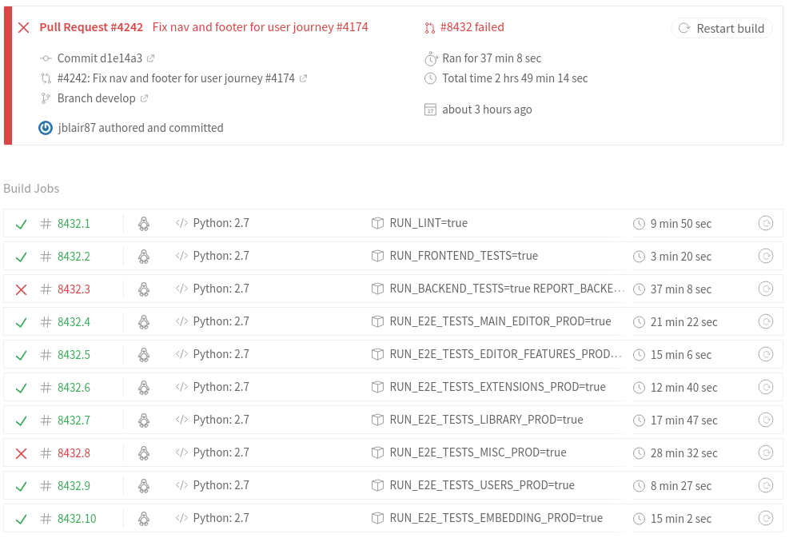

...do not despair! The failure may be due to one of following things:

- There's a merge conflict (in which case, Travis won't actually run).
- Your code is wrong.
- Travis is being flaky (e.g. network issues).

To figure out which it is, check the bottom of the GitHub PR thread. If there's a merge conflict, it will show up there. You'll need to fix the conflict by following the [instructions for making a code change](https://github.com/oppia/oppia/wiki/Contributing-code-to-Oppia#instructions-for-making-a-code-change) and pushing a new commit to the branch before Travis can run.

Otherwise, if Travis explicitly shows a failure, click the "Details" link at the bottom of the GitHub PR thread (at the right of "The Travis CI build failed"):

  

This will take you to the Travis dashboard for your PR. You can see which tests have failed (marked with an X) and which have stalled (marked with a !); both of these are errors that need to be resolved:

  

To figure out what you need to do next, click on the individual failed test(s) and have a look at the error log, then:

* If the error seems related to your PR, you probably have an error somewhere. You can try to reproduce the error locally: see the relevant section in [Running Tests](https://github.com/oppia/oppia/wiki/Running-Tests#end-to-end-tests) for instructions on how to run specific e2e tests on your local machine. If it still happens locally, then it's something that needs to be fixed. Note that all linter and backend errors fall into this category.

* If the error seems unrelated to your PR, it might be due to a recently-merged PR. Try figuring out the root cause of the error. If it is due to a recently-merged PR, then identify the PR that caused the issue and revert it. (In general, it is better to revert the bad PR rather than trying to fix the issue, since the latter would cause further delays in resolution and more PRs to get blocked while the fix is in progress.)

* If the error seems totally unrelated to your PR, and is not due to a recently-merged PR, or the test has just stalled (e.g. "Failed: Timed out waiting for Angular"), this might just be Travis being flaky. Make sure you're logged in to Travis (with your GitHub account), then go to the log for the failing test, and click the 'refresh' button in the top right of that specific test page. (Don't click the refresh button in the top right of the overall dashboard, unless you want to run *all* the tests again.)
  - **Note:** If you're new to Oppia and haven't been added yet as a collaborator to the repo, you might not have permissions to restart the failing test. In that case, please [ask on Gitter](https://gitter.im/oppia/oppia-chat) if someone can help you out, and provide a URL to the Travis CI page for your PR.
  - **Note:** The Core Maintainers have a [spreadsheet](https://docs.google.com/spreadsheets/d/1y_zk1S7YjybqxKXXh8GLPnILhBIGOr7zRvE80CPvCKk/edit#gid=0) that tracks CI failure issues which affect multiple PRs. If you do not see your issue there (or if the issue is there but has an old filing date), and can confirm that the issue is affecting other PRs and is not due to your code specifically, please email oppia-core-maintainers@googlegroups.com and the team will look into it.
  - **Note:** A list of known flakiness issues, for which restarting is the only option, can be found at the bottom of this wiki page. You can also check the [oppia-dev@ mailing list](https://groups.google.com/forum/#!forum/oppia-dev) for announcements of known issues.

Following these instructions should result in PRs that are green and ready to merge by the time a reviewer looks at them, thus shortening the review cycle!


## Common flakiness issues

* If the error has a message like the one below, then it is due to a network error and is unrelated to your PR. Please reach out to a code owner or Core Maintainer to restart your test.

   ```
   Installing Node.js
   Traceback (most recent call last):
     File "/usr/local/lib/python2.7/runpy.py", line 174, in _run_module_as_main
       "__main__", fname, loader, pkg_name)
     File "/usr/local/lib/python2.7/runpy.py", line 72, in _run_code
       exec code in run_globals
     File "/home/circleci/oppia/scripts/install_third_party_libs.py", line 311, in <module>
       main()
     File "/home/circleci/oppia/scripts/install_third_party_libs.py", line 236, in main
       setup.main(args=[])
     File "scripts/setup.py", line 158, in main
       download_and_install_node()
     File "scripts/setup.py", line 120, in download_and_install_node
       outfile_name)
     File "scripts/setup.py", line 81, in download_and_install_package
       python_utils.url_retrieve(url_to_retrieve, filename=filename)
     File "python_utils.py", line 289, in url_retrieve
       return urllib.urlretrieve(source_url, filename=filename)
     File "/usr/local/lib/python2.7/urllib.py", line 98, in urlretrieve
       return opener.retrieve(url, filename, reporthook, data)
     File "/usr/local/lib/python2.7/urllib.py", line 289, in retrieve
       "of %i bytes" % (read, size), result)
   urllib.ContentTooShortError: retrieval incomplete: got only 7372553 out of 18638507 bytes

   Exited with code exit status 1
   ```
