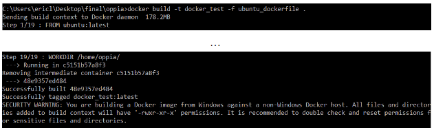

# Table of Contents

* [Installing Oppia in Windows and WSL2](#installing-oppia-in-windows-and-wsl2)
  * [Step 1: Check if your Windows is up to date](#step-1-check-if-your-windows-is-up-to-date)
  * [Step 2: Install WSL2](#step-2-install-wsl2)
  * [Step 3: Install the ubuntu app from the Microsoft Store](#step-3-install-the-ubuntu-app-from-the-microsoft-store)
  * [Step 4: Clone your fork and setup](#step-4-clone-your-fork-and-setup)
  * [Step 5: Download and install google-chrome (in the Ubuntu Environment)](#step-5-download-and-install-google-chrome-in-the-ubuntu-environment)
  * [Step 6: Add a lightweight desktop environment](#step-6-add-a-lightweight-desktop-environment)
    * [Edit desktop environment config](#edit-desktop-environment-config)
  * [Step 7: Start the rdp server](#step-7-start-the-rdp-server)
  * [Step 8: Connect to the server using the Windows RDP client](#step-8-connect-to-the-server-using-the-windows-rdp-client)
  * [Step 9: Run Oppia locally](#step-9-run-oppia-locally)
  * [How to run the E2E tests?](#how-to-run-the-e2e-tests)
  * [Miscellaneous](#miscellaneous)
* [Installation in VirtualBox on Windows 10](#installation-in-virtualbox-on-windows-10)
  * [Set up Ubuntu VM in VirtualBox](#set-up-ubuntu-vm-in-virtualbox)
  * [Install Ubuntu 18 ISO](#install-ubuntu-18-iso)
  * [Optional but recommended: Setup VirtualBox config](#optional-but-recommended-setup-virtualbox-config)
* [Installation using Docker on Windows 10](#installation-using-docker-on-windows-10)
  * [Prerequisites and Getting Docker Container Set Up](#prerequisites-and-getting-docker-container-set-up)
    * [Start Docker](#start-docker)
    * [Build the Docker Image](#build-the-docker-image)
    * [Build a Docker container based on image](#build-a-docker-container-based-on-image)
  * [Running Oppia on a development server](#running-oppia-on-a-development-server)
    * [Ensure container is running](#ensure-container-is-running)
    * [Start bash and run the start script](#start-bash-and-run-the-start-script)
  * [Run frontend tests](#run-frontend-tests)
  * [Troubleshooting installation with Docker](#troubleshooting-installation-with-docker)
* [Appendix](#appendix)

**Note:** If you just want to create and share explorations, you may be able to use the hosted server at https://www.oppia.org (in which case you don't need to install anything).

**Note:** These instructions are tested to work on Windows 10. If you have some other version of Windows, we strongly recommend using Linux or Mac OS, if possible.

*For information on issues that may occasionally arise with the installation process, please see the [Troubleshooting](https://github.com/oppia/oppia/wiki/Troubleshooting) page.*

There follow instructions for 3 different ways to install Oppia on Windows: using WSL2, using VirtualBox, and using WSL1. You only need to follow one of the four.
**The first approach (Installing Oppia in Windows and WSL2) is recommended.**

Note: If you already use VirtualBox, it will stop working after installing WSL2 because the hypervisor resource gets locked by WSL2, and can't be used by VirtualBox. WSL2 is much faster, but make sure to copy over all your data from the VM before proceeding with the installation of WSL2.

# Installing Oppia in Windows and WSL2

## Step 1: Check if your Windows is up to date

To do so press "windows-key + r" and type `winver`.


This will open up a window. Note down your windows version number and build number.


Make sure your version and build meet the following criteria:

* For x64 systems: Version 1903 or higher, with Build 18362 or higher.
* For ARM64 systems: Version 2004 or higher, with Build 19041 or higher.
* Builds lower than 18362 do not support WSL 2. Use the Windows Update Assistant to update your version of Windows.


## Step 2: Install WSL2

You can install WSL2 by following the steps [here](https://docs.microsoft.com/en-us/windows/wsl/install-win10) until step 5.

* The windows version number and build number will be useful in determining whether or not your system needs to be updated.


## Step 3: Install the ubuntu app from the Microsoft Store

Install Ubuntu 18.04 LTS from the Microsoft Store.

Once it is installed, run the app from the startup menu. After initializing your environment, it will ask you to create a user. Provide a username and password.


| | |
|-|-|
|||

**Note: You can go for Ubuntu 20.04 or "Ubuntu" as well but it comes as a barebones config. It means that you will have to install all the libs yourself, i.e, gcc, make, etc to run oppia. If you are familiar with these processes then you can use these as well.**

## Step 4: Clone your fork and setup

Inside your Ubuntu environment, follow the steps for [[Linux|Installing-Oppia-(Linux;-Python-3)]].

If you are facing problems with pushing the code to your fork check this link: [WSL_GIT](https://docs.microsoft.com/en-us/windows/wsl/tutorials/wsl-git).

## Step 5: Download and install google-chrome (in the Ubuntu Environment)

_Even if you have Chrome installed on you windows system, you still need to do this to run E2E tests and unit tests._

Run the following commands to download latest chrome:

```console
wget https://dl.google.com/linux/direct/google-chrome-stable_current_amd64.deb
sudo apt install ./google-chrome-stable_current_amd64.deb
```

**Note: make sure to download this outside the oppia folder so that you don't have to worry about pushing the file to your repo by mistake.**


## Step 6: Add a lightweight desktop environment

```console
sudo apt update && sudo apt -y upgrade
sudo apt-get purge xrdp
sudo apt install -y xrdp
sudo apt install -y xfce4
sudo apt install -y xfce4-goodies
sudo cp /etc/xrdp/xrdp.ini /etc/xrdp/xrdp.ini.bak
sudo sed -i 's/3389/3390/g' /etc/xrdp/xrdp.ini
sudo sed -i 's/max_bpp=32/#max_bpp=32\nmax_bpp=128/g' /etc/xrdp/xrdp.ini
sudo sed -i 's/xserverbpp=24/#xserverbpp=24\nxserverbpp=128/g' /etc/xrdp/xrdp.ini
echo xfce4-session > ~/.xsession
```

### Edit desktop environment config

Edit the `/etc/xrdp/startwm.sh` file:

```console
sudo nano /etc/xrdp/startwm.sh
```

Comment out these lines:

```text
#test -x /etc/X11/Xsession && exec /etc/X11/Xsession
#exec /bin/sh /etc/X11/Xsession
```

Add these lines:

```text
# xfce
startxfce4
```

Once inside Nano, you can use the arrow keys to move between lines. When you are done with your changes press: `ctrl+x` followedby `Y` followedby enter to save the file.
You can read more about RDP, XFCE, XRDP in the [Appendix](#appendix).

## Step 7: Start the rdp server

```console
sudo /etc/init.d/xrdp start
```

## Step 8: Connect to the server using the Windows RDP client

The name of the app is "Remote Desktop Connection". It is already installed in the windows system by default. No need to use any third-party app.


It will ask for a field called "computer". Add `localhost:3390` in that field and hit connect.


The very first time it will ask for username and password. Enter the username and password you created in step 3.

You will be asked about the setup for the panel. Just click on default config.


## Step 9: Run Oppia locally

To run the Oppia application locally, run `python -m scripts.start --no_browser` in the Ubuntu environment.
Navigate to any browser and access Oppia at http://localhost:8181.

## How to run the E2E tests?

Open the terminal (in the ubuntu-desktop env/ the RDP client) and run `google-chrome`. Then Open a new terminal tab and run your e2e tests 🙂. To check you can run `python -m scripts.run_e2e_tests --suite="users"`.

**Note: You only need to use the RDP client to run e2e tests. You don't have to start the X server for developing and pushing code.**

## Miscellaneous

- The WSL environment does not support audio, but it can be enabled by installing the [PulseAudio](https://wiki.ubuntu.com/PulseAudio) server on Windows following [this guide](https://token2shell.com/howto/x410/enabling-sound-in-wsl-ubuntu-let-it-sing/). With the latest [wslu package](https://launchpad.net/ubuntu/+source/wslu) installed the starting Ubuntu app detects the running [PulseAudio](https://wiki.ubuntu.com/PulseAudio) server and enables audio.
- VSCode comes with an extension called remote-wsl, that makes it very easy to code when the code exists in your Ubuntu folder.
- Per [this AskUbuntu question](https://askubuntu.com/questions/1115564/wsl-ubuntu-distro-how-to-solve-operation-not-permitted-on-cloning-repository), Git clone doesn’t work on mounted drives within WSL so be sure not to use it.
- When in the Ubuntu file system, you can type `explorer.exe .`  (don't forget the extra dot at the end) to open that folder in your Windows file explorer.
- Default terminal apps in Windows don't have many features. Windows Terminal is an app by Microsoft. It enables multiple tabs (quickly switch between multiple Linux command lines, Windows Command Prompt, PowerShell, Azure CLI, etc), create custom key bindings (shortcut keys for opening or closing tabs, copy+paste, etc.), use the search feature, and custom themes (color schemes, font styles and sizes, background image/blur/transparency). [Learn More](https://docs.microsoft.com/en-us/windows/terminal).
[Link to Install Windows Terminal](https://docs.microsoft.com/en-us/windows/terminal/get-started).

# Installation in VirtualBox on Windows 10

_Last tested by **@Sadasiva20** on Windows 10 in October 28 2023. E2e, frontend and backend tests worked at that point._

_For this method, a machine with at least 8 GB RAM (preferably 16 GB) and at least a dual-core processor (preferably quad-core) is recommended._

With VirtualBox, we run an Ubuntu 18.04 VM, with some minor changes to the VM config. With this installation, the terminal and editor for the codebase will be in VM, while the development site itself can be accessed on the Windows host. This is done so that at least some memory usage can be reduced on VM for better performance.  This configuration was also tested on Ubuntu 22.0.3 VM.

## Set up Ubuntu VM in VirtualBox

Any VM manager is fine, but the instructions here are specific to VirtualBox.

1. Install VirtualBox from [here](https://www.virtualbox.org/wiki/Downloads).
2. Open VirtualBox and click New.
3. Select Type as "Linux", Version "Ubuntu 64bit" and give some name for the VM.
4. In the next page, select an appropriate amount of RAM for the VM (can be changed later). The whole dev environment is verified to work smoothly at 6 GB RAM. At least 4 GB is recommended.
5. In the next page, select "Create a virtual hard disk now" and click Create.
6. Select VDI as the file type.
7. Depending on free space on the machine, either dynamically allocated or static can be chosen here.
8. Select the amount of storage that is needed (around 20 GB should be fine) and select a location on the machine with enough free space to host the VM and click create.

## Install Ubuntu 18 ISO or later version

1. Download the Ubuntu 18.04 64bit ISO from [here](https://releases.ubuntu.com/18.04/).
2. Select the newly created VM in the virtual box and click Start.
3. Here, a window pops up where you have to link the downloaded ISO file. Click the folder icon and select the ISO from your machine.
4. Now, go through the normal Ubuntu installation steps, you can do the following the specific steps:
 * Select "Minimal Installation", and check both checkboxes below it.
 * Select "Erase disk and install Ubuntu". Don't worry, no data in your host machine will be affected :).
5. Once, Ubuntu is running and everything is done installing, exit from VM.

## Optional but recommended: Setup VirtualBox config

_The following has to be done after exiting from VM. Also, the following only needs to be done if you want the browser on the host to have access to the server running in VM. If you allocated enough RAM to handle the browser instance as well in VirtualBox, then you are done and can use the VM as a complete dev environment!_

1. Select the newly created VM in VirtualBox and click Settings.
2. Go to 'System'. Here, you can change the amount of RAM allocated to the VM, and in the 'Processor' tab, you can change the number of cores as well. At least 2 cores are recommended, it is verified to work smoothly at 4 cores.
2. Go to the 'Network' tab. Here, Adapter 1 should be 'NAT', change it to 'Bridged Adapter'.
3. Change the name field to whatever is the network adapter that you are using now (like Wi-Fi or ethernet).

It should look something like this:

[Screenshot](https://drive.google.com/file/d/1dt9qippO7lq6CClywPA0ymhcTSGumSrj/view?usp=sharing)

Now, you can open the VM. Inside the VM, clone and install the Oppia repository from GitHub following the [[Linux installation instructions|Installing-Oppia-(Linux;-Python-3)]] in order to set up Oppia in the VM.

If you have done the optional steps, then when running the dev server in the VM, use the command `python -m scripts.start --disable_host_checking` so that the host can access the server started in the VM. This has to be done whenever you start a server in the VM, if you require the host to access the page.

Once, this is done, whenever you run the dev server in the VM, you can go to your browser on the Windows host and go to: `http://<your_vm's_local_ip>:8181` to access the dev server. You can find your VM's local IP address by running `ifconfig` in a terminal in the VM. It should be the `inet` address of the second adapter shown there (usually starts with 192.168 or 10.0).

# Installation using Docker on Windows 10

**THESE INSTRUCTIONS ARE CURRENTLY NOT WORKING, IF YOU HAVE EXPERIENCE WITH DOCKER WE ARE LOOKING FOR SOMEONE THAT CAN HELP US CREATE A DOCKER FOR OPPIA**

_These notes were kindly contributed by **@ezl-13** on 13 Aug 2019. **Note, though, that this installation method has problems**: getting the frontend (Karma) tests running may not work in a foolproof way, and we haven't figured out how to get the e2e tests running yet._

Docker allows for an easy installation of Oppia for Windows users and a more reliable testing environment for running test scripts. The following instructions describe how to install Oppia using Docker. (If you need help with troubleshooting, please see [this section](https://github.com/oppia/oppia/wiki/Installing-Oppia-(Windows;-Python-3)#troubleshooting).)

## Prerequisites and Getting Docker Container Set Up

You should only need to follow these instructions once.

### Start Docker

1. Download Docker Desktop for Windows:
    - Windows Enterprise and Pro: https://hub.docker.com/editions/community/docker-ce-desktop-windows
    - Windows 10 Home: https://docs.docker.com/toolbox/toolbox_install_windows/

2. Start Docker by clicking on the Docker application (a Docker icon should appear in your taskbar tray).


### Build the Docker Image

1. Build the Docker image from the Oppia root folder (note the "." at the end of the command). Make sure you have a good Internet connection when doing this step.

    If this is your first time running docker build, run:
    ```
      docker build -t {image_name} -f ubuntu_dockerfile .
    ```
    where you should replace `{image_name}` with whatever you want to call your Docker image (say `oppia_image`).

    Expect up to a 2 minute delay until the first line of output is printed to the console. The total runtime for this build should be around 25-30 minutes on a good connection.
    - If successful, the output should say: `successfully tagged {image_name}:latest`. It will also give a security warning, but this is fine. You will be able to see the Docker image’s details by running: `docker images`
    - If it is not successful, it is very likely due to unstable wifi connections. Move next to a router, and retry this step.

    Here's what a successful run looks like:

      


### Build a Docker container based on image

1. Now that the Docker image is built, create a Docker container using that image by running:

   ```console
   docker run -u 0 -it -p 8181:8181 --name {container_name} -v {path_to_oppia_parent_dir}:/home {image_name}:latest bash
   ```

   where you should replace `{container_name}` with whatever you want to call your Docker container (say `oppia_container`), `{path_to_oppia_parent_dir}` with the **absolute path** to your oppia folder's parent directory (which might be `C:\Users\name\Desktop\opensource`), and `{image_name}` with the name of your Docker image (see above).

2. At this point, a container is built with your current oppia directory. Now you should have a new terminal prompt `root@...`. This is a Linux-based terminal. Everything is now set up to run scripts like start.py and run_backend_tests.py. You can type `exit` to return to your Command Prompt.

## Running Oppia on a development server

### Ensure container is running

1. Run `docker ps`.
    - If this outputs a container, move on to step 3. Note: the `{container_name}` in the following steps can be found under the “NAMES” column of the output of `docker ps`.
    - If this does not output a container, move on to step 2.

2. Run `docker ps -a`
    - If this outputs names of containers, find the NAME of the most recent container and run: `docker start {container_name}`
    - If this does not output names of containers, run: `docker images` to get the name of a previously built image and follow step 4 from the prerequisite instructions. Then return to step 1 to ensure that the container is running.


### Start bash and run the start script

1. Start bash in the updated Docker container: `docker exec -it {container_name} bash`

2. Now you should have a new terminal prompt`root@...`. Run the start.py script: `python -m scripts.start`

The estimated runtime for this script is about 10-20 minutes. It will open a server at localhost:8181. After the terminal prints `INFO ... http://0.0.0.0:8181` or `+ 27 hidden modules`, open localhost:8181 in your local computer browser. If the Oppia server does not load, restart this step.

**Note:** The script should continue to run so long as the development server is on (you’ll see a lot of lines that start with “INFO”) and you’re able to navigate to the page.

## Run frontend tests

> **Note**
> run_frontend_tests.py might not run correctly every time, and we’re still working on figuring out why.

1. If you are in the Docker container bash, type `exit` to return to your Command Prompt.

2. Ensure that node.js is installed on your Windows computer by running `node -v`. If not, install it from [here](https://nodejs.org/en/download/).

3. Run `pip install future`

4. Run these two commands to manually compile the frontend tests and run the tests:
     ```
       node .\node_modules\typescript\bin\tsc --project .
       node .\node_modules\karma\bin\karma start .\core\tests\karma.conf.ts
     ```
   If this outputs an error, please see [this section](https://github.com/oppia/oppia/wiki/Installing-Oppia-(Windows;-Python-3)#troubleshooting) for alternative commands.

You're done! Now return to the [code contribution instructions](https://github.com/oppia/oppia/wiki/Contributing-code-to-Oppia), skipping the step about cloning the Oppia repository with `git`.

## Troubleshooting installation with Docker

- If docker outputs: Error processing … no space left on device.
  - Then: run docker system prune (to delete terminated docker images / containers)

- If docker outputs: docker: Error response from daemon: … port is already allocated.
  - Then: restart docker by right clicking on the icon in the taskbar and clicking Restart

- If docker outputs: unzip not found
  - Then: run bash scripts/install_prerequisites.sh inside of the Docker image (bash)

- If docker outputs: npm: no such file or directory
  - Then: run the following two commands:
       ```
         curl -sL https://deb.nodesource.com/setup_8.x | bash
         apt-get install nodejs
       ```

- If the frontend test command is not working
  - Then: try these 2 alternative options:
    - Option 1:
       Start bash in the Docker container (follow steps 1-3 from running Oppia on a development server).
       Run the run_frontend_tests.py script. The expected runtime is about 3-7 minutes.
       ```
         python -m scripts.run_frontend_tests
       ```
    - Option 2:
       Start bash in the Docker container (follow steps 1-3 from running Oppia on a development server).
       Run these two commands to manually compile the frontend tests and run the tests:
       ```
         ./node_modules/typescript/bin/tsc --project .
         ./node_modules/karma/bin/karma start ./core/tests/karma.conf.ts
       ```

# Appendix

- RDP: Remote Desktop Protocol is a proprietary protocol developed by Microsoft which provides a user with a graphical interface to connect to another computer over a network connection. The user employs RDP client software for this purpose, while the other computer must run RDP server software. [More Info](https://en.wikipedia.org/wiki/Remote_Desktop_Protocol).

- XRDP: xrdp is a free and open-source implementation of Microsoft RDP server that enables operating systems other than Microsoft Windows to provide a fully functional RDP-compatible remote desktop experience. It works by bridging graphics from the X Window System to the client and relaying controls from the client back to X. [More Info](https://en.wikipedia.org/wiki/Xrdp).

- XFCE: Xfce or XFCE is a free and open-source desktop environment for Linux and BSD operating systems. Xfce aims to be fast and lightweight while still being visually appealing and easy to use. Xfce embodies the traditional Unix philosophy of modularity and re-usability. [More Info](https://en.wikipedia.org/wiki/Xfce).
