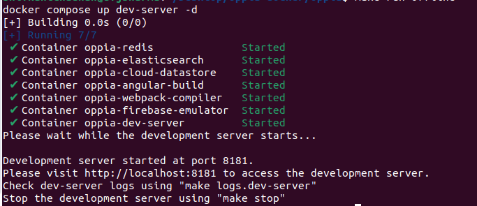

This guide provides step-by-step instructions for installing Oppia using Docker. Docker simplifies the installation process and ensures a consistent environment across different systems, making it easier to set up and run Oppia.
If you get stuck somewhere and need help, please refer to our [[Getting Help Page|Get-help]].

## Table of Contents

- [Docker - Brief Overview](#docker---brief-overview)
- [Installation Steps](#installation-steps)
  - [Clone Oppia](#clone-oppia)
  - [Pre-requisites for setting up the development server](#pre-requisites-for-setting-up-the-development-server)
  - [Launching the development server](#launching-the-development-server)
- [Using Flags with Make Command](#using-flags-with-make-command)
- [Additional Make Commands](#additional-make-commands)
- [Contributing](#contributing)

## Docker - Brief Overview

Docker is an open-source platform that automates the deployment, scaling, and management of applications using containerization. Containers provide lightweight and isolated environments that encapsulate application dependencies and configurations, making installations more reliable and error-resistant.

Using Docker to install Oppia eliminates the need for extra configurations or setting up development environments for the local server. It provides a consistent and reproducible environment for running Oppia across different systems.

## Pre-requisites for setting up the development server

1. **Install Docker Desktop**: Download and install the latest version of Docker Desktop from the [official Docker website](https://www.docker.com/products/docker-desktop/). Docker Desktop provides a user-friendly interface for developers. Follow the steps in the given link to download and install it.
2. **For Windows users**: Prior to proceeding with the setup, make sure you have activated the WSL2 backend for Windows in Docker Desktop. You can find instructions on how to do this [here](https://docs.docker.com/desktop/wsl/). Additionally, ensure that you execute all the `make` commands within the Windows Subsystem for Linux 2 (WSL2) terminal.

**Note for Developers: Data required to setup Oppia using Docker Desktop**

It takes 2.5 GB of data to download all the dependencies for setting up Oppia using Docker.
- 2.1 GB to download the dependencies on running ``` make build ```.
- 470 MB to download the dependencies on running ``` make run-devserver ``` for the first time.

## Installation Steps

To install Oppia under Docker, follow these steps:

### Clone Oppia

1. Create a new, empty folder that will hold your Oppia work. Here, we call the folder `opensource`.

2. Navigate to the folder (`cd opensource/`). Next, we'll [fork and clone](https://help.github.com/articles/fork-a-repo/) the Oppia repository.

3. Navigate to https://github.com/oppia/oppia and click on the `fork` button. It is placed on the right corner opposite the repository name `oppia/oppia`.

   

   You should now see Oppia under your repositories. It will be marked as forked from `oppia/oppia`.

   

4. Clone the repository to your local computer (replacing the values in `{{}}`):

   ```console
   $ git clone https://github.com/{{GITHUB USERNAME}}/oppia.git
   Cloning into 'oppia'...
   remote: Enumerating objects: 203313, done.
   remote: Total 203313 (delta 0), reused 0 (delta 0), pack-reused 203313
   Receiving objects: 100% (203313/203313), 179.26 MiB | 3.12 MiB/s, done.
   Resolving deltas: 100% (155851/155851), done.
   Updating files: 100% (4199/4199), done.
   ```

   > Note that you will see slightly different output because the numbers change as Oppia grows.

5. Now your `origin` remote is pointing to your fork (`{{GITHUB USERNAME}}/oppia`). To stay up to date with the main `oppia/oppia` repository, add it as a remote called `upstream`. You'll first need to move into the `oppia` directory that was created by the clone operation.

   ```console
   $ cd oppia
   $ git remote add upstream https://github.com/oppia/oppia.git
   $ git remote -v
   origin     https://github.com/{{GITHUB USERNAME}}/oppia.git (fetch)
   origin     https://github.com/{{GITHUB USERNAME}}/oppia.git (push)
   upstream   https://github.com/oppia/oppia.git (fetch)
   upstream   https://github.com/oppia/oppia.git (push)
   ```

   The `git remote -v` command at the end shows all your current remotes.

   Now you can pull in changes from `oppia/oppia` by running `git pull upstream {{branch}}` and push your changes to your fork by running `git push origin {{branch}}`.

   We have established a clean setup now. We can make any changes we like and push it to this forked repository, and then make a pull request for getting the changes merged into the original repository. Here's a nice picture explaining the process ([image source](https://github.com/Rafase282/My-FreeCodeCamp-Code/wiki/Lesson-Save-your-Code-Revisions-Forever-with-Git)).

   

   For making any changes to original repository, we first sync our cloned repository with original repository. We merge develop with `upstream/develop` to do this. Now we make a new branch, do the changes on the branch, push the branch to forked repository, and make a PR from Github interface. We use a different branch to make changes so that we can work on multiple issues while still having a clean version in develop branch.

**Note for Developers: Allocating Resources to Docker Desktop**
For systems with 8GB RAM:
- Allocate at least 6GB RAM to Docker Desktop from the settings (Resources tab) in Docker Desktop.
- Allocate around 75% of the CPUs and swap memory available on your system specifications from the same settings panel.


2. **Build Oppia for the First Time**: Run the following command to build Oppia for the first time. This step downloads all the necessary third-party libraries, python dependencies, and the other services required for the Oppia development server, which may take approximately 15-20 minutes (varies according to the network connection speed).

   ```
   make build
   ```
   > NOTE: The initial build process will require more time, as each layer will be built anew. However, subsequent image builds will be swifter, only recreating layers if any of them are altered. Docker's caching mechanism will be leveraged if unchanged layers are encountered, resulting in quicker subsequent builds resembling cache retrieval.

   > NOTE: This build is not related to production build in any way. This command runs `docker compose build` under the hood, which is used to build the images for services defined in the `docker-compose.yml` file. For more information, refer to the [official documentation](https://docs.docker.com/compose/reference/build/).

### Launching the development server

1. **Launch the Docker Desktop app from your Applications menu**: This will start the Docker Engine, which is required to run any dockerized application or the Docker commands.

2. **Start the local development server**: To start the local development server, execute the following command:

   ```
   make run-devserver
   ```

   

3. **Access oppia development server**: Open your browser and navigate to `http://localhost:8181/`. You should see the Oppia development server running.

   

   Here are the logs that will appear in the Terminal once the development server is initiated along with all the services.

   

   You can verify the development server is up in the Containers Tab of Docker Desktop which displays that all services within `Oppia` are running.

   This command launches the Oppia development server, and you can continue to perform your tasks as usual.

   > NOTE: The development server requires Docker Desktop to be running, as it relies on the Docker Engine, which is initiated by Docker Desktop, to function locally.


   **[ALTERNATE] - Start the local development server in Offline mode**: To start the local development server in offline mode, execute the following command:

   ```
   make run-offline
   ```

   This command launches the Oppia development server in offline mode, and you can continue to perform your tasks as usual.
   > NOTE: Ensure that you have already built and run the Oppia development server for the first time before running this command. If not, run `make build` and then `make run-devserver` first (with internet connection), which downloads all the necessary third-party libraries, python dependencies, and the other services required for the Oppia development server.

3. **Stop the Local Development Server**: To stop the local development server, execute the following command:

   ```
   make stop
   ```

   This command stops the Oppia development server and shuts down the Docker containers running the Oppia development server.


--------------------

**That's it!** You have successfully installed Oppia using Docker, and ready-to-go for your contributions at Oppia.

--------------------

## Using Flags with Make Command

You can use flags with the `make run-devserver` and `make run-offline` command to modify the behavior of Oppia development server as per the flag which is required to enhance your development workflow. The following table lists the available flags and their descriptions:
- `save_datastore`: This flag prevents clearing of the datastore upon shutting down the development server.
- `disable_host_checking`: Disables host checking so that the dev server can be accessed by any device on the same network using the host device's IP address. DO NOT use this flag if you're running on an untrusted network.
- `prod_env`: Runs the development server in production mode. This flag is useful for testing the production build of Oppia locally.
- `maintenance_mode`: This flag puts the Oppia development server into the maintenance mode.
- `source_maps`: Builds webpack with source maps.
- `no_auto_restart`: Disables the auto-restart feature of the development server when files are changed.


You can run the `make run-devserver` and `make run-offline` command with any of the above flags as follows:

```
make run-devserver save_datastore=true
```
or
```
make run-offline save_datastore=true
```

Similarly, you can use multiple flags as follows:

```
make run-devserver prod_env=true maintenance_mode=true
```
or
```
make run-offline prod_env=true maintenance_mode=true
```

## Additional Make Commands

The Oppia development environment provides additional `make` commands that you can use for various purposes. The following lists the available `make` commands and their descriptions:
- `make help`: This command shows the help menu for all the `make` commands for Oppia development environment under Docker.
- `make clean`: This command cleans the Oppia development environment (under Docker) by removing all the docker containers, images, and volumes. This command is useful when you want to start installation (under Docker) from scratch.
- `make logs.%`: This command shows the logs of the specified Docker container of the Oppia server. Replace `%` with the name of the service for which you want to see the logs. For example, `make logs.dev-server` shows the logs of the dev-server docker container of the Oppia server.
- `make shell.%`: Opens a terminal in the Docker container environment. Replace `%` with the name of the service for which you want to open the terminal. For example, `make shell.datastore` opens a terminal in the Datastore Docker container environment of the Oppia server.
- `make restart.%`: Restarts the specified Docker container of the Oppia server. Replace `%` with the name of the service for which you want to restart. For example, `make restart.dev-server` restarts the dev-server Docker container.
- `make update.requirements`: Updates all the Python dependencies of the Oppia server. Run this command when the local development server is running.
- `make update.package`: Updates all the npm packages of the Oppia server. Run this command when the local development server is running.
- `make build.%`: Builds the specified Docker container of the Oppia server. Replace `%` with the name of the service for which you want to build. For example, `make build.dev-server` builds the dev-server Docker container.
- `make stop.%`: Stops the specified Docker container of the Oppia server. Replace `%` with the name of the service for which you want to stop. For example, `make stop.dev-server` stops the dev-server Docker container.
- `make init`: Initializes the Oppia development environment by building the Docker Images and starting the dev-server.
- `make echo_flags`: This command shows the flags with thier values that are being used by the Oppia development server.

## Running tests

Once you have Oppia installed using Docker, you can execute a variety of tests to ensure the functionality and quality of the code. These tests check various parts of the application, such as code style (linting), server-side functionality (backend), client-side functionality (frontend), and how the application behaves in different scenarios (acceptance testing).

### Available make commands for running tests

These are the `make` commands available for running tests:

- `make run_tests.lint` - Runs the linter tests, checks code style and formatting for consistency.

- `make run_tests.backend` - Runs the backend tests, verifies the functionality of backend logic and database interactions.  
**Flags:**  
	Usage - `make run_tests.backend PYTHON_ARGS="--flag_name"`
	* `--test_target` - Specifies the dotted module name of the test(s) to run.
	* `--test_path` - Specifies the subdirectory path containing the test(s) to run.
	* `--test_shard` - Specifies the name of the shard to run.
	* `--generate_coverage_report` - Generates a coverage report.
	* `--ignore_coverage` - Prevents tests from failing due to coverage issues.
	* `--exclude_load_tests` - Excludes load tests from being run.
	* `--verbose` - Displays the output of the tests being run.

- `make run_tests.frontend` - Runs the frontend unit tests, tests individual components and functions of the frontend code.  
**Flags:**  
	Usage - `make run_tests.frontend PYTHON_ARGS="--flag_name"`
	* `--dtslint_only` - Runs only dtslint type tests.
	* `--skip_install` - Skips installing dependencies.
	* `--verbose` - Enables the Karma terminal and prints all logs.
	* `--run_minified_tests` - Runs tests on both minified and non-minified code.
	* `--check_coverage` - Checks frontend test coverage..
	* `--download_combined_frontend_spec_file` - Downloads the combined frontend spec file.

- `make run_tests.typescript` - Runs the TypeScript checks, ensures type safety and catches potential errors in TypeScript code.  
**Flag:**  
	Usage - `make run_tests.typescript PYTHON_ARGS="--flag_name"`
	* `--strict_checks` - Compiles TypeScript using strict config.

- `make run_tests.custom_eslint` - Runs the custom ESLint tests, enforces additional code style and quality rules defined by the project.

- `make run_tests.mypy` - Runs mypy checks., performs static type checking for Python code, detecting potential type-related errors.  
**Flags:**  
	Usage - `make run_tests.mypy PYTHON_ARGS="--flag_name"`
	* `--skip-install` - Skips installing dependencies.
	* `--install-globally` - Installs mypy and its requirements globally.
	* `--files` - Specifies the files to type-check.

- `make run_tests.check_backend_associated_tests` - Runs the backend associate tests, verifies that backend changes have corresponding test coverage.

- `make run_tests.acceptance suite=SUITE_NAME` - Runs the acceptance tests for the specified suite, tests end-to-end user interactions and workflows within a specific feature area.  
**Flags:**  
	Usage - `make run_tests.e2e FLAG_NAME=VALUE`
	* `suite` - The suite to run the acceptance tests
   * `MOBILE` - Runs the mobile acceptance tests.

	Usage - `make run_tests.acceptance PYTHON_ARGS="--flag_name"`
	* `--skip-build` - Skips building files.
	* `--prod_env` - Run acceptance test in production mode.
	* `--server_log_level` - Sets the log level for the appengine server.
	* `--source_maps` - Builds webpack with source maps.

- `make run_tests.e2e` - Runs the e2e tests for the specified suite, tests the entire application from a user's perspective, simulating real-world interactions.  
**Flags:**  
	Usage - `make run_tests.e2e FLAG_NAME=VALUE`
	* `suite` - The suite to run the e2e tests.
	* `sharding_instances` - Sets the number of parallel browsers to open while sharding.
	* `CHROME_VERSION` - Uses the specified version of the chrome driver.
	* `MOBILE` - Run e2e test in mobile viewport e.g. `make run_tests.e2e MOBILE=true`.
	* `DEBUG` - Enables debugging for more detailed output e.g. `make run_tests.e2e DEBUG=true`.
	
	Usage - `make run_tests.e2e PYTHON_ARGS="--flag_name"`
	* `--skip-install` - Skips installing dependencies.
	* `--skip-build` - Skips building files.
	* `--prod_env` - Runs tests in production mode.
	* `--server_log_level` - Sets the log level for the appengine server.
	* `--source_maps` - Builds webpack with source maps.

- `make run_tests.lighthouse_accessibility shard=SHARD_NUMBER` - Runs the Lighthouse accessibility tests for the specified shard, assesses the application's accessibility for users with disabilities.

- `make run_tests.lighthouse_performance shard=SHARD_NUMBER` - Runs the Lighthouse performance tests for the specified shard, evaluates the application's performance and identifies potential bottlenecks.

## Troubleshooting
If you are facing any issues while installing Oppia using Docker, please refer to the [[Troubleshooting page|Troubleshooting]].
