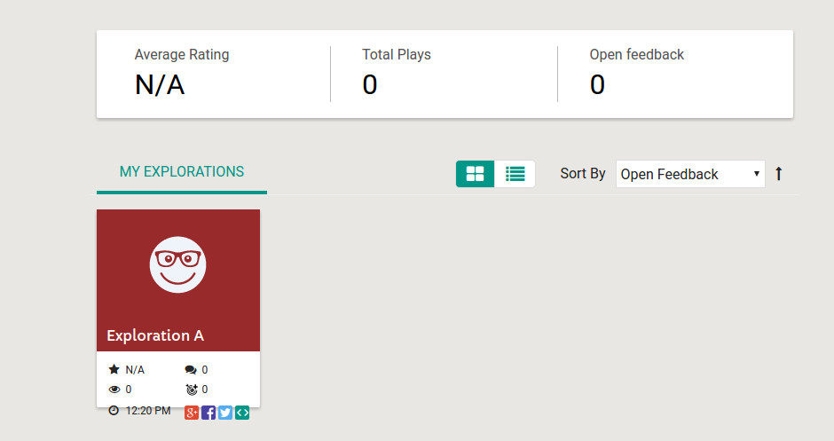
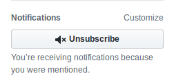
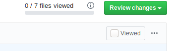

Code review is an important part of the Oppia development cycle. Having a second pair of eyes look at your code can help to catch silly mistakes and serve as a check for whether your code is readable/understandable by other team members (which is important for maintainability).

When you receive a code review request, please try to do the review as soon as possible! Otherwise, the submitter will be blocked.

## Figuring out which PRs need your attention

Simply visit this URL: https://github.com/pulls/assigned. It takes you to a list of PRs that are assigned to you, across all repositories. 

**Note:** If you just want to restrict to the oppia/oppia repository, use https://github.com/oppia/oppia/pulls/assigned/{{USERNAME}} instead (replacing `{{USERNAME}}` with your GitHub username at the end. However, the resulting list will not include your assigned PRs from other Oppia repositories.

## When you first receive a review request

  1. When you get an email saying a pull request has been assigned to you for review, click on the link to open it in GitHub.
  1. Ensure that the correct target branch (usually "develop") has been selected to merge the branch into.
  1. Ensure that a "changelog" label is applied on the PR. If not, select an appropriate changelog category label for the PR.
  1. If you want to CC additional reviewers, you can do so using "/cc @username". Say why you're adding them.

## Doing the review

**Pro-tip**: You can change the review pane on the "Files Changed" tab of a PR to show the old and new versions side-by-side! This makes it easier to review the diffs. See this [GitHub help page](https://help.github.com/en/github/collaborating-with-issues-and-pull-requests/about-comparing-branches-in-pull-requests#diff-view-options) for more information.

  1. Look out for the following things:
     * Do you understand exactly what the code is doing, without needing to dig in too much? If not, it's probably the writer's fault, and you should tell them so. The logic needs to be very clear. 
       * Don't be afraid, as a reviewer, about asking for the logic to be broken up or simplified. It's also totally fine (and preferable!) to ask for code to be simplified if it is hard to read (even though it may be technically correct in its current form). Code is typically written once and read many times, so we try to optimize for readability.
     * Is the code doing the right thing? (Make sure to further expand the parts above and below the code you're looking at, to ensure that you have the full context of what is going on. This is _especially_ important for complex logic -- e.g. can you find the critical bug that was introduced [here](https://github.com/oppia/oppia/pull/9141/files#diff-3d7e1efacf316f35426e24bedbd89564R128)?)
     * Does the design look sensible?
     * User-facing bugs should be incorporated into unit/e2e tests.
     * User-facing confusions should be incorporated into manual tests / critical user journeys for functional capabilities. (Ping one of the QA team members on the PR thread).
     * Are there tests/docs which should be present, but aren't?
     * If the change affects the UI, check out the branch and look at it in a browser. Does the UI look good and intuitive to the user?
     * Are there any files or folders which are renamed? If yes, make sure that all the documentation and instructions where the names of the file/folder is mentioned is changed too.
     * Are there changes to or additions of new models? If yes, verify that all the steps mentioned in [Creating and modifying storage models](https://github.com/oppia/oppia/wiki/) are included.
     * Does the PR include changes to user data or changes that relate to privacy? If yes, check that all the measures mentioned in [Privacy aware programming](https://github.com/oppia/oppia/wiki/Privacy-aware-programming#implementation-stage) were addressed.
     * If the PR includes changes to how we handle Wipeout or Takeout, verify that even with these changes all the user data still get deleted (Wipeout) and that all the user data are exported (Takeout).
     * **Important:** Please also ensure that, if a PR author files a TODO for future work, they assign themselves to it (or arrange for it to be assigned responsibly to someone else) and don't just abandon it. It should typically be the next thing they work on, unless there is a principled reason to agree otherwise. (In other words, PR authors shouldn't just file TODOs for future work and then abandon them.)


      **Note**: To checkout branch BRANCH_NAME from committer COMMITTER_USERNAME to your local machine, run:
      ```
        git checkout -b {{COMMITTER_NAME}}-{{BRANCH_NAME}} develop
        git pull https://github.com/{{COMMITTER_NAME}}/oppia.git {{BRANCH_NAME}}
      ```
      See also [Checking out pull requests locally](https://help.github.com/articles/checking-out-pull-requests-locally/).

  1. After submitting the review, set the Assignee field to the developer's GitHub username, so that they know it's their turn.

  1. If the developer pushes subsequent commits to the pull request, you'll automatically be notified by email. When you review these, make sure that all previous review comments have been addressed (both in the code and by the developer's replies.)

  1. If all review comments have been addressed, and the code looks good and is ready to be merged into develop, write a comment saying "LGTM".

## Merging into develop

### Squash-Merging

_Note that only maintainers and project leads can merge PRs into develop._

If all commits in a PR are done by a single committer, we recommend using GitHub's 'Squash-Merge' functionality, which you can select as an option after clicking the green "Merge pull request" button. This allows the history of both the author and maintainer who merged it to be retained, while doing a standard squash of all the changes in the PR to a single commit.

The commit message of the squash should be a clear one-line summary of the changes introduced in the PR. It should begin with a present-tense, transitive verb. Here are some examples of good commit messages:
* ``Fix #bugnum: introduce the first version of the collection editor.``
* ``Update the exploration editor to do X better.``

Getting this message correct is important, since it will be used to compile the CHANGELOG during the next release. If you like, feel free to also add optional follow-up sentences after the one-line summary.

### Who Should Merge

In general, the last reviewer to give LGTM should merge the PR if the CI tests are passing. Otherwise, they should assign the PR to the author, who should merge it once the CI tests have passed.

### Standard Merging

There are special circumstances when standard merging should be done instead of a squash-merge. Generally speaking, commits which have already been squash-merged should not be squash-merged again. Also, if there are multiple contributors who have contributed to a PR, please don't squash-merge -- we want to preserve their history.

## Resolving merge conflicts as a reviewer

In some cases, the reviewer (contributors with write access) might want to fix the merge conflicts for a PR. This is allowed in the cases when the PR being merged to:

* is urgent or is a bugfix
* is already fully approved (everything is done except for merge) but the contributor has become inactive

### Instructions

1. Add PR author fork as a new remote, `git remote add {{AUTHOR_NAME}} git@github.com:{{AUTHOR_NAME}}/oppia.git`.
1. Locally fetch author branches, `git fetch {{AUTHOR_NAME}}`.   
1. Checkout to the fetched branch, `git checkout -b {{AUTHOR_NAME}}-{{BRANCH_NAME}} {{AUTHOR_NAME}}/{{BRANCH_NAME}}`.
1. Update that branch from develop, `git pull upstream develop` and fix the merge conflicts as usual.
1. Push back to the branch, `git push {{AUTHOR_NAME}} HEAD:{{BRANCH_NAME}}`.
1. Notify the PR author by adding a comment to the PR saying something similar to the following: "Hi **@{{AUTHOR_NAME}}**, I've updated your PR from develop. If you want to add any more commits, you will first need to pull the branch locally by using `git pull origin {{BRANCH_NAME}}`. Thanks!".

## Troubleshooting

### Errors loading the GitHub review conversation page

Sometimes, GitHub shows a "Unicorn!" error page when the PR is too large or there are several hundred comments on a review thread:


As a workaround, we have been advised by GitHub Support that, until the issue gets fixed, we can use an additional timeline_per_page query parameter when viewing such pages. For example, instead of accessing https://github.com/oppia/oppia/pull/8720, you can access https://github.com/oppia/oppia/pull/8720?timeline_per_page=20 instead. (Note that "20" should be a low number.)

### Other notes

#### Adblock Disable
You might want to disable adblockers temporarily when doing the review. We once had a regression caused by the "share" buttons on the dashboard tiles not showing up correctly on the reviewer's machine, which caused a screenshot that ought to have looked like

  

(where the error would have more easily been caught) to look like the following instead:

  

#### Reducing Email Noise
If you would like to reduce email noise following a review, click on the "Unsubscribe" button on the right side of the page. However, if your username is tagged (using the "**@username**" syntax), you will still get emails.

  


### View Only Diffs since last review
It is not possible to do this directly using the GitHub interface. However, one way to review the files that have changed is to mark the respective files as viewed by clicking on the button as shown below.

  

Clicking on that button will automatically collapse the file. Any subsequent changes to that file will then change the status to unviewed, allowing you to review only the files that have changed.

Viewing the changes across multiple commits is possible. To do this, use the "Changes from all commits" dropdown in the "Files Changed" tab. (For a readonly version of this, you can also change the commit hashes in the URL `https://github.com/oppia/oppia/compare/commit_1...commit_2` -- [here](https://github.com/oppia/oppia/compare/be4b661...b46838c) is an example.)