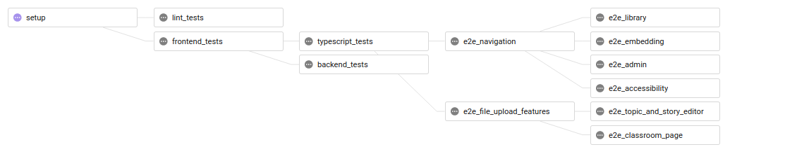
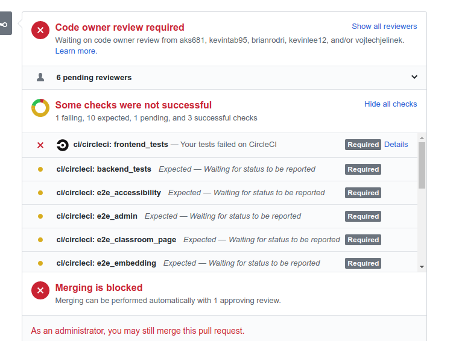

# Interpreting CircleCI Results

## tl;dr

If your test status does not report, check the upstream test result. Here's the workflow job diagram:

  

## Detailed Explanation

Our CircleCI tests run in a staggered manner as to alleviate the overall pressure on the queue. As a result, some tests may never run if the upstream test fails. For example, see the following:

  

In the example above, the frontend tests failed. Therefore, from looking at the workflow diagram above, typescript, backend, frontend, and all of the e2e tests follow the frontend tests. Because the downstream jobs do not run when the upstream fails, the following tests: typescript, backend, and all of e2e tests will not run. The statuses of those tests will remain pending, when in fact, they will never run for this commit.

### What should you do?

Following the example above, you must first fix the frontend tests and push. If the frontend tests pass, then the next round: typescript and backend tests will run. If the typescript tests pass, the two flagship e2e tests will run and so on.
