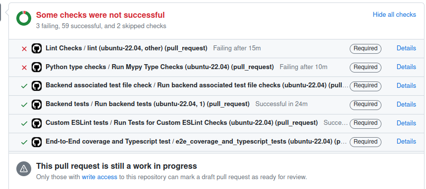

# Interpreting GitHub Actions Results

## Detailed Explanation

Our workflow tests run in parallel as to alleviate the overall pressure on the queue.

  

In the example above, the lint checks and Mypy checks have failed. However, the rest of the tests have passed.

We also have two checks that have been skipped due to the failure of one of the e2e tests. In the event of an e2e test failure, any remaining e2e tests that are queued or currently running will be terminated and marked as "skipped."

### What should you do?

- Go to 'Details' to view the test logs.
- Following the example above, you must first fix the [failing CI checks](https://github.com/oppia/oppia/wiki/If-CI-checks-fail-on-your-PR#failing-tests-and-lint-checks) then push.
