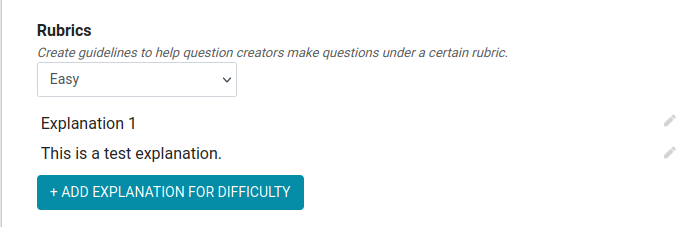
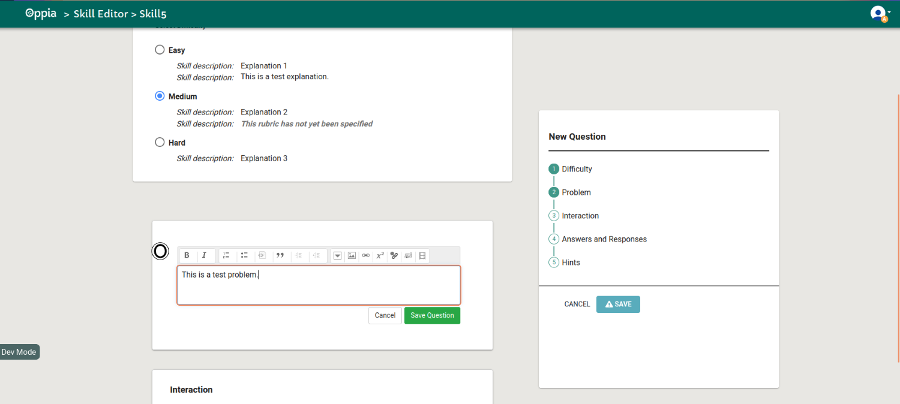

This page will help you solve common queries that you may face while working on LaCE issues. If you do not get a satisfactory explanation from this page, feel free to mention your query in the issue thread that you are working on or else make a discussion regarding this in [Dicussions](https://github.com/oppia/oppia/discussions). If you feel that your query can be a valid addition to this page, then make sure to create a new issue [here](https://github.com/oppia/oppia-web-developer-docs/issues) addressing your question.

# How to perform common operations on your local server

| Index | Common Queries   |
| :---: |     :---:        |
| 1.    | [Creating a Topic](#1-creating-a-topic) |
| 2.    | [Creating a Skill](#2-creating-a-skill)|
| 3.    | [Generating data on localhost](#3-generating-data-on-localhost)|
| 4.    | [Creating a classroom](#4-creating-a-classroom)|

## 1. Creating a Topic 
- To create a new topic, we first navigate to the `Topics and Skill Dashboard` and select the `CREATE TOPIC` option. To do so, you can take a look at this [guide](Editor-pages.md#steps-to-create-a-topicskill)
- A modal will open up with necessary details of the topic that are to be filled such as topic name, topic thumbnail, etc.

- Once this is done, the topic is created and you will be redirected to the topic editor page.

- In the main editor tab, we will be able to see the errors that are preventing the topic from being published.

- This tab has 4 main sections:
  - Details: Information related to the topic
  - Subtopics section: Subtopics and skills associated with the topic are listed.
  
  

  - Diagnostic Tests: Add skills that will be used to generate the diagnostic test that determines whether to recommend this topic to new learners. For a skill to qualify for this, it must have at least 3 questions and be assigned to that topic.
  
  

  - Canonical stories: In this section, the stories belonging to the topic are listed.
  
  
  

## 2. Creating a Skill
  > **_NOTE:_** For a skill to be visible on the practice tab of a topic, it must have at least 10 questions associated with it.
- A skill can be directly created from the topic editor by clicking the `ADD SKILL` button under `Subtopics` section of the topic editor. But in this case, the skill will be automatically assigned to that topic.
- A skill can also be created from the Topic and Skill Dashboard as well but it will not be assigned to any topic.
- On clicking the `ADD SKILL` option a modal will pop up with necessary details of the skill.

- Once this is done, the skill is created and you will be redirected to the skill editor page
- The main skill editor section has the following part:
  - Details
  
  

  - Worked example

  

  - Misconceptions: Common errors that users may have and their explanations. The creator is given the option to enforce the misconception on all question within the skill as seen in the image below.
 
  

  - Pre-requisite Skills: Skills that are to be completed before attempting the current skill. The prerequisite skills can be filtered by topic, subtopic and by title of the skill.

  

  - Rubrics: This section of the skill helps question creators make questions under a certain rubric. 
  
  

- The questions section lists the questions in the skill:
  - To add a new question, select the `ADD QUESTION` option
  - In the question editor, there are 5 sections:
    - Difficulty
    
    

    - Problem
    
    

    - Interaction
    
    

    - Answers and Responses (This section can be seen in the image above)
    - Hints
    
    

  - Once all these sections are filled, the question can be saved.
  
  

## 3. Generating data on localhost
- To generate data, we must first navigate to the admin page.

 We will automatically be redirected to the `ACTIVITIES` tab.
- This tab will have several sections:
- Reload a single exploration: This section has preloaded explorations. These can be loaded onto your local server by clicking the `Reload` button for each of them.

  - Generate dummy explorations: Along with the option to generate dummy explorations (with no content), we can also publish a certain number of them.

  - Reload a single collection: This section has preloaded collections.

  - Load dummy new structures data: This section provides a combination of topics, skills, stories and exploration.
  
  

  - Generate dummy skill with questions

  - Generate a dummy math classroom

## 4. Creating a Classroom
- We must first navigate to the `CONFIG` tab in the admin page. 
- In this tab, there is a section `The details for each classroom page.` in which you will find a default math classroom that is filled out. 

- It has details about the classroom:
  - Name
  - URL Fragment
  - topic list intro
  - topci ids: The topic ids that should be included in the classroom are listed here. We can add to this by clicking on the `Add element` option.
- More classrooms can be generated by clicking on the `Add element` option beneath this section.
- Once the classroom details have been filled, to complete the process we must save changes by clicking the `Save` button at the buttom left corner of the `CONFIG` tab.

- If the classroom has been created successfully you will be able to see a message `Data successfully saved` at the bottom right corner of the screen.

- The newly created classroom will be visible in the `Home` tab of the learner dashboard page or we can directly access the classroom from the link `localhost:8181/learn/<classroom-url-fragment>`.

