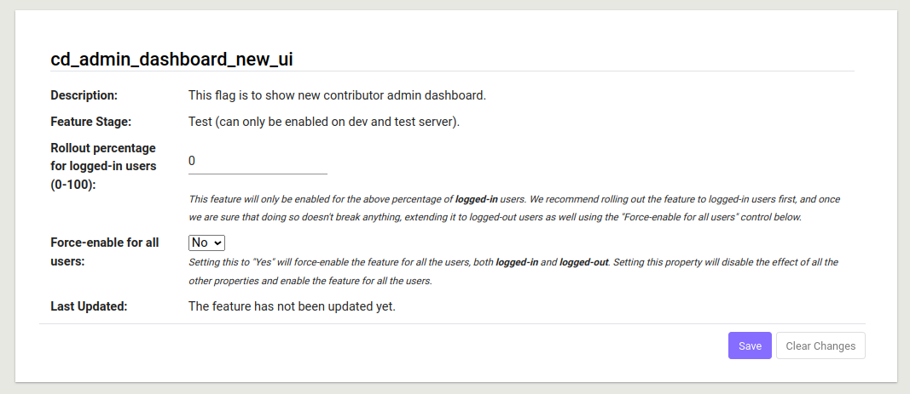

When developing a new feature, you might want to limit the scope of the feature so that it's only enabled when certain criteria are met (e.g. only enabled in dev environment). In these cases, you can use the feature gating system to gate the enabling of the features with a feature flag.

## Why do we need feature flags?

Feature flags vastly improve/simplify the development process by allowing developers to safely deploy new features to production. They also allow us to quickly disable features if we find that they are causing problems in production.

They also allow us to hide features that are still in development/still being tested. This means that developers can add the feature incrementally to the codebase, and only enable it once it is fully ready for production. Should the feature break, they also allow us to easily disable it without having to remove all the changes from the codebase. This is especially useful when the feature is large and/or complex.

Additionally, feature flags allow us to decouple the feature & binary releases. This allows us to deploy new binaries to the server with less risk of regressions.


## How do you, as a developer, use feature flags?

### When to use feature flags?

Feature flags should be used when you are working on a feature whose scale makes it hard to implement all at once, or for more experimental features that are likely to cause breakages. Essentially, feature flags are a must for features that are not yet ready for production/fully-tested at the time that they're merged into develop.

### How to use feature flags?

Say you are working on a large scale user-facing feature that will take 1 or more PRs to fully implement. In such a case, please use feature flags to gate your feature appropriately by carefully following the steps listed below:

1. The very first PR you make must introduce a new feature flag to the codebase, that is meant to be used with this new feature. The feature flag should be placed in the DEV stage and disabled by default, so that it **cannot** accidentally be turned on in environments for which it is not yet ready (like the test/prod servers). Every single user-facing aspect of the feature -- whether frontend or backend -- must be gated behind the feature flag (both in the first PR, and all the following ones as well). This is to ensure that the feature is not visible to the user until it is fully implemented and ready for production.

2. The first PR above must be merged before any of the following PRs are merged. This is to ensure that the feature flag is available in the codebase for it to be used in the following PRs.

3. When developing, make sure that e2e tests are present for your feature. If the feature is gated behind a feature flag, you may need to use the 'enableFeature' utility functions for the release-coordinator page to first enable the required flag, and then proceed to perform the testing. For unit tests, you should include tests for both the `flag=True` and `flag=False` cases.

4. The very last PR you make (to finish up the feature you are working on) must include changes that move the feature flag to the TEST stage. This is to ensure that the feature is available in the test environment, so that we can feature-test it before it is made available to the users in the production environment. **NOTE: Please test all the changes manually to make sure that the feature works fully end-to-end on your local dev server, before moving the flag to the TEST stage.**

5. When the PR is merged, fill out [this form](https://forms.gle/zDCsoN6Xb6JvQku87) to request that your feature be tested. This form will be processed by the server admins team, who will work with you and the feature testers to set a date during which your feature will be available to use on one of our test servers. (We can only surface the feature for a limited time because the servers are also needed for other things, such as release testing.) Once the testing date is confirmed, the server admin will make a deployment, turn the feature flag on, and send instructions to the feature testers for how to test the feature. Feature testers will use this [feature review template](https://docs.google.com/document/d/1ibQC9t1jnOg-o1lrHEM3QEXeF4eSqAiPhs2lD2iCpy4/edit) to conduct the testing.

6. If the feature testing reveals that the feature is not yet ready for production, you must work on fixing the highlighted issues before proceeding further. You can request a re-test once all the testing feedback is addressed.

7. Once you receive a go-ahead from the feature testers, you must merge another PR. This PR should do only one thing, i.e. move the feature flag to the PROD stage, allowing it to be enabled/disabled in production (by the release-coordinator(s)). **NOTE: When opening this PR, include a link to the testing doc or other proof that the feature has been approved for release.** While this PR is open, confirm with the release coordinators that the new CUJs for this feature have been added to the overall CUJs used for testing releases in general.

8. Once this PR is merged, send a ["job run request"](https://forms.gle/rUJaHJSpRGemtGDp6) to the release coordinators to turn on the feature in production by adding a rule in the `/release-coordinator` page.
    - (Optional) If you like, you can fill in [this form](https://goo.gl/forms/sNBWrW03fS6dBWEp1) to announce your feature to the public once it's launched!

9. Once the feature is confirmed to be functioning as intended in production (for at least 2 weeks) by the product team, please do the following, in order:
    - Make sure that the feature is ready to be made permanent. To do this, confirm with the PMs that no users have reported issues with it, and that no regressions have been detected via StackDriver or general user feedback. The PMs should also fill in this [post-launch review template](https://docs.google.com/document/d/1DifFAe3oRzjmVPh2fEllfAky4n0QMAXVQc3Y580qkr8/edit).
    - Once you have confirmation that the feature can be made permanent, merge one last PR to "un-gate" the feature and move the feature flag to the deprecated stage (one of the stages listed in `core/domain/platform_parameter_list.py`, meant for flags that are no longer in use). Additionally, in the same PR, please remove all remaining references to the feature flag from the codebase (for example, in all the `if` blocks you created to gate the feature).


## Follow the steps below to add a new feature flag

### Creating the flag

1. Add a new unique feature flag name in the `PARAM_NAMES` enum class in `core/domain/platform_parameter_list.py`, similar to a key-value pair. Example:

```python
class ParamNames(enum.Enum):
    """Enum for parameter names."""
    // ...
    NEW_FEATURE = 'new_feature',

```

2. Create and register a feature flag instance in the same file with its name, description and stage (see the [Feature Stage](#feature-stage-explanation) section for more details). Example:

```python
Registry.create_feature_flag(
    PARAM_NAMES.NEW_FEATURE,
    'This is a newly created feature.',
    platform_parameter_domain.FeatureStages.DEV,
)
```

3. Add the name of the newly created feature to one of the feature name lists (`DEV_FEATURES_LIST`, `TEST_FEATURES_LIST`, or `PROD_FEATURES_LIST`) in `core/platform_feature_list.py` according to its stage. Note: if the name is added to the wrong list, a backend test error will raise. Example:

```python
DEV_FEATURES_LIST = [
    # ...
    params.PARAM_NAMES.NEW_FEATURE,
]
```

4. To make the feature flag available in the front-end, you need to add it into the name enum in `core/templates/domain/platform_feature/feature-status-summary.model.ts` as well:

```typescript
export enum FeatureNames {
  // ...
  NewFeature = 'new_feature',
}
```

### Modifying unit tests to account for the creation of the new flag

The codebase contains two unit tests (one in the backend and one in the frontend) whose success or failure depends on them being aware of all the feature flags that currently exist.

To make sure those two tests succeed, please follow the steps below (so they account for the newly created feature flag).

1. Add the name of the feature flag to the `EXPECTED_PARAM_NAMES` array in the `ExistingPlatformParameterValidityTests` class in `core/domain/platform_parameter_list.py`. Example:

```python
EXPECTED_PARAM_NAMES = [
    # ... existing names
    'new_feature',
]
```

2. Add the newly created flag as a key-value pair in the `featureStatusSummary` object in the unit-test meant for testing the functioning of the session storage in `core/templates/services/platform-feature.service.spec.ts`, like so:

```typescript
it('should load from sessionStorage if there are valid results.', fakeAsync(
  () => {
    // ...
    mockSessionStore({
      SAVED_FEATURE_FLAGS: JSON.stringify({
        // ...
        featureStatusSummary: {
          // ...
          [FeatureNames.NewFeature]: true,
        }
      })
    });

    // ...
  })
);
```

### Writing unit tests for gated features

To write unit tests for gated features, follow the steps below:

#### Frontend

1. Import `PlatformFeatureService` in the .spec file.

```typescript
import { PlatformFeatureService } from 'services/platform-feature.service';
```

2. Create a mock for the service, consisting of a getter for the status of the feature flag, like so:

```typescript
class MockPlatformFeatureService {
  get status(): object {
    return {
      NewFeature: {
        isEnabled: true
      }
    };
  }
}
```

3. Add the mock to the `TestBed` configuration, like so:

```typescript
TestBed.configureTestingModule({
  imports: [
    //...
  ],
  providers: [
    // ...
    {
      provide: PlatformFeatureService,
      useClass: MockPlatformFeatureService
    }
    // ...
  ]
});
```

4. Inject the service in the beforeEach block, like so:

```typescript
let platformFeatureService: PlatformFeatureService;
beforeEach(() => {
  platformFeatureService = TestBed.get(PlatformFeatureService);
});
```

5. Spy on the getter to check the status of the feature flag, like so:

```typescript
spyOnProperty(platformFeatureService, 'status', 'get').and.returnValue(
  {
    NewFeature: {
      isEnabled: false // or true, depending on the test
    }
  }
);
```

#### Backend

For example, if you wish to write a test with the required feature flag enabled, you can do so by following the steps below (the approach to testing with the feature flag disabled is the same up to step 4):

1. Import the following modules into the test file:

```python
from core.domain import platform_feature_services as feature_services # (alias is optional)
from core.domain import platform_parameter_domain
from core.domain import platform_parameter_list
from core.domain import platform_parameter_registry as registry # (alias is optional)
```

2. Clear the parameter registry and create a mock feature flag (using the actual enum of the feature flag -- we recommend you do it in the `setUp` hook), like so:

```python
self.mock_feature_flag = registry.Registry.create_feature_flag(
    platform_parameter_list.ParamNames.NewFeature, 'a mock of the new_feature feature flag',
    platform_parameter_domain.FeatureStages.DEV)
```

3. Set the rules for when the feature flag is to be enabled (in the method which performs the testing), like so (here we're setting the flag to be enabled when in DEV mode):

```python
test_can_do_something(self) -> None:
    feature_services.update_feature_flag_rules(
        platform_parameter_list.ParamNames.NewFeature.value, self.owner_id, 'test update', # owner_id is the id of the user that is updating the feature flag. See note underneath this code block.
            [
                platform_parameter_domain.PlatformParameterRule.from_dict({
                    'filters': [
                        {
                            'type': 'platform_type',
                            'conditions': [
                                ['=', platform_parameter_domain.ALLOWED_PLATFORM_TYPES[0]]
                            ]
                        }
                    ],
                    'value_when_matched': True
                })
            ]
    )

```

**NOTE**: Like mentioned above `self.owner_id` refers to the id of the user with the necessary permissions (i.e. super-admin permissions) to perform the actual feature flag rules update. Some tests have the `owner_id` property created within the `setUp()` hook, and this variable can be used throughout the test class.

If this is not the case (i.e. you do not have access to the `owner_id` property in the class within which you are writing your tests), you can obtain the `owner_id` by following these steps:

- Create a new user with the proper credentials (see code below for how these 'proper' credentials can be accessed), so that this user has super-admin permissions,
- Then use the `get_user_id_from_email()` method to get the `owner_id` from the email address of the newly created user.

The code would look like this (note that this needs to be in the `setUp()` hook):

```python
    self.signup(self.OWNER_EMAIL, self.OWNER_USERNAME) # an account created using these credentials will have super-admin permissions
    # ...
    self.owner_id = self.get_user_id_from_email(self.OWNER_EMAIL)
```

4. Now you can create a `with` statement to manipulate the value of the feature flag as needed!

For example, in case of this tutorial, the rules we set for the feature flag in the previous step would mean that the feature flag is enabled only in the `dev` environment. So, if we want to write a test with the feature flag enabled, we can write it within the following `with` statement:

```python
with self.swap(constants, 'DEV_MODE', True):
    # ...
```

To start with, you could test whether the feature flag is actually behaving as expected with the following lines of code in the `with` block:

```python
with self.swap(constants, 'DEV_MODE', True):
    self.assertTrue(
      feature_services.is_feature_enabled(platform_parameter_list.ParamNames.NewFeature.value))
```

and then proceed to write the actual test right after that assertion, within the `with` block.

**(Similarly, if you wish to write a test with the feature flag disabled, you can write it within the following `with` statement):**

```python
with self.swap(constants, 'DEV_MODE', False):
    # ...
```

## Feature Stage Explanation

Features fall in the three types of stages: dev, test and prod. In short, the stage of a feature implies its maturity & stability and the environment where it can be enabled:

- dev feature can only be enabled in dev environment.
- test feature can be enabled in dev or test environments, but it can never be enabled in production environments.
- prod feature can be enabled in any of the dev, test, production environments.

Note: The environment the flag is placed in determines the enviroment(s) where it CAN BE enabled, not where it IS enabled. A feature in `test` stage, as mentioned above, can only be enabled in the `dev` and `test` environments, and not in the `prod` environment. By default (i.e. when the flag is first added to the codebase and its value is yet to be adjusted from the admin page), however, the flag is disabled in all environments. See the [Changing Value of Feature Flags](#changing-value-of-feature-flags) section for details on how to enable/disable feature flags.

## Usage Example

### Gating in Backend

```python
from core import platform_feature_list
from core.domain import platform_feature_services

# ...

if platform_feature_services.is_feature_enabled(
    platform_feature_list.ParamNames.DUMMY_FEATURE.value):
    # Code of the feature
else:
    raise Exception("Feature is not fully implemented yet.")
```

## Gating in Frontend

The status of features is loaded during the page initialization, once it's loaded you can access it through the `PlatformFeatureService`:

```typescript
// Assuming this.featureService is the PlatformFeatureService instance.
if (this.featureService.status.NewFeature.isEnabled) {
    // Code of the feature
} else {
    // ...
}
```

## Changing Value of Feature Flags

Feature flags are defaulted to `false/disabled`. To change their values, you can login as the administrator, provide yourself the role of release-coordinator from the 'Roles' tab present on the Admin page, navigate to the release-coordinator page, then to the feature tab.

In the feature tab, where you will see the feature flag you added, you can change the settings (see the [Setting of Feature Flags](#settings-of-feature-flags) section for detail) of the feature flags.

Note: since only users with release-coordinator permission can edit the settings of feature flags, you can only enable your features on your local dev instance of Oppia, while in production environment, only release-coordinators can enable/disable features.

## Settings of Feature Flags

We use the following principles to determine the value of a feature flags:

- Each feature flag has multiple *rules*, its value changes to the value specified in the first rule that is matched. If no rule is matched, its value remains default.
- Each rule has multiple *filters*, and a rule is matched only when all of its filters are matched.
- Each filter describes a scenario. There are multiple types of filters (like `platform type` and `app version`) which can be used in combination with each other to describe various scenarios (like `platform type = Web OR platform type = Android`).
- Each filter can have multiple conditions, and a filter is matched if any of the conditions specified in the rule are matched.

For example, if we want a feature flag to be enabled on Web, we can configure the flag's rules/filters as shown below.


