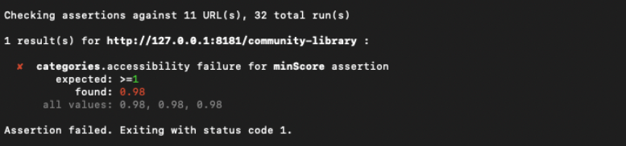
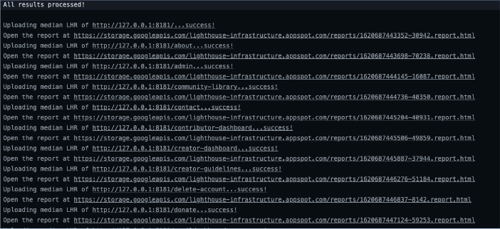
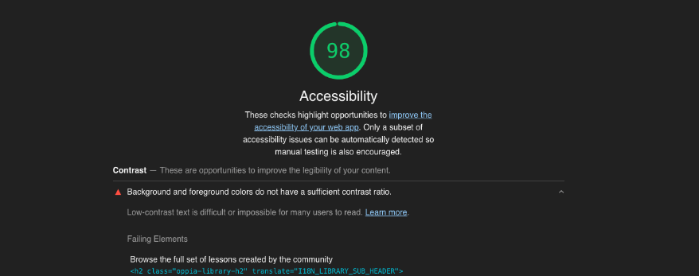

# Lighthouse CI Automated Tests
Lighthouse CI is a suite of tools that make continuously running, saving, retrieving, and asserting against Lighthouse results as easy as possible. Lighthouse has tests for performance, best practices, and accessibility.

To run the automated tests on Oppia. Type the commands
"python -m scripts.run_lighthouse_tests"
or
“python -m scripts.run_lighthouse_accessibility_tests” in the terminal.

The script will run the Oppia server, and then run Lighthouse checks on all the webpages outlined in the lighthouserc.js config. The Lighthouse tests also automatically test against any PR with Github Actions. The accessibility tests run only accessibility audits while the general lighthouse test audits best practices and performance

For further information about lighthouse [checkout this page](https://developers.google.com/web/tools/lighthouse)

# How to add new pages to lighthouse tests

If you have recently created a new webpage on Oppia, it should be covered by lighthouse tests to ensure that your page is accessible.

## Add a static webpage
If your webpage URL is static and doesn't require any id generation. Then the only thing you need to do is add your webpage to the lighthouserc.js and lighthouserc-accessibility.js config.

For example, if your webpage is on the URL: `http://127.0.0.1:8181/your/static/webpage`
Just add the URL to the `'url'` list in the config

      'url': [
        'http://127.0.0.1:8181/admin',
        'http://127.0.0.1:8181/your/static/webpage'
      ]

## Add a dynamic webpage
If your webpage URL is dynamic and requires id generation. You will need to generate the id in lighthouse_setup.js and export the id to the lighthouse configs. As an example, we will show how we add the exploration editor to the lighthouse tests.

### 1. Get the URL

```
const getExplorationEditorUrl = async function(browser, page) {
  try {
    // eslint-disable-next-line dot-notation
    await page.goto(
      CREATOR_DASHBOARD_URL, { waitUntil: networkIdle });

    await page.waitForSelector(createButtonSelector, {visible: true});
    await page.click(createButtonSelector);
    await page.waitForSelector(
      dismissCreateModalSelector, {visible: true});
    explorationEditorUrl = await page.url();
  } catch (e) {
    // eslint-disable-next-line no-console
    console.log(e);
  }
};
```

## 2. Write the URL to stdout

```
  await getExplorationEditorUrl(browser, page);
  await process.stdout.write(
    [
      explorationEditorUrl,
    ].join('\n')
  );
```

## 3. Export the URL to an environment variable

```
def export_url(url):
    """Exports the url to an environmental variable."""
    url_list = url.split('/')
    if 'create' in url:
        os.environ['exploration_editor'] = url_list[4]

```
## 4. Call the environment variable in the lighthouse config
```
      'url': [
        'http://127.0.0.1:8181/admin',
        `http://127.0.0.1:8181/create/${process.env.exploration_editor}`,
      ]
    },
```
# How to debug Lighthouse tests?
- **Common question:** What to do if your changes cause the lighthouse accessibility tests to fail?
- The lighthouse logs will provide you most of the information you need (To see the logs, click on the details button on the right)

## Failing Lighthouse Puppeteer Script

Lighthouse tests might fail because the puppeteer script failed to properly set up the web page to run ligthouse tests on. To determine if this is the case, check the log and see whether the line "Puppeteer script failed" was printed.

To debug Puppeteer script errors locally, please run `python -m scripts.run_lighthouse_tests` with the extra argument `--record_screen`. The video will then be saved in a folder titled "ffmpeg-puppeteer-video" in the folder outside of "oppia". Alternatively, to view the recording from a GitHub test, you can downlaod the recording as an artifact titled "ffmpeg-puppeteer-video" from the summary page of the lighthouse test.

## Steps to solve the failing lighthouse test

**1. Find out which pages are failing:** You can find which pages are failing in the lighthouse logs


**2. Find report for failing page:** The lighthouse checks will upload reports to a temporary url for each page that it audits. 
The lighthouse checks will print the link to each report in the logs.



Alternatively, you can do the following:

- (From the branch that is related to you PR which is failing the lighthouse tests) Go to the failing page on localhost in chrome web browser 
- Go to inspect tab and select the `lighthouse` option
- Select the "Accessibility" checkbox to specifically test for accessibility issues (uncheck all the other options)
- Click the "Generate report" or "Run audits" button
- After the test completes, Lighthouse will generate a detailed report with various sections, including accessibility.

**3. Read the report and learn how to fix the problem:** Click on the accessibility tab in the report to see which elements are failing.


**4. Find the failing element and apply the fix:** Lighthouse often suggests possible solutions and provides additional resources for fixing the issues.

**5. Re-run the Lighthouse tests after making the changes to ensure the issues are successfully addressed.**


