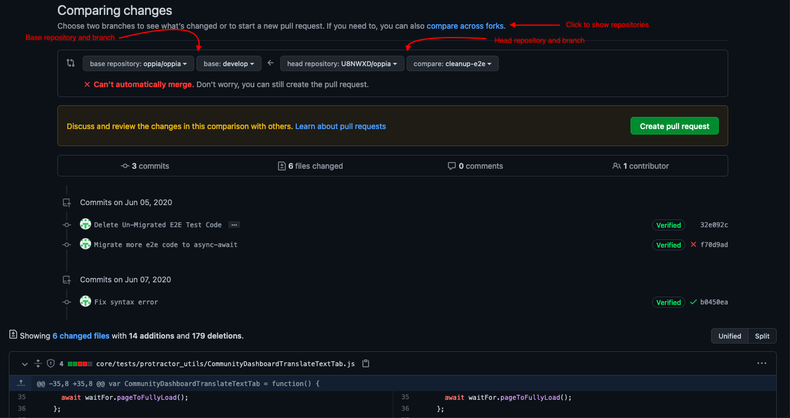
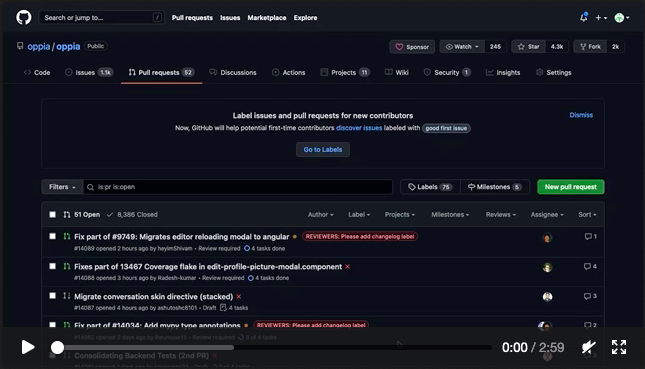
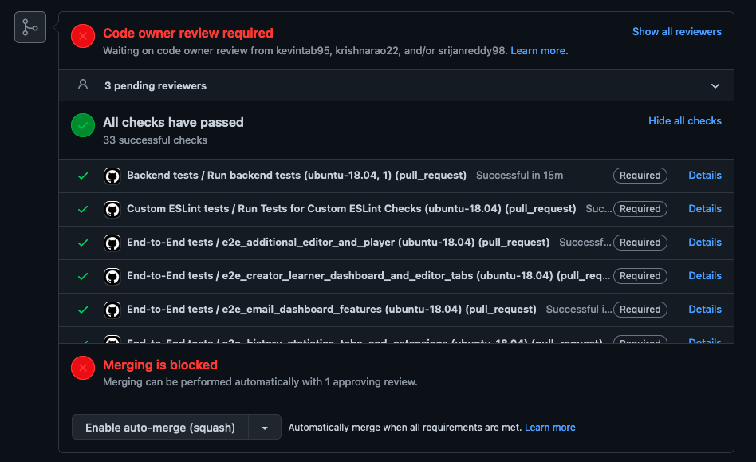

## Table of Contents

* [Step 1: Before writing any code, choose a descriptive branch name](#step-1-create-a-new-branch-with-a-descriptive-name)
* [Step 2: Make commits locally to your feature branch](#step-2-make-commits-locally-to-your-feature-branch)
* [Step 3: Push changes to your GitHub fork](#step-3-push-changes-to-your-github-fork)
* [Step 4: Create a pull request](#step-4-create-a-pull-request)
* [Step 5: Address review comments until all reviewers approve](#step-5-address-review-comments-until-all-reviewers-approve)
* [Step 6: Make sure all continuous integration checks pass](#step-6-make-sure-all-continuous-integration-checks-pass)
* [Step 7: Tidy up](#step-7-tidy-up)
* [Step 8: Celebrate](#step-8-celebrate)

**Working on your first pull request?** Pull requests can be tricky to understand at first, so if the instructions on this page don't make sense to you, check out the free series [How to Contribute to an Open Source Project on GitHub](https://app.egghead.io/series/how-to-contribute-to-an-open-source-project-on-github) or [Atlassian's tutorial to pull requests](https://www.atlassian.com/git/tutorials/making-a-pull-request).

**Note:** If your change involves more than around 500 lines of code, we recommend first creating a short [design doc](https://github.com/oppia/oppia/wiki/Writing-design-docs). This helps avoid duplication of effort, and allows us to offer advice and suggestions on the implementation approach.

To make code changes, please follow the following instructions carefully! Otherwise, your code review may be delayed.

## Step 1: Create a new branch with a descriptive name

The new branch should be based on the latest code in `develop`, so checkout the latest version of `develop` like this:

```console
git fetch upstream
git checkout develop
git merge upstream/develop
```

Then create a new branch. In this example the branch is named `your-branch-name`. The branch name should be lowercase and hyphen-separated, e.g. `fuzzy-rules`. Make sure that your branch name doesn't start with `develop`, `release` or `test`.

```console
git checkout -b your-branch-name
```

## Step 2: Make commits locally to your feature branch

Each commit should be self-contained and have a descriptive commit message that helps other developers understand why the changes were made.

However, **do not write "Fix #ISSUE_NUMBER"** (e.g. "Fix #99999") in your commit messages (or any of the other closing phrases from [GitHub's documentation](https://docs.github.com/en/issues/tracking-your-work-with-issues/linking-a-pull-request-to-an-issue#linking-a-pull-request-to-an-issue-using-a-keyword)), as this will cause Github to close the original issue automatically.

You can change your most recent commit message using `git commit --amend`. **It is difficult to change any commit messages other than your most recent one or messages on commits that have been pushed, so write your commit messages carefully!**

* Before making the commit, do some sanity-checks:

  * Ensure that your code follows [[the style rules|Coding-style-guide]].
  * Start up a local instance of Oppia and do some manual testing in order to check that you haven't broken anything!
  * Run `git status` to check that your changes are what you expect.  To inspect the changes made to any particular file, use `git diff your-file-name`.

  * Stage all your changes:

    ```console
    git add .
    ```

    (`.` refers to your current directory)

* To actually make the commit, run:

  ```console
  git commit -m "{{YOUR COMMIT MESSAGE HERE}}"
  ```

**Note**: There is no maximum or minimum number of commits required in a PR. Instead of aiming for a certain number, you should try to make each commit a logical "chunk" of work. There are many opinions about how big commits should be, but a useful rule of thumb is that you should be able to read the first lines of all your commit messages to get a good idea of what you changed. If you find yourself needing lots of clauses to capture what you changed, your commit is probably too big.

## Step 3: Push changes to your GitHub fork

* **Before pushing**, make sure to check the following things, otherwise you will incur delays with the review process or the automated checks:

  * **Do some manual testing** on your local instance of Oppia to check that you haven't broken anything. This is important to avoid breakages. **Don't rely on the automated tests alone.** Once you're sure that your changes are correct, make a screen recording showing that the part of the website you changed still works correctly. You'll need to add this video to the pull request description.

  * Use a tool like `git diff upstream/develop` to check that the changes you've made are exactly what you want them to be, and that you haven't left in anything spurious like debugging code.

  * Ensure that your code is fully covered by automated tests. (For more info, see the wiki pages on writing tests in the sidebar menu.)

  **We don't allow force-pushing at Oppia, so once you push your commits, you can't change them.** You can still add new commits though.

* When you're ready to push, run:

  ```console
  git push origin {{YOUR BRANCH NAME}}
  ```

  **Make sure to do this from the command line** (and not GitHub's Desktop client), since this also runs some important presubmit checks before your code gets uploaded to GitHub. If any of these checks fail, read the failure messages and fix the issues by making a new commit (see step 3), then **repeat the previous instructions** to retry the push. **Do not bypass these presubmit checks!** The checks get run on your PR too, so if you bypass failures on your local machine, you'll just have to fix them later when they fail on the PR.

## Step 4: Create a pull request

Once your feature is ready, you can open a pull request (PR)!

* Go to your fork on GitHub, select your branch from the dropdown menu, and click "pull request". Ensure that the base repository is `oppia/oppia` and that the base branch is `develop`. The head repository should be your fork, and the head branch should be your branch. If you don't see the repository, click the link to `compare across forks`.

  On this page you can also see your commits and your changes.  Read these changes carefully to make sure that the changes are correct (e.g., no missing newlines at the ends of files; no files left out by mistake). This is a good way to catch obvious errors that would otherwise lead to delays in the review process.

  

* Click "Create pull request".

* Following the guidance in the PR checklist, add a descriptive title explaining the purpose of the PR (e.g. "Fix issue #bugnum: add a warning when the user leaves a page in the middle of an exploration.").

  **WARNING: If your PR only fixes a specific part of the issue, start the title with "Fix part of issue #bugnum:" instead so that the original issue is not auto-closed by GitHub when the PR is merged.**

* Fill out the rest of the PR checklist.

* Add the screen recording you saved to the description.

* Click "Create pull request".

* If you have already completed 2 pull requests and been added as a collaborator to the project, you should also add a changelog label.  If you are a new contributor, you don't have permission to do this.  Don't worry! Oppiabot will automatically ask someone to do it for you.

* Oppiabot will check that you filled out the PR description correctly. If you didn't, it will leave a comment explaining what you need to do to fix it. More details on the kinds of comments Oppiabot leaves are coming soon.

* GitHub will automatically assign reviewers, and Oppiabot will assign the issue's "owner" (from the changelog label) to do the first review.

  If you need to assign someone else but aren't a collaborator yet, leave a comment of the form `@{{reviewer username}} PTAL`, which will tell Oppiabot to assign that person for you. ("PTAL" means "Please take a look".)

* After a while, check your pull request to see whether the CI checks have passed. If not, follow our instructions to [[diagnose PR failures|If-CI-checks-fail-on-your-PR]].

* Then, wait for your code to get reviewed! While you're waiting, it's totally fine to start work on a new PR if you like. Just follow these instructions again from the beginning.

Here's a video showing one example of the PR creation process:

[](https://user-images.githubusercontent.com/19878639/137946692-7c5f72e3-c6ce-4157-b8fa-b1e82bcc7642.mov)

Notice that in this example:

* No proof of correctness was needed, but this might not be the case for your PR.
* The CI checks were failing as soon as the PR was opened. If you see this, you should investigate.

## Step 5: Address review comments until all reviewers approve

Note that reviewers will often say "LGTM," which means "looks good to me".

When your reviewer has completed their review, they will reassign the pull request back to you, at which point you should push updates, respond to **all** comments, and reassign it back to them. This continues until the reviewer approves, after which the pull request is merged. Here is the procedure for responding to a review:

* Merge develop into your branch. If you run into conflicts, run the following commands to resolve them (**note:** replace new-branch-name with the name of your branch):

  ```console
  git checkout new-branch-name
  git fetch upstream
  git merge upstream/develop
  ...[fix the conflicts -- see https://help.github.com/articles/resolving-a-merge-conflict-using-the-command-line]...
  ...[make sure the tests pass before committing]...
  git commit -a
  git push origin new-branch-name
  ```

  **Note:** Do not squash commits when you merge develop into your branch! This often happens when you are using an graphical interface instead of the command line. Squashing commits can confuse GitHub and cause the changes you merge in from develop to be treated as changes you made. If this happens, you'll need to close the pull request and open a new one.

* Make a new commit addressing the comments you agree with, and push it to the same branch. (Continue to use descriptive commit messages, or something like "Address review comments" if you're addressing many disparate review comments in the same commit.) **You do not need to close your pull request and create a new one -- it's fine to push new commits to the existing pull request.**

* **Always make commits locally, and then push to GitHub.** Don't make changes using the online GitHub editor -- this bypasses lint/presubmit checks, and will cause the code on GitHub to diverge from the code on your machine.

* **Never force-push changes to GitHub.** This will lead to the PR being closed.

* As you are making changes, track them by replying to each comment via the Files Changed tab. Each reply should be either "Done" or a response explaining why the corresponding suggestion wasn't implemented. Also, please **do not** mark the comment as resolved, since this just makes it harder to actually read the comment thread. Also, please **use the 'Start a review' button** (rather than the 'Add single comment' button) to write draft comments, so that you don't publish them before the code is ready.

  **Tip:** If a reviewer asks questions about the "why" behind something, consider proactively adding a clear comment above the relevant line in your code, since the fact that the reviewer had to ask suggests that at least one developer doesn't understand what is going on from the code alone. Otherwise, you'll probably get a follow-up review comment asking you to leave a code comment anyway :)

  **Note:** If any comments require follow-up PRs, please file an issue to track the necessary changes, and mention the issue number in the relevant review comment thread. (You should do this automatically for any deferred changes; reviewers may defer approval until you do.)

* Once you've addressed everything and would like the reviewer(s) to take another look:

  * Follow the instructions in Step 3 to test your changes locally before pushing.

  * Make the push, and then immediately check that the changes in the "Files Changed" tab are what you intend them to be.

    **Important:** Make sure you've posted responses to **all** the review comments from the reviewer(s). (If you see "Pending" labels next to your comments, that means it hasn't been submitted yet and others cannot see it. To fix this, make sure you've actually clicked through the green "Review changes > Submit review" button in the top right of the Files Changed tab.)

    **Important:** In the conversation thread, **write a top-level comment** explicitly asking the reviewer(s) to take another look ("@XXX PTAL"), and assign them to the PR. If however, you forget to assign the reviewer(s), Oppiabot will assign them for you.

## Step 6: Make sure all continuous integration checks pass

While waiting to get approval from reviewers, make sure that all the continuous integration (CI) checks (GitHub Actions, CircleCI, etc.) pass, since otherwise you won't be able to merge your pull requests. CI checks are shown at the bottom of your pull request on GitHub.



(See [[If CI checks fail on your PR|If-CI-checks-fail-on-your-PR]] for some suggestions on what to do if you run into issues.)

If all reviewers have approved but you're still waiting for the CI checks to pass, make sure you're assigned to the PR, so that you can merge it once the CI checks are complete.

## Step 7: Tidy up

After the PR status has changed to "Merged", delete the feature branch from both your local clone and the GitHub repository:

```console
git branch -D new-branch-name
git push origin --delete new-branch-name
```

## Step 8: Celebrate

Congratulations, you have contributed to Oppia! To learn some more advanced ways to use PRs at Oppia, see our [[guide to common PR workflows|Common-pull-request-workflows]].
