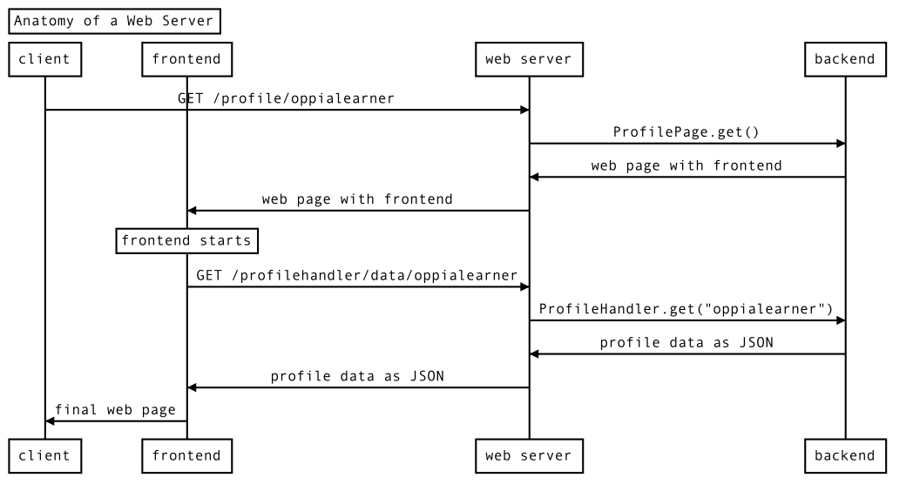
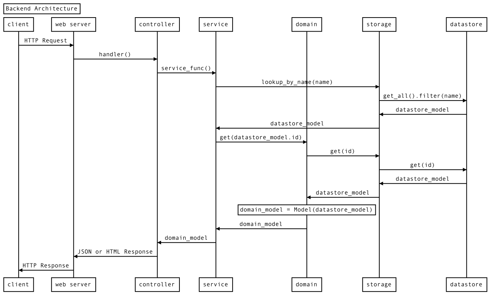

## Table of Contents

* [Web server anatomy: Explaining "frontend" and "backend"](#web-server-anatomy-explaining-frontend-and-backend)
* [Backend](#backend)
  * [Controller layer](#controller-layer)
  * [Backend service layer](#backend-service-layer)
  * [Backend models](#backend-models)
  * [Domain layer](#domain-layer)
  * [Storage layer](#storage-layer)
  * [Backend tests](#backend-tests)
* [Frontend](#frontend)
  * [Component layer](#component-layer)
  * [Frontend service layer](#frontend-service-layer)
    * [Backend API services](#backend-api-services)
  * [Frontend models](#frontend-models)
  * [Other parts of the frontend](#other-parts-of-the-frontend)
  * [Frontend tests](#frontend-tests)
* [Extensions](#extensions)
* [Other files and folders](#other-files-and-folders)

Oppia is built with [Google App Engine](https://developers.google.com/appengine/docs/whatisgoogleappengine). Its backend is written in [Python](https://www.python.org/), and its frontend is written using [AngularJS](https://angularjs.org/) and [Angular](https://angular.io).

## Web server anatomy: Explaining "frontend" and "backend"

If you aren't too familiar with web servers, you might be wondering what terms like "frontend" and "backend" mean. Here's a quick primer.

Suppose you want to view the profile page of the Oppia user `oppialearner`, so you point your browser to `/profile/oppialearner`. If you start a local development server and create a user with username `oppialearner`, you can see this page at http://localhost:8181/profile/oppialearner. This diagram illustrates what happens:



<details>
<summary>Diagram source code</summary>

This diagram can be generated by pasting the text below into https://bramp.github.io/js-sequence-diagrams/.

```uml
Title: Anatomy of a Web Server

participant client
participant frontend
participant web server as webserver
participant backend

client -> webserver: GET /profile/oppialearner
webserver -> backend: ProfilePage.get()
backend -> webserver: web page with frontend
webserver -> frontend: web page with frontend
Note over frontend: frontend starts
frontend -> webserver: GET /profilehandler/data/oppialearner
webserver -> backend: ProfileHandler.get("oppialearner")
backend -> webserver: profile data as JSON
webserver -> frontend: profile data as JSON
frontend -> client: final web page
```
</details>

First, your browser (the client) sends a request to Oppia's web server for the path `/profile/oppialearner`. The webserver passes this request to the appropriate handler function in the backend code. The backend code responds with a web page that contains the frontend code, which the web server passes along to your browser.

Now the frontend code starts running in your browser and, in this example, requests additional data from the web server by issuing a request for the `/profilehandler/data/oppialearner` path. Once again, the web server passes this request to the appropriate backend function, which responds. This time however, the response is [JSON-formatted data](https://developer.mozilla.org/en-US/docs/Learn/JavaScript/Objects/JSON), not a web page. This JSON data is passed to the frontend. The JSON data is not very readable, but you can see it by navigating to http://localhost:8181/profilehandler/data/oppialearner.

While all these operations have been running, your browser has been showing a loading page. Now, the frontend code uses the profile JSON data to create the final web page, which you then see.

For most websites, including Oppia, backend code runs on the server and does most of the site's complicated logic. It works with information and mostly ignores how that information will be conveyed to the user.

On the other hand, frontend code runs in the user's browser and doesn't handle much logic. Instead, it is responsible for conveying the information from the backend to the user and passing user commands to the backend.

## Backend

This diagram illustrates how Oppia's backend works. Don't worry, we'll work through it step by step.



<details>
<summary>Diagram source code</summary>

This diagram can be generated by pasting the text below into https://bramp.github.io/js-sequence-diagrams/.

```uml
Title: Backend Architecture

participant client
participant web server as webserver
participant controller
participant service
participant domain
participant storage
participant datastore

client -> webserver: HTTP Request
webserver -> controller: handler()
controller -> service: service_func()
service -> storage: lookup_by_name(name)
storage -> datastore: get_all().filter(name)
datastore -> storage: datastore_model
storage -> service: datastore_model
service -> domain: get(datastore_model.id)
domain -> storage: get(id)
storage -> datastore: get(id)
datastore -> storage: datastore_model
storage -> domain: datastore_model
Note over domain: domain_model = Model(datastore_model)
domain -> service: domain_model
service -> controller: domain_model
controller -> webserver: JSON or HTML Response
webserver -> client: HTTP Response
```
</details>

Like before, we have the client and webserver on the left. However, this time we're ignoring the frontend and we're showing all the layers that make up the backend. Note that here the "client" could be the frontend code!

### Controller layer

Controllers are the handler functions that get called by the web server each time an HTTP request is received. These functions are usually pretty short and offload most of their work to services, which we'll discuss next. These controllers will often look something like this:

```python
# Handler accepts arguments from the HTTP request
def handler(self, argument_1, argument_2):
    # Call some services
    value_1 = service_1(argument_1)
    value_2 = service_2(argument_2)

    # Do a little logic to combine the results from the services
    value = (value_1 + value_2) ** 2

    # Return the result
    return self.render_json({"value": value})
```

Controllers are stored in `core/controllers/`. `main.py` defines which controller should handle each request.

### Backend service layer

Services get called by controller functions or other services to perform various computations. They often need to access Oppia's stored data, which they do by calling functions in the domain and storage layers.  We'll look at those next.

Services are, confusingly, defined by files in the `core/domain/` folder. Services end in `_services.py`.

### Backend models

Before we talk about the domain layer, we need to discuss models.

A model is a data structure, often a class, that stores the information that defines a particular object in Oppia. For example, we have a model for each exploration. (Note that we use "model" to refer to both the class that defines the exploration model and each instance of that class. Sorry, we know it's confusing, but this language is all over the code base.)

There are many different kinds of models in Oppia. We have frontend models, backend (domain) models, and storage models.

### Domain layer

The domain layer defines the domain, or backend, models. These models are very similar to the frontend models, and they are what most of the backend code operates on. Each model is defined as a class.

These classes don't just store information. They also provide `from_dict` and `to_dict` methods to convert between classes and dictionaries (which can be converted to JSON), and they can contain validation and converters to convert between different versions of the model.

The domain models are defined in `*_domain.py` files under `core/domain/`.

### Storage layer

Finally, we have the storage layer, which defines the storage models.  These are also classes, but they define how data is stored in whatever system we are using to store data to the file system. In production, we use the [Google Cloud Datastore](https://cloud.google.com/datastore), and we interface with it from Python using [Cloud NDB](https://googleapis.dev/python/python-ndb/latest/index.html). (Cloud NDB is for Python 3. For Python 2, we use App Engine NDB.)

The storage models are defined in `core/storage`, while the code that handles interacting with the datastore is in `core/platform`.  `core/platform/models.py` provides an interface to these storage models and the underlying datastore that dynamically loads the correct classes to interface with whatever datastore is currently in use. All the code in the controller, service, and domain layers should remain platform-agnostic by relying on the storage layer.

For example, we use different underlying file storage platforms in dev mode (when running locally on developer machines) versus in prod mode (when running in production). Switching between these platforms is handled by the code in `core/platform`, so the rest of the backend layers can ignore them.

### Backend tests

The backend codebase is heavily tested. Tests are contained in `*_test.py` files next to the Python module they test. This naming convention allows them to be automatically detected and compiled into a test suite by Python's `unittest` module. For more information, see [[Backend tests|Backend-tests]].

## Frontend

Oppia's frontend code is currently being migrated from AngularJS to Angular, so when reading the following sections, you'll see things that have one name in AngularJS and another name in Angular.

The frontend includes the HTML and CSS code that define what the user sees, and it includes the JavaScript (and TypeScript) code that runs in the user's browser.

Oppia's frontend follows the [Model-View-Controller (MVC)](https://developer.mozilla.org/en-US/docs/Glossary/MVC) software design pattern. You should be familiar with that pattern before reading further.

Here are the Angular and AngularJS features we use to implement the MVC paradigm:

| MVC Term            | Angular Term | AngularJS Term |
|---------------------|--------------|----------------|
| Model               | Model        | Object Factory |
| View and Controller | Component    | Directive      |

Let's start with a diagram of Oppia's frontend architecture. Then we will discuss each layer in turn.


<details>
<summary>Diagram source code</summary>

This diagram can be generated by pasting the text below into https://bramp.github.io/js-sequence-diagrams/.

```uml
Title: Frontend Architecture

participant user
participant component
participant service
participant backend API service as backendAPI
participant backend

user -> component: click save button
component -> service: save()
component -> user: show loading indicator
service -> backendAPI: updateProfile(profile)
backendAPI -> backend: PUT /preferenceshandler/data
backendAPI -> service: promise
service -> component: promise
backend -> backendAPI: 200 OK
backendAPI -> component: resolve promise
component -> user: success message
```
</details>

### Component layer

Components (directives in AngularJS) define both the view (the layout of the page the user sees) and the controller logic that responds to user input.

Most pages begin with a `*.mainpage.html` file, for example `topic-editor-page.mainpage.html`. This HTML file contains a `<topic-editor-page>` tag, which refers to the `topic-editor-page.component.html` file.

Both files are HTML, but `*.mainpage.html` is what the browser sees as the webpage, so it begins with `<!DOCTYPE html>`, contains `<head>`, and so on like a normal HTML page. `*.component.html` on the other hand is just defining a tag, so it won't have those lines. Instead, it could just begin with a `<div>` tag.

Alongside each component, you'll also find a `*.module.ts`, for example `topic-editor-page.module.ts`. This defines the component as an Angular module and specifies its dependencies. You'll also see a `*.import.ts` file, which imports third-party dependencies.

Finally, each component comes with a `*.component.ts` file that provides the controller logic. Here you'll find a class for the component that looks something like this:

```ts
@Component({
  selector: 'oppia-profile-page',
  templateUrl: './profile-page.component.html'
})
export class ProfilePageComponent {

  userLoggedIn: boolean;
  // ... more instance fields ...

  constructor(
    // ... dependencies ...
  ) { }

  ngOnInit(): void {
    // ... initialization code ...
    this.userLoggedIn = false;
  }

  logIn(): void {
    this.userLoggedIn = true;
  }

  // ... more methods ...
}
```

(Note that here we used the profile page as an example since the topic editor page hadn't been migrated to Angular yet at time of writing.)

Then this code gets used in the component HTML file like this:

```html
<div *ngIf="!userLoggedIn">
  <button class="btn"
          (click)="logIn()">
    Log In
  </button>
</div>
```

Components for pages are defined in `core/templates/pages`. Some components get re-used across many pages, and these live in `core/templates/components`.

While components' `*.component.ts` files handle controller logic, they offload complex logic to the service layer.

### Frontend service layer

Services are just TypeScript files that define Angular modules to handle more complex controller logic. These are defined in a `services/` folder alongside the rest of the component files we saw above.

Services that are used across components live under `core/templates/services`.

#### Backend API services

Some service files end in `-backend-api.ts` (their module names end in `BackendApiService`). These submit HTTP requests to Oppia's backend. For example, when you update your profile, a backend API service issues a PUT request to Oppia's backend with your updated profile.

Ideally, all interaction with the backend would happen through these backend API services. However, there is unfortunately still some code that makes backend calls elsewhere.

### Frontend models

Everything we've described so far lives in the "view" and "controller" realms of MVC. Now let's get to the "model" part.

Models (or object factories in AngularJS) are data structures that represent objects in Oppia. For example, we have a model for a user and another for a user's profile. These are just classes that hold information about the object they represent and provide methods for getting that information.

Here's an (overly simplified) example of a model:

```ts
export class Light {
  _isOn: boolean;

  constructor(isOn: boolean) {
    this._isOn = isOn;
  }

  static createFromBackendDict(
      data: UserInfoBackendDict): Light {
    return new Light(data.is_on);
  }
  static createDefault(): Light {
    return new Light(false);
  }

  isOn(): boolean {
    return this._isOn;
  }
```

This model describes whether a light is on or off. It stores this state in a private `_isOn` instance variable. A new light can be created using the constructor by passing in whether the light is on, but more commonly you will use the `createFromBackendDict` to create a light from the JSON data provided by a backend API service. We also have methods to create a default light and to read the state of the light.

Models are defined in `core/templates/domain/`.

### Other parts of the frontend

* **CSS** code defines the site's visual style. CSS code lives within each HTML file, but the `core/templates/css` directory holds the CSS code shared across the website.
* **Expression services** help us parse mathematical expressions. We use [PEG.js](https://pegjs.org) to generate our parser, and the parser code lives in `core/templates/expressions`.
* **Filters** are TypeScript classes that perform common filtering operations, like truncating a long string. These are stored in `core/templates/filters`.

### Frontend tests

The frontend isn't quite as heavily tested as the backend yet, but we're working on that! Any new code you write should be fully tested. For information on how, check out our [[guide to frontend testing|Frontend-tests]].

Our frontend tests live in `*.spec.ts` files that accompany each frontend code file. For example, `topic-editor-page.ts` will be in the same directory as its test file, `topic-editor-page.spec.ts`.

## Extensions

Oppia has a number of extension points that allow developers to augment its functionality, all of which are located in the `extensions/` folder.

There are several different types of extensions:

* **Objects** represent object types that Oppia recognizes, such as NonnegativeInt, UnicodeString and Filepath. In general, they each come with an editor view, a readonly view, and a normalizer which tries to convert a Python object to the given type.
* **Rules** allow learner answers to be classified, so that Oppia can provide appropriate feedback in response.
* **Value generators** are essentially functions which take some inputs and produce a single output. They are used when defining parameter changes: for example, they allow an exploration author to specify an exact value for the parameter, or a range of values, one of which is selected at random.
* **Rich-text-editor extensions** provide additional functionality for content that is shown to the learner. They are accessed via control buttons in the rich-text editor toolbar, and include things like videos, images, links and LaTeX math expressions.
* **Interactions**, such as interactive maps and numeric input, allow the learner to submit an answer, which is then sent to the server for Oppia to respond to.

## Other files and folders

* `feconf.py` contains various constants that are referred to by other backend files in the app.
* The `data/explorations` folder contains sample explorations that are bundled with the Oppia distribution.
* The `scripts/` folder contains several utility scripts that automate processes like starting a development server, running tests, and deploying a copy of Oppia to a production server.
