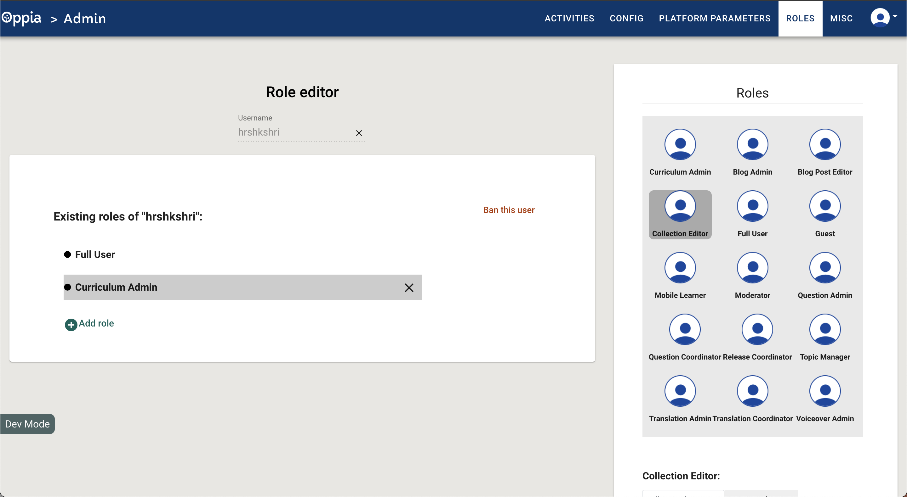
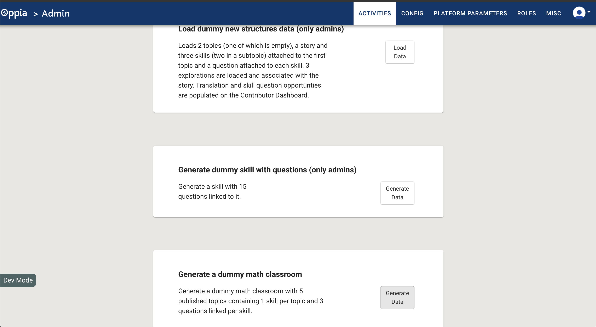
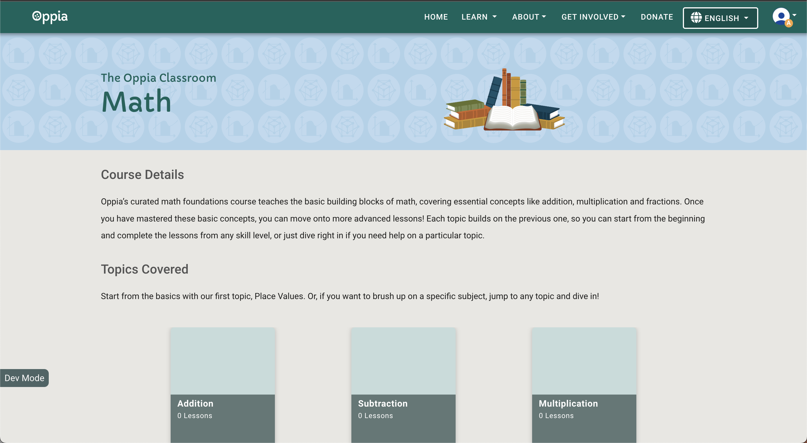

This guide provides step-by-step instructions for populating data on a local Oppia server. It is intended for Oppia users who need to set up a local environment for testing or development purposes.

## Table of Contents
- [Classroom Pages](#classroom-pages)
  - [Maths Classroom Page](#maths-classroom-page)

Please note that the instructions provided in this document are to be executed only after logging into Oppia.
If you are not logged in, please follow the link [log-in-instruction](https://github.com/oppia/oppia/wiki/How-to-access-Oppia-webpages#user-account-pages) before executing the guidelines in this document.

## Classroom Pages

### Maths Classroom Page

1. Assign "Curriculum Admin" Role:

   - Log in as a super-admin.
 - Navigate to the [Admin page](https://github.com/oppia/oppia/wiki/How-to-access-Oppia-webpages#admin-pages).
   - Assign the "Curriculum Admin" role to your user.
  

2. Generate a New Math Classroom:

   - On the Activities tab of the admin page, click the "Generate Data" button to create a new dummy math classroom.
  

3. Access Math Classroom Page:

   - Go to http://localhost:8181/learn/math to view the newly generated math classroom.
  
