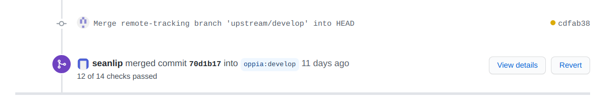
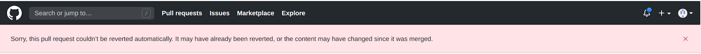

## Table of Contents

* [Blame-Free Reverts](#blame-free-reverts)
* [Policy](#policy)
* [Instructions](#instructions)
  * [Developers Who Notice a Regression](#developers-who-notice-a-regression)
  * [Developers Who Cause a Regression](#developers-who-cause-a-regression)
  * [Developers with Revert Permissions](#developers-with-revert-permissions)
  * [Dev Workflow Leads](#dev-workflow-leads)
* [Tips](#tips)
  * [How to identify the bad commit](#how-to-identify-the-bad-commit)
  * [How to revert a PR](#how-to-revert-a-pr)

## Blame-Free Reverts

Sometimes, PRs need to be reverted despite the PR author doing nothing wrong. For example, sometimes a race condition occurs where 2 PRs are merged in quick succession and conflict. We may have to revert one of the PRs to fix develop even though no PR author did anything wrong.

It is important to note that reverts are not ment to be punitive. A key tenet of the dev workflow team is that develop needs to be kept correct at all times. When a regression appears, we need to fix develop as quickly as possible to avoid blocking other developers, and sometimes the quickest way is to revert PRs. Thus, we revert PRs to help developers keep working, not because the PR author did something wrong.

## Policy

When a PR is merged that causes a regression in develop, there are two ways to fix the regression:

1. Revert the PR. This can be quick if there are no merge conflicts, but with large PRs, reverts can be difficult.
2. Fix forward by merging another PR without reverting the problematic PR. This can be easy if the bug is small and easily-identifiable, but if the solution is unclear, fixing forward can be hard.

> **Note**
> In either case, the PR author is responsible for fixing the bug in their PR, either by re-creating their PR without the bug (if we revert) or by opening a new PR to fix the bug (if we fix forward).

By default, we should take whichever approach will fix develop first, possibly by pursuing both in parallel. The dev workflow leads are responsible for deciding which approach(es) to follow.

However, based in part on the severity (minor, moderate, or severe) of the regression, the dev workflow team leads may decide to make the following exceptions to this policy:

1. If (a) the regression does not have a severe detrimental effect on developers, (b) the regression in develop affects only developers, and (c) a revert would substantially harm the PR author (e.g. an impending external deadline), we may allow the PR author to fix the regression forward even if reverting the PR would fix develop faster. In making this exception, we should set a clear deadline for the fix forward PR to be merged (2-7 days) based on the severity of the regression.

2. If the regression in develop has only a minor detrimental effect on developers, we may decide to accept it as a permanent regression. Moving forward, the new "broken" state would be considered the intended state, and no fix would be required. An issue should be opened describing how the problem can be fixed, and this issue will be handled by the dev workflow team like any other feature request.

To decide whether an exception is available, first decide whether anyone besides developers are affected. If non-developers are affected, no exceptions are available. Next, decide whether the regression has a minor, moderate, or severe detrimental effect on developers. Then this table shows when each exception applies:

| Detrimental Effect on Developers | Applicable Exceptions              |
|----------------------------------|------------------------------------|
| Severe                           | None                               |
| Moderate                         | 1 (if points 1b and 1c are met)    |
| Minor                            | 1 (if points 1b and 1c are met), 2 |

## Instructions

### Developers Who Notice a Regression

If you see a regression in develop, notify the dev workflow leads by opening an issue (the "regression tracking issue") that describes the regression in detail. Please include:

* A description of the previous (correct) behavior.
* A description of the current (broken) behavior.
* What impact the regression has on affected stakeholders (e.g. learners, developers, exploration creators, etc.).
* A discussion of any investigations you have done and the cause of the regression, if known.

Please at-mention @oppia/dev-workflow-reviewers so that we can get to work fixing the breakage quickly.

### Developers Who Cause a Regression

If you have been notified that your changes caused a regression in develop, you should first reach out to the dev workflow leads via the tracking issue so they can advise you on which remediation approach should be followed. If no tracking issue (discussed in the previous section) exists, you should create it. In your comment, please estimate how quickly you can merge a PR to fix the regression (fix forward).

You should also begin debugging your changes to figure out what caused the regression and how to fix it. Regardless of whether we end up reverting the PR or fixing forward, you're responsible for fixing the bug, either by re-creating the PR after the revert or by fixing forward.

Once the dev workflow leads decide whether to revert, fix forward, or both, you should start work on the associated actions (re-creating the PR with the bug fixed, opening a fix-forward PR to fix the bug, or both).

### Developers with Revert Permissions

Any Oppia developer with permission to open revert PRs on GitHub may decide, following the above policy, whether to revert the PR, fix forward, pursue both in parallel, or make one of the two allowed exceptions. If you are such a developer, you should document your reasoning and communicate on the tracking issue so the dev workflow leads can understand what happened.

### Dev Workflow Leads

As dev workflow leads, you are developers with revert permissions, so the above instructions apply to you too. Further, you should make sure a tracking issue is created and alert the rest of the dev workflow leads. You are also responsible for making sure whatever stragety we decide on to fix develop is actually executed.

You should also notify people as follows:

* If the regression is user-facing, notify the release coordinator of the previous release so that they can do a hotfix to fix production.
* Once the PR that caused the regression is identified, you should also comment on the PR to notify the PR author. Make clear that they are expected to help fix the regression.
* If the regression affects developers, email oppia-dev. Include a link to the tracking issue so developers can track the status of our work to fix it.

Finally, consider what mitigation steps we could take to prevent similar regressions in the future. Here are some potential mitigations to consider:

   * New tests, for example if a breakage occurred in a bit of code that wasn't thoroughly tested.
   * Adding lint checks, for example if the regression was caused by a coding pattern we should avoid.
   * Changes to how we review PRs, for example if the regression was a UI bug that would have been caught had the PR description included screenshots.
     * Consider how much your mitigation will slow down the review process. Some mitigations, like adding screenshots, might not be a problem. Others, like requiring many more reviewers, might be more trouble than they're worth.
   * Emailing oppia-dev, for example to warn developers to avoid the coding pattern that caused the regression.
     * While we want to notify the developer community of how they can avoid regressions, we don't want to spam them with so many emails that they stop reading oppia-dev. Emailing oppia-dev is often the easiest mitigation, but it is not always the most effective.

   You may conclude that no mitigation is worth implementing, for example if the mitigations would introduce too much friction into the PR approval process. However, you should document your thought process in the issue in case someone has an idea for a mitigation you didn't consider.

Unless you can implement the mitigations immediately, you should open an issue for them. You should assign the issue to whoever is going to be in charge of implementation (often the dev workflow team lead).

## Tips

### How to identify the bad commit

To systematically locate a bad commit, you can use the git-bisect tool. It internally uses a binary search algorithm to find the offending commit from the project history. To use this tool:

1.  Git checkout develop branch where the bug is observed (`git checkout develop`).

2.  Run `git bisect start` to start a bisect session.

3.  Run `git bisect bad` to verify that the current commit contains the bug.

4.  Go to [this](https://github.com/oppia/oppia/commits/develop) page to find an older (“good”) commit where the bug did not exist. Copy the commit id of the commit, and do git checkout on it (git checkout <commit-id>). Start the dev server (by running the start script) and try to figure out whether the error still exists. If so, you will need to find an even older commit than the current one. Kill the server, and repeat this step until you find a “good” commit.

5.  Once you’ve found a “good” commit, run `git bisect good`. The tool will automatically perform a binary search and checkout a commit between the “good” commit and “bad” commit. Start the dev server (by running the start script) and try to reproduce the error. At each step:
    - If the bug is reproducible, run `git bisect bad`.
    - If not, run `git bisect good`.

    Repeat this step until the tool reports the offending commit.

### How to revert a PR

In the PR page, you will find a “revert” button at the point where the PR was merged.

Clicking on this button will create a new PR with the reverted changes. Feel free to add a detailed comment in the PR description explaining why the PR needs to be reverted and tag the author of the original PR.

If you see this:

You will need to make the code changes on your local machine and create a PR by hand.
