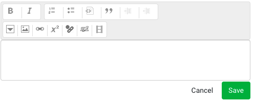

## Table of Contents

* [Table of Contents](#table-of-contents)
* [Introduction](#introduction)
* [Write a schema](#write-a-schema)
* [Uses for schemas in Oppia](#uses-for-schemas-in-oppia)
  * [Schema-based forms](#schema-based-forms)
  * [Validating controller arguments](#validating-controller-arguments)
    * [Schema validation system code](#schema-validation-system-code)
    * [How to write validation schemas for handlers](#how-to-write-validation-schemas-for-handlers)
    * [Important code pointers](#important-code-pointers)
      * [Default and optional arguments](#default-and-optional-arguments)
      * [Domain object arguments: Schemas with type `object_dict`](#domain-object-arguments-schemas-with-type-object_dict)
        * [Case 1: `object_class` key](#case-1-object_class-key)
        * [Case 2: `validation_method` key](#case-2-validation_method-key)
      * [Extra validators](#extra-validators)
      * [Extra arguments](#extra-arguments)
      * [Handlers with no arguments](#handlers-with-no-arguments)
      * [Post schema operations](#post-schema-operations)
    * [Common errors faced](#common-errors-faced)
    * [Examples for reference](#examples-for-reference)
    * [Debugging tricks](#debugging-tricks)
    * [Contact](#contact)
  * [Configuration values](#configuration-values)

## Introduction

At Oppia, we often want to describe the possible structure of some data. This data could be as simple as the boolean value of a checkbox in a user's preferences, or it could be more complex like the valid arguments to one of our backend API controllers. We describe these data using _schemas_.

A schema describes the structure of data in a machine-readable format so that generic utility functions can operate on arbitrary data so long as the data comes with a schema. For example, schemas let us:

* Validate provided data to make sure it conforms to the expected schema.
* Automatically generate forms that let a user provide data in a form specified by a schema.

## Write a schema

A schema is just a dictionary that takes the form described below:

* Required keys:

  * `type`: The type of the data. Must be one of the following types. Unless otherwise stated, the type corresponds to the Python type of the same name.

    * `bool`
    * `int`
    * `float`
    * `basestring`: A type that includes both the `bytes` and `str` types in Python 3. Normalization will _not_ decode the data, even if a `bytes` object is provided.
    * `unicode`: The `str` type in Python 3, which was the `unicode` type in Python 2. This type also accepts a `bytes` object, which will be automatically decoded according to UTF-8 during normalization.
    * `list`
    * `dict`
    * `html`: A string (`bytes` or `str` in Python 3) with HTML code. When normalized, the HTML code will be sanitized by `core.domain.html_cleaner.clean()`. A `bytes` object may also be provided, which will be automatically decoded acording to UTF-8 during normalization.
    * `custom`: A custom object type defined in `extensions/objects/models/objects.py`.
    * `object_dict`: A dictionary that corresponds to a domain object (an object whose class is defined in the domain layer).
    * `unicode_or_none`: Accepts data of type `unicode` or `None`. If the data is not `None`, it is normalized as if it were of type `unicode`.

* Optional keys:

  * `choices`: A list of possible values. The data must exactly match one of the choices.
  * `validators`: A list of dictionaries, each of which has a sole key `id` that maps to the name of a validation function. The validation functions are defined as static methods of `schema_utils._Validators`. To conform to the schema, data must pass all validators provided in the schema.
  * `ui_config`: A dictionary of configuration parameters for how the data should be displayed. Note that this key only applies when the schema data is being displayed as a form. The dictionary may contain any of the following keys:

    * `rows`: Only allowed for type `unicode`. If specified, the value must be a positive integer. If this value is omitted, the unicode field is displayed as a regular `<input>` field. Otherwise, it is displayed as a textarea with the given number of rows.
    * `placeholder`: Only allowed for type `unicode`. If specified, the value must be a string, which will be the placeholder for the input field.
    * `coding_mode`: Only allowed for type `unicode`. If specified, the value must be a string equal to either `none` or `python`. If this value is specified, a CodeMirror instance with the appropriate syntax highlighting is used as the input area, and the `rows` and `placeholder` properties above are ignored.
    * `add_element_text`: Only allowed for type `list`. If specified, the value must be a unicode string. If this value is omitted, no changes are made to the 'Add element' button; otherwise, the default 'Add element' text is replaced with the given value.
    * `size`: Only allowed for type `html`. If specified, the value must be a string equal to either `small` or `large`. If `small`, a 2-line RTE is shown; if `large`, a 10-line RTE is shown.

* Keys for certain types:

  * If the type is `object_dict`, the schema must also include exactly one of the following keys:

    * `object_class`: If this key is provided, the value should be the domain object class. During normalization, the data will be passed to the class's `from_dict` method to construct the object, and then the object's `validate()` method will be called.

    * `validation_method`: If this key is provided, its value should be a function that can validate the provided dictionary. During normalization, the function will be called with the data as its sole argument, and then the data will be returned. Note that the validation function should not return anything and should raise an exception if it finds invalid data.

  * If the type is `list`, the following keys apply:

    * `len` (optional): The required length of the list. Normalization will fail if the list length differs from the value of this key.
    * `items` (required): A schema that describes each object in the list. Normalization will recursively normalize each of the list elements according to this schema.

  * If the type is `dict`, the following keys apply:

    * `properties` (required): A list of dictionaries. Each dictionary describes a key-value pair in the data and has exactly two keys:

      * `name`: The key in the dictionary that the schema describes.
      * `schema`: A schema describing the associated value.

      For example, suppose we want to describe a dictionary with a single key, `version`, whose value is an integer. We could do so with the following schema:

      ```json
      {
        "type": "dict",
        "properties": [
          {
            "name": "version",
            "schema": {
              "type": "int"
            }
          }
        ]
      }
      ```

      In an editor, the fields for the properties will appear in the same order as they appear in the list.

    * `description` (optional): A human-readable description.

The code that handles schemas is in [`schema_utils.py`](https://github.com/oppia/oppia/blob/develop/schema_utils.py).

## Uses for schemas in Oppia

### Schema-based forms

Oppia uses lots of forms, and it's tiresome to have to write each one from scratch each time. To get around this, we have built a schema-based form framework that allows such forms to be built declaratively. From each schema, we know the type of the form field, what restrictions we want to impose on user input (from the validators), and how the form should be displayed (from the `ui_config` key).

Note that this framework isn't meant to be exhaustive; it is meant to simplify form creation for the more common cases. Custom forms can still be written using the methods referenced in [[Creating Objects|Creating-Objects]].

In the frontend, the `components/forms/schema-based-editors/` directory contains the `schema-based-editor` component which takes a schema and generates a form whose return value satisfies the schema. The schema can be annotated with UI configuration options to tell the form how to display itself. You can also use FormBuilder to create a custom form; the only requirement is that the return type matches that defined by the schema.

For example, the [`story-node-editor` component](https://github.com/oppia/oppia/blob/develop/core/templates/pages/story-editor-page/editor-tab) includes a schema-based editor with the following HTML:

```html
<schema-based-editor id="storyNodeOutline"
                     schema="OUTLINE_SCHEMA"
                     local-value="editableOutline">
</schema-based-editor>
```

The `OUTLINE_SCHEMA` constant in the component's TypeScript file like this:

```ts
$scope.OUTLINE_SCHEMA = {
  type: 'html',
  ui_config: {
    startupFocusEnabled: false,
    rows: 100
  }
};
```

The result is a form where a user can provide an outline with some basic HTML markup:



### Validating controller arguments

All arguments passed to the GET/POST/PUT/DELETE methods of the handler classes in the Oppia controller layer or in main.py need to be robustly validated before being passed to the domain layer in the backend. If we define schemas for the expected arguments, then we can use a generic schema validation system (SVS) to validate the arguments!

#### Schema validation system code

The following key methods are used in the validation of handler args through the SVS:

* `validate_and_normalize_args()` in `base.py`: This method is defined in the BaseHandler class of base.py. The `validate_and_normalize_args` method is responsible for validating and normalizing handler args. It also raises exceptions when those validation and normalization fail, for example `InvalidInputException` and `NotImplemented` errors. (See [this section](#common-errors-faced) for a list of common errors that may arise.)

* `validate(handler_args, handler_args_schemas)` in `payload_validator.py`: This method is the core method of the SVS. It collects all the AssertionErrors raised from schema_utils.
  * `handler_args`: The arguments from the HTTP request.
  * `handler_args_schemas`: Schemas from the handler class as they are defined in the class's `URL_PATH_ARGS_SCHEMAS` or `HANDLER_ARGS_SCHEMAS` class variables. See [this link](#how-to-write-validation-schema-for-handlers) for more information on how to write a schema and how to define these class variables.

* `normalize_against_schema(obj, schema)` in `schema_utils.py`: This method normalizes the given `obj` against its schema and raises `AssertionError` if any of the validation checks fail. This `AssertionError` is represented as `InvalidInputException` to users.
  * `obj`: The object which needs to be normalized.
  * `schema`: The schema for the object.

#### How to write validation schemas for handlers

If you’re writing a new handler method, you’ll need to add schema validation for the handler args. To do this, follow the steps below:

1. **List all the arguments passed to each method in the handler**
   Make a list of all the arguments passed to each method in the handler class. Arguments received by a handler class method can be categorized into 3 types:

   * **URL path elements** : The data included in the path of the URL are called URL path elements. Example: in `url/<exploration_id>/`, the exploration_id is a URL path element.
   * **Payload arguments**: The data which come from payloads are called payload arguments. These data are typically received by PUT and POST methods.
   * **URL query parameters**: Query parameters are included at the end of a URL. Example: in `url/<exploration_id>?username=nikhil`, there is a single URL query parameter with name “username” and value “nikhil”. URL query parameters are typically received by GET and DELETE methods.

   If you face any difficulty with this step, see the [debugging section](#debugging-tricks) or reach out to anyone mentioned in the [contact section](#contact).

2. **Determine the schema for each argument**
   First, you should be familiar with [how to write a schema](#write-a-schema). Then, you can write a schema for each argument, beginning with [some boilerplate code](#handlers-with-no-arguments). For more information, see the sections on [important code pointers](#important-code-pointers) and [examples](#examples-for-reference).

3. **Define schemas for URL path elements in URL_PATH_ARGS_SCHEMAS**

   * The schemas for URL path elements should be written in the `URL_PATH_ARGS_SCHEMAS` class variable in the handler class.
   * The keys of `URL_PATH_ARGS_SCHEMAS` should be the full set of URL path elements and the corresponding values should be the schemas for those args. If there are no URL path elements, then `URL_PATH_ARGS_SCHEMAS` should be set to {} (an empty dict).

   Example: Let `exploration_id` be a URL path element. Then, the schema for `exploration_id` should look like:

   ```python
   URL_PATH_ARGS_SCHEMAS = {
       'exploration_id': {
           'schema': {
               'type': 'basestring'
           }
       }
   }
   ```

4. **Define schemas for payload arguments and URL query parameter in `HANDLER_ARGS_SCHEMAS`**

   * The schemas for payload arguments and URL query parameters are written in the `HANDLER_ARGS_SCHEMAS` class variable in the handler class.
   * After writing [boilerplate code](#handlers-with-no-arguments) for the `HANDLER_ARGS_SCHEMAS`, the value corresponding to each request method key (GET/PUT/POST/DELETE) should be a dictionary containing all the payload args and URL query parameters for the corresponding method. Each key of this dictionary should represent the name of an argument, and the corresponding value should be its schema. **Note**: While writing boilerplate code, make sure to remove the request keys which do not correspond to any request method in the handler class.

   Example:  Let `username` be an argument passed to the delete request method of a handler class. Then, the schema for the delete request method should look like:

   ```python
   HANDLER_ARGS_SCHEMAS = {
       'DELETE': {
           'username': {
               'schema': {
                   'type': 'basestring'
               }
           }
       }
   }
   ```

#### Important code pointers

The following points discuss the conventions adopted throughout the codebase for adding schemas to handler classes. **Please read these conventions carefully**.

##### Default and optional arguments

If an argument is not present in a request, and the schema for that argument is defined in the handler, then that argument is treated as “missing”. For missing args, `schema_utils` will raise an `AssertionError` which will be represented as an `InvalidInputException` by the `validate_and_normalize_args()` method.

To provide a default value for an argument, include a key with the name `default_value` along with the schema. The value for this key is the default value, which will be used if the argument is not present. If an argument is optional and it is not supposed to be updated with any default value, then the `default_value` key should map to `None`.

**Example when a default value is provided**: Let `apply_draft` be an optional argument which should take the default value `False` if no value for that argument is provided. In that case, the schema for `apply_draft` should look like:

```python
{
    'GET': {
        'apply_draft': {
            'schema': {
                'type': 'bool'
             },
            'default_value': False
        }
    }
}
```

**Example when no default value is provided**: Suppose `make_community_owned` is an optional argument which should not take any default value if no value for that argument is provided with the request. In that case, the schema for `make_community_owned` should look like:

```python
{
    'PUT':{
        'make_community_owned': {
            'schema': {
                'type': 'bool'
             },
            'default_value': None
        }
    }
}
```

For more information [refer to our examples](#examples-for-reference).

##### Domain object arguments: Schemas with type `object_dict`

Objects which are represented by classes written in the domain layer of the codebase are called domain objects. These classes typically include methods to validate their objects.

For validating domain objects through the SVS, there are two preferred solutions:

###### Case 1: `object_class` key

Many of the domain objects do not get initialized with dictionaries,so they must be initialized by using their `from_dict()` methods.  This case applies when the data coming from a request is a dict and the domain object the dict represents has a `from_dict()` method.

In this case, schemas should have the following two keys:

1. **type**: 'object_dict'
2. **object_class**: class written in the domain layer of the codebase for the corresponding argument.

**Example**: Let `new_rules` be the list of dicts where each dict item is a representation of the `PlatformParameterRule` domain object in the `platform_parameter_domain.py` file. The schema for `new_rules` should look like:

```python
HANDLER_ARGS_SCHEMAS = {
    'POST': {
        'new_rules': {
            'schema': {
                'type': 'list',
                'items': {
                    'type': 'object_dict',
                    'object_class': (
                        platform_parameter_domain.PlatformParameterRule)
                }
            }
        }
    }
}
```

###### Case 2: `validation_method` key

Sometimes, a domain object has a `validate_dict()` method that should be used for validation. These methods sometimes need extra arguments, for example to enforce strict validation. Since these cases cannot be handled generally, you'll need to write a function that accepts the dictionary from the request and passes it to the domain object's `validate_dict()` method, specifying other parameters as needed. Your function should be in the `domain_objects_validator.py` file.

The newly written function of the `domain_objects_validator.py` file should be directly passed into the schema with a schema key named `validation_method`. Schemas for these cases should have the following two keys:

1. **type**: 'object_dict'
2. **validation_method**: method written in domain_objects_validator for calling the `validate()` method from the domain class.

**Example**:  Let `change_list` be a list of dicts where each dict item is a representation of the `ExplorationChange` domain object in the `exp_domain.py` file. The schema for change_list should look like:

```python
HANDLER_ARGS_SCHEMAS = {
    'PUT': {
        'change_list': {
            'schema': {
                'type': 'list',
                'items': {
                    'type': 'object_dict',
                    'validation_method': (
                        domain_objects_validator.validate_exploration_change)
                }
            }
        }
    }
}
```

Here, `validate_exploration_change` is the function you wrote.

For more information [refer to our examples](#examples-for-reference).

##### Extra validators

By providing validators, you can increase a schema’s functionality. The `validators` field in the schema contains a list of dicts, where each dict contains a key `id` whose value is the name of the validator. Existing validator methods can be found in the `_Validator` class of  `schema_utils.py`. You can use the existing validators or write new ones.

**Example**: Let us assume that `language_code` is a handler arg that needs to be validated in order to check whether it is a supported language code. The validator checking this is already written in `schema_utils.py`, so the schema for `language_code` would look like:

```python
HANDLER_ARGS_SCHEMAS = {
    'PUT': {
        'language_code': {
            'schema': {
                'type': 'basestring',
                'validators': [{
                    'id': 'is_supported_language_code'
                }]
            }
        }
    }
}
```

##### Extra arguments

Any received arguments which do not correspond to a schema in the handler class are treated as extra arguments. By default, `schema_utils.py` will raise an `AssertionError` for extra args. However, for HTML handlers, extra arguments are allowed. (This accommodates e.g. utm parameters which are not used by the backend but needed for analytics. See [this link](https://support.google.com/analytics/answer/1033863?hl=en#zippy=%2Cin-this-article) for an explanation.) Note that the schema for HTML handlers can be written in the usual way. The functionality for allowing extra arguments in HTML handlers is already handled by the schema validation infrastructure.

##### Handlers with no arguments

Handlers with no request arguments still need a schema defined, otherwise you will face a `NotImplemented` error. In this case, the schema should look like the following (note that the keys for `HANDLER_ARGS_SCHEMAS` depend on which handler methods are present):

```python
URL_PATH_ARGS_SCHEMAS = {}
HANDLER_ARGS_SCHEMAS = {
    'PUT': {},
    'GET': {},
    'PUT': {},
    'POST': {}
}
```

##### Post schema operations

After writing schemas for a handler class, make sure to update the request methods to use the normalized value after schema validation and remove any now-redundant validation checks.

**Example**: Replace the `request` keyword in the backend with the `normalized_request` keyword and the `payload` keyword with the `normalized_paylaod` keyword so that the normalized value obtained after schema validation can be used in the backend.

```python
self.request.get(‘version’) ----> self.normalized_request.get(‘version’)
self.payload.get(‘username’) ----> self.normalized_payload.get(‘username’)
```

#### Common errors faced

When writing handler args, you may encounter `NotImplementedError`s or `InvalidInputException`s. Here is how to handle these:

1. **NotImplementedError**

   * **Description**: This error will be raised if any necessary schemas (i.e, `HANDLER_ARGS_SCHEMAS` or `URL_PATH_ARGS_SCHEMAS`) are not present in the corresponding handler class.
   * **How to resolve**: This error message is raised with the name of the handler which is missing a schema definition. Add schemas to the specified handler class.

2. **InvalidInputException**

   * **Description**: This error will be raised if schema validation failed for any argument. It may be due to extra arguments, missing arguments or any type mismatch.
   * **How to resolve**: This error message is raised by the `validate_and_normalize_args()` method with the name of the argument for which schema validation failed. By looking at error messages and stack traces, you can find which argument is failing the schema validation test and debug.

#### Examples for reference

Examples of PRs for different types is given below:

* [Sample PR 1](https://github.com/oppia/oppia/pull/13223)
* [Sample PR 2](https://github.com/oppia/oppia/pull/13224)
* [Sample PR 3](https://github.com/oppia/oppia/pull/13225)

#### Debugging tricks

When writing the schema for a handler class, you will often need to add a couple of print statements to gain information about the arguments coming from request. In this section we will add a schema step by step for `ExplorationRightsHandler`.

1. **Find the handler class.**
   `ExplorationRightsHandler` is present in the `editor.py` file.

2. **Identify the request methods.**
   `ExplorationRightsHandler` contains PUT and DELETE request methods.

3. **Make a list of all arguments.**

   * URL path elements: `exploration_id`
   * Payload arguments: `version`, `make_community_owned`, `new_member_username`, `new_member_role`, `viewable_if_private`.
   * URL query parameters: `username`

4. **Add print statements**
   Add these print statements in the `validate_and_normalize_args()` function of `base.py`. Make sure to add these print statements after the printed variables have been declared.

   ```python
   print('\n'*3)
   print('------------'*3)
   print('Request url = ',self.request.uri)
   print('Handler class name = ',handler_class_name)
   print('handler_args = ',handler_args)
   print('Arguments = ', self.request.arguments())
   print('Iterating over arguments...')
   for j in self.request.arguments():
       print(j, self.request.get(j))
   print('URL path elements = ', self.request.route_kwargs)
   print('Request method = ',request_method)
   print('HANDLER_ARGS_SCHEMAS =  ', self.HANDLER_ARGS_SCHEMAS)
   print('URL_PATH_ARGS_SCHEMAS = , ', self.URL_PATH_ARGS_SCHEMAS)
   print('GET_HANDLER_ERROR_RETURN_TYPE', self.GET_HANDLER_ERROR_RETURN_TYPE)
   print('------------'*3)
   print('\n'*3)
   ```

5. **Hit the handler through frontend**
   Start the server and hit the handlers from the frontend. Then look for your print statements in the terminal. For `ExplorationRightsHandler`, the print logs should look like:

   ```text
   ------------------------------------
   (u'Request url = ', 'http://localhost:8181/createhandler/rights/QuWbhgRTovXr')
   (u'Handler class name = ', 'ExplorationRightsHandler')
   (u'Arguments = ', ['csrf_token', 'payload', 'source'])
   Iterating over arguments...
   ('csrf_token', u'1622997677/wOV5q43bIZf1cvOhCB4vrQ==')
   ('payload', u'{"version":1,"new_member_role":"owner","new_member_username":"nikhil"}')
   ('source', u'http://localhost:8181/create/QuWbhgRTovXr#/settings')
   (u'URL path elements = ', {u'exploration_id': 'QuWbhgRTovXr'})
   (u'Request method = ', 'PUT')
   (u'HANDLER_ARGS_SCHEMAS =  ', {u'DELETE': {u'username': {u'type': u'basestring'}}, u'PUT': {u'make_community_owned': {u'default_value': None, u'type': u'bool'}, u'new_member_role': {u'default_value': None, u'type': u'basestring'}, u'new_member_username': {u'default_value': None, u'type': u'basestring'}, u'viewable_if_private': {u'default_value': None, u'type': u'bool'}, u'version': {u'type': u'int'}}})
   (u'URL_PATH_ARGS_SCHEMAS = , ', {u'exploration_id': {u'type': u'basestring'}})
   ------------------------------------
   ```

6. **Write the schema by following the boilerplate code**
   Writing the schema is the most crucial part, and it is important to get this correct. The print logs from the previous step can help you get started, but please be sure to dig into the backend and frontend code, and follow calls to methods/functions to see how the incoming data is used. This will help you avoid making errors. In particular:

   * **For the backend**: Try to read code as well as docstrings of all the methods which use the arguments from the request.
   * **For the frontend**: Try to read the functions which are associated with the request URL.

   The eventual schema for ExplorationRightsHandler should look like:

   ```python
   class ExplorationRightsHandler(EditorHandler):
       """Handles management of exploration editing rights."""

       URL_PATH_ARGS_SCHEMAS = {
           'exploration_id': {
               'schema': {
                   'type': 'basestring'
               }
           }
       }

       HANDLER_ARGS_SCHEMAS = {
           'DELETE': {
               'username': {
                   'schema': {
                           'type': 'basestring'
                    }
                }
           },
           'PUT':{
               'version': {
                   'schema': {
                       'type': 'int'
                   }
               },
               'make_community_owned': {
                   'schema': {
                       'type': 'bool'
                   },
                   'default_value': None
               },
               'new_member_username': {
                   'schema': {
                       'type': 'basestring'
                   },
                   'default_value': None
               },
               'new_member_role': {
                   'schema': {
                       'type': 'basestring'
                   },
                   'default_value': None
               },
               'viewable_if_private': {
                   'schema': {
                       'type': 'bool'
                   },
                   'default_value': None
               }
           }
       }

   ```

7. Remove print statements

Remove all the print statements and verify schema validation by again hitting the handler from the frontend.

#### Contact

If you have any questions, please contact one of:

* Rohit (@rohitkatlaa)
* Vojtech (@vojtechjelinek)
* Nikhil (@Nik-09)

### Configuration values

The admin page exposes many configuration options, and we define what kinds of values we expect using schemas. In [`core/domain/config_domain.py`](https://github.com/oppia/oppia/blob/develop/core/domain/config_domain.py), we define schemas for each configuration option. Then we can automatically generate the forms in the admin page for changing these values based on their schemas.
