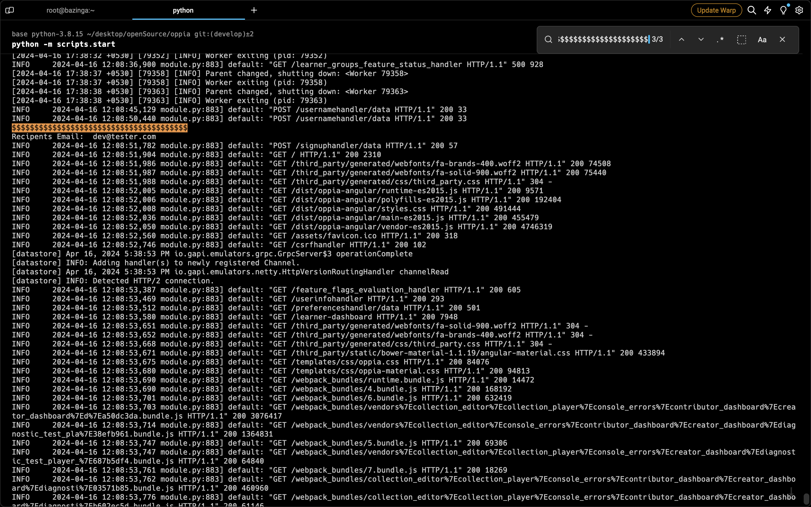

# How to Test Oppia's Email Functionality

While it's not feasible to directly receive emails during local testing, you can effectively verify email functionality using these steps:

1. **Configuration**

    - **Enable Emails**: Within the `feconf.py` file, confirm that the following flags are set to `True`:
        - `CAN_SEND_EMAILS`
        - Any other flags pertinent to your configuration for email transmission.

2. **Code Adjustment**

    - **Modify `send_mail`**:
        - Locate the `send_mail` function in `core/domain/email_services.py`.
        - Add print statements to view the email body, email id, etc, as per the testing requirements.

3. **Trigger and Validate**

    - **Actions**: Execute actions within local server anticipated to trigger email dispatch (e.g., user registration, feedback submission).
    - **Cron Jobs**: If emails are scheduled, manually initiate the associated cron job endpoint.
    - **Log Scrutiny**: Examine your logs to locate the recorded email details.

**Example: Testing the Signup Email**

- **Preparation**: Ensure `CAN_SEND_EMAILS = True` in `feconf.py`.
- **Logging Inclusion**: Incorporate the following snippet within `core/domain/email_services.py` under `send_mail`:
    ```python
    print('$$$$$$$$$$$$$$$$$$$$$$$$$$$$$$$$$$$$$$$') 
    print('Recipient Email: ', recipient_email)
    ```
- **Triggering**: Establish a new user account (e.g., username `testuser`, email `test@example.com`).
- **Log Examination**:
    - Identify the `$$$$$$$` line to easily pinpoint the recipient email.
    
    

### Important Points:

- **Customization**: Tailor the logged information to match the specific email under test.
- **Log Search Tools**: Utilize your terminal's search capabilities (Ctrl/Cmd+F or similar) or tools like `grep` to streamline log analysis.