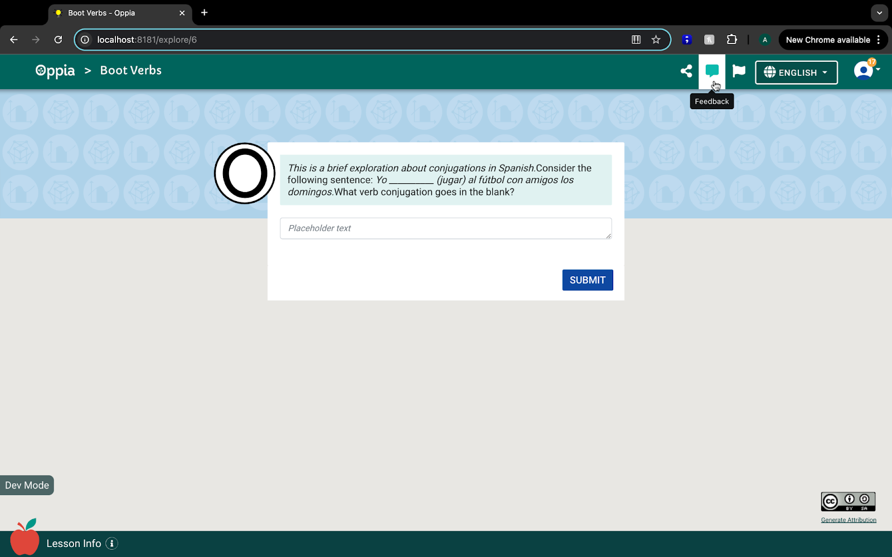
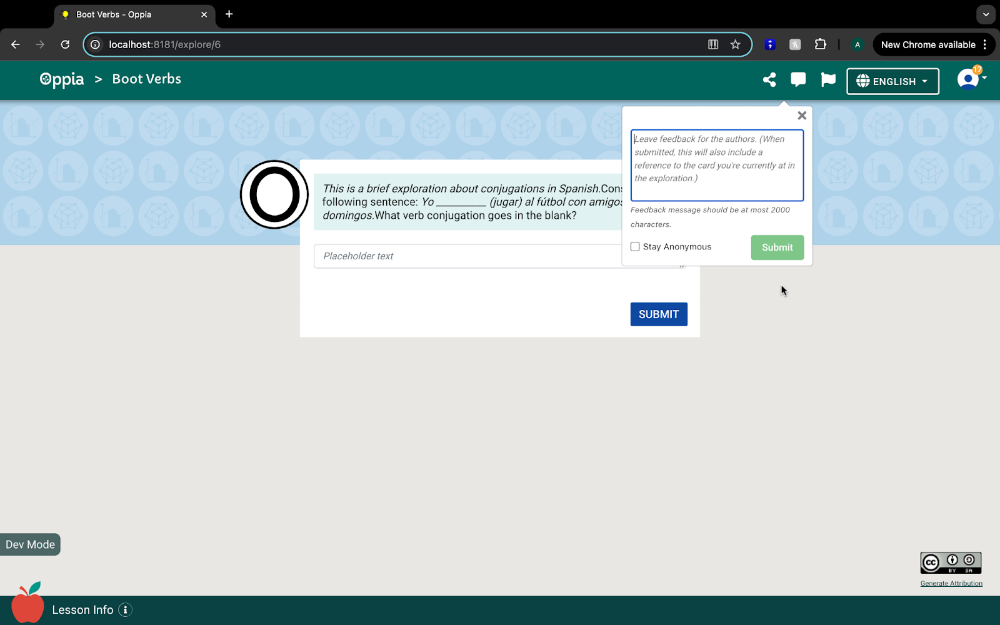
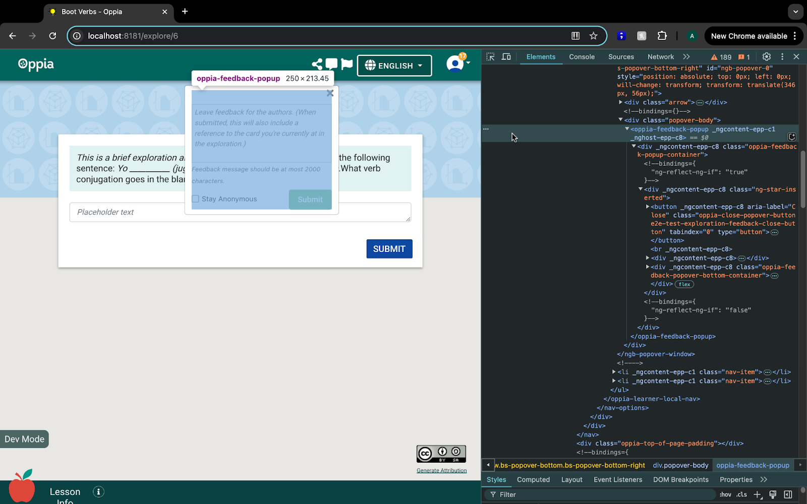
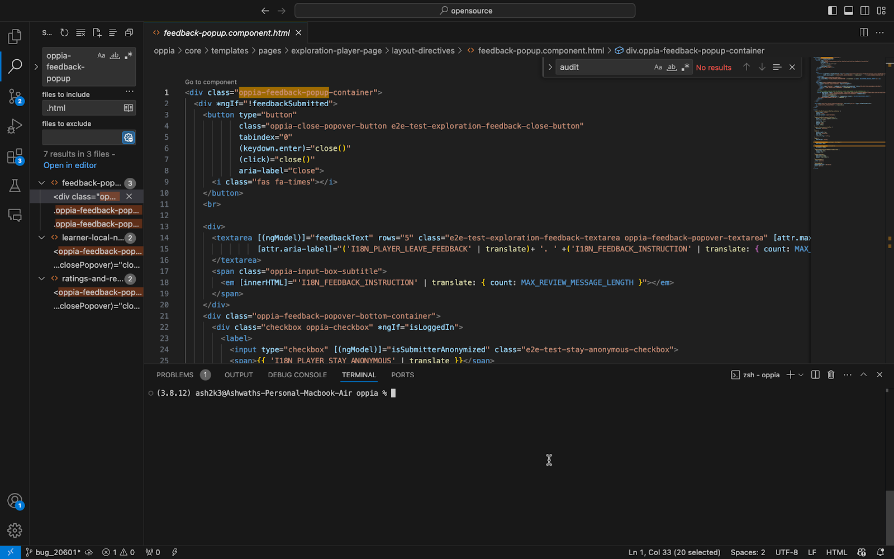
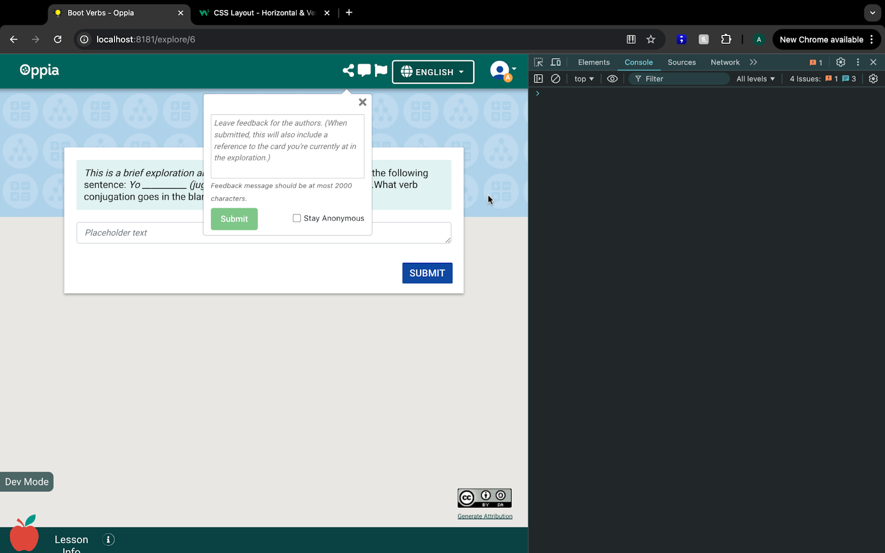
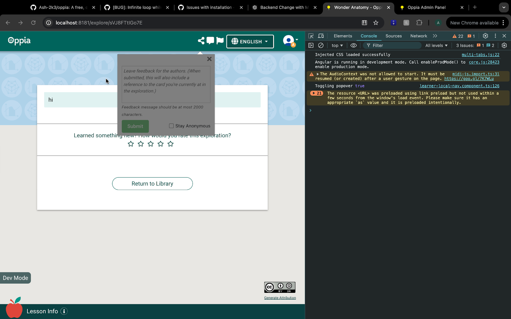
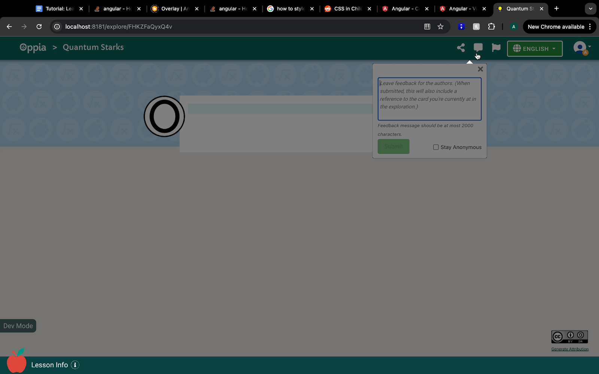
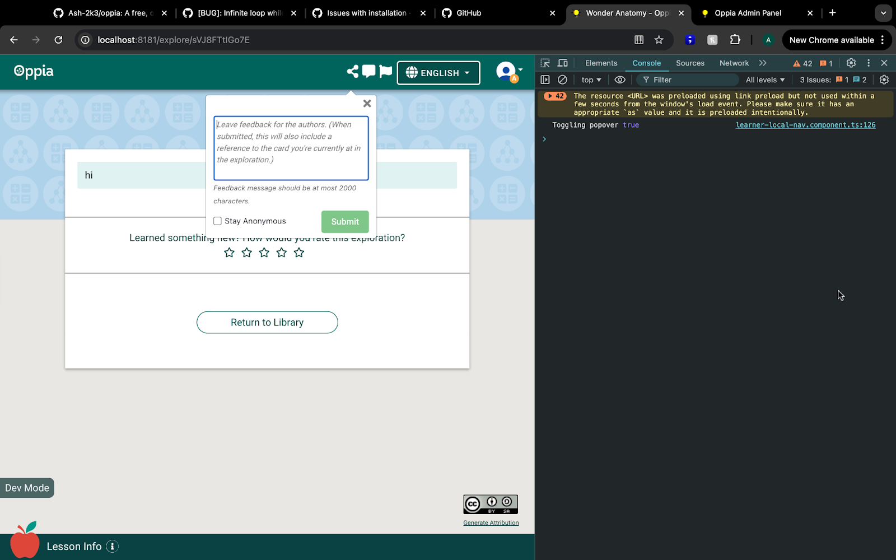
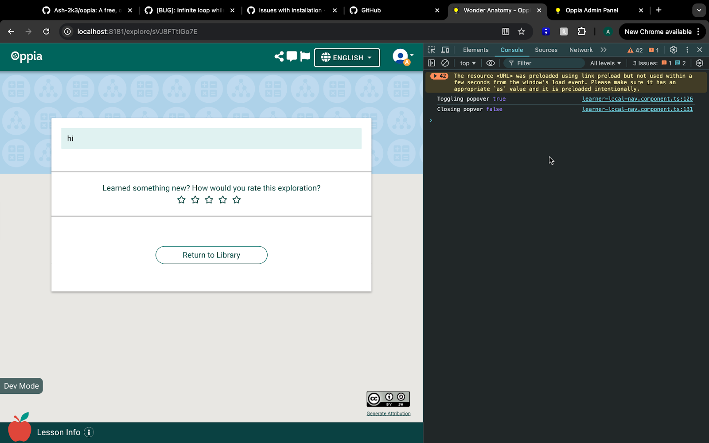
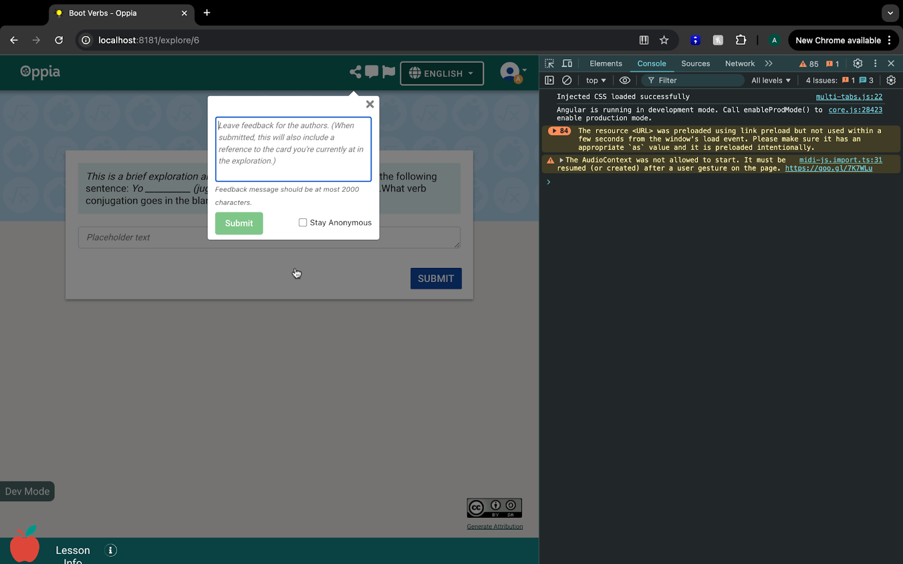

## Table of Contents

- [Introduction](#introduction)
- [Scenario](#scenario)
- [Prerequisites](#prerequisites)
- [Procedure](#procedure)
  - [Understand the Product Requirements and the Current State of the UI](#understand-the-product-requirements-and-the-current-state-of-the-ui)
    - [Explore the Issue](#explore-the-issue)
    - [Review the Current UI](#review-the-current-ui)
  - [Locate the Code Using Browser Developer Tools](#locate-the-code-using-browser-developer-tools)
    - [Inspect the Code](#inspect-the-code)
    - [Locate the Relevant Code in the Repository](#locate-the-relevant-code-in-the-repository)
  - [Experimenting and Iterating](#experimenting-and-iterating)
    - [Task 1: Rearranging the UI Elements](#task-1-rearranging-the-ui-elements)
    - [Task 2: Implementing a Background Blur](#task-2-implementing-a-background-blur)
  - [Implementing the Final Solution](#implementing-the-final-solution)
- [Conclusion](#conclusion)
  - [We Value Your Feedback](#we-value-your-feedback)

## Introduction

In this tutorial, you’ll learn how to tackle common UI issues in Oppia. UI improvements often focus on making features easier to use, fixing layout inconsistencies, and addressing accessibility gaps. These might involve tasks like rearranging elements for better clarity or ensuring the interface works well on different screen sizes.

You’ll start by identifying the problem, tracing the relevant frontend code, and understanding how the existing UI is built. Then, you’ll make targeted updates to the HTML, CSS, and component logic to address the issue. 

By the end, you'll have a clearer understanding of how to approach UI problems in a structured way at Oppia.

## Scenario

In this tutorial, we’ll work with a~~n~~ hypothetical issue in the 'Submit Feedback' popover within the lesson player. The expected behavior for this example is as follows:

* The submit button should appear on the left, and the "Save Anonymously" checkbox should be on the right.  
* When the popup opens, the background should blur, ensuring the focus remains on the feedback popover.

The current behavior deviates from these expectations, and our task is to fix it.

***Note:** While this tutorial addresses the feedback modal's layout and behavior, please note that Oppia’s general design convention places the primary action button (e.g., **Submit**) at the **bottom-right corner**. For this tutorial, we are temporarily deviating from that standard to illustrate the problem-solving approach.*

## Prerequisites

To follow along with this tutorial, ensure you meet the following prerequisites:

* Have a working development environment. (If you haven't, follow the [Oppia setup instructions](https://github.com/oppia/oppia/wiki/Installing-Oppia).)  
* Basic understanding of frontend development with [Angular](https://angular.dev/overview).  
* Familiarity with the Oppia codebase and its file structure. (If not, refer to the [Oppia codebase overview](https://github.com/oppia/oppia/wiki/Overview-of-the-Oppia-codebase).)  
* Understand the [UI/UX principles followed at Oppia](https://github.com/oppia/oppia/wiki/Oppia-UX-guidelines-&-rationales)

***Note**: If you’re completely new to working with the UI, consider starting with this [tutorial](https://github.com/oppia/oppia/wiki/Tutorial-Learn-How-to-Make-a-Simple-UI-Change). It covers a simpler UI change and serves as a great starting point before diving into more complex topics.*

## Procedure

When working on UI-related issues at Oppia, it’s helpful to follow a step-by-step process to identify the problem, locate the relevant code, and make changes confidently. Here’s how we typically approach these tasks:

1. **Understand the Product Requirements and the Current State of the UI:**  

   Before touching the code, focus on identifying what needs to change. Compare the current UI behavior with the expected outcome. If available, refer to product documentation or design mockups—they’ll guide you on how things should look and behave.  
   At this stage, don’t worry about how to fix the issue. Instead, pinpoint the differences: What looks off? What needs to move, change, or behave differently? Clarifying the “what” before diving into the “how” will make the next steps much smoother.  

2. **Locate the Code Using Browser Developer Tools:**  

   Once you know what needs to be changed, the next step is to determine where in the codebase to make those changes.  
   * Use browser dev tools (e.g., Chrome DevTools) to inspect the relevant UI components.  
   * Pay attention to the HTML structure, CSS classes, and attributes tied to those components—they’ll guide you to the right files in the next step.  
   * Use your code editor's search to look for these identifiers (like class names or component selectors) in the codebase.  
     Think of this step as detective work—you’re gathering evidence to pinpoint exactly where the changes need to happen.

3. **Breaking Down the Problem:**

    Take a moment to analyze the problem and identify the key tasks. Ask yourself:
   * What specifically needs to change?  
   * Are there multiple parts to the problem that can be tackled one at a time?  
   * Which part might require more research or deeper analysis?  
       
    For example:  
   * Do you need to rearrange elements on the UI?  
   * Are there animations or effects that need to be triggered conditionally?  
       
    By breaking the problem into smaller tasks, you’ll have a clearer starting point and avoid feeling overwhelmed.

4. **Experimenting and Iterating:**

    Once you’ve identified the tasks, start solving them one by one. This process often involves a combination of experimentation and analysis.  
    What this looks like:
    * Modify the code for one task and observe the changes.  
    * Use browser DevTools or console.log statements to understand how the existing UI behaves.  
    * Refresh your local server frequently to test the updates.

    If something doesn’t work, pause to analyze why. Some guiding questions include:
    * Are the styles being applied to the correct elements?  
    * Is the logic in the component behaving as expected?  
    * Is there a scoping issue with CSS or JavaScript?

    When stuck, it’s helpful to research. Look for solutions within the codebase first—similar components or functionality might provide clues. If that doesn’t help, search online using specific queries. For instance:
    * "How to position elements in CSS flexbox."  
    * "Angular component communication best practices."

    Remember, trial and error is part of the process, but staying methodical helps keep your efforts focused.

6. **Finalizing the Solution**

    Once you’ve implemented the changes, it’s time to verify and refine:
    * Test the updated UI to confirm it behaves as intended.  
    * Check for unintended side effects on other parts of the application.  
    * Test the changes on different devices, screen sizes, and user states.

    Additionally, clean up the code before finalizing:
    * Ensure your changes align with the Oppia’s code style and structure.  
    * Document any significant changes or new logic introduced.

    Testing and code refinement are important to ensure that your solution integrates seamlessly with the Oppia and is easy for others to understand and maintain.

While these steps provide structure, remember that real-world debugging and implementation can be non-linear. You’ll often switch between experimenting, researching, and testing as you refine your solution. The key is to approach each step thoughtfully, document your findings, and seek help when necessary.

Alright, let’s move forward and apply these steps\!

### Understand the Product Requirements and the Current State of the UI

When working on a UI-related issue, the first step is to understand *what needs to change* before diving into *how to change it*. This helps create clarity and prevents unnecessary trial and error.

Start by visiting the exploration player page on your local development server. Spend some time observing how the feedback popover currently looks and behaves. Don’t rush to conclusions—just note down observations, compare them with the expected behavior described in the issue, and start forming a mental picture of the changes needed. At this stage, don’t worry about implementation details—just focus on identifying the discrepancies.

> [!IMPORTANT]
> **Practice 1**: Visit the exploration player page and take a close look at the feedback popover. To do this:
> 1. Populate your local server with the necessary data by following the wiki page on populating the local server.
> 2. Start a lesson in the exploration player.
> 3. Observe the UI elements, focusing on the feedback icon and the associated popover.
> 
> Compare how it currently looks and behaves with the expected changes mentioned in the issue.
> 
> **Hint**: If you're unsure about explorations or how learners interact with them, refer to this guide for an overview.

#### Explore the Issue

Navigate to the exploration player page and start a lesson. Once you’re inside, locate the Feedback Icon in the menu bar (it’s to the left of the language selector as shown in the below screenshot). Click the icon to open the Feedback popover and carefully observe its layout and behavior. Spend some time analyzing:

* Where the **Submit Button** is currently positioned.  
* Where the **"Save Anonymously"** checkbox is located.  
* Whether the **background blurs** when the modal is open.

These observations will help you connect the expected behavior with the current behavior, setting the stage for the changes you need to make.  


#### Review the Current UI

The screenshot below shows the feedback submission popover as it appears currently:  



As described in the issue, the following changes are needed:

* Move the submit button to the left and the "Save Anonymously" checkbox to the right.  
* Ensure the background blurs when the popup opens, focusing attention on the feedback bar.

Now that we’ve analyzed the problem, it’s time to identify the code responsible for rendering the Feedback popover.

### Locate the Code Using Browser Developer Tools

Now that we’ve analyzed the issue and identified the expected behavior, it’s time to locate the code responsible for rendering the Feedback popover.

#### Inspect the Code

> [!IMPORTANT]
> **Practice 2**: Use your browser's developer tools to identify the code responsible for rendering the feedback popover.
>
> **Hint**: Open the "Elements" tab in the developer tools to examine the frontend code. (If you're unfamiliar with how to use the developer tools, refer to this guide.)

Open the "Elements" tab in your browser’s developer tools (e.g., Chrome DevTools) to inspect the webpage. Hover over the feedback submission modal in inspect mode to highlight the relevant code. The modal is defined by the `oppia-feedback-popup` tag.



*Tip: When working on a UI bug, the browser console is a powerful tool for quickly testing potential fixes without modifying the actual codebase. By applying temporary CSS changes or rearranging HTML elements directly in the console, you can prototype and validate your approach before making permanent updates to the code.*

*For example:*

* *You can reorder the Submit Button and Checkbox elements directly in the browser console.*

*These changes are not persistent and will reset when the page is refreshed, but they’re useful for iterating quickly and verifying your ideas.*

*If you're unfamiliar with this approach or want to dive deeper, you can refer to this comprehensive guide: [**Google Chrome DevTools: CSS Overview**](https://developer.chrome.com/docs/devtools/css)*

#### Locate the Relevant Code in the Repository

Now that you have identified the `<oppia-feedback-popup>` tag in the browser tools, the next step is to find it in the codebase.

> [!IMPORTANT]
> **Practice 3**: Locate the HTML tag for oppia-feedback-popup in your local codebase.
>
> **Hint**: Perform a global search in your code editor for oppia-feedback-popup. Use the .html file filter to narrow down the results to relevant templates. For tips and tricks on using common IDEs effectively, check out this wiki page.

Perform a global search in your code editor for `oppia-feedback-popup`. Use the `.html` file filter to locate the template. Upon searching for oppia-feedback-popup, we can see the following instances.



We can also include the .ts file so that we can figure out which typescript file declares this tag oppia-feedback-popup as the component selector. (To know more about these Angular-specific terms, you can go through the official angular documentation at [https://angular.dev/guide/components/selectors](https://angular.dev/guide/components/selectors).) You should find the following Angular component definition:

```python
@Component({
  selector: 'oppia-feedback-popup',
  templateUrl: './feedback-popup.component.html',
})

```

The file `oppia/core/templates/pages/exploration-player-page/layout-directives/feedback-popup.component.html` contains the HTML structure for the modal and the navbar component is located in `learner-local-nav.component.html`.

**Formulating, Applying and Testing the Solution**

At this stage, we’ve understood the issue and located the relevant code. Now, we’ll focus on the implementation part. Since this is a UI-related issue, it might involve some back-and-forth between the code and the local server to see how changes reflect visually. It’s common to try out different approaches (trial and error) to arrive at the best solution.

### Experimenting and Iterating

We’ll break the problem into two parts:

1. **Rearranging the UI Elements:**  
   * Move the **Submit Button** to the **left**.  
   * Place the **"Save Anonymously" Checkbox** on the **right**.  
2. **Implementing a Background Blur Effect:**  
   * Blur the background when the **Feedback popover** is open so the focus stays on the modal.

##### Task 1: Rearranging the UI Elements

Alright, let’s start with the first task—**rearranging the UI elements**. This one’s pretty straightforward, and it’s a good warm-up before we tackle the trickier background blur issue.

Here’s what we need to do:

* Move the **Submit Button** to the **left**.  
* Place the **"Save Anonymously" Checkbox** on the **right**.

At first glance, this seems like a simple HTML adjustment, and in most cases, it is. Let’s walk through it together.

> [!IMPORTANT]
> **Practice 4:** Locate the HTML code for the checkbox and the submit button in `oppia/core/templates/pages/exploration-player-page/layout-directives/feedback-popup.component.html`. Update the code to switch their order so that the submit button appears on the left and the checkbox on the right.

Here’s the updated code after making the required changes:

```html
  <div class="oppia-feedback-popover-bottom-container">
     <div class="checkbox oppia-checkbox" *ngIf="isLoggedIn">
       <label>
         <input type="checkbox" [(ngModel)]="isSubmitterAnonymized" class="e2e-test-stay-anonymous-checkbox">
         <span>{{ 'I18N_PLAYER_STAY_ANONYMOUS' | translate }}</span>
       </label>
     </div>
     <!-- The z-index ensures that the button is not overlapped by the checkbox div. -->
     <button mat-button class=" btn btn-success float-right oppia-exploration-feedback-submit-btn e2e-test-exploration-feedback-submit-btn"
             [ngClass]="{'oppia-feedback-popover-submit-btn-enabled': feedbackText}"
             (click)="saveFeedback()"
             [disabled]="!feedbackText || feedbackText.length > MAX_REVIEW_MESSAGE_LENGTH">
       {{ 'I18N_PLAYER_SUBMIT_BUTTON' | translate }}
     </button>
    </div>
```

Notice how the Checkbox now comes first in the code, followed by the Submit Button. This change should directly reflect in the UI.

*If you’ve worked with HTML before, you’ll know that the order of elements in the code typically determines their order on the screen. For horizontal layouts, the default rule applies: top-to-bottom in the code translates to left-to-right in the UI. Keep in mind that CSS properties like `flex`, `grid`, or `float` can override this behavior, but for this case, simply reordering the tags in the code is sufficient.*



##### Task 2: Implementing a Background Blur

Great job on finding the working solution for Task 1\! Now, let’s move forward with the second task: adding a background blur effect when the feedback popover is open.

For this task, we don’t have a clear solution upfront. So, we’ll approach it step by step—starting with an initial idea and gradually refining it through trial and error. Along the way, we’ll also explore approaches inspired by online research.

###### *Trial 1*

The feedback popover is defined in the `feedback-popup.component.html` file. An easy first attempt would be to apply the blur effect directly to the **parent container** of the popover.

The target element is:

```html
<div class\="oppia\-feedback\-popup\-container"\>
```

Let’s add a CSS class to it with a blur effect:

```css
.oppia-feedback-popup-container {
   background: rgba(0, 0, 0, 0.5);
}
```

Now, refresh your local server and check the result.



The background blur only affects the container of the popover—it doesn’t span across the entire page.

This behavior makes sense because this container (`oppia-feedback-popup-container`) is only responsible for the content *inside* the feedback popover. It doesn’t have control over the rest of the page.

This tells us: Applying styles directly to this container won’t work if we want a global background blur.

Time for a new approach.

###### *Trial 2*

Let’s try creating a **sibling div** alongside the popover container. The idea is to create an overlay div that spans the entire screen when the popover is open.  
In `feedback-popup.component.html`, add the following at the end of the HTML:

```html
<div class="popover-backdrop"></div>
```

And add the CSS:

```css
.popover-backdrop {
   position: fixed;
   top: 0;
   left: 0;
   width: 100%;
   height: 100%;
   background: rgba(0, 0, 0, 0.5);
}
```

**What is this code doing?**

* `position: fixed` makes the overlay stick to the viewport, covering the entire screen.  
* `width` and `height` set to `100%` ensure full coverage.  
* `background` applies a semi-transparent black overlay.

Save your changes, refresh the server, and check the result.


Alright, it looks like we’ve hit a roadblock. The background blur still isn’t covering the entire screen, and it seems stuck inside the boundaries of the feedback popover. That’s frustrating, but roadblocks like this are normal when working on UI issues. Now’s a good time to pause, step back, and think about what we’re trying to solve before diving deeper.

**Researching the Problem**

When you're stuck, it’s important to clearly define the problem. If we can describe the issue in simple terms, it’ll be easier to search for answers and focus on what really matters.

Here’s our problem statement:

* **What’s happening?** The CSS styles we added to create the blur effect are only applied inside the popover component.  
* **What do we want?** The background blur should cover the entire screen, not just the popover container.  
* **Key question:** Why are styles defined in the feedback popover unable to affect the rest of the page? How can we make them apply globally?

By putting the problem into words, we’ve set ourselves up for more focused research.

> [!IMPORTANT]
> **Practice 5**: Take a few minutes to search online for possible causes and solutions. Use search queries that align with our problem, such as:
> - "Angular CSS styles not affecting parent components"
> - "How to make CSS styles global in Angular components"
> - "Angular blur background for popover"
> 
> **Tip**: The internet is full of resources, but it’s easy to get overwhelmed. Stay focused on our specific problem and filter out unrelated results. If a solution seems promising but isn’t immediately clear, bookmark it and revisit it after you’ve explored a few other approaches.
> 
> Once you’ve gathered some insights, let’s regroup and think about how we can apply them to our issue.


After digging around in internet, we found two helpful resources:

1. [How to Style Child Components from Parent Component's CSS File](https://stackoverflow.com/questions/36527605/how-to-style-child-components-from-parent-components-css-file)  
2. [Blur Background Behind Spinner in Angular](https://stackoverflow.com/questions/50212145/blur-background-behind-spinner-angular) (another StackOverflow discussion addressing a similar problem).

Additionally, the [Angular ViewEncapsulation Documentation](https://v17.angular.io/guide/view-encapsulation) provided clarity on how Angular handles styles at the component level.

> [!IMPORTANT]
> **Practice 6**: Take some time to carefully read the resources mentioned above. These articles explain how Angular’s ViewEncapsulation works and why styles in a child component can’t affect the global DOM by default.
> 
> As you read, focus on these key points:
> - How does Angular's ViewEncapsulation control CSS styles within components?
> - Why do styles added in a child component stay restricted to that component?
> - Are there common patterns or solutions in Angular to handle global styles from within a component?
> 
> If there’s anything you don’t understand in the resources, do a quick internet search to clarify.
> 
> After going through them, pause and ask yourself:
> - Why didn’t our earlier attempts work?
> - What was stopping our blur effect from applying globally?
> - What do we need to change to fix this?
> 
> Write down your observations before moving ahead. Understanding this now will make the next steps easier to follow.


In Angular, ViewEncapsulation determines how styles defined in a component interact with the   
rest of the application. Think of each component as being wrapped in an invisible "style bubble."

Here’s a quick breakdown:

1. By default, Angular uses **`ViewEncapsulation.Emulated`**, which ensures styles are scoped locally to the component.  
2. This means CSS rules won’t "leak out" to affect other parts of the application.  
3. Even properties like `position: fixed` or `width: 100%` remain trapped within this style bubble, limited to the DOM tree of the component.

So, when we tried adding a `.popover-backdrop` div with `position: fixed`, it stayed confined within the `feedback-popup` component. It didn’t matter how we styled it—the bubble prevented it from affecting the rest of the page.

Alright, based on the same articles, there are two potential solutions. Let’s try them one by one.

###### *Trial 3*

By default, Angular uses **ViewEncapsulation.Emulated**, which means styles applied in a component stay within that component and don’t affect the global DOM. This is why our blur effect remained restricted to the feedback popover and didn’t cover the entire screen.

To make our styles (like `position: fixed` and `width: 100%`) apply globally and affect the entire page, we need to find a way to disable Angular's default scoping behavior.

> [!IMPORTANT]
> **Practice 7**: How can we make our CSS styles, like position: fixed and width: 100%, apply globally across the page instead of being restricted to the feedback popover component?
> 
> **Hint**: Research how Angular manages CSS scoping and look into terms like ViewEncapsulation. You might find this resource helpful:
How to Style Child Components from Parent Component's CSS

Angular provides a configuration option called ViewEncapsulation in the component decorator. By changing this property, we can control how styles are applied across components.  
In our case, setting ViewEncapsulation.None disables Angular's style encapsulation, allowing our CSS to affect the global DOM.

Let’s make this change in the feedback-popup.component.ts file. Update the @Component decorator like this:

```python
@Component({
 selector: 'oppia-feedback-popup',
 templateUrl: './feedback-popup.component.html',
 encapsulation: ViewEncapsulation.None
})
```

This change disables the default scoping behavior, allowing our styles to apply globally.

Head back to your local server and refresh the exploration player page.



After refreshing, you’ll likely notice:

* The blur effect now covers the entire screen – great\!  
* But wait... there’s a new problem: the blur is also affecting the popover content itself. The feedback popover is now unresponsive because it’s hidden beneath the overlay.

So while we’ve partially succeeded, we’ve also introduced a new issue.

This is not what we want. Ideally, the blur layer should sit behind the popover, allowing the popover to remain fully functional and interactive.

Now we need to step back and think:

* How can we ensure that the blur layer stays behind the popover and does not block it?  
* Are there any CSS properties that allow us to control the order in which these layers appear?

Upon searching for it online, you might come across an article like this:  
🔗 [**How to overlay one div over another div**](https://stackoverflow.com/questions/2941189/how-to-overlay-one-div-over-another-div)

> [!IMPORTANT]
> **Practice 8**: How can we control the layering of the components? In our case, we want the blur effect to sit behind the popover element without interfering with its functionality.
> 
> **Hint** - You might find this resource helpful: How to Overlay One Div Over Another Div

This article explains how `z-index` can control the stacking order of elements on a webpage.

From the article, we learn:

* `z-index` defines the **stacking order** of elements on the page.  
* Elements with a **higher `z-index` value** will sit **on top** of elements with a **lower value**.  
* For this to work, the elements need a **`position` property** set to `relative`, `absolute`, or `fixed`.

In our case:

1. The **blur overlay (`.popover-backdrop`)** should have a **lower `z-index`**.  
2. The **popover container (`.oppia-feedback-popup-container`)** should have a **higher `z-index`**.

This will ensure the blur stays in the background while the popover remains interactive.

Let’s update our CSS styles accordingly:

```css
.oppia-feedback-popup-container {
   z-index: 1300;
   min-width: 200px;
}
.popover-backdrop {
   position: fixed;
   top: 0;
   left: 0;
   width: 100%;
   height: 100%;
   background: rgba(0, 0, 0, 0.5); /* Dim background */
   z-index: 1040;
}
```

Now let’s test on the local machine.   


And hurray, it works as expected now.

###### *Trial 4*

So far, we’ve tried overriding Angular’s `ViewEncapsulation` to globally apply styles, but we encountered the issue where the blur effect covered the popover content itself. While we solved that with `z-index`, let’s now explore **another approach** inspired by the article: [*Blur Background Behind Spinner in Angular*.](https://stackoverflow.com/questions/50212145/blur-background-behind-spinner-angular)

> [!IMPORTANT]
> **Practice 9**: In the article Blur Background Behind Spinner in Angular, a background blur effect was applied to a spinner component.
> 
> Take some time to read through the article and think about how the same approach can be adapted for our feedback popover.
> 
> Once you’ve understood the approach, think about how these ideas can be applied to our popover scenario.
> 
> When you're ready, let’s move ahead and break down the implementation step by step.


In the article, the solution was applied to a spinner, but the same logic can be adjusted for our popover.

The key idea here is:

* Instead of handling the blur effect inside the **feedback-popup** component, we’ll manage it at the **parent container level** (`learner-local-nav`), where the popover is being rendered.  
* This approach relies on **state management**, **dynamic rendering**, and **CSS layering**.

Here’s what we need to do \-

1. **State Management:** Track whether the popover is open using a variable (`isPopoverOpen`).  
2. **Dynamic Overlay:** Use Angular's `*ngIf` directive to render the overlay only when `isPopoverOpen` is `true`.  
3. **CSS for Blur Effect:** Apply CSS styles to create a dimming effect and manage proper layering with `z-index`.

**State Management**

We need to track whether the feedback popover is open using a state variable in the parent component

> [!IMPORTANT]
> **Practice 10**: Can you add a new variable to the `learner-local-nav.component.ts` file that will keep track of the feedback popover's status?
> 
> **Hint**: Refer to the Coding Style Guide to understand the naming conventions followed at Oppia.

In the parent component (`learner-local-nav.component.ts`), we will add a new variable to track whether the popover is open.To control the overlay's visibility, update the `learner-local-nav.component.ts` file by introducing a new variable `popoverIsOpen`. The default value of this variable should be false.

```python
export class LearnerLocalNavComponent implements OnInit {
    canEdit: boolean = false;
    // The following property is set to null when the
    // user is not logged in.
    username: string | null = '';
    feedbackOptionIsShown: boolean = true;
    explorationId!: string;
    popoverIsOpen = false;
    @ViewChild('feedbackPopOver') feedbackPopOver!: NgbPopover;
```

This variable will toggle between `true` and `false` depending on whether the popover is open or closed.

**Dynamic Overlay**

Next, we need to ensure that the overlay is dynamically rendered based on `isPopoverOpen`.

> [!IMPORTANT]
> **Practice 11**: Review the learner-local-nav.component.html file to understand how the popover is opened and closed. Use this knowledge to identify where the value of the isPopoverOpen variable should be updated.

To ensure the `popoverIsOpen` variable maintains accurate values, we need to review how the opening and closing of the popover are handled in the `learner-local-nav.component.html` file. Here’s the relevant portion of the `learner-local-nav.component.html` file:

```html
<ng-template #popContent>
  <oppia-feedback-popup (closePopover)="closePopover()"></oppia-feedback-popup>
</ng-template>
<ul class="nav navbar-nav oppia-navbar-nav float-right mr-0">
  <li *ngIf="feedbackOptionIsShown"
      placement="bottom-right"
      [ngbPopover]="popContent"
      triggers="manual"
      (click)="togglePopover()"
      (keydown.enter)="togglePopover()"
      class="nav-item"
      tabindex="0"
      #feedbackPopOver="ngbPopover"
      [autoClose]="false">
    <div class="nav-link e2e-test-exploration-feedback-popup-link"
         ngbTooltip="{{ 'I18N_PLAYER_FEEDBACK_TOOLTIP' | translate }}" placement="bottom">
      <i class="fas fa-comment-alt exploration-player-navbar-icons"></i>
      <span class="oppia-icon-accessibility-label">{{ 'I18N_PLAYER_FEEDBACK_TOOLTIP' | translate }}</span>
    </div>
  </li>
</ul>
```

From the code, you can observe:

* The **opening** of the popover is triggered by the `togglePopover()` method.  
* The **closing** of the popover is triggered by the `closePopover()` method.

> [!IMPORTANT]
> **Practice 12**: Locate the `togglePopover()` and `closePopover()` functions in the corresponding TypeScript file. Update these functions to modify the value of the `popoverIsOpen` variable that we created earlier.

Here’s an example of how the updated functions should look:

```python
togglePopover(): void {
  this.feedbackPopOver.toggle();
  this.popoverIsOpen = !this.popoverIsOpen; // Toggle the value dynamically
}

closePopover(): void {
  this.feedbackPopOver.close();
  this.popoverIsOpen = false; // Reset to false when the popover is closed
}
```

**Render the Overlay**

At this point, we have our `popoverIsOpen` variable in the parent component (`learner-local-nav`) to track whether the feedback popover is open or closed. Now, we’ll use this variable to dynamically render the overlay when the popover is active.

But before moving forward, it’s important to verify that this variable behaves as expected. If the state tracking isn’t reliable, the overlay might not appear or disappear correctly, leading to unpredictable UI behavior. Let’s confirm that everything so far works as intended.

In `learner-local-nav.component.html`, add the following overlay div:

```html
<div *ngIf="popoverIsOpen" class="popover-backdrop" (click)="closePopover()"></div>
```

This code uses Angular’s `*ngIf` directive to dynamically render the backdrop when the popover is open. The \*ngIf renders the backdrop based on the boolean value of this popoverIsOpen variable.  The `class="popover-backdrop"` applies the CSS dimming effect, and `(click)="closePopover()"` ensures the popover closes when the user clicks outside it.

This step sets up the link between our `popoverIsOpen` variable and the overlay. Now, every time the variable changes, the overlay should appear or disappear.

Before proceeding, we need to confirm that the `popoverIsOpen` variable updates correctly when the popover opens and closes. If the variable doesn’t behave as expected, the overlay won’t render correctly, no matter how good our HTML or CSS is.

To test this, we’ll add `console.log` statements to the `togglePopover` and `closePopover` functions in `learner-local-nav.component.ts`:

```python
 togglePopover(): void {
   this.feedbackPopOver.toggle();
   this.popoverIsOpen = !this.popoverIsOpen; // Toggle the value dynamically
   console.log('Toggling popover', this.popoverIsOpen)
 }
  closePopover(): void {
   this.feedbackPopOver.close();
   this.popoverIsOpen = false; // Reset to false when the popover is closed
   console.log('Closing popver', this.popoverIsOpen)
 } 
```

Here’s why this step is important:

* `togglePopover()` should correctly flip the value of `popoverIsOpen` every time the feedback icon is clicked.  
* `closePopover()` should reset `popoverIsOpen` to `false` when the popover is closed.

Without this confirmation, we might end up troubleshooting CSS or HTML when the actual issue lies in how the state is being managed.

Let’s test it now. Go to the exploration player page and click the feedback icon to toggle the popover. You should see \- 



Now click outside or close the popover. You should see:



It means our `popoverIsOpen` variable is updating correctly, and we can rely on it to control the overlay.

**CSS for Blur Effect**

> [!IMPORTANT]
> **Practice 13**: Write the CSS for the popover-backdrop class to apply the background blur effect.

Now, add the CSS code which will be active when the popover is open \- 

```css
 /* Backdrop for the popover */
.popover-backdrop {
  position: fixed;
  top: 0;
  left: 0;
  width: 100%;
  height: 100%;
  background: rgba(0, 0, 0, 0.5); /* Dim background */
  z-index: 1040; /* Below the popover */
}
```

Here’s what we are doing in the above code \-

1. **Creating a Full-Page Overlay:** The `position: fixed;` and `width: 100%; height: 100%;` properties ensure the backdrop spans the entire viewport.  
2. **Dimming the Background:** The `background: rgba(0, 0, 0, 0.5);` property applies a translucent black overlay.  
3. **Layering Properly:** The `z-index: 1040;` places the backdrop below the popover but above the rest of the content.

Refresh the exploration player page and verify the updated UI.


Great, our changes are working as expected\!

### Implementing the Final Solution

We’ve identified one working solution for rearranging the UI elements (submit button and "Save Anonymously" checkbox) and two possible solutions for implementing the blur effect. It’s now important to choose a single clear solution for the blur effect, rather than keeping both.

At this point, reach out to your team at Oppia to discuss your findings. Share the two approaches for the blur effect and explain the steps you took for each. Walk them through how each approach works, where changes were made in the code, and any observations you made during testing.

Clear communication ensures that the team is aligned and that the chosen solution fits the project’s needs. Once you’ve gathered feedback and finalized the approach, remove the changes introduced for testing other solutions.

Finally, align your code with Oppia’s [Coding Style Guide](https://github.com/oppia/oppia/wiki/Coding-style-guide) and verify accessibility following the [Testing for Accessibility](https://github.com/oppia/oppia/wiki/Testing-for-Accessibility) guidelines. By adhering to these guides, you ensure that your solution is clean, maintainable, and accessible for all users.

## Conclusion

In this tutorial, you successfully learned how to identify and implement UI improvements in Oppia's exploration player. Specifically, you explored the product to understand the issue firsthand, used browser developer tools to inspect and experiment with the UI and traced the relevant code in the codebase using Angular components and file searches. You also made changes to the HTML and CSS to align with the desired design and managed Angular component states to implement functionality such as the background blur effect.

By completing this tutorial, you have honed your skills in debugging UI issues, navigating and modifying a complex Angular codebase, and adhering to accessibility and design principles. Additionally, you gained hands-on experience with iterative debugging techniques, which are essential for refining solutions.

By completing this tutorial, you’ve honed your skills in:

* Understanding product requirements for UI enhancements.  
* Navigating and modifying an Angular codebase effectively.  
* Using browser developer tools for inspecting UI elements.  
* Following best practices for state management and dynamic rendering in Angular components.  
* Writing clean, reusable CSS styles for consistent UI improvements.

Additionally, you gained hands-on experience in structuring solutions iteratively—breaking down problems into smaller tasks, formulating a clear plan, and implementing changes systematically. These skills are essential for contributing to larger issues at Oppia, where clarity, consistency, and attention to detail play a significant role in maintaining product quality.

### We Value Your Feedback

Did you find this tutorial useful? Or, did you encounter any issues or find things hard to grasp? Let us know by opening a discussion on [GitHub Discussions](https://github.com/oppia/oppia/discussions/new?category=tutorial-feedback). We would be happy to help you and make improvements as needed\!
