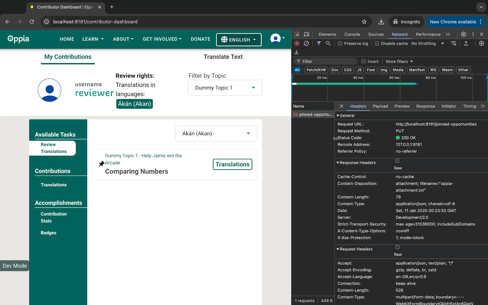
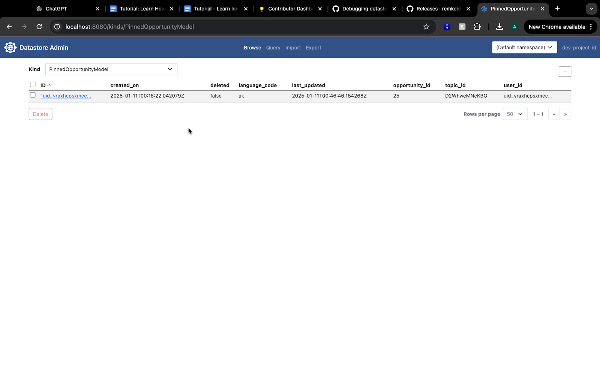

# Table of Contents
- [Introduction](#introduction)
- [Scenario](#scenario)
- [Prerequisites](#prerequisites)
- [Procedure](#procedure)
   * [Understanding the Bug and Reproducing It](#understanding-the-bug-and-reproducing-it)
   * [Tracing the Flow of Data and Understanding Relevant Code](#tracing-the-flow-of-data-and-understanding-relevant-code)
      + [Pinning/Unpinning lesson](#pinningunpinning-lesson)
      + [Fetching pinned lessons](#fetching-pinned-lessons)
      + [Observations](#observations)
   * [Formulating and Testing a Solution Iteratively](#formulating-and-testing-a-solution-iteratively)
   * [Finalizing the Solution](#finalizing-the-solution)
         - [**Testing the Final Solution**](#testing-the-final-solution)
   * [Conclusion](#conclusion)
      + [We Value Your Feedback](#we-value-your-feedback)

# Introduction

This tutorial will guide you through the process of debugging a backend bug. You’ll learn how to trace code execution paths through the layers of Oppia's codebase and think critically about making changes to fix a bug. By following along, you’ll develop a systematic approach to problem-solving and debugging in backend systems.

# Scenario

**Problem:** Pinned translation opportunities remain pinned even after all available cards for a lesson have been reviewed. The lesson tile remains pinned even though there are no available translations for review.

**Expected Behavior:** Once all available cards of a pinned lesson are reviewed, the lesson should automatically be unpinned and no longer appear in the reviewable lessons list.

***Note:*** *The described problem is the current intended functionality of Oppia and is not a bug. However, for this tutorial, we are treating this scenario as a bug to demonstrate the debugging process.*

# Prerequisites

To follow along with this tutorial, ensure you meet the following prerequisites:

* Have a working development environment. (If you haven't, follow the [Oppia setup instructions](https://github.com/oppia/oppia/wiki/Installing-Oppia).)  
* Basic understanding of frontend development with [Angular](https://angular.dev/overview).  
* Familiarity with the Oppia codebase and its file structure. (If not, refer to the [Oppia codebase overview](https://github.com/oppia/oppia/wiki/Overview-of-the-Oppia-codebase).)  
* Review the [Contributor Dashboard System Design document](https://docs.google.com/document/d/1wM9cQzq1-3nbEhZliRlpnGDXbM_HspNkY16CYnA6lWg/edit?tab=t.0) for an in-depth, developer-focused overview of the system design.

# Procedure

To ensure that you are working with the same version of the code as this tutorial, navigate to your local Oppia directory and check out this specific commit: 

`git checkout 192f0a9a4866debac160015bc949130aaae6a7fe`

This ensures consistency between your environment and the code referenced in this tutorial.

**Verify the Commit:** You can verify that you are on the correct commit by running: `git log -1`

The output should display the commit ID `192f0a9a4866debac160015bc949130aaae6a7fe`.

## Understanding the Bug and Reproducing It

Before jumping into the code, it’s important to understand and reproduce the bug. This will help us observe the current behavior and identify what needs to be fixed.

> [!IMPORTANT]
> **Practice 1**: Reproduce the Bug on Your Local Machine and Note Your Observations 
> To reproduce the bug, follow these steps: 
> 
> - Populate the Local Database: Ensure your local database contains the necessary data. You may need to grant yourself the appropriate permissions on the dev server. Additionally, since users cannot accept their suggestions, you will need two accounts to submit translations and review them. Refer to the [*Populating Data on Local Server*](https://github.com/oppia/oppia/wiki/Populating-data-on-local-server) guide for instructions.  
> - Navigate to the Contribution Dashboard: Open the [Contribution Dashboard](http://localhost:8181/contributor-dashboard) and switch to the Review Translations tab. 
> - Submit Translations for Review:
>   - Log in with the submitter account. 
>   - Go to the Translations tab and submit a few translations for review. 
>   - Log out and switch to the reviewer account.  
>   - Return to the Review Translations tab. 
> - Reproduce the Bug:
>   -  Locate the lesson for which you submitted translations. It should appear in the list with a pin icon (initially unpinned). 
>   - Pin the lesson by clicking the pin icon. 
>   - Accept all the translation suggestions for that lesson. 
> - Observe the Behavior: After accepting all translation suggestions for the lesson, check whether it remains pinned and visible in the Review Translations tab.   
> 
> Now, note down your observations. Does the behavior align with the bug description? Can you visualize what the expected flow should look like?

**Observations**

1. **Pinning and Unpinning Behavior:**  
   * The functionality for pinning and unpinning lessons works correctly for lessons with active suggestions.  
2. **The Bug:**  
   * When all suggestions for a pinned lesson are reviewed, the lesson remains pinned and visible in the Review Translations tab.  
3. **Expected Behavior:**  
   * Once all suggestions for a lesson are reviewed:  
     * The lesson should automatically be unpinned.  
     * It should disappear from the Review Translations tab.

## Tracing the Flow of Data and Understanding Relevant Code

To understand how lesson pinning works, let’s begin by tracing the flow of data through the codebase. This will help us identify where the bug might originate and pinpoint what changes are needed to fix it.

### Pinning/Unpinning lesson

> [!IMPORTANT]
> **Practice 2**: Identify the Network Calls for Pinning and Unpinning Opportunities. 
> Follow these steps to trace the network calls: 
> 1. Pin a Reviewable Opportunity: Go to the Review Translations tab on the Contribution Dashboard and pin a reviewable opportunity by clicking the pin icon. 
> 2. Use the Developer Console: Open your browser’s developer tools and switch to the Network tab. Observe the network calls made when you pin the opportunity
> 3. Identify the Calls: Can you identify which API endpoint is being called for the pin and unpin actions? 
> 
> **Tip**: If you’re unfamiliar with browser developer tools, refer to [this guide](https://developer.chrome.com/docs/devtools).

Here, we’re focusing on identifying the network call made when the pinning action is triggered. This will tell us which endpoint handles this operation.



As you pin the lesson, you’ll notice a call to the following endpoint:  
`http://localhost:8181/pinned-opportunities`

This endpoint manages the pinning functionality. Our next step is to locate this endpoint in the codebase to understand its implementation.

> [!IMPORTANT]
> **Practice 3**: Locate the code that implements the `/pinned-opportunities` endpoint. 
> 
> **Hint**: Use the global search feature in your code editor to search for the endpoint name. This will help you identify where it is defined and how it connects to a specific handler or function. You can refer to [this guide on common IDEs](https://github.com/oppia/oppia/wiki/Tips-for-common-IDEs) for tips and shortcuts.

Search for `/pinned-opportunities` in the codebase. You’ll find it defined as: `PINNED_OPPORTUNITIES_URL = '/pinned-opportunities'` in the file `oppia/core/feconf.py`.

This constant is tied to a handler through a routing configuration in `oppia/main.py`:

```python
get_redirect_route(
    r'%s' % feconf.PINNED_OPPORTUNITIES_URL,
    contributor_dashboard.LessonsPinningHandler,
)
```

The `LessonsPinningHandler` is responsible for handling requests related to pinning and unpinning lessons. Let’s examine this handler more closely.

The `LessonsPinningHandler` is implemented in `oppia/core/controllers/contributor_dashboard.py`. Its definition looks like this:

```python
class LessonsPinningHandler(
   base.BaseHandler[
       LessonsPinningHandlerNormalizedRequestDict,
       Dict[str, str],
   ]
):
   """Handler for pinning & unpinning lessons."""

   URL_PATH_ARGS_SCHEMAS: Dict[str, str] = {}
   HANDLER_ARGS_SCHEMAS = {
       'PUT': {
           'language_code': {
               'schema': {
                   'type': 'basestring'
               }
           },
           'topic_id': {
               'schema': {
                   'type': 'basestring'
               }
           },
           'opportunity_id': {
               'schema': {
                   'type': 'basestring'
               },
               'default_value': None
           }
       },
   }

   @acl_decorators.open_access
   def put(self) -> None:
       """Handles pinning/unpinning lessons."""
       assert self.normalized_payload is not None
       assert self.user_id is not None
       topic_name = self.normalized_payload.get('topic_id')
       language_code = self.normalized_payload.get('language_code')
       opportunity_id = self.normalized_payload.get('opportunity_id')
       if language_code and topic_name:
           topic = topic_fetchers.get_topic_by_name(topic_name)
           topic_id = topic.id
           opportunity_services.update_pinned_opportunity_model(
               self.user_id, language_code, topic_id, opportunity_id
           )
       self.render_json(self.values)
```

> [!IMPORTANT]
> **Practice 4**: Examine the `LessonsPinningHandler` to understand how it processes the pinning and unpinning of opportunities. 
> 
> As you go through the handler, make notes on: 
> - How it validates the input data for pinning and unpinning. 
> - The logic it applies to decide whether an opportunity should be pinned or unpinned. 
> - Any services or helper functions it calls to carry out these operations.

The `LessonsPinningHandler` manages both the pinning and unpinning of lessons through a `PUT` request. It requires three key inputs:

* `language_code` (to specify the language of the lesson),  
* `topic_id` (to identify the topic of the lesson), and  
* `opportunity_id` (the unique ID of the lesson being pinned).

The handler calls `update_pinned_opportunity_model` in the service layer to process the request.

The function `update_pinned_opportunity_model` is implemented in `oppia/core/domain/opportunity_services.py`:


```python
def update_pinned_opportunity_model(
    user_id: str, language_code: str, topic_id: str, lesson_id: Optional[str]
) -> None:
    """Pins/Unpins Reviewable opportunities in Contributor Dashboard."""
```

The function begins by checking if a pinned model already exists for the given `user_id`, `language_code`, and `topic_id`. If no model exists and a `lesson_id` is provided, it creates a new pinned model. ~~Here’s how it works:~~


```python
user_models.PinnedOpportunityModel.create(
    user_id=user_id,
    language_code=language_code,
    topic_id=topic_id,
    opportunity_id=lesson_id)
```

A new pinned model is created. This ensures that only unique combinations of `user_id`, `language_code`, and `topic_id` are stored in the datastore.

If a model exists:

```python
    pinned_opportunity.opportunity_id = lesson_id
    pinned_opportunity.update_timestamps()
    pinned_opportunity.put()
```

The model’s `opportunity_id` is updated with the new `lesson_id`.

Unpinning is achieved by calling the handler without specifying an `opportunity_id`. If `opportunity_id` is `None`, the pinned lesson is removed.

Next, we examine how the `PinnedOpportunityModel` is stored in the datastore.

Pinned opportunities are stored in the datastore as `PinnedOpportunityModel` objects. The model is defined in `oppia/core/storage/user/gae_models.py`. Here’s how it works:

```PYTHON
@classmethod
   def create(
       cls,
       user_id: str,
       language_code: str,
       topic_id: str,
       opportunity_id: str
   ) -> PinnedOpportunityModel:
       """Creates a new PinnedOpportunityModel instance. Fails if the
       model already exists.

       Args:
           user_id: str. The ID of the user.
           language_code: str. The code of the language.
           topic_id: str. The ID of the topic.
           opportunity_id: str. The ID of the pinned opportunity.

       Returns:
           PinnedOpportunityModel. The created instance.

       Raises:
           Exception. There is already a pinned opportunity with
               the given id.
       """
       instance_id = cls._generate_id(user_id, language_code, topic_id)
       if cls.get_by_id(instance_id):
           raise Exception(
               'There is already a pinned opportunity with the given'
               ' id: %s' % instance_id)

       instance = cls(
           id=instance_id, user_id=user_id, language_code=language_code,
           topic_id=topic_id, opportunity_id=opportunity_id)
       instance.update_timestamps()
       instance.put()
       return instance
```

In the datastore, the models are stored with a primary key created by combining `user_id`, `language_code`, and `topic_id`.

### Fetching pinned lessons

Now that we understand how lessons are pinned, let’s investigate how they are fetched. This is important for understanding why lessons that should no longer be pinned still appear in the Review Translations tab.

> [!IMPORTANT]
> **Practice 5**: Similar to how we traced the pinning and unpinning logic, follow the flow of code responsible for fetching reviewable lessons. Start by identifying the endpoint used for fetching these lessons and track its implementation in the codebase.
> 
> **Tip**: If you need guidance on tracing the flow, refer to earlier sections of this tutorial. The process is similar and will help you understand how reviewable lessons are retrieved and displayed.

When you visit the Review Translations tab, all opportunities—both pinned and unpinned—are fetched at once. To observe this, open the Network tab in your browser’s developer tools and look for the following API request:

`http://localhost:8181/getreviewableopportunitieshandler?topic_name=Dummy%20Topic%201&language_code=ak`

This endpoint does not distinguish between pinned and unpinned lessons; it retrieves everything together. To understand how this works in the backend, we’ll trace this endpoint in the codebase.

Searching for `getreviewableopportunitieshandler` in the codebase leads us to this constant in `oppia/core/feconf.py`:

```python
REVIEWABLE_OPPORTUNITIES_URL = '/getreviewableopportunitieshandler'
```

This URL is routed to a handler in `oppia/main.py`:

```python
get_redirect_route(
    r'%s' % feconf.REVIEWABLE_OPPORTUNITIES_URL,
    contributor_dashboard.ReviewableOpportunitiesHandler)
```

The `ReviewableOpportunitiesHandler` in `oppia/core/controllers/contributor_dashboard.py` is responsible for fetching the opportunities. Let’s examine how it works.

Within `ReviewableOpportunitiesHandler`, pinned opportunities are fetched using:

```python
if language and self.user_id:
    pinned_opportunity_summary = (
        opportunity_services.get_pinned_lesson(
        self.user_id,
        language,
        topic.id
        )
    )
```

This calls the `get_pinned_lesson` function in the service layer, implemented in `oppia/core/domain/opportunity_services.py`. Here’s its definition:

```python
def get_pinned_lesson(
   user_id: str,
   language_code: str,
   topic_id: str
) -> Optional[opportunity_domain.ExplorationOpportunitySummary]:
   """Retrieves the pinned lesson for a user in a specific language and topic.


   NOTE: If the pinned lesson exists, it will have the 'is_pinned'
   attribute set to True.


   Args:
       user_id: str. The ID of the user for whom to retrieve the pinned
           lesson.
       language_code: str. The ISO 639-1 language code for the
           desired language.
       topic_id: str. The ID of the topic for which to retrieve
           the pinned lesson.


   Returns:
       ExplorationOpportunitySummary or None. The pinned lesson as an
       ExplorationOpportunitySummary object, or None if no
       pinned lesson exists.
   """
   pinned_opportunity = user_models.PinnedOpportunityModel.get_model(
       user_id,
       language_code,
       topic_id
   )
   if pinned_opportunity and pinned_opportunity.opportunity_id is not None:
       # If the model exists and has a valid opportunity_id, return it.
       model = opportunity_models.ExplorationOpportunitySummaryModel.get(
           pinned_opportunity.opportunity_id)
       exploration_opportunity_summary = (
           get_exploration_opportunity_summary_from_model(model))
       exploration_opportunity_summary.is_pinned = True


       return exploration_opportunity_summary


   # If the model doesn't exist or has None as opportunity_id, return None.
   return None
```

This calls `get_pinned_lesson`, located in `oppia/core/domain/opportunity_services.py`. This function retrieves pinned lessons by checking for an existing `PinnedOpportunityModel` entry for the user, language, and topic. If a pinned lesson exists, it returns the corresponding ExplorationOpportunitySummary object with `is_pinned = True`. Otherwise, it returns `None`.

### Observations

At this stage, we have gathered enough information to explain why lessons with all reviewed suggestions are still appearing as pinned.

> [!IMPORTANT]
> **Practice 6**: Based on the steps you’ve followed and the analysis of the code so far, take a moment to reflect on what you’ve discovered. Have you formed any hypotheses about what might be causing the issue? Do you suspect any specific part of the code that could be leading to the incorrect behavior?
> 
> Write down all your observations and any potential explanations you can think of. This will help you structure your thoughts and prepare for the next steps in debugging. 
> 
> If you feel unsure about any part of the code, spend some additional time analyzing it. Go back to previous sections of the tutorial and retrace the flow to ensure you haven’t missed anything critical.

The issue likely stems from outdated `PinnedOpportunityModel` entries in the datastore. Even after all suggestions for a lesson are reviewed, the corresponding pinned entry remains, causing `get_pinned_lesson` to return it incorrectly.

To confirm this, we can debug the datastore locally:

1. Launch your local database following [this guide](https://github.com/oppia/oppia/wiki/Debugging-datastore-locally).  
2. Open the datastore viewer at `http://localhost:8080/kinds/`.  
3. Search for the `PinnedOpportunityModel` and check for entries corresponding to the lesson in question.

Upon inspection, you’ll find that a pinned model still exists for lessons that no longer have any pending suggestions. This causes the lesson to be returned by the API despite being fully reviewed.



*Note: Instead of immediately applying a fix, we focused on understanding the entire data flow—how opportunities are fetched, how the handler processes requests, and how the service retrieves data. This systematic approach helped us identify the actual problem: outdated entries in the datastore. By confirming this through debugging, we now have a clear root cause and can proceed with a permanent solution rather than a temporary fix.*

## Formulating and Testing a Solution Iteratively

Now that we’ve identified the issue, the next step is to implement a solution. The goal is simple: if a lesson no longer has any reviewable suggestions, its pinned entry should be removed.

> [!IMPORTANT]
> Practice 7: Before implementing a solution, consider different ways to ensure that lessons with no reviewable suggestions are automatically unpinned. 
> 
> Think about possible approaches or flows that could handle this scenario effectively. For example: 
> - Could this logic be incorporated into existing flows, such as when a suggestion is reviewed or fetched? 
> - Should we consider periodic checks, like a scheduled job, to clean up pinned lessons with no suggestions?
> - Are there specific functions or services that could be extended to handle this scenario?

A straightforward approach is to check if the lesson’s last reviewable suggestion has been processed. If so, we unpin the lesson. However, before committing to this, we need to explore how suggestions are accepted and rejected.

> [!IMPORTANT]
> **Practice 8**: Trace the code responsible for accepting and rejecting suggestions. Start by identifying the endpoint used for these actions. And search for the code in your code editor to locate where the endpoint is defined and which handler it is tied to.

When a translation suggestion is reviewed (accepted or rejected), it triggers a call to the following endpoint:  
`http://localhost:8181/suggestionactionhandler/exploration/<target_id>/<suggestion_id>`

This route points to the `SuggestionToExplorationActionHandler` in `oppia/core/controllers/suggestion.py`. The handler passes the responsibility of accepting suggestions to the service layer via the `accept_suggestion` function.  
Deeper in the service layer (`oppia/core/domain/suggestion_services.py`), here’s how this function works:

```PYTHON
def accept_suggestion(
   suggestion_id: str,
   reviewer_id: str,
   commit_message: str,
   review_message: str
) -> None:
   """Accepts the suggestion with the given suggestion_id after validating it.

   Args:
       suggestion_id: str. The id of the suggestion to be accepted.
       reviewer_id: str. The ID of the reviewer accepting the suggestion.
       commit_message: str. The commit message.
       review_message: str. The message provided by the reviewer while
           accepting the suggestion.

   Raises:
       Exception. The suggestion is already handled.
       Exception. The suggestion is not valid.
       Exception. The commit message is empty.
   """
   if not commit_message or not commit_message.strip():
       raise Exception('Commit message cannot be empty.')

   suggestion = get_suggestion_by_id(suggestion_id, strict=False)

   if suggestion is None:
       raise Exception(
           'You cannot accept the suggestion with id %s because it does '
           'not exist.' % (suggestion_id)
       )
   if suggestion.is_handled:
       raise Exception(
           'The suggestion with id %s has already been accepted/'
           'rejected.' % (suggestion_id)
       )
   suggestion.pre_accept_validate()
   html_string = ''.join(suggestion.get_all_html_content_strings())
   error_list = (
       html_validation_service.
       validate_math_tags_in_html_with_attribute_math_content(
           html_string))
   if len(error_list) > 0:
       raise Exception(
           'Invalid math tags found in the suggestion with id %s.' % (
               suggestion.suggestion_id)
       )

   if suggestion.edited_by_reviewer:
       commit_message = '%s (with edits)' % commit_message

   suggestion.set_suggestion_status_to_accepted()
   suggestion.set_final_reviewer_id(reviewer_id)

   author_name = user_services.get_username(suggestion.author_id)
   commit_message = get_commit_message_for_suggestion(
       author_name, commit_message)
   suggestion.accept(commit_message)

   _update_suggestion(suggestion)

   # Update the community contribution stats so that the number of suggestions
   # of this type that are in review decreases by one, since this
   # suggestion is no longer in review.
   _update_suggestion_counts_in_community_contribution_stats([suggestion], -1)

   feedback_services.create_message(
       suggestion_id, reviewer_id, feedback_models.STATUS_CHOICES_FIXED,
       None, review_message, should_send_email=False)

   # When recording of scores is enabled, the author of the suggestion gets an
   # increase in their score for the suggestion category.
   if feconf.ENABLE_RECORDING_OF_SCORES:
       user_id = suggestion.author_id
       score_category = suggestion.score_category

       # Get user proficiency domain object.
       user_proficiency = _get_user_proficiency(user_id, score_category)

       # Increment the score of the author due to their suggestion being
       # accepted.
       user_proficiency.increment_score(
           suggestion_models.INCREMENT_SCORE_OF_AUTHOR_BY
       )

       # Emails are sent to onboard new reviewers. These new reviewers are
       # created when the score of the user passes the minimum score required
       # to review.
       if feconf.SEND_SUGGESTION_REVIEW_RELATED_EMAILS:
           if user_proficiency.can_user_review_category() and (
                   not user_proficiency.onboarding_email_sent):
               email_manager.send_mail_to_onboard_new_reviewers(
                   user_id, score_category
               )
               user_proficiency.mark_onboarding_email_as_sent()

       # Need to update the corresponding user proficiency model after we
       # updated the domain object.
       _update_user_proficiency(user_proficiency)
```

The function performs various validation checks, sets the suggestion’s status to accepted, and updates relevant records like community contribution stats and reviewer scores. However, it doesn’t currently check if the lesson has additional cards left for review.

The current logic doesn't handle unpinning lessons with no remaining suggestions. To fix this:

* **If suggestions remain**, keep the pinned lesson.  
* **If no suggestions remain**, remove the pinned entry.

To check the number of suggestions for a lesson, we can use the `get_translation_suggestions_in_review_with_exp_id` function in `GeneralSuggestionModel`. This function retrieves all translation suggestions under review for a given exploration ID (`exp_id`) and language. We can apply this logic to determine whether any suggestions remain for a pinned lesson. If none exist, we call the unpin function.

Next, let's consider where to add this logic to check whether a pinned lesson still has reviewable suggestions. 

> [!IMPORTANT]
> **Practice 9**: Think about where in the code we could add the logic to check the number of reviewable suggestions for a pinned lesson.

The `accept_suggestion` and `reject_suggestion` functions seem to be the most suitable places to check if a lesson still has reviewable suggestions after a suggestion is reviewed. We can test this by adding a check using `get_reviewable_translation_suggestions_for_single_exp`. To begin, we'll implement this change in `accept_suggestion` and verify if it works.

> [!IMPORTANT]
> **Practice 10**: Try adding minimal logic to the `accept_suggestion` function to determine whether a pinned lesson still has reviewable suggestions. The goal is to confirm that your logic can identify which lessons need to be unpinned.
> 
> **Hint**: Use the `get_reviewable_translation_suggestions_for_single_exp` function to check for reviewable suggestions and ensure your logic works as expected. Server logs will help you debug and refine your approach.

```PYTHON
# Check if the pinned_opportunity has atleast 1 reviewable suggestions.
       has_reviewable_suggestions = suggestion_services.get_reviewable_translation_suggestions_for_single_exp(
           user_id,
           pinned_opportunity.opportunity_id,
           language_code
       )
       if has_reviewable_suggestions:
           print('PINNED LESSON HAS REVIEWABLE SUGGESTIONS')
       else:
           print('THIS PINNED LESSON NEEDS TO BE UNPINNED AS NO SUGGESTIONS ARE THERE')
```

After adding this check, refresh the Review Translations tab on the local server to trigger the refetching of lessons. We expect that the server logs will display:  
`THIS PINNED LESSON NEEDS TO BE UNPINNED AS NO SUGGESTIONS ARE THERE`

However, upon checking the server logs, we see the following instead:  
`PINNED LESSON HAS REVIEWABLE SUGGESTIONS`

At first glance, this seems to suggest that the lesson still has suggestions but that’s not the case since we have already reviewed all available suggestions. But to confirm, let’s dig deeper and investigate further.

> [!IMPORTANT]
> **Practice 11**: The output from the previous step differs from our expectations. To understand why, investigate the return type of the `get_reviewable_translation_suggestions_for_single_exp` function. 
> 
> **Tip**: Add print statements to print the output of this function in the server logs to see exactly what it is returning.

To understand what’s happening, let’s print the value of `has_reviewable_suggestions` directly.

The output reveals:  
`([], 0)`

Upon reviewing the return type of the `get_reviewable_translation_suggestions_for_single_exp` function, we can see that `has_reviewable_suggestions` is a tuple where:

* The first element (`[]`) is an empty list, indicating that there are no reviewable suggestions.  
* The second element (`0`) is an integer offset, which isn’t relevant here.

So why did our condition fail? Well, the issue is that the tuple itself is not `None` or empty, so Python evaluates it as `True`.

To fix this, we need to be more specific in our condition. Let’s check the first element of the tuple directly:

```python
if has_reviewable_suggestions[0]: 
     print('PINNED LESSON HAS REVIEWABLE SUGGESTIONS')

```

Now refresh the page and in the server logs you should be seeing the logs as \-  
`THIS PINNED LESSON NEEDS TO BE UNPINNED AS NO SUGGESTIONS ARE THERE`

This confirms that the logic is working as intended. When no reviewable suggestions are left for a pinned lesson, the lesson is correctly identified as needing to be unpinned.

Now in the if block let’s add the logic to unpin the lesson and test if it works as expected.

```python
if has_reviewable_suggestions[0]: 
    update_pinned_opportunity_model(user_id, language_code,
    pinned_opportunity.opportunity_id)
```

Test the changes on your local server. After refreshing the page, you will notice that previously empty pinned lessons no longer appear in the list of reviewable lessons.

At this point, we have confirmed the root cause of the bug and found an initial working solution. Now, let's move on to finalizing the solution.

## Finalizing the Solution

*Debugging a bug isn’t just about finding and fixing the issue—it also includes ensuring the fix is robust and maintainable. Once you identify the root cause, it’s important to communicate your findings with the team, discuss potential solutions, and agree on the best approach. This collaborative step prevents back-and-forth changes during the review process and ensures everyone is on the same page.*

Now that we’ve identified the root cause and tested an initial working solution, it’s time to finalize our approach. This involves:

1. Implementing the complete solution.  
2. Writing unit tests to prevent regressions.  
3. Removing any temporary debugging code or print statements.

Let’s refine and apply the solution.

The core logic for unpinning a lesson remains the same: if a lesson has no reviewable suggestions left, we remove its pinned opportunity model. However, we need to ensure this logic is applied consistently in both the **accept** and **reject** suggestion flows. Additionally, we’ll clean up the code to remove debugging prints and adhere to [Oppia’s coding style guidelines](https://github.com/oppia/oppia/wiki/Coding-style-guide).

> [!IMPORTANT]
> **Practice 13**: Refactor the code for both accepting and rejecting suggestions to include the logic for checking and unpinning lessons without reviewable suggestions. Ensure that the logic is consistent and adheres to [coding standards](https://github.com/oppia/oppia/wiki/Coding-style-guide). 
> Remove any temporary code or print statements that were introduced for debugging purposes. Use commands like `git status` and `git diff` to review the changes you’ve made and confirm that they align with the intended solution. 
> Take a moment to double-check that all modifications are clean, concise, and ready for submission. This step ensures that the final code is polished and free of unnecessary clutter.

Here’s how the final implementation may look like:

```PYTHON
if not reviewable_suggestions[0]:
       opp = opportunity_services.get_exploration_opportunity_summary_by_id(suggestion.target_id)
       opportunity_services.update_pinned_opportunity_model(
           reviewer_id, suggestion.language_code, opp.topic_id, None)
```

This logic ensures that if no suggestions remain for the lesson, the pinned opportunity is updated to remove the lesson.

To make the fix complete, the above block of code needs to be added to both the **accept** and **reject** suggestion functions in the service layer. By doing so, the unpinning logic will be triggered regardless of whether a suggestion is approved or rejected.

#### **Testing the Final Solution**

Once the code changes are in place, it’s important to test them thoroughly. Here’s what you should check:

1. Accept a suggestion for a lesson with only one reviewable suggestion remaining. Verify that the lesson is unpinned afterward.  
2. Reject a suggestion for a lesson with only one reviewable suggestion remaining. Verify that the lesson is unpinned afterward.  
3. Test edge cases, such as lessons with multiple reviewable suggestions, to ensure they remain pinned as expected.

*Note: While this tutorial doesn’t cover writing unit tests, it’s a good practice to write them for your learning. You can refer to [Oppia’s unit testing guide](https://github.com/oppia/oppia/wiki/Backend-tests) to write tests for scenarios like:*

* *Lessons with no reviewable suggestions are unpinned after a suggestion is reviewed.*  
* *Lessons with remaining reviewable suggestions staying pinned.*  
* *Edge cases, such as lessons with invalid or incomplete data.*

*Unit tests are crucial for ensuring your fix is future-proof and preventing similar issues from reoccurring.*

## Conclusion

Congratulations on completing this tutorial\! You’ve now gained skills in debugging backend issues, including:

* Tracing through various layers of code to identify root causes.  
* Using tools like developer console and server logs for debugging.  
* Analyzing handlers, endpoints, and service layers to understand code flows.  
* Implementing solutions iteratively while refining your approach.  
* Writing clean, maintainable code and removing temporary debugging artifacts.

These skills are not just limited to this tutorial. Feel free to revisit this guide whenever you encounter similar issues while working at Oppia. Debugging is a learning process, and with each challenge, you’ll grow more confident in tackling complex problems.

### We Value Your Feedback

Did you find this tutorial useful? Or, did you encounter any issues or find things hard to grasp? Let us know by opening a discussion on [GitHub Discussions](https://github.com/oppia/oppia/discussions/categories/tutorial-feedback). We would be happy to help you and make improvements as needed\!