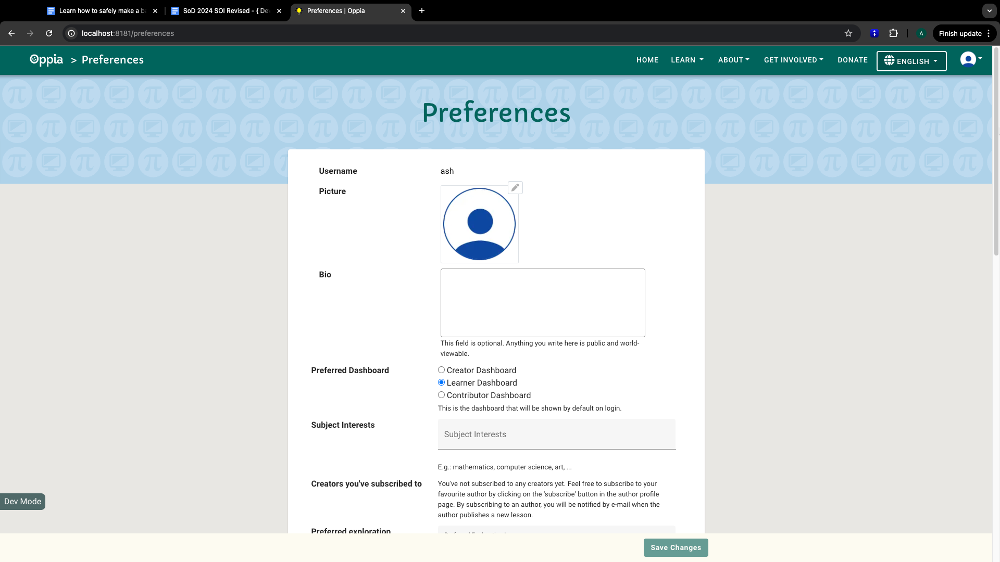
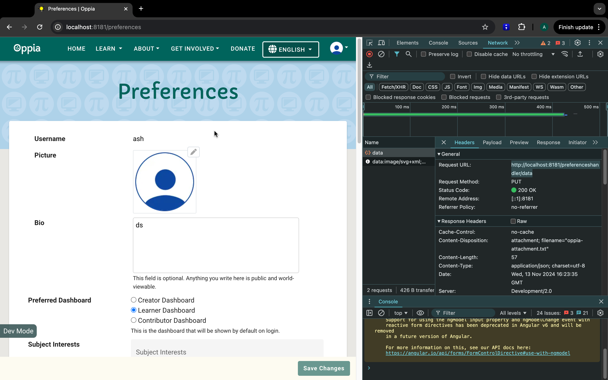
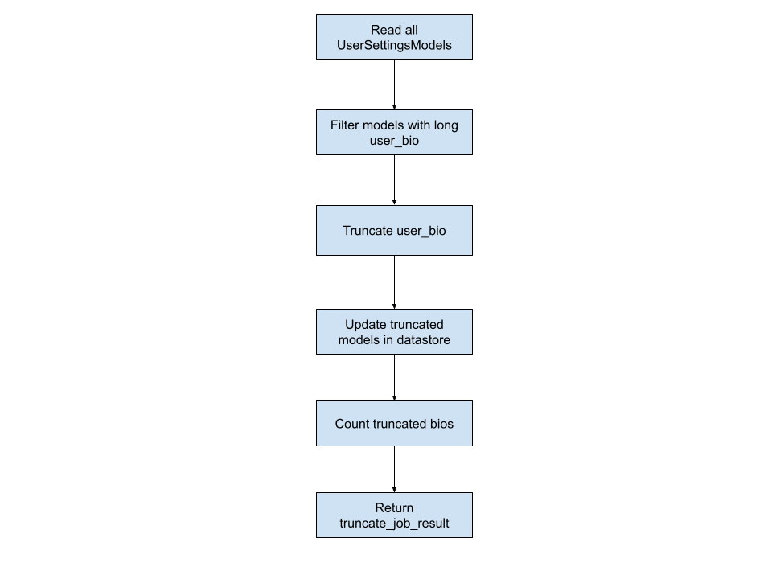

## Table of Contents

- [Introduction](#introduction)
- [Scenario](#scenario)
- [Prerequisites](#prerequisites)
- [Procedure](#procedure)
  - [Section 1: Prevent New Data Violations](#section-1-prevent-new-data-violations---identify-code-changes-for-bio-length-limit)
  - [Section 2: Writing the Migration Job](#section-2-writing-the-migration-job)
  - [Section 3: Writing the Audit Job](#section-3-writing-the-audit-job)
  - [Section 4: Testing the Beam Job](#section-4-testing-the-beam-job)
  - [Section 5: Run and Validate the Job](#section-5-run-and-validate-the-job)
    - [**Conclusion**](#conclusion)
      - [We Value Your Feedback](#we-value-your-feedback)

# Introduction

In this tutorial, you will learn how to safely implement backend changes that impact server data, an essential skill for any developer working with data-storing applications. We’ll cover key concepts like modifying data models, as well as writing and testing Beam jobs (Audit and Migration). These skills are fundamental for maintaining data integrity, ensuring data consistency, and avoiding disruptions during backend updates.

By the end of this tutorial, you will have the knowledge and confidence to handle backend changes at Oppia effectively, ensuring data safety and smooth application performance.

# Scenario

In this tutorial, we will address an issue in which the `user_bio` field in the `UserSettingsModel` allows users to enter bios of unrestricted length. For this tutorial, imagine that the technical team has decided to enforce a length limit of 200 characters for this field to ensure consistency and allow UI designers to allocate space reliably for displaying bios.

To implement this change, we need to modify the data model to restrict the bio length and write a migration job to ensure that existing user bios exceeding this limit are truncated accordingly. 

# Prerequisites

Before you begin, ensure that you have completed the following steps to set up and prepare your development environment:

1. Set Up Oppia Locally: Follow the [Oppia setup instructions](https://github.com/oppia/oppia/wiki) to clone the repository and set up your local development environment.  
2. Familiarize Yourself with Apache Beam Jobs: [Beam jobs](https://github.com/oppia/oppia/wiki/Apache-Beam-Jobs) are an integral part of data processing at Oppia. Before proceeding, take some time to understand their role in auditing and migrating data. You can refer to the [Apache Beam Jobs at Oppia tutorial](https://github.com/oppia/oppia/wiki/Tutorial-Learn-How-to-Write-and-Test-a-Non-Trivial-Beam-Job) for detailed guidance on writing and testing Beam jobs.  
3. Understand the Preferences Page: This tutorial involves modifying the bio field in the user’s Preferences page. To understand the context better, go through the [How to Access Oppia Webpages: Preferences Page](https://github.com/oppia/oppia/wiki/How-to-access-Oppia-webpages#preferences-page) guide.

# Procedure

Before we dive into the implementation, let’s outline the sequence of operations required to enforce and apply the new bio length limit safely. Fixing an issue that affects existing data is a structured process that must follow the correct order:

1. **Modify the Backend Layer to Prevent Future Violations**
	- Update the backend validation to ensure that new or updated bios cannot exceed 200 characters.
	- This ensures that, once we fix existing data, no new invalid entries will be introduced.

2. **Implement the Data Migration and Audit Jobs**
	- Write an Apache Beam migration job to truncate existing bios that exceed the character limit.
	- Implement an audit job that performs the same logic as the migration job but without modifying any data. This allows us to verify the migration logic before making actual changes.

3. **Test the Migration and Audit Jobs**
	- Run the jobs locally with test data to validate their correctness.
	- Ensure that only bios exceeding 200 characters are truncated, while all other data remains unaffected.

4. **Run the Migration Job in a Safe Environment** (Not covered in this tutorial)
	- Execute the job in a staging environment or backup server before deploying it to production.
	- Validate the results to confirm no unintended changes occur.

5. **Deploy to Production** (Not covered in this tutorial)
	- After thorough validation and approval, deploy the migration job on the live server.
	- Confirm the data integrity of UserSettingsModel after the migration is complete.

In this tutorial, we will cover the first three steps—modifying the domain layer, implementing the migration and audit jobs, and testing them. Running the migration in a safe environment and deploying it to production are beyond this tutorial’s scope.

> **Before moving forward, make sure to review the** [**Apache Beam Job Guidelines**](https://github.com/oppia/oppia/wiki/Apache-Beam-Jobs#guidelines-for-writing-beam-jobs) **to understand best practices for writing and testing Beam jobs effectively.**

## Section 1: Prevent New Data Violations - Identify Code Changes for Bio Length Limit

Start by navigating to the Preferences page in your local development environment.  
**URL**: [`http://localhost:8181/preferences`](http://localhost:8181/preferences)

Our goal is to identify which storage model stores the fields shown on this page. If you already know which storage model handles these fields, you can inspect them directly. If not, observe the network call triggered when changes are made on the Preferences page. This will guide you in tracing the update process through the codebase and locating the relevant storage model.

Let’s proceed and try to trace the model that stores the fields for this page.

> [!IMPORTANT]
> Practice 1: Familiarize yourself with the codebase architecture at Oppia. Understanding the structure of the codebase will help you navigate through various layers of code at Oppia more efficiently. Follow this guide: [Overview of the Oppia Codebase](https://github.com/oppia/oppia/wiki/Overview-of-the-Oppia-codebase).



Above is an image of the Preferences page, which includes various fields. In our case, we need to update the `Bio` field, then click the **Save Changes** button and observe which endpoint is triggered in the network tab of your browser's developer tools.

1. Enter any random text in the `Bio` field on the Preferences page. Notice that the **Save Changes** button becomes clickable (it’s disabled by default until changes are made).  
2. Click the **Save Changes** button and open the **Network Tab** in your browser’s developer tools.  
3. Clear any existing network calls to focus on new ones.

> [!IMPORTANT]
> Practice 2: From the network tab in your browser's developer tools, can you figure out which network call is made to update the `user_bio` field at Oppia?
> 
> **Hint**: When you first open the network tab, you might see a large number of network calls. To narrow them down, refresh the network tab just before clicking the Save Changes button. This will help you focus on the new calls triggered by the action. For a deeper understanding of how to use Chrome DevTools effectively, refer to this guide: [Chrome DevTools Network Panel Documentation](https://developer.chrome.com/docs/devtools/network).

Upon clicking the **Save Changes** button, you’ll notice a call to the following endpoint:  
`http://localhost:8181/preferenceshandler/data`

This tells us that the endpoint (`/preferenceshandler/data`) handles updates to the Preferences page.



Now it’s time to trace this endpoint in the codebase.

The URL triggered when clicking the **Save Changes** button is `/preferenceshandler/data`. Perform a quick search in the codebase for this endpoint. Note that exact URL matches may not yield results, as URLs are often aliased as constants. To locate the relevant code, try variations such as `/preferenceshandler/data`, `/preferenceshandler`, or `preferenceshandler`.

> [!IMPORTANT]
> **Practice 3**: Can you search for the above variations of the endpoint in the codebase? Note down where these instances appear and identify the controller attached to the endpoint. It will help you trace the endpoint to its corresponding logic in the code. For tips on using your code editor effectively to ease the development process, refer to this guide: [Tips for Common IDEs](https://github.com/oppia/oppia/wiki/Tips-for-common-IDEs).
>
> **Hint**: All endpoint routings are centralized in main.py, so you can focus your search there instead of the entire codebase.

Upon searching, you’ll find in `feconf.py` that the URL `/preferenceshandler/data` is aliased as `PREFERENCES_DATA_URL`.

Next, search for `PREFERENCES_DATA_URL` in the codebase. In `main.py`, you’ll find the following line:

```python
get_redirect_route(
    feconf.PREFERENCES_DATA_URL, profile.PreferencesHandler),
```

This indicates that the `PreferencesHandler` class in the `profile` module handles the endpoint.

> [!IMPORTANT]
> Practice 4: Locate the `PreferencesHandler` class in the codebase and carefully examine the controller to understand its purpose. Specifically, trace where it processes the `user_bio` field update. Understanding the controller’s flow will help you see how different components interact to handle a request.
> 
> To deepen your knowledge of HTTP requests, refer to this guide: [HTTP Methods](https://developer.mozilla.org/en-US/docs/Web/HTTP/Methods). At Oppia, we commonly use `GET`, `POST`, `PUT`, and `DELETE` methods. You can also explore `base.py` in the codebase to see how these methods are enumerated and used.

In `oppia/core/controllers/profile.py`, you’ll find the `PreferencesHandler` class:

```python
class PreferencesHandler(base.BaseHandler[Dict[str, str], Dict[str, str]]):
   """Provides data for the preferences page."""

   GET_HANDLER_ERROR_RETURN_TYPE = feconf.HANDLER_TYPE_JSON

   # Other Code…

   @acl_decorators.can_manage_own_account
   def get(self) -> None:
       """Handles GET requests."""
       # Code

   @acl_decorators.can_manage_own_account
   def put(self) -> None:
       """Handles PUT requests."""
       # Code
```

Above is the code for the `PreferencesHandler` class. As you can see, this handler class handles both `PUT` and `GET` methods. Our next step is to determine which model fields are being updated through this handler.

The `PUT` method retrieves user settings using `user_services.get_user_settings()`, modifies the settings, and saves the updates with `user_services.save_user_settings()`.

The `get_user_settings` function is defined in `oppia/core/domain/user_services.py`. 

Here’s the relevant code:

```python
def get_user_settings(
   user_id: str, strict: bool = True
) -> Optional[user_domain.UserSettings]:
   """Return the user settings for a single user.

   Args:
       user_id: str. The unique ID of the user.
       strict: bool. Whether to fail noisily if no user with the given
           id exists in the datastore. Defaults to True.

   Returns:
       UserSettings or None. If the given user_id does not exist and strict
       is False, returns None. Otherwise, returns the corresponding
       UserSettings domain object.

   Raises:
       Exception. The value of strict is True and given user_id does not exist.
   """

   user_settings = get_users_settings([user_id])[0]
   if strict and user_settings is None:
       logging.error('Could not find user with id %s' % user_id)
       raise Exception('User not found.')
   return user_settings
```

The `get_user_settings` function retrieves user settings as a domain object (`user_domain.UserSettings`). This domain object is a representation of the underlying datastore model (`UserSettingsModel`). It is used for interacting with user data in the application.

To understand how the `UserSettings` domain object is derived from the `UserSettingsModel` storage model, let’s look at the [`get_users_settings()`](https://github.com/oppia/oppia/blob/cac148abaaa0bba4d96b9df26aa67fd3068b216c/core/domain/user_services.py#L324) function. This function retrieves user settings storage models from the datastore and converts them into domain objects.

To learn more about how domain objects and models are utilized at Oppia, refer to the [Overview of the Oppia Codebase](https://github.com/oppia/oppia/wiki/Overview-of-the-Oppia-codebase) wiki page. This wiki page delves in detail into the architecture of Oppia’s codebase.

For our purpose, we need to examine the datastore model: `UserSettingsModel`

The datastore model is defined in `oppia/core/storage/user/gae_models.py`:

```python
class UserSettingsModel(base_models.BaseModel):
   ... other attributes.
   # User specified biography (to be shown on their profile page).
   user_bio = datastore_services.TextProperty(indexed=False)
```

Here, the `user_bio` field is defined as a `TextProperty`, allowing unrestricted text input

> [!NOTE]
> Now that we have identified the field storing the Bio property, there are multiple approaches to enforce the character limit. One straightforward approach is to validate the length of the Bio field in the frontend. Another is to add validation in the backend before storing the data. A more robust solution combines both approaches—adding validation in both the frontend and backend to ensure reliability and consistency.
>
> In real-world Oppia development, we would also consider how the UI handles this scenario. For instance, the frontend could validate the character limit before calling the backend, providing immediate feedback to users through a warning message near the text box or a snackbar notification. While this tutorial focuses on backend implementation, incorporating frontend validation would enhance the overall user experience.
>
> For this tutorial, we will focus on implementing backend validation. Within the backend, we also need to decide where to add this validation—whether in the service layer, controller layer, domain model layer, or storage model layer. If you find yourself unsure about such decisions in practice, don’t hesitate to reach out to team members for guidance.
>
> When implementing this in a real scenario, validation would also need to be enforced in the domain layer's `validate()` method to maintain consistency and adhere to Oppia's standards. For an example, see the `validate()` method in the domain layer: [user\_domain.py\#L217](https://github.com/oppia/oppia/blob/cac148abaaa0bba4d96b9df26aa67fd3068b216c/core/domain/user_domain.py#L217). However, since the focus of this tutorial is on the overall process of making a data-affecting change, we won’t cover domain layer validation in detail here.
>
> For this tutorial, we’ll implement the validation in the controller layer.

> [!IMPORTANT]
> Practice 6: Add a validation check to ensure the length of the updated bio field in the `PreferencesHandler` class is within the allowed limit before making a call to the service layer to update it in the datastore. 
>
> Hint: Explore how validations are implemented in other parts of the codebase to understand the practices followed at Oppia. Pay special attention to how validation methods are structured and where they are called.

To restrict the bio length to 200 characters, we’ll add validation to the `PreferencesHandler`.

In `feconf.py`, add:

```python
MAX_BIO_LENGTH_IN_CHARS = 200
```

Update the `put` Method in the Controller by adding a check to enforce the character limit before saving: 

```python
elif update_type == 'user_bio':
    self.__validate_data_type(update_type, str, data)
    if len(data) > feconf.MAX_BIO_LENGTH_IN_CHARS:
        raise self.InvalidInputException(
            'User bio exceeds maximum character limit: %s'
            % feconf.MAX_BIO_LENGTH_IN_CHARS)
    user_settings.user_bio = data
```

> [!NOTE]
> Normally, we would use schema validation to enforce this (e.g., by defining validation rules for the handler). You can refer to the [Oppia Schemas Guide](https://github.com/oppia/oppia/wiki/Schemas#how-to-write-validation-schemas-for-handlers) for instructions on how to write validation schemas for handlers. However, the preferences handler hasn’t been set up for schema validation yet. Adding schema validation would require defining validations for the entire handler, which is beyond the scope of this tutorial.

The changes we have implemented so far ensure that all new and updated user bios are limited to a maximum of 200 characters. However, this does not account for existing users whose bios may already exceed this limit. Such cases would create discrepancies in the data, potentially causing inconsistencies or unexpected behavior.

To address this, we will write a **Migration Job** using Apache Beam. This job will process and update the existing user data to conform to the new restrictions. Details on implementing this Migration Job will be covered in the next section.

## SECTION 2: Writing the Migration Job

Now that we have implemented the necessary changes to restrict the `Bio` field to 200 characters for new and updated data, we must ensure data consistency for pre-existing records.

At this stage, it is essential to consult with your team to decide how to handle the existing data for users whose bios exceed the character limit.

For example, potential options might include:

1. Truncating the `user_bio` field to the maximum allowed length (200 characters).  
2. Clearing the `user_bio` field entirely for users with long bios.  
3. Leaving the bios unchanged but marking them as needing a manual update.

For this tutorial, we will choose the **truncation** approach, ensuring all user bios conform to the 200-character limit.

> [!NOTE]
> In practice, when making decisions that aren’t clear-cut—especially those affecting user experience—it’s important for developers to compile a list of different options along with their respective pros and cons. This ensures that all potential approaches are considered thoroughly. Once the options are outlined, they should be discussed with the product team and technical leads to collaboratively decide on the best course of action. For the purposes of this tutorial, imagine that the team leads reviewed the options and decided to proceed with Option 1.

At Oppia, [**Apache Beam Jobs**](https://github.com/oppia/oppia/wiki/Apache-Beam-Jobs) are used for data migration, validation, and other large-scale data processing tasks. Let’s get started with writing an Apache Beam job to truncate the `user_bio` field for all records that exceed the limit.

> [!IMPORTANT]
> Practice 7: Familiarize yourself with how Apache Beam is used at Oppia. Understanding its role and implementation will help you design efficient and scalable jobs. You can refer to the following resources: 
> - [Tutorial: Learn How to Write and Test a Non-Trivial Beam Job](https://github.com/oppia/oppia/wiki/Tutorial-Learn-How-to-Write-and-Test-a-Non-Trivial-Beam-Job)
> - [Apache Beam Jobs at Oppia](https://github.com/oppia/oppia/wiki/Apache-Beam-Jobs)

**Understanding the Workflow with a Directed Acyclic Graph (DAG)**

Before we write any code, let's visualize the workflow of our Beam job as a Directed Acyclic Graph (DAG). This will help us understand the sequence of operations and the flow of data through the pipeline.

**What is a DAG?** Like all graphs, a directed acyclic graph (DAG) consists of nodes connected by edges. In this case, the nodes are steps in the job, and the edges indicate the order in which to complete the steps. The edges are thus directional (hence "directed"), and the graph isn't allowed to have any cycles (hence "acyclic"). In other words, it should be impossible to start at one node and follow the edges back to the same node, as this would create an infinite loop in our job.

For more detailed information about DAGs, you can refer to the [DAG Wikipedia page](https://en.wikipedia.org/wiki/Directed_acyclic_graph).

Visualizing our Beam job as a DAG helps in planning the structure and flow of our data processing pipeline. It provides a clear picture of how data moves from one step to another, ensuring that all necessary operations are performed in the correct order.

The Beam job’s objective is to truncate the `user_bio` field in the `UserSettingsModel` datastore records exceeding the 200-character limit. The workflow can be broken down into the following steps:

> [!IMPORTANT]
> Practice 8: Take a notebook and try drafting a rough workflow of what our job would do, using boxes for the steps and arrows to connect different steps. 
> 
> Hint: 
> - **Read everything first**. Start by reading all the necessary data at the beginning of the job. This ensures that you have all the required information before performing any operations.
> - **Process data in steps**. Break down the job's functionality into simpler steps, such as filtering, transforming, and aggregating the data. Each step should be a separate node in your DAG. 
> - **Write everything last**. Ensure that all writing operations, such as saving results or updating models, are performed at the end of the job. This helps in maintaining data consistency and avoids incomplete writes.

**Steps in the Workflow:**

1. Read User Settings Models: Retrieve all `UserSettingsModel` records from the datastore.  
2. Filter Models with Long Bios: Identify records where the `user_bio` field exceeds 200 characters.  
3. Truncate Long Bios: Modify the `user_bio` field to meet the character limit.  
4. Update Truncated Models in Datastore: Save the updated records back to the datastore.  
5. Count Truncated Bios: Count the number of bios that were truncated.
6. Return Truncation Job Results: Output the results of the job, including statistics.

Here's a simple representation of the DAG for our Beam job:



Visualizing the job as a DAG ensures that every necessary step is accounted for and data flows seamlessly through the pipeline.

**Implementing the Beam Job**

With the workflow in mind, we’ll now implement the Beam job. According to Oppia’s documentation, Beam jobs are stored in the `oppia/core/jobs/batch_jobs` directory.

> [!IMPORTANT]
> Practice 9: Decide on suitable names for the module and job. Follow the conventions mentioned in the [https://github.com/oppia/oppia/wiki/Apache-Beam-Jobs\#writing-apache-beam-jobs](https://github.com/oppia/oppia/wiki/Apache-Beam-Jobs#writing-apache-beam-jobs) wiki.

Per the [Oppia documentation for Beam Jobs](https://github.com/oppia/oppia/wiki/Apache-Beam-Jobs#writing-apache-beam-jobs):

* The name of the file follows the format \`\<noun\>\_\<operation\>\_jobs.py\`. In this case, we can use something like \`user\_bio\_truncation\_jobs.py\`.  
* The name of the job follows the convention: \<Verb\>\<Noun\>Job. In this case, we can name the job as \`TruncateUserBioJob\`.

We will also use the `DATASTORE_UPDATES_ALLOWED` property, which controls whether a Beam job can modify datastore entities.

**Why Use DATASTORE_UPDATES_ALLOWED?**

- When set to True, the job can modify datastore entities (e.g., truncating bios).
- When set to False, the job should behave as an audit job, simulating the logic without making actual changes.

This property helps distinguish between migration jobs that modify data and audit jobs that merely report potential changes.

Here’s what one implementation of the job could look like \- 

```python
"""Job to truncate user bio if it exceeds 200 characters."""

from __future__ import annotations

from core.jobs import base_jobs
from core.jobs.io import ndb_io
from core.jobs.transforms import job_result_transforms
from core.jobs.types import job_run_result
from core.platform import models
from core.jobs import job_utils

import apache_beam as beam

from typing import Iterable

MYPY = False
if MYPY:
   from mypy_imports import user_models

(user_models,) = models.Registry.import_models([models.Names.USER])


class TruncateUserBioJob(base_jobs.JobBase):
    """One-off job to truncate user bio in UserSettingsModel."""

    DATASTORE_UPDATES_ALLOWED = True  # This job modifies the datastore.

    def run(self) -> beam.PCollection[job_run_result.JobRunResult]:
        """Runs the job to truncate user bios.

        Returns:
            A PCollection containing the results of the job run.
        """
        # Retrieve all UserSettingsModels from the datastore
        user_settings_models = (
            self.pipeline
            | 'Get all UserSettingsModels' >> (
                ndb_io.GetModels(user_models.UserSettingsModel.get_all()))
        )

        # Filter models with user_bio longer than 200 characters
        models_to_process = (
            user_settings_models
            | 'Filter models with long user_bio' >> beam.Filter(
                lambda model: model.user_bio and len(model.user_bio) > 200)
        )

        # Apply truncation
        truncated_models = models_to_process | 'Truncate user_bio' >> beam.ParDo(TruncateUserBioFn())

        # Count truncated bios
        truncated_bios_count = (
            truncated_models
            | 'Count truncated bios' >> (
                job_result_transforms.CountObjectsToJobRunResult('TRUNCATED BIOS'))
        )

        # Conditionally update the datastore if allowed
        if self.DATASTORE_UPDATES_ALLOWED:
            unused_put_results = (
                truncated_models
                | 'Update truncated models in datastore' >> ndb_io.PutModels()
            )

        # Return the job results
        return (
            truncated_bios_count
        )


class TruncateUserBioFn(beam.DoFn):
    """DoFn to truncate user bio if it exceeds 200 characters."""

    def process(
        self, user_settings_model: user_models.UserSettingsModel
    ) -> Iterable[user_models.UserSettingsModel]:
        """Truncates user_bio to 200 characters if updates are allowed.

        Args:
            user_settings_model: UserSettingsModel. Model to process.

        Yields:
            UserSettingsModel. Modified model if datastore updates are allowed.
        """
        # Always clone the model to prevent accidental modifications
        model = job_utils.clone_model(user_settings_model)

        if model.user_bio and len(model.user_bio) > 200:
            if TruncateUserBioJob.DATASTORE_UPDATES_ALLOWED:
                model.user_bio = model.user_bio[:200]
                model.update_timestamps()  # Only update timestamps if writing is allowed
                yield model  # Yield the modified model
            else:
                # If updates aren't allowed, just log the affected user_bio (for auditing)
                yield job_run_result.JobRunResult.as_stdout(
                    f"User bio for ID {model.id} requires truncation."
                )
```

## Section 3: Writing the Audit Job

At Oppia, whenever a Beam job modifies datastore models, it is essential to write a corresponding **Audit Job**. The primary purpose of an audit job is to simulate the logic of the main job without making any actual changes to the datastore. This helps identify potential issues in the migration logic and ensures the data remains safe from unintended modifications during testing. Audit jobs are critical for maintaining confidence in the system, as they help verify the accuracy and scope of the data migration or validation process.

An audit job can be used in the following ways:

1. **Before the Beam Job**: To understand the scope of the data to be modified and ensure the migration logic is correct.  
2. **After the Beam Job**: To verify that the migration was performed as expected and all affected records were updated.

For instance, in the **Topic Migration Job**, the `AuditTopicMigrateJob` simulates all steps of the main `MigrateTopicJob` but does not write changes to the datastore. Similarly, we will follow this paradigm for the `TruncateUserBioJob`.

The objective of our audit job, `AuditTruncateUserBioJob`, is to:

1. Identify user records with bios exceeding 200 characters.
2. Simulate truncation logic for these records without saving the changes.  
3. Provide a detailed report of all affected records, ensuring we are confident in the data to be modified before running the actual migration job.

#### Key Considerations for Designing an Audit Job

When designing an audit job, the goal is to validate the logic and scope of the main Beam job without making any changes to the datastore. Here’s a step-by-step thought process to guide you:

**Step 1: Understand the Main Beam Job’s Logic**

Before writing the audit job, thoroughly understand the logic of the main Beam job. For our scenario, the main job truncates the user_bio field in UserSettingsModel to 200 characters. The audit job should simulate this logic but skip the actual write operation.

**Step 2: Use DATASTORE_UPDATES_ALLOWED to Enforce Read-Only Behavior**

To ensure the audit job doesn’t modify the datastore, set the DATASTORE_UPDATES_ALLOWED property to False. This enforces read-only behavior and prevents accidental data changes. Additionally, subclass the main Beam job to reuse its logic, ensuring consistency between the two jobs.

Reuse the main job’s logic by subclassing it. This ensures that the audit job performs the same transformations, filters, and checks as the main job. For example, the audit job should:
- Filter UserSettingsModel instances with user_bio exceeding 200 characters.
- Count the number of records that would be truncated.

> [!IMPORTANT]
> **Practice 9**: Based on the explanation above, can you write an audit job for our use case? Think about how you can simulate the truncation logic while ensuring the job remains read-only and produces detailed reports.

The `AuditTruncateUserBioJob` is implemented alongside the main Beam job in the `user_bio_truncation_jobs.py` file. Here’s how it can be implemented:

```python
class AuditTruncateUserBioJob(TruncateUserBioJob):
    """Audit job to check how many UserSettingsModels require truncation."""

    DATASTORE_UPDATES_ALLOWED = False  # Enforce read-only behavior
```

With the audit job in place, you are now ready to confidently validate the migration logic and scope before executing the main Beam job. In the next section, we will focus on testing and running these jobs.

## Section 4: Testing the Beam Job

Testing is a crucial step in ensuring that the `TruncateUserBioJob` works as intended under various scenarios. Effective tests help confirm the correctness of the logic, prevent regressions, and ensure that the job behaves as expected in both typical and edge cases.

In this section, we’ll focus on writing unit tests for the `TruncateUserBioJob` to validate its behavior under different conditions. The key objectives of these tests are:

1. To ensure the job processes data correctly.  
2. To verify that the job handles edge cases gracefully.  
3. To confirm that the output matches the expected results for each scenario.

When designing tests, it’s important to consider the following types of scenarios:

1. **Null Case**:  
   * **Scenario**: No `UserSettingsModel` instances exist in the datastore.  
   * **Expected Outcome**: The job should complete successfully without producing any output.  
2. **Standard Case**:  
   * **Scenario**: All user bios in the datastore are within the character limit.  
   * **Expected Outcome**: The job should process the models without modifying any data.  
3. **Error Case (Exceeding Character Limit)**:  
   * **Scenario**: Some `user_bio` fields exceed the 200-character limit.  
   * **Expected Outcome**: The job should correctly truncate these fields to the maximum allowed length.  
4. **Complex Case (Multiple Affected Models)**:  
   * **Scenario**: Multiple users have bios exceeding the character limit.  
   * **Expected Outcome**: The job should truncate all affected bios and provide a report indicating the number of truncations performed.

By covering these cases, we can ensure the robustness of the Beam job and gain confidence in its behavior across different scenarios.

> [!IMPORTANT]
> Practice 10: Using the scenarios outlined above, write unit tests for the `TruncateUserBioJob` to validate its behavior under different conditions.
> 
> Hint: Refer to the structure of existing tests in the Oppia codebase for examples and reusable patterns that can guide you in writing effective tests.

Here’s what one implementation of tests could look like 

```python
"""Tests for user_bio_truncation_jobs."""


from __future__ import annotations


from core.jobs import job_test_utils
from core.jobs.batch_jobs import user_bio_truncation_job
from core.jobs.types import job_run_result
from core.platform import models


MYPY = False
if MYPY:  # pragma: no cover
   from mypy_imports import user_models


(user_models,) = models.Registry.import_models([models.Names.USER])


class TruncateUserBioJobTests(job_test_utils.JobTestBase):
   """Tests for TruncateUserBioJob."""


   JOB_CLASS = user_bio_truncation_job.TruncateUserBioJob


   def test_run_with_no_models(self) -> None:
       self.assert_job_output_is([])


   def test_user_bio_within_limit_is_not_modified(self) -> None:
       user = self.create_model(
           user_models.UserSettingsModel,
           id='test_id_1',
           email='test_1@example.com',
           username='test_1',
           user_bio='Short bio'
       )


	original_last_updated = user.last_updated
       self.put_multi([user])
       self.assert_job_output_is([])


       updated_user = user_models.UserSettingsModel.get_by_id(user.id)
       self.assertEqual(updated_user.user_bio, 'Short bio')
	self.assertEqual(updated_user.last_updated, original_last_updated)


   def test_user_bio_exceeding_limit_is_truncated(self) -> None:
       long_bio = 'A' * 250  # 250 characters
       user = self.create_model(
           user_models.UserSettingsModel,
           id='test_id_2',
           email='test_2@example.com',
           username='test_2',
           user_bio=long_bio
       )


	original_last_updated = user.last_updated
       self.put_multi([user])
       self.assert_job_output_is([
           job_run_result.JobRunResult(
               stdout='TRUNCATED BIOS SUCCESS: 1'
           )
       ])


       updated_user = user_models.UserSettingsModel.get_by_id(user.id)
       self.assertEqual(len(updated_user.user_bio), 200)
       self.assertEqual(updated_user.user_bio, 'A' * 200)
	self.assertNotEqual(updated_user.last_updated, original_last_updated)


   def test_multiple_users_with_long_bios_are_truncated(self) -> None:
       user_1 = self.create_model(
           user_models.UserSettingsModel,
           id='test_id_3',
           email='test_3@example.com',
           username='test_3',
           user_bio='B' * 220
       )
       user_2 = self.create_model(
           user_models.UserSettingsModel,
           id='test_id_4',
           email='test_4@example.com',
           username='test_4',
           user_bio='C' * 300
       )


	original_last_updated_1 = user_1.last_updated
original_last_updated_2 = user_2.last_updated


       self.put_multi([user_1, user_2])
       self.assert_job_output_is([
           job_run_result.JobRunResult(
               stdout='TRUNCATED BIOS SUCCESS: 2'
           )
       ])


       updated_user_1 = user_models.UserSettingsModel.get_by_id(user_1.id)
       updated_user_2 = user_models.UserSettingsModel.get_by_id(user_2.id)


       self.assertEqual(len(updated_user_1.user_bio), 200)
       self.assertEqual(updated_user_1.user_bio, 'B' * 200)
       self.assertEqual(len(updated_user_2.user_bio), 200)
       self.assertEqual(updated_user_2.user_bio, 'C' * 200)
	self.assertNotEqual(updated_user_1.last_updated, original_last_updated_1)
self.assertNotEqual(updated_user_2.last_updated, original_last_updated_2)
```

> [!NOTE]
> In addition to testing the migration job, it is important to test the audit job (`AuditTruncateUserBioJob`) to ensure that it correctly identifies records needing truncation without making any changes to the datastore. While the implementation of audit job tests is not shown here, it follows a similar structure, focusing on validating read-only operations and accurate reporting.

## Section 5: Run and Validate the Job

Once the `TruncateUserBioJob` has been written and tested, the next step is to run the job on a local server and validate its behavior. Running the job allows you to see how it interacts with real data and confirm that it performs as expected. This section walks you through the steps to run the job and test it with various scenarios.

Now let’s try running the job on our local server. 

1. Sign in as an administrator ([instructions](https://github.com/oppia/oppia/wiki/How-to-access-Oppia-webpages#log-in-as-a-super-administrator)).  
2. Navigate to Admin Page \> Roles Tab.  
3. Add the "Release Coordinator" role to the username you are signed in with.  
4. Navigate to [http://localhost:8181/release-coordinator](http://localhost:8181/release-coordinator), then to the Beam Jobs tab.  
5. Search for your job by name (e.g., `TruncateUserBioJob`).  
6. Click the **Play** button next to the job name.  
7. Click **Start a New Job** to begin execution.

To thoroughly validate the job, you’ll need to test it under various conditions. Follow these steps to create dummy data and observe the job’s behavior:

1. **Initial Run Without Dummy Data**  
   * Without creating any dummy data, run the job.  
   * Since no data exists in the datastore, the behavior will match the "Null Case" from the test suite.  
   * **Expected Outcome**: The job should complete without making any changes, and the output should indicate that no models were processed.  
2. **Populate the Datastore with Users**  
   * Sign up as different users to create new entries in the datastore.  
   * Visit the Preferences page ([http://localhost:8181/preferences](http://localhost:8181/preferences)) for each user and add data to the `Bio` field.  
3. **Create Various Test Cases**  
   * For some users, set the `user_bio` field to within the 200-character limit.  
   * For others, enter a `user_bio` that exceeds 200 characters.  
   * Leave the `user_bio` field empty for additional cases.  
4. **Run the Job on Populated Data**  
   * Navigate back to the **Release Coordinator** page and start the job again.  
   * Observe the behavior and verify whether it matches the expected outcomes for each scenario:  
     * **Bios within the limit**: Remain unchanged.  
     * **Bios exceeding the limit**: Are truncated to 200 characters.  
     * **Empty bios**: Remain unaffected.

### **Conclusion**

You’ve successfully written, tested, and validated a Beam job to manage the `user_bio` field in the `UserSettingsModel`. Through this tutorial, you’ve learned:

1. How to write a Beam job for data migration (`TruncateUserBioJob`).  
2. How to write an audit job (`AuditTruncateUserBioJob`) to verify data without modifying the datastore.  
3. How to test your job under various scenarios, ensuring correctness and robustness.  
4. How to run and validate the job in a local environment using realistic data.

These skills are critical for maintaining data integrity and consistency in Oppia’s datastore, ensuring that backend changes are implemented safely and effectively.

**Rolling Out Changes Safely**

In real-world Oppia development, rolling out such changes requires a phased approach to ensure stability and consistency:

1. **Enforce Validation for New Data**:  
   Start by enforcing the bio limit for new bios and bio updates through the backend validation added in this tutorial. This ensures that no new data violates the limit while existing data remains unaffected.  
2. **Run the Migration Job**:  
   Once validation is in place for new data, run the migration job to truncate existing bios that exceed the character limit. This step brings the historical data in line with the new constraints.  
3. **Build Features That Depend on the New Constraints**:  
   With all bios conforming to the limit, you can confidently design features that rely on this constraint, such as a new preferences page layout or other UI updates.

For further reading and more complex scenarios, refer to the [Apache Beam documentation](https://beam.apache.org/documentation/) and Oppia's [developer guides](https://github.com/oppia/oppia/wiki).

**Additional Steps for Production Deployment**

For deploying this job to production, there are additional steps to ensure smooth operation in a live environment:

1. **Testing on the Backup Server**:  
   * Ensure the job runs without failures on the Oppia backup server.  
   * Verify the job produces the expected output and outcomes.  
2. **Validation**:  
   * Validate the results through user-facing changes, a validation job, or an output check.  
3. **Approval**:  
   * Obtain explicit approval from the server jobs admin before deployment.

For more details, refer to the [Oppia Wiki on Testing Jobs](https://github.com/oppia/oppia/wiki/Testing-jobs-and-other-features-on-production). The wiki includes a template for requesting testing and approval, along with detailed instructions for submitting your job for production deployment.

By following these steps, you'll ensure that your Beam job is ready for production and can be deployed to help maintain the integrity and consistency of data in Oppia.

#### We Value Your Feedback

Did you find this tutorial useful? Or, did you encounter any issues or find things hard to grasp? Let us know by opening a discussion on [GitHub Discussions](https://github.com/oppia/oppia/discussions/new?category=tutorial-feedback). We would be happy to help you and make improvements as needed\!
