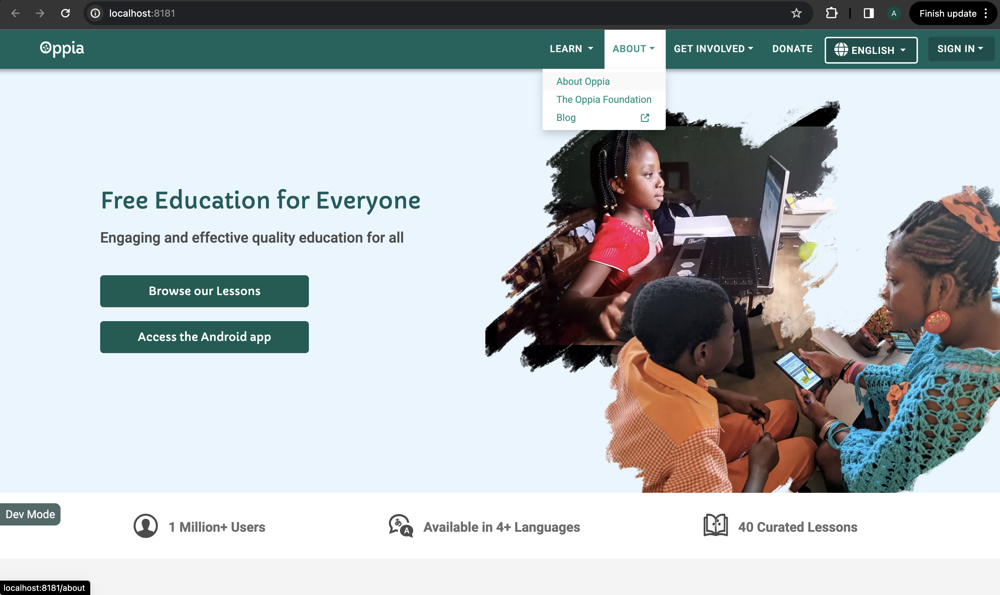
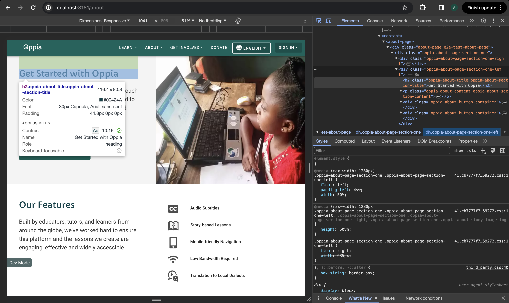
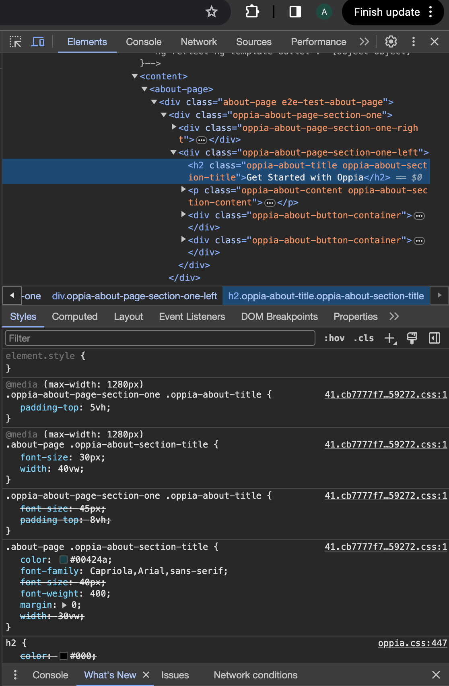
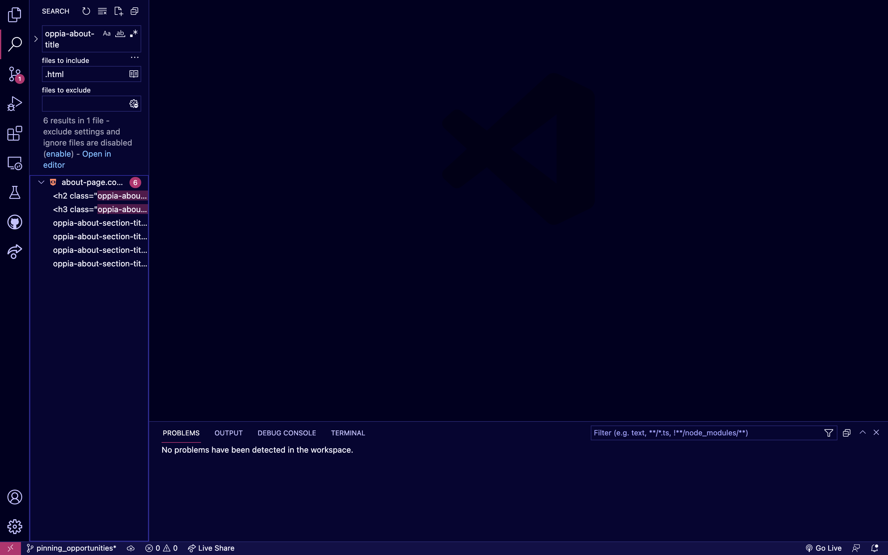
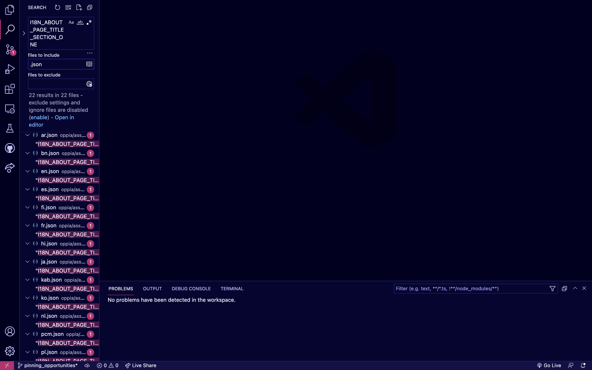
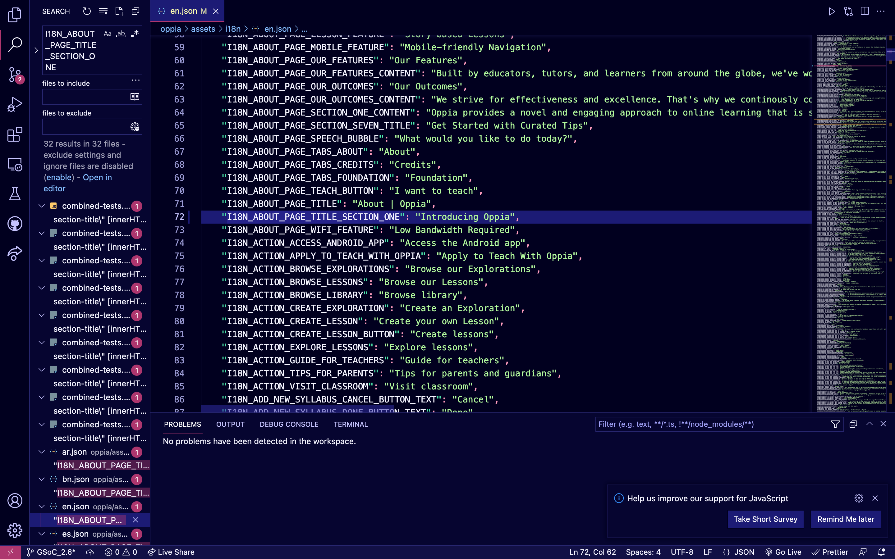
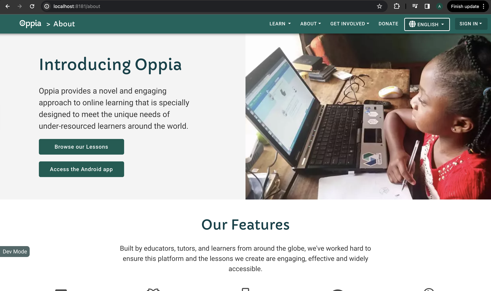

## Introduction

This tutorial guides you through making a simple UI change on the Oppia website. Specifically, we'll update the text on the top of the About page from "Get Started with Oppia" to "Introducing Oppia."

## Skills Covered

1. Figuring out which file(s) in the codebase to modify.
2. Understanding how to work with internationalization (i18n) keys.
3. Manually testing changes in both English and another language.

## Scenario

The UX writing team has filed a request on GitHub asking to update the text on the top of the About page. Let's proceed step by step.

## Procedure

<i>The following steps illustrate how a developer might tackle this issue. Try following this tutorial step-by-step on your local machine! This will give you a better sense of how to tackle other similar issues in the codebase.

**Important:**
When you see a “question box”, stop and try to figure out the answer on your own before reading ahead. You will learn more if you try to figure out your own answer to the question first!</i>

### Stage 1: Figure out the root cause of the issue and which files are affected.

**Setup:**
Start your local Oppia server. If you haven’t installed Oppia on your local machine, please follow the steps in [this wiki page](https://github.com/oppia/oppia/wiki/Installing-Oppia).

**Identify the Element:**
When the server is started, it navigates to the home page by default. Since the changes have to be done in the About page, let’s head to the About page at localhost:8181/about.

> [!IMPORTANT]
> Practice 1:
> Load the /about page on your machine following the instructions above. It should look different from the screenshot above.
>
> Can you find the “Get Started with Oppia” text that needs to be changed? Take a moment to locate it before moving forward.

The About page opens up. Now, you need to figure out which section needs to be changed. If you look carefully, you can find the text to be modified (“Get Started with Oppia”) in the right part of the first banner that appears on the About page. 

You have now successfully identified the section that needs to be modified. Next, let’s figure out what part of the codebase needs to be altered, to achieve our target. To do so, you will be using [browser developer tools](https://developer.mozilla.org/en-US/docs/Learn/Common_questions/Tools_and_setup/What_are_browser_developer_tools), preferably Chrome.

> [!IMPORTANT]
> Practice 2:
> On the About page, right-click on the "Get Started With Oppia" text on the About page and select "Inspect." This action will open the Developer Tools and highlight the relevant HTML section.
>
> Can you find the HTML code that corresponds to this text? Look for “Get Started with Oppia” in the HTML code (you might need to expand some elements).
> 

You’ll see a highlighted code that looks like `<h2 class="oppia-about-title oppia-about-section-title">Get Started with Oppia</h2>`. This code represents the text you want to change.

Now, let’s find the file on your computer so that you can make the necessary changes.

> [!IMPORTANT]
> Practice 3:
> Open your code editor (such as VS Code). Search for the file that contains the class name "oppia-about-title". Can you identify the specific file where this text is stored?
>
> Hint: To streamline your search, focus on HTML files as they commonly contain HTML classes. Use the editor's search functionality to narrow down the files containing this class. (Refer to the documentation for your editor if you don’t know how to do this – being able to use your tools efficiently is important!)

You’ll likely find it in a file named something like about-page.component.html.

### Stage 2: Make the changes

**Understanding i18n Keys:**
In the code file you found, look for a line similar to `<h2 class="oppia-about-title oppia-about-section-title" [innerHTML]="'I18N_ABOUT_PAGE_TITLE_SECTION_ONE' | translate"></h2>`. This line indicates that the text is fetched from an [internationalization (i18n)](https://angular.io/guide/i18n-overview) key named I18N_ABOUT_PAGE_TITLE_SECTION_ONE. These keys help Oppia manage translations for different languages – the key is substituted with the relevant language’s text at runtime.

**Making Changes:**
To change the text, locate the i18n file or section that contains `I18N_ABOUT_PAGE_TITLE_SECTION_ONE`. This is where you’ll find the text “Get Started with Oppia”.

> [!IMPORTANT]
> Practice 4:
> Search for the I18N_ABOUT_PAGE_TITLE_SECTION_ONE key. You’ll get a lot of results for this. Can you > > find the file which contains the english translations?

When you search for the I18N_ABOUT_PAGE_TITLE_SECTION_ONE key, you'll find several files in different languages. In general, when making PRs we update the English strings and let translators handle the other languages through translatewiki (which we will discuss later). So, we should focus on the en.json file, which contains the translations for Oppia in English.

Open the en.json file. Inside, you’ll see multiple i18n keys and their respective translated strings. Look for the key I18N_ABOUT_PAGE_TITLE_SECTION_ONE. Currently, it should be assigned to the text "Get Started with Oppia".

> [!IMPORTANT]
> Practice 5:
> Now that you know which key-value pair needs to be altered to get the result, can you change the text from "Get Started with Oppia" to “Introducing Oppia” ?

Change the value of the key I18N_ABOUT_PAGE_TITLE_SECTION_ONE from "Get Started with Oppia" to “Introducing Oppia”. Ensure that the syntax and formatting in the file remain intact while making this change. 

Note: When you change en.json and check in the changes, Translatewiki (the service we use for translating) pulls the changes and automatically handles retranslation of the content. This all happens behind the scenes, and you don’t need to do anything besides submitting the PR with the English-language changes. If a language doesn’t have translations yet, then the text shown will default to the English version. See the following Oppia Wiki pages to understand I18N development at Oppia.
 - [Adding new translations for i18n](https://github.com/oppia/oppia/wiki/Adding-new-translations-for-i18n#contributing-translations-to-oppia)
 - [How to develop for i18n](https://github.com/oppia/oppia/wiki/How-to-develop-for-i18n)

### Stage 3: Verify that your changes are correct

**Testing:**
Open your local Oppia instance and go to the About page. Check that the text now displays as “Introducing Oppia” instead of the original text, when the selected language is English.

If you’d like to see I18N in action, then change I18N keys in a different language too.

> [!IMPORTANT]
> Practice 6:
> Try changing the value for the key ` I18N_ABOUT_PAGE_TITLE_SECTION_ONE` in some other language file, say Hindi.
> Change the value to anything, for instance `Getting Started in Hindi`.
>
> Now, navigate to the ‘/about’ page in your local server. Change the language of the website from English to 
> Hindi.  Do you see the text `Getting Started in Hindi` ?

Remember, take your time with each step, and don’t hesitate to ask for help on [GitHub Discussions](https://github.com/oppia/oppia/discussions) if something isn’t clear. These changes might seem small, but they’re a great way to start getting comfortable with Oppia’s codebase!
