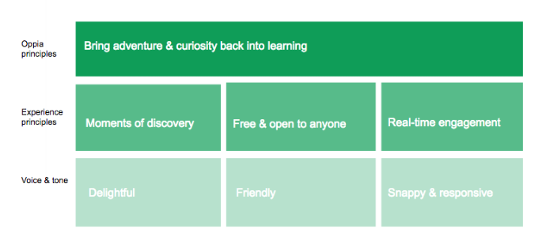

_(Compiled by @whygee, Dec 2015)_

## Voice and Tone Cheat Sheet

  

This diagram shows how the voice and tone characteristics are derived from Oppia's core principle ("bring adventure and curiosity..."). In order for that core principle to come across, we try to ensure that every interaction feels like a moment of discovery, that it's open and collaborative, and that it happens in real time. For each of these experience principles, we then ask: how do we talk / what language do we use, and what is the brand personality if we had to assign characteristics to each? So, for example, each moment of discovery should use delightful language (e.g. for a correct response, we might use "Good call, you got it right" in favor of "Your answer is correct").

**General tip on tone:** Avoid over-branding or using quirky language when the user expects a straightforward outcome. In other words, never let the quirkiness get in the way when the user is trying to take action. Examples include: navigation, forms and field labels, instructional text, selection text (drop-downs, radio buttons) and buttons. _Source: [Smashing Magazine](http://www.smashingmagazine.com/2013/06/17/five-ways-prevent-bad-microcopy/)_

## Style best practices

1. **Keep it simple.**
    - Use simple words and short phrases. Pretend you’re speaking to someone who’s smart and competent, but doesn’t know technical jargon and may not speak English very well.
    - Use short words, active verbs, and common nouns.
    - Put the most important thing first. "Front-load" the first 10 or so characters with the most salient information in the string.
    - Don’t try to explain subtle differences. They are lost on most users.
2. **Use contractions.** Use all conventional contractions wherever possible, i.e. it’s, can’t, wouldn’t, you’re, you’ve, haven’t, don’t. Mirror how we speak.
3. **Use numerals.** Don’t spell out numbers (even zero through nine) in UI text. Brevity is best. However, it is okay to spell out numbers in longer-form communications (i.e. email) or at the beginning of a sentence. You might also consider rewriting the sentence so it doesn’t start with a number.
4. **Turn paragraphs into bullet points.** To the user, a paragraph can feel like a lot to take in. Make important information in the UI more digestible by breaking it up into bullet points (even if it’s just 2 or 3 sentences). This will allow users to get the info they need quickly.
5. **Avoid text based on physical direction.** To ensure UI text is accessible to those who may not be able to see the screen or page, try to avoid words like "below", "above", "here", etc. when instructing users. For example, instead of “Enter your account details below,” just use "Enter your account details".
6. **Error messages = explanation + solution, that’s it.** Explain the problem in simple language, then tell the user how to fix it (or offer to fix it for them). A few tips: consider adding helpful links, don’t blame the user, avoid humor.

## Punctuation
- **Ampersand (&).** Use ampersand (&) in headlines on the site when referencing two items (i.e. ' Snacks & drinks' ). In a list of three or more items, spell out ' and'  (i.e. ' Snacks, drinks, and more' ). 
- **Asterisks.** Use before superscript numerals to disclaim a statement. Place asterisk at end of sentence or phrase unless legal deems otherwise. Place asterisks outside punctuation: Get free delivery on orders over $15.*
- **Colon.** The word directly after a colon should always be lowercase (i.e. Weekly sale: household supplies). This applies in headlines, email subject lines, email body copy, etc.
- **Contractions.** Use them to make your writing sound less robotic and stiff. Also, use more casual & friendly terms for greetings, ‘thanks’ over ‘thank you,’ ‘hi there’ over ‘hello.’
- **Dash.** Avoid if possible in running text. When used as a phrase marker – like this – use an en dash with a normal word space on either side, rather than an em dash. When used to indicate a range of numbers, use an en dash closed up on either side: pages 13–24.
- **Ellipsis.** Use the ellipsis character (…) to indicate:
  - Incompleteness, such as an action in progress (“Downloading...”) or truncated text.
  - That a menu item (such as Print… or Share…) leads to further UI involving significant choices. Exception: Commands whose wording already implies further (but limited) UI, such as Find in page or Pick a date, do not require ellipsis.
- **Exclamation points (!).** Avoid (or use very sparingly). Too many can come off as disingenuous or overly excitable. Be real & sincere in tone.
- **Hyphen.** Use hyphens to link all words in a compound adjective (i.e. ' game-day snacks' ). Do not use a hyphen if the construction includes an adverb ending in -ly (i.e. ' a globally inspired feast' ).
- **Period.** Don't use a period after a single sentence or phrase used in isolation, such as in a toast, label, or notification. Wherever two or more sentences run together, use a period for each sentence. 
- **Question mark.** Use a question mark if the string is a question.
- **Quotation marks.** Use single quotes to refer to in-product labels or buttons. Use double quotes when quoting something said by a person.
- **Serial comma.** Always use the serial comma (i.e. ' word, word, and word' ). Serial commas make text clearer, more consistent, and easier to read.
- **Spacing after periods.** Include only one space after each period.

## Capitalization
- DO NOT use title-style caps ("Click Here"). Instead, use sentence-style caps ("Click here").
- Capitalize product names only when referring to a product as a product. 
- When in doubt, don't capitalize any name of less significance than a formal product name.
- Retain the usual capitalization of proper nouns, acronyms, and code wherever they appear.
- Use sentence capitalization for most links, buttons, labels, controls, headings, and text in the Oppia interface.
- Use title capitalization for tab names (unless the tab names start with verbs) and references to other capitalized page titles.
  - (Optional) If a page has a top-level title that doesn't start with a verb ("Web History"), you may use title capitalization instead of sentence capitalization. Try to make this style consistent across a set of related pages.

## Formatting
- **Bold.** Use bold sparingly. Too much bold lessens its impact. In general, reserve bold to distinguish essential information (such as important keywords) from supplemental info.
- **Italic.** Use italic text sparingly, for example, for placeholder text or variables. Some users find italic text difficult to read.
- **Underline.** Don't use underlines.
- **Date.** Spell out full names of months when used on their own (without specific date). Abbreviate months (Jan, Feb, Mar, Apr, May, Jun, Jul, Aug, Sep, Oct, Nov, Dec) with single or double-digit dates.
- **Numbers.** In UI text, don’t spell out numbers (even zero through nine) Brevity is best. However, it is okay to spell out numbers in longer-form communications (i.e. email) or at the beginning of a sentence. You might also consider rewriting the sentence so it doesn’t start with a number.
- **Time.** Use uppercase AM or PM without periods. When using AM or PM with time, separate from time with a space: 10 AM.
- **Units of measurement.** Spell out all units of measurement. Use figures whenever a number precedes a unit of measurement, even if it is below 10. Use a hyphen when the measurement becomes a compound modifier (e.g. "the 5-inch screen").

## Writing resources

A few more resources on UI writing that you may find helpful:
- Official dictionary: [Merriam-Webster](http://www.merriam-webster.com/)
- A checklist of [content usability guidelines](http://www.userfocus.co.uk/resources/contentchecklist.html)
- UX writing checkist
  - Too few words? Too many?
  - Front loaded keywords?
  - Present tense? (in most cases)
  - Active voice? (in most cases)
  - "You" is the only pronoun? (in most cases)
  - 4th grade vocabulary? 
  - Friendly, short, simple words?
  - Part of product vocabulary?
  - Meets established word patterns?
  - Short? If not, cut in half, then cut in half again.
